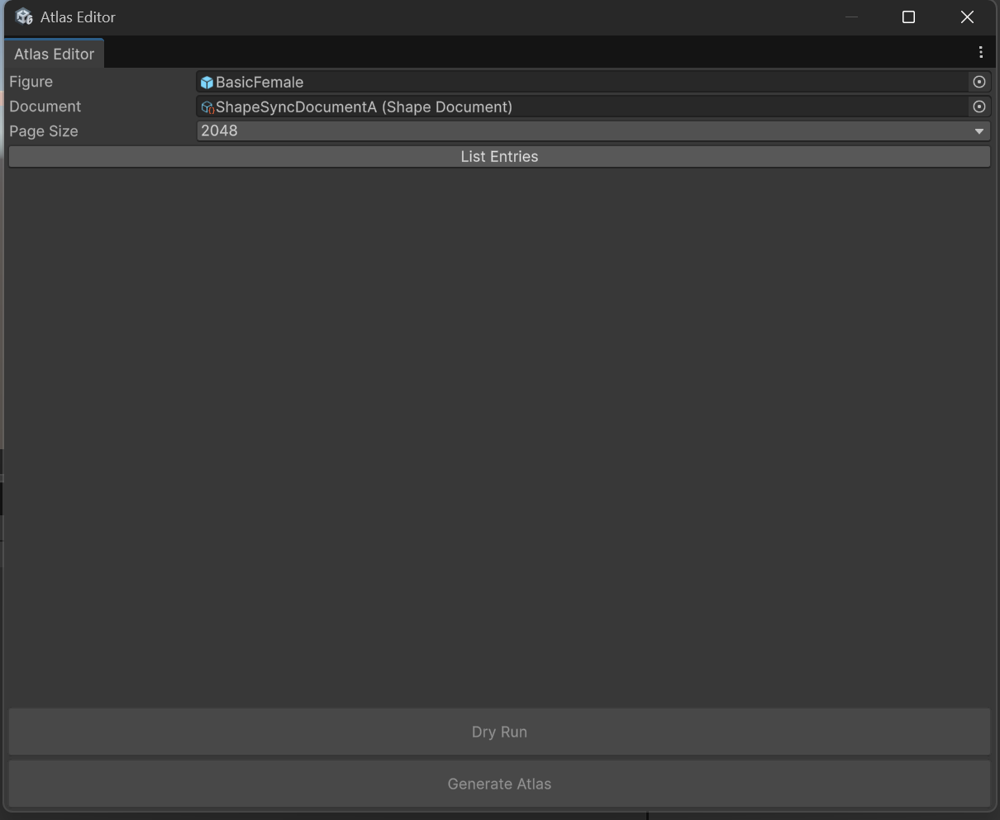
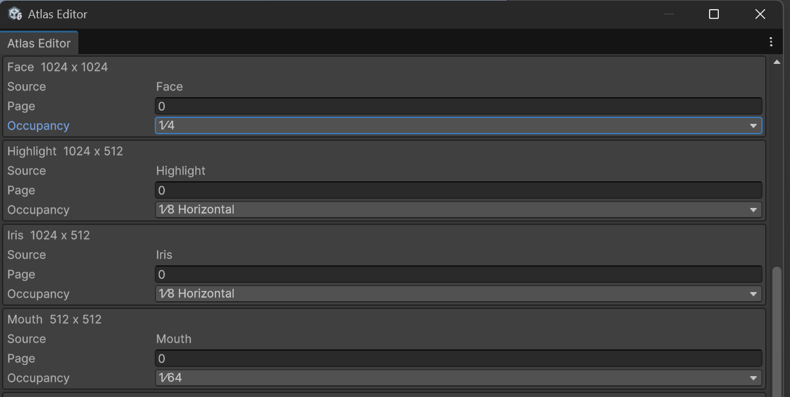
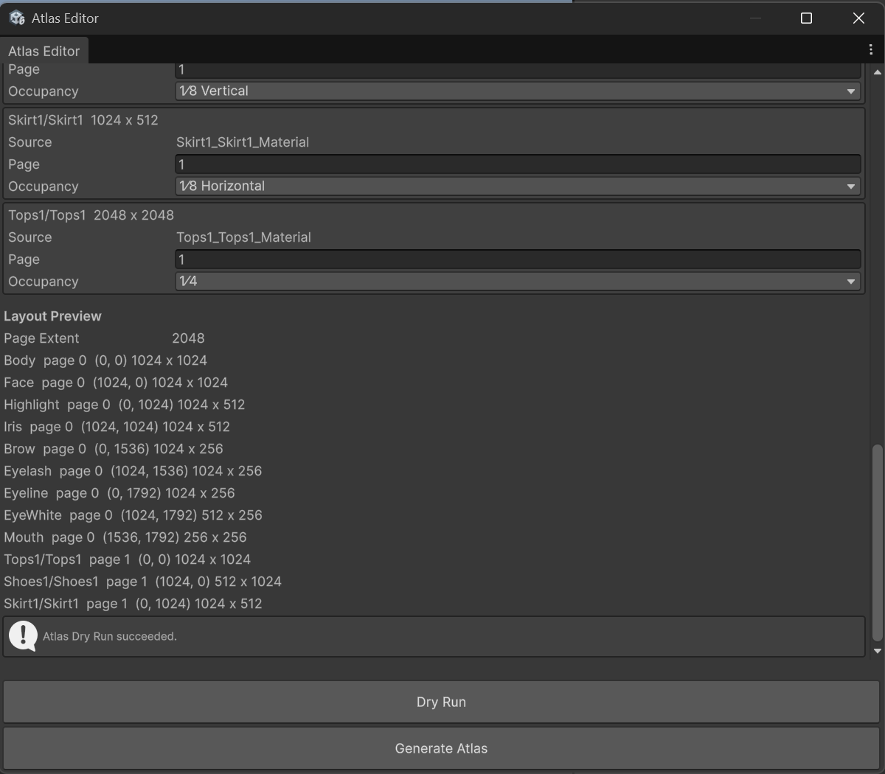
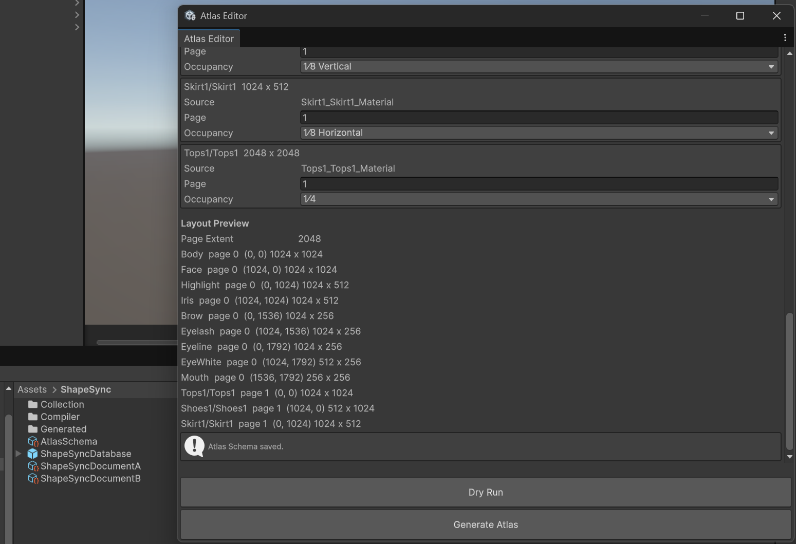
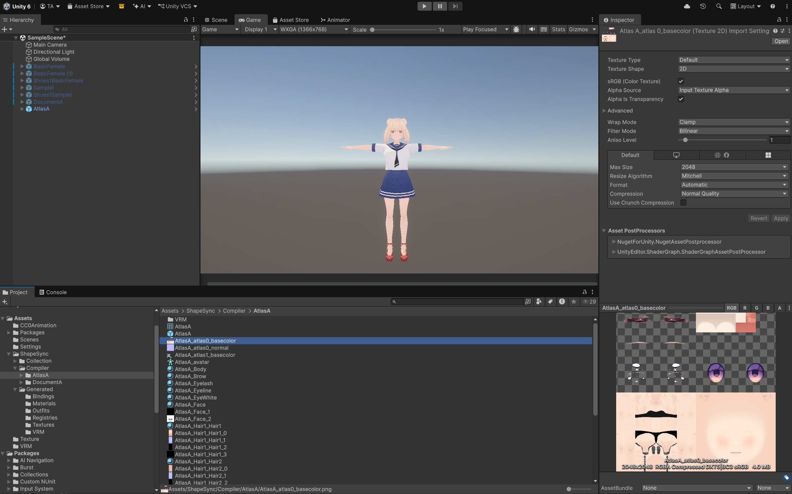

# 第12章: Atlas（テクスチャ・マテリアルの統合による VRAM 削減と Humanoid 再生成）

[← チュートリアル目次へ戻る](./index.html) ｜ [← 第11章: Humanoid Compiler（Document からの Pure Humanoid 生成と確認）](./humanoidcompiler.html)

本章では、第11章で作成した Pure Humanoid（`BasicFemale.prefab` および `ShapeSyncDocumentA.asset`）を引き継ぎ、**Atlas Editor** を使用して複数のパーツテクスチャやマテリアルを統合する **Atlas Schema** を作成し、描画負荷（Draw Call）と VRAM 使用量を低減したモデルを再生成する手順を解説します。

* **本章の作業環境**: VRoid Studio の操作は行いません。すべての作業は **Unity エディタ** および **ShapeSync Editor** 内で行います。
* **入力アセット**: 第11章と同じ Figure（`Assets/ShapeSync/Generated/BasicFemale.prefab`）と Document A（`Assets/ShapeSync/ShapeSyncDocumentA.asset`）を使用します。
* **出力先フォルダー**: 第11章のフォルダーとは別に、新しい空フォルダー **`Assets/ShapeSync/Compiler/AtlasA/`** を使用します。

---

## 1. はじめに（Atlas の目的と仕組み）

### 1.1 Atlas の目的
* **テクスチャ枚数と VRAM の削減**: キャラクターモデルには、顔・体・目・髪・服などパーツごとに多数の個別テクスチャが存在します。これらをそのまま描画するとテクスチャ切り替えの負荷（Draw Call）や VRAM 消費が大きくなります。
* **Atlas 化の役割**: **Atlas** は、対応する複数のパーツテクスチャを 1 つのアトラス画像（大きな画像シート）にまとめ、マテリアル数を削減して描画効率を向上させる機能です。

### 1.2 すべてのマテリアルが 1 枚になるわけではない仕様
* **グループごとの集約**: Atlas は用途や解像度に合わせて複数のページ（`page 0`, `page 1` 等）に分けて割り当てます。
* **個別テクスチャの残存**: 統合対象外に設定したパーツ（髪型など）や、マテリアルの仕様・構成によって統合されないテクスチャは個別に維持されるため、すべてのテクスチャが必ず 1 枚に集約されるわけではありません。

---

## 2. Atlas Editor の起動と Entry 一覧の取得

### 2.1 Atlas Editor の起動
1. Unity エディタの上部メニューから **`Tools > zgock > ShapeSync > Atlas Editor`** をクリックして開きます。

### 2.2 Figure と Document A の指定
1. **`Figure`**: Project ウィンドウの **`Assets/ShapeSync/Generated/BasicFemale.prefab`** をドラッグ＆ドロップして指定します。
2. **`Document`**: 第10章で保存した **`Assets/ShapeSync/ShapeSyncDocumentA.asset`** をドラッグ＆ドロップして指定します。
3. **`Page Size`**: ポップアップで **`2048`** が選択されていることを確認します（既定値: `2048`）。

*▲図 12-1: Atlas Editor ウィンドウで Figure（BasicFemale）、Document（ShapeSyncDocumentA）、および Page Size（2048）を指定した初期状態*

### 2.3 List Entries の実行
1. ウィンドウ上部の **`List Entries`** ボタンをクリックします。
2. Document A に含まれるマテリアルの一覧（`Entries`）と、各パーツの元テクスチャサイズが読み込まれて表示されます（初期状態では全 Entry が `Page: 0`、`Occupancy: ignore` となっています）。
   > [!IMPORTANT]
   > **スナップショット仕様について**:
   > `List Entries` の結果はクリック時点のスナップショットです。以後、プロジェクト側で Document や元アセットを変更しても自動更新されません。元アセットを変更した場合は、再度 `List Entries` をクリックしてください。

*▲図 12-2: List Entries 実行後に読み込まれた Document A 由来の Entry 一覧と各パーツの元テクスチャサイズ*

---

## 3. Page と専有面積の割り当て設定

各 Entry に対してどのページ（`Page`）のどれくらいの面積・向き（`Occupancy`）を割り当てるかを設定します。

### 3.1 Page 0 の割り当て（素体パーツ群）
素体側の各パーツを **`Page 0`** にまとめます。各 Entry の `Page` 欄に **`0`** を入力し、`Occupancy` ポップアップから以下の専有面積を選択します。

| Entry 名 | 元サイズ | Page | Occupancy（専有面積・向き） |
| :--- | :--- | :---: | :--- |
| **`Body`** | `2048 x 2048` | `0` | **`1⁄4`** |
| **`Brow`** | `1024 x 256` | `0` | **`1⁄16 Horizontal`** |
| **`EyeWhite`** | `1024 x 512` | `0` | **`1⁄32 Horizontal`** |
| **`Eyelash`** | `1024 x 256` | `0` | **`1⁄16 Horizontal`** |
| **`Eyeline`** | `1024 x 256` | `0` | **`1⁄16 Horizontal`** |
| **`Face`** | `1024 x 1024` | `0` | **`1⁄4`** |
| **`Highlight`** | `1024 x 512` | `0` | **`1⁄8 Horizontal`** |
| **`Iris`** | `1024 x 512` | `0` | **`1⁄8 Horizontal`** |
| **`Mouth`** | `512 x 512` | `0` | **`1⁄64`** |

*▲図 12-3-1: Page 0（素体パーツ前半: Body, Brow, EyeWhite, Eyelash, Eyeline）の Page 番号および Occupancy 設定*

*▲図 12-3-2: Page 0（素体パーツ後半: Face, Highlight, Iris, Mouth）の Page 番号および Occupancy 設定*

### 3.2 Page 1 の割り当て（衣装パーツ群）
衣装側の各パーツを **`Page 1`** にまとめます。各 Entry の `Page` 欄に **`1`** を入力し、`Occupancy` を設定します。

| Entry 名 | 元サイズ | Page | Occupancy（専有面積・向き） |
| :--- | :--- | :---: | :--- |
| **`Shoes1/Shoes1`** | `512 x 1024` | `1` | **`1⁄8 Vertical`** |
| **`Skirt1/Skirt1`** | `1024 x 512` | `1` | **`1⁄8 Horizontal`** |
| **`Tops1/Tops1`** | `2048 x 2048` | `1` | **`1⁄4`** |

### 3.3 対象外（Ignore）の設定（`Hair1_*`）
髪型パーツは UV 構造の都合上、アトラス統合を行うと UV 交錯エラーが発生するため、統合対象外（`ignore`）に設定します。

| Entry 名 | 元サイズ | Page | Occupancy |
| :--- | :--- | :---: | :--- |
| **`Hair1/Hair1`** | `512 x 1024` | `0` | **`ignore`** |
| **`Hair1/Hair2`** | `512 x 1024` | `0` | **`ignore`** |

*▲図 12-4: Page 1（衣装パーツ群: Shoes1, Skirt1, Tops1）の割当と Hair1_*（Hair1/Hair1, Hair1/Hair2）の ignore（対象外）設定*

---

## 4. Dry Run（検証）と Atlas Schema の保存

### 4.1 Dry Run の実行と配置確認
1. ウィンドウ下部の **`Dry Run`** ボタンをクリックします。
2. **検証結果の確認**:
   * 設定内容に問題がなければ、ウィンドウ内に **`Layout Preview`**（`Page Extent 2048` および各パーツの配置座標・サイズ一覧）が表示され、情報ボックスに `Atlas Dry Run succeeded.` と表示されます。
   * これにより、下部の **`Generate Atlas`** ボタンが有効化されます。
   > [!NOTE]
   > **設定変更時の再 Dry Run について**:
   > `Dry Run` は配置の検証のみを行い、アセットの作成は行いません。`Occupancy` や `Page Size` などの設定を変更すると `Generate Atlas` ボタンは再び無効化されます。変更後は必ず再度 `Dry Run` をクリックしてください。

*▲図 12-7: Dry Run 実行後に Layout Preview が生成され「Atlas Dry Run succeeded.」と表示され Generate Atlas ボタンが有効化した状態*

### 4.2 Atlas Schema の保存
1. `Dry Run` 成功後、ウィンドウ下部の **`Generate Atlas`** ボタンをクリックします。
2. `Save Atlas Schema` ダイアログが表示されたら、**`Assets > ShapeSync`** フォルダー内にファイル名 **`AtlasSchema.asset`** として保存します。
3. Atlas Editor 下部に `Atlas Schema saved.` と表示され、Project ウィンドウの `Assets/ShapeSync/` 直下に **`AtlasSchema.asset`** が生成されたことを確認します。
   * （※Schema アセットに保存されるのは Entry ごとの設定値であり、テクスチャ画像そのものではありません）

*▲図 12-8-1: Save Atlas Schema ダイアログで Assets/ShapeSync/ 直下に AtlasSchema.asset を指定して保存する操作*

*▲図 12-8-2: Atlas Schema saved. メッセージの表示と Project ウィンドウ内での AtlasSchema.asset 生成確認*

---

## 5. Humanoid Compiler での Atlas 適用再生成

作成した Atlas Schema を使用して、Humanoid Compiler で Pure Humanoid を再生成します。

### 5.1 Humanoid Compiler の設定
1. Unity エディタの上部メニューから **`Tools > zgock > ShapeSync > Humanoid Compiler`** を開きます。
2. 各入力欄を設定します。
   * **`Figure`**: `Assets/ShapeSync/Generated/BasicFemale.prefab`
   * **`Document`**: `Assets/ShapeSync/ShapeSyncDocumentA.asset`
   * **`Atlas Schema (Optional)`**: 手順 4 で保存した **`Assets/ShapeSync/AtlasSchema.asset`** を指定します。
   * **`Transport VRM Physics`**: VRM 連携環境の場合は **ON**（`VRM Asset Relative Folder: VRM`）にします。

*▲図 12-9: Humanoid Compiler で Figure、Document、および Atlas Schema（AtlasSchema）を指定し VRM Physics を ON に設定した状態*

### 5.2 出力先フォルダーの指定と Generate 実行
1. Compiler ウィンドウ下部の **`Generate`** ボタンをクリックします。
2. `Select Empty Pure Humanoid Output Folder` ダイアログで、新規または空のフォルダー **`Assets/ShapeSync/Compiler/AtlasA`** を選択します。
   > [!IMPORTANT]
   > 第11章で使用した `DocumentA` フォルダーとは混ざらないよう、必ず別の空フォルダー **`AtlasA`** を指定してください。
3. コンパイルが正常に完了し、`Progress: Completed`、`Output: Assets/ShapeSync/Compiler/AtlasA` と表示されたことを確認します。

*▲図 12-10-1: Select Empty Pure Humanoid Output Folder ダイアログでの新規空フォルダー AtlasA の選択*

*▲図 12-10-2: Humanoid Compiler でのコンパイル完了（Completed）表示と Project ビューに出力された AtlasA 接頭語のアセット群*

---

## 6. 生成アセットの確認と動作確認

### 6.1 生成アセットと Main Texture の集約確認
1. Project ウィンドウで **`Assets > ShapeSync > Compiler > AtlasA`** を開きます。
2. 出力フォルダー名（`AtlasA`）を接頭語とする以下の生成物を確認します。
   * 主 Prefab: **`AtlasA.prefab`**
   * 統合 Mesh: **`AtlasA.asset`**
   * Humanoid Avatar: **`AtlasA_avatar.asset`**
   * **Atlas Page Texture**: **`AtlasA_atlas0_basecolor.png`**、**`AtlasA_atlas0_normal.png`**、**`AtlasA_atlas1_basecolor.png`** など
   * **残存個別 Texture**: 統合対象外（ignore）に設定した `Hair1` 由来のテクスチャなど
3. **Main Texture の集約効果**:
   * **Atlas 対象となった各 page（Page 0 / Page 1）では、それぞれの Main Texture（BaseColor）が 1 枚のアトラス画像へ集約されます。**
   * これにより、キャラクター描画時のテクスチャ切り替え負荷が大幅に軽減されます。

*▲図 12-11-1: Project ビューの AtlasA_atlas0_basecolor（Page 0 アトラス画像: 素体パーツ群）のプレビュー表示と Scene 上の AtlasA モデル*

*▲図 12-11-2: Project ビューの AtlasA_atlas1_basecolor（Page 1 アトラス画像: 衣装パーツ群）のプレビュー表示と Scene 上の AtlasA モデル*

### 6.2 Scene 配置と動作確認
1. Project ウィンドウの **`Assets/ShapeSync/Compiler/AtlasA/AtlasA.prefab`** を Scene ビューにドラッグ＆ドロップして配置します。
2. **見た目の確認**: 各パーツのテクスチャがアトラス化された状態でも、外見やマテリアル表現が破綻なく綺麗に描画されていることを確認します。
3. **Animation 再生確認**: Inspector で `Animator` に `Walking.controller` を割り当て、Play Mode で再生します。歩行アニメーションおよび SpringBone 揺れ物が破綻なく滑らかに連動動作することを確認します。

*▲図 12-12: Play Mode 中に Walking.controller による歩行アニメーションおよび VRM Physics（髪・スカートの揺れ物）が正常に連動動作している状態*

---

## 7. よくあるトラブルと警告・エラー例（トラブルシューティング）

### Q1. 対象 Entry の下にアスペクト比に関する警告（黄色 HelpBox）が表示される
* **警告例**:
  `Shoes1/Shoes1: source 512 x 1024 does not match Atlas cell 1024 x 1024. PLACE will resample the source into this cell.`
* **原因**:
  元テクスチャのアスペクト比（縦長/横長）と、`Occupancy` で指定したセルの向き（`Horizontal` / `Vertical` / 正方形 `1⁄4` 等）が一致していない場合に表示されます。
* **解決策**:
  警告を無視せず、元テクスチャの縦横比に合わせて適切な向き（例: 縦長なら `1⁄8 Vertical`、横長なら `1⁄8 Horizontal`）を選び直してください。

*▲図 12-5: Shoes1/Shoes1 に 1⁄4 を指定したことで表示されたアスペクト比率不一致・リサンプルに関する警告（黄色 HelpBox）*

### Q2. Dry Run 時に `AtlasUv0OutOfRange` エラーが表示される
* **エラー内容**:
  `Atlas UV0 must be finite and within [0,1]. owner=Hair1;materialId=Hair1/Hair1;submesh=0;pageIndex=1;cause=`
* **原因**:
  髪型（`Hair1/Hair1` や `Hair1/Hair2`）など、UV タイリングや交錯を持つマテリアルを Atlas 対象に含めて Dry Run を実行した場合に発生します。
* **解決策**:
  `Hair1/Hair1` および `Hair1/Hair2` の `Occupancy` を **`ignore`** に設定し、再度 `Dry Run` を実行してください。

*▲図 12-6: Hair1/Hair1 を Atlas 対象に含めたことで Dry Run 時に発生した AtlasUv0OutOfRange エラー（赤色 HelpBox）*

### Q3. 設定を変更したら Generate Atlas ボタンが押せなくなった
* **原因**:
  安全のため、`Occupancy` や `Page Size` などの設定値を変更すると直前の Dry Run 検証状態が無効化される仕様です。
* **解決策**:
  設定変更後は、再度 **`Dry Run`** ボタンをクリックして配置を検証してください。Dry Run が成功すると `Generate Atlas` ボタンが再び有効化されます。

---

[← チュートリアル目次へ戻る](./index.html) ｜ [← 第11章: Humanoid Compiler（Document からの Pure Humanoid 生成と確認）](./humanoidcompiler.html)
