# 第10章: Document 保存と Outfit Tag / Priority（衣装の競合制御と状態保存・復元）

[← チュートリアル目次へ戻る](./index.html) ｜ [← 第9章: 高度な VRM 連携（Expression・Physics の設定と動作確認）](./vrmintegration.html)

本章では、複数衣装の着用部位や優先順位を制御する **Outfit Tag（タグ）** と **Priority（優先度）** の設定方法、およびキャラクターの現在の着用・変形状態（Shape や Outfit）を丸ごとアセットとして保存・復元する **Document（ドキュメント）保存・読み込み** の手順を解説します。

* **前半（VRoid Studio / ShapeSync Editor）**: 上半身トップス（`Tops1`）と下半身スカート（`Skirt1`）のセパレート衣装 VRM を準備して登録し、Tag（`upperchest`, `lowerchest`）と Priority を設定します。
* **後半（Unity / ShapeDirector）**: Play Mode での衣装競合・排他表示を確認し、現在の着用状態を **Document A（`ShapeSyncDocumentA`）** および **Document B（`ShapeSyncDocumentB`）** として保存して、Template 解除状態からワンクリックで読み込み・復元できることを確認します。

---

## 1. はじめに（衣装の競合制御と Document の役割）

### 1.1 Priority と Tag による衣装排他制御
キャラクターに複数の衣装（トップス、ボトムス、ワンピースなど）を同時に着せる場合、「どの部位で競合するか」「競合したときにどちらを表示するか」を制御する必要があります。
* **Tag（競合部位）**: 「どの部位で競合するか」を定義する識別子です（例: 上半身 `upperchest`、下半身 `lowerchest`）。同じ Tag を持つ Outfit 同士が競合の対象になります。
* **Priority（優先順位）**: 競合が発生した際に「どちらが優先されるか」を決める数値です。**数値が大きい Outfit が優先** され、数値の小さい Outfit は自動的に非表示（排他）となります。
* **論理登録と表示状態の分離**: ShapeDirector に複数の Template が同時に登録されていても、Tag と Priority の排他判定によって画面上の表示は自動的に整理されます。

### 1.2 Document の役割
* **Document とは**: 現在キャラクターが着用している Outfit、体型（Morph / FBM / PBM）、マテリアルなどの状態を一括して 1 つのファイル（`.asset`）に記録するデータ形式です。
* **保存と読み込み**: Document を保存しておけば、Template を個別に付け替えることなく、Document を読み込む（Load）だけで瞬時に目的のコーディネートや体型へ切り替えることができます。

---

## 2. Tops1 と Skirt1 の VRM 準備と Mesh Outfit 登録

### 2.1 VRoid Studio での VRM 準備
セパレート衣装として、上半身用の `Tops1` と下半身用の `Skirt1` を準備します。

* **`Tops1`（計 4 種類）**:
  胸部変形（`BreastSize` PBM）の影響を受けるため、Base / FBM に加えて PBM follow 用を含めた計 4 種類を出力します。
  1. `BasicFemale.vroid` に Tops を着用し、`Tops1BasicFemale.vrm` としてエクスポート（図 10-1, 図 10-2）。
  2. `SampleI.vroid` に Tops を着用し、`Tops1SampleI.vrm` としてエクスポート（図 10-3）。
  3. `BreastSizeBasicFemale.vroid` に Tops を着用し、`Tops1BreastSizeBasicFemale.vrm` としてエクスポート（図 10-4）。
  4. `BreastSizeSampleI.vroid` に Tops を着用し、`Tops1BreastSizeSampleI.vrm` としてエクスポート（図 10-5）。

| 図 10-1: BasicFemale に Tops 着用 | 図 10-2: Tops1BasicFemale 保存 |
| :---: | :---: |
| 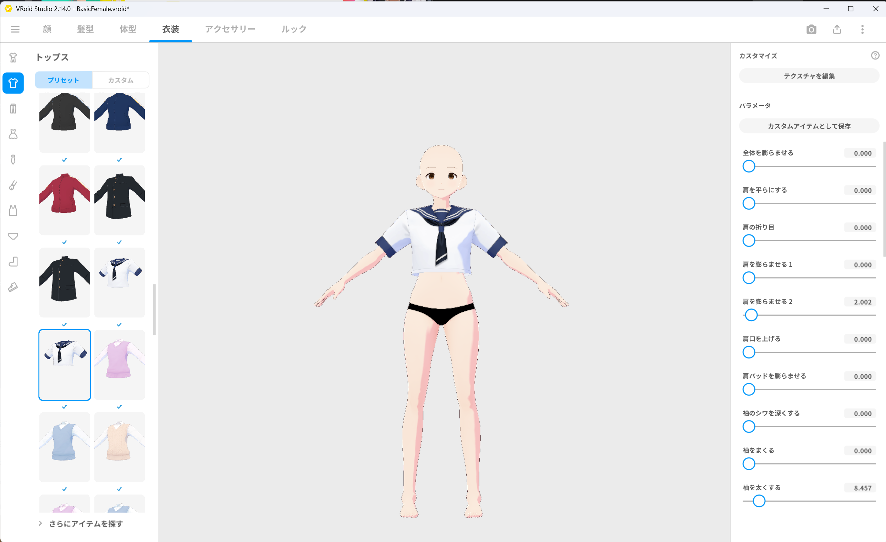 | 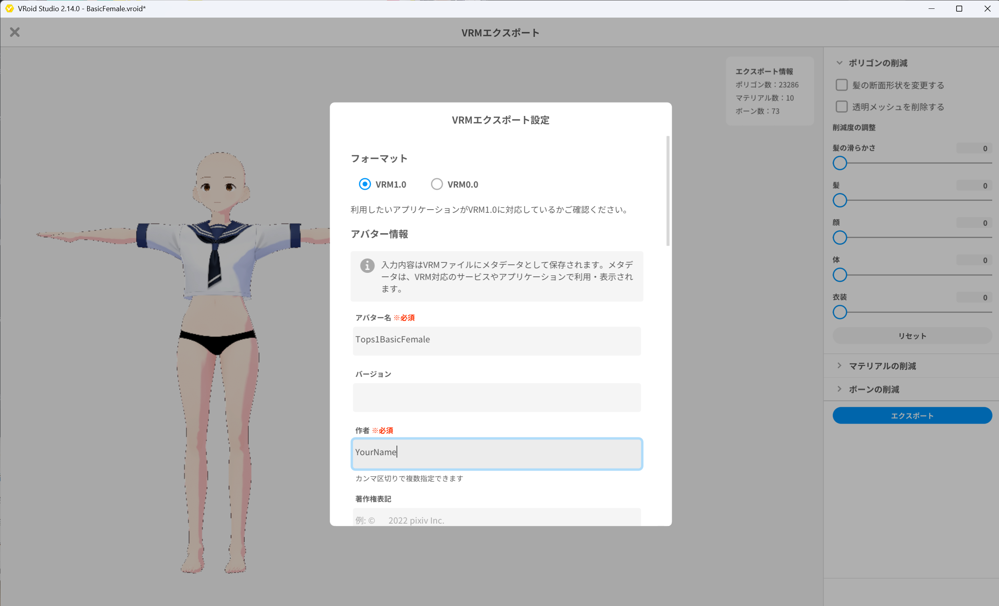 |

| 図 10-3: Tops1SampleI 保存 | 図 10-4: Tops1BreastSizeBasicFemale 保存 | 図 10-5: Tops1BreastSizeSampleI 保存 |
| :---: | :---: | :---: |
| 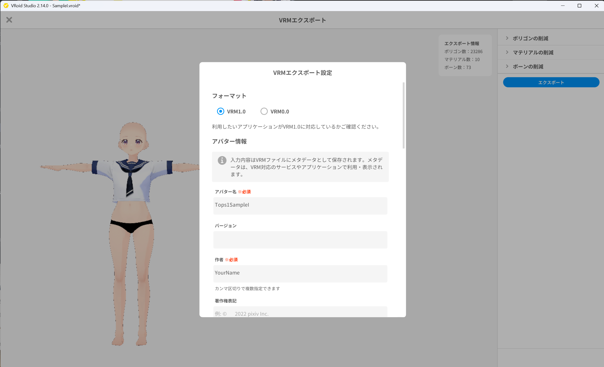 | 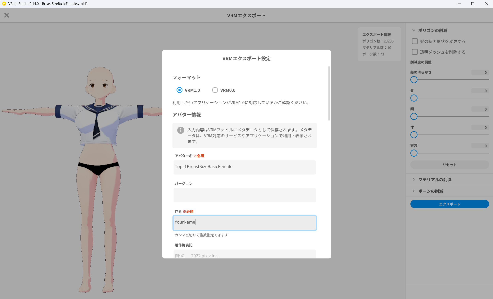 | 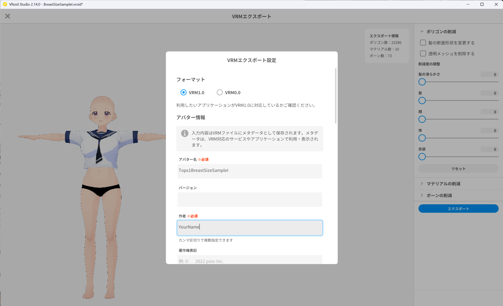 |

* **`Skirt1`（計 2 種類）**:
  胸部変形（`BreastSize`）の影響を受けないため、Base / FBM の計 2 種類を出力します。
  1. `BasicFemale.vroid` に Skirt を着用し、`Skirt1BasicFemale.vrm` としてエクスポート（図 10-6, 図 10-7）。
  2. `SampleI.vroid` に Skirt を着用し、`Skirt1SampleI.vrm` としてエクスポート（図 10-8）。

| 図 10-6: BasicFemale に Skirt 着用 | 図 10-7: Skirt1BasicFemale 保存 | 図 10-8: Skirt1SampleI 保存 |
| :---: | :---: | :---: |
| 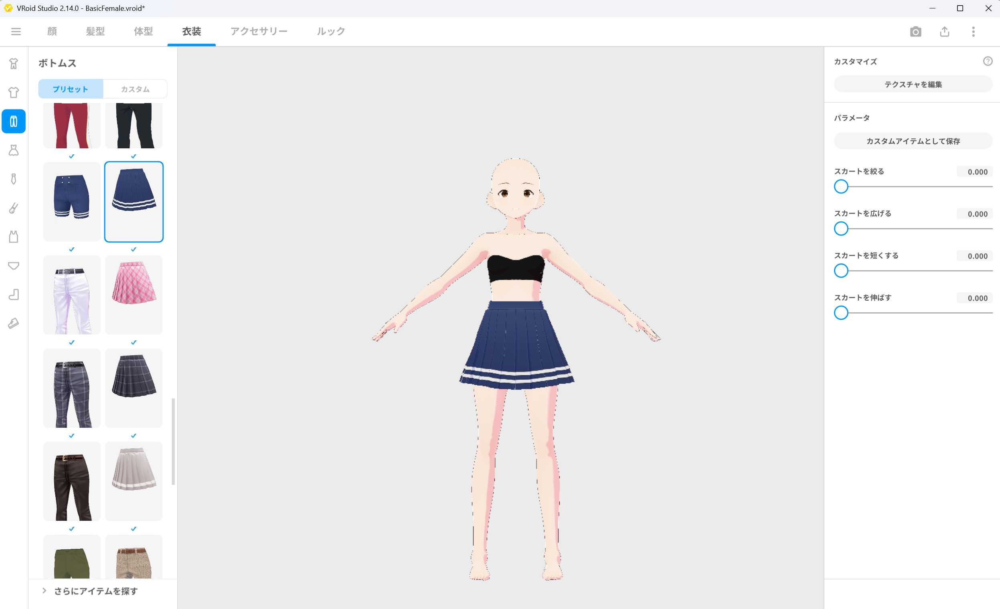 | 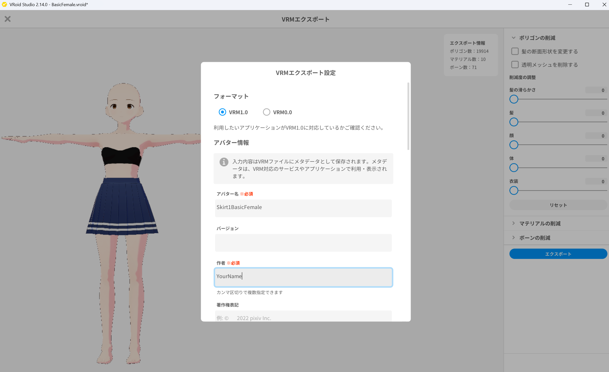 | 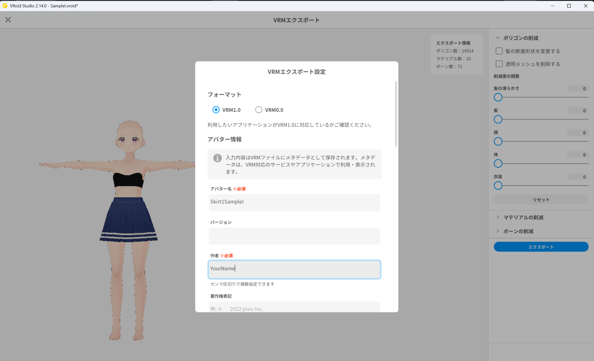 |

### 2.2 ShapeSync Editor での Tops1 登録
1. Unity エディタで ShapeSync Editor（**Tools > zgock > ShapeSync > ShapeSync Editor**）を開きます。
2. 左側 TreeView の `Outfits > Mesh Outfits` で `Tops1` を作成し、`Outfit Id: Tops1`、`Outfit Name: Tops1`、`Outfit Prefab: Tops1BasicFemale` を指定します（図 10-9-1）。
3. `Materials` 画面にて、顔・目・肌などの素体マテリアルを **`Exclude`** に分類し（図 10-9-2）、最下部の衣装マテリアル（`Tops_01_CLOTH`）を `Entry Name: Tops1`、`Classification: Include` に設定して **`Save to Database`** をクリックします（図 10-9-3）。
4. `FBMs` 画面にて、`SampleI` の `FBM Prefab` に **`Tops1SampleI`** を割り当てます（図 10-9-4）。
5. `PBMs` 画面にて、**`Follow BreastSize`** を有効化し、`Base Prefab` に **`Tops1BreastSizeBasicFemale`**、`SampleI Prefab` に **`Tops1BreastSizeSampleI`** を指定して **`Save to Database`** をクリックします（図 10-9-5）。

| 図 10-9-1: Tops1 基本情報登録 | 図 10-9-2: 素体マテリアルの Exclude 分類 |
| :---: | :---: |
| 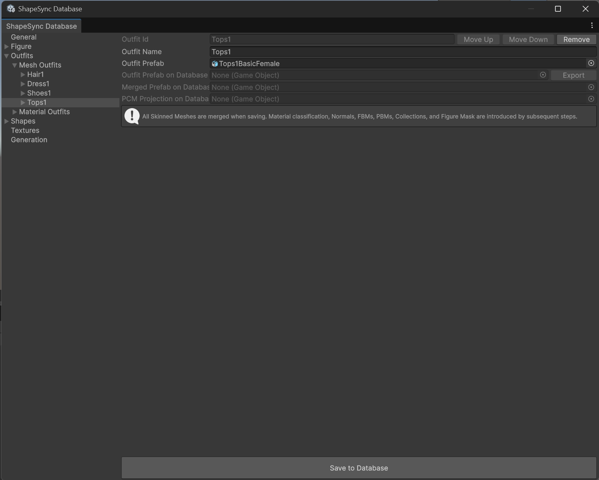 | 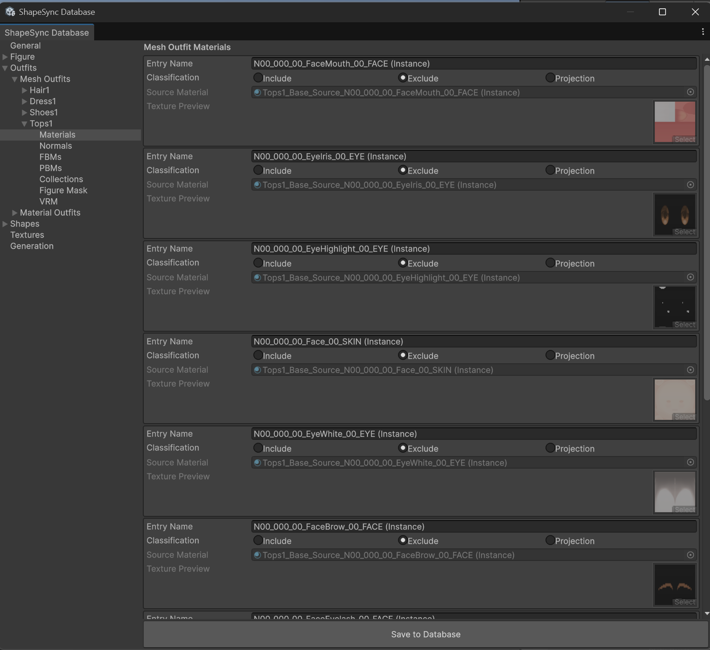 |

| 図 10-9-3: Tops1 マテリアルの Include と保存 | 図 10-9-4: Tops1 FBM Prefab 割り当て | 図 10-9-5: Tops1 PBM Follow 設定と保存 |
| :---: | :---: | :---: |
|  | 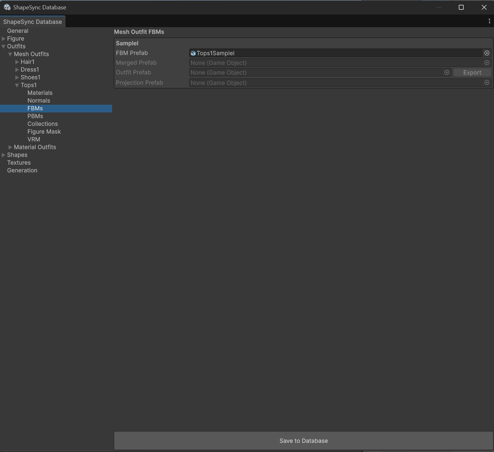 | 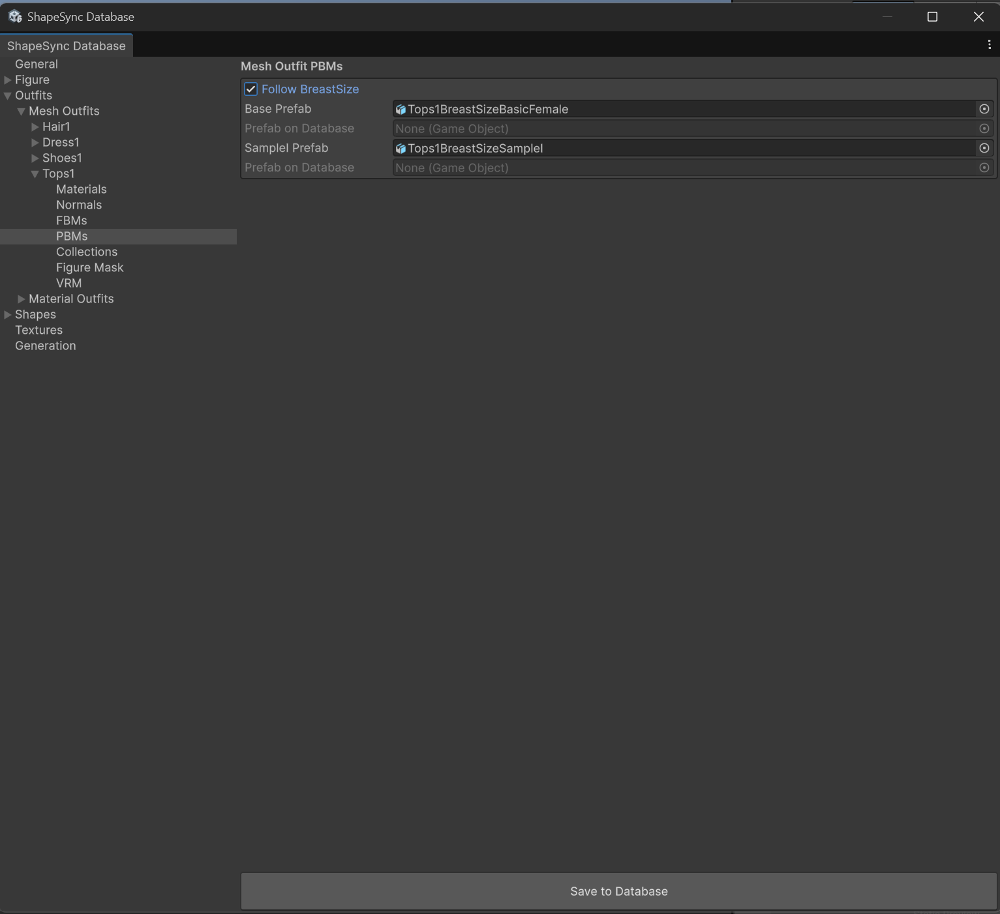 |

### 2.3 ShapeSync Editor での Skirt1 登録
1. 左側 TreeView の `Outfits > Mesh Outfits` で `Skirt1` を作成し、`Outfit Id: Skirt1`、`Outfit Name: Skirt1`、`Outfit Prefab: Skirt1BasicFemale` を指定します（図 10-10-1）。
2. `Materials` 画面にて、素体マテリアルを **`Exclude`** に分類し（図 10-10-2）、最下部の衣装マテリアル（`Bottoms_01_CLOTH`）を `Entry Name: Skirt1`、`Classification: Include` に設定して **`Save to Database`** をクリックします（図 10-10-3）。
3. `FBMs` 画面にて、`SampleI` の `FBM Prefab` に **`Skirt1SampleI`** を指定します（図 10-10-4）。（※Skirt1 は `BreastSize` の影響を受けないため、PBM Follow 設定は不要です）
4. `VRM` 画面にて、`Physics Reference VRM` に **`Skirt1BasicFemale`** を指定し、**`Save to Database`** をクリックします（図 10-11）。

| 図 10-10-1: Skirt1 基本情報登録 | 図 10-10-2: 素体マテリアルの Exclude 分類 |
| :---: | :---: |
|  | 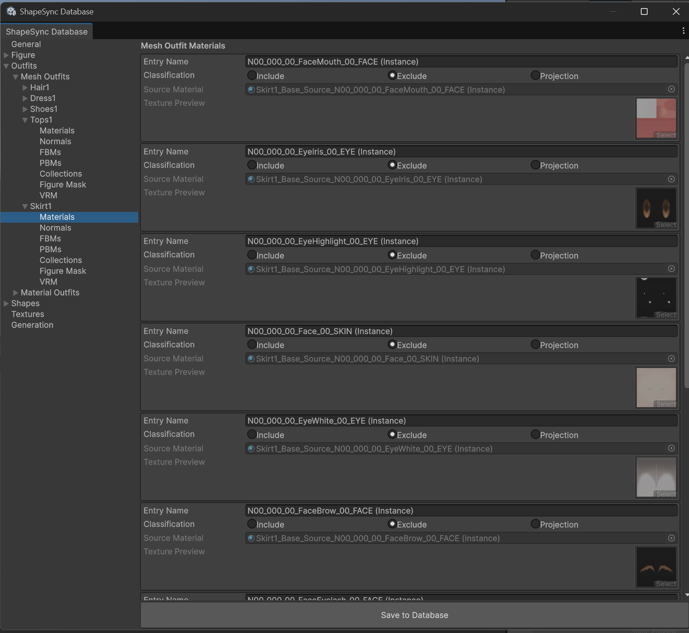 |

| 図 10-10-3: Skirt1 マテリアルの Include と保存 | 図 10-10-4: Skirt1 FBM Prefab 割り当て | 図 10-11: Skirt1 VRM Physics Reference 設定 |
| :---: | :---: | :---: |
|  | 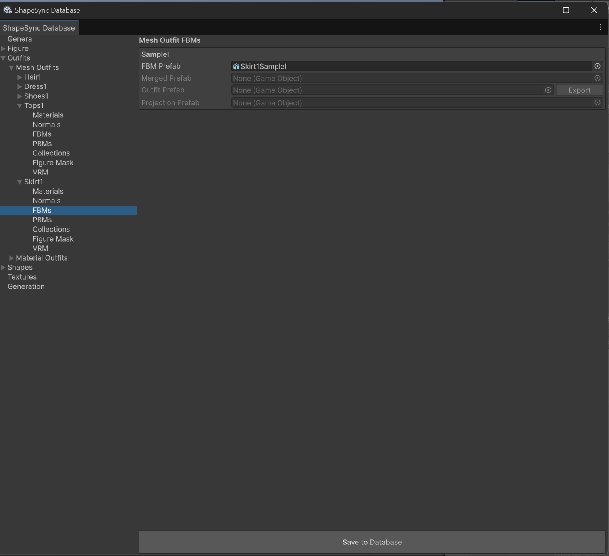 |  |

---

## 3. Outfit Tag の作成と Outfit Shape への Priority / Tag 設定

### 3.1 Outfit Tag の作成
Shape が選択できるタグ語彙（部位名）を登録します。

1. ShapeSync Editor の左側 TreeView から **`Shapes > Tags`** を選択します。
2. **`Add Tag`** ボタンをクリックし、入力欄に **`upperchest`** と入力します。
3. もう一度 **`Add Tag`** ボタンをクリックし、入力欄に **`lowerchest`** と入力します。
4. 画面下部の **`Save into Database`** ボタンをクリックしてタグ語彙を保存します（図 10-12）。

| 図 10-12: Shapes > Tags で upperchest および lowerchest を作成し保存 |
| :---: |
|  |

### 3.2 Outfit Shape の作成・更新と Priority / Tag 割り当て
作成したタグと優先度（Priority）を各 Outfit Shape に設定します。

1. **`outfitTops1` の新規作成**:
   * `Shapes` ルート画面で `Shape Id: outfitTops1`、`Shape Name: outfitTops1` を入力し、**`Create Outfit Shape Template`** をクリックします。
   * **`Priority`**: **`10`** を入力します。
   * **`Tags`**: ポップアップから **`upperchest`** を選択し、**`Add Tag`** をクリックします。
   * **`Parts`**: **`Add Mesh`** をクリックし、`Outfit Mesh` ポップアップから **`Tops1`** を選択します。
   * 画面下部の **`Save to Database`** をクリックします（図 10-13-1）。

2. **`outfitSkirt1` の新規作成**:
   * `Shapes` ルート画面で `Shape Id: outfitSkirt1`、`Shape Name: outfitSkirt1` を入力し、**`Create Outfit Shape Template`** をクリックします。
   * **`Priority`**: **`15`** を入力します。
   * **`Tags`**: ポップアップから **`lowerchest`** を選択し、**`Add Tag`** をクリックします。
   * **`Parts`**: **`Add Mesh`** をクリックし、`Outfit Mesh` ポップアップから **`Skirt1`** を選択します。
   * 画面下部の **`Save to Database`** をクリックします（図 10-13-2）。

3. **`outfitSampleI`（既存 Dress 用）の上書き更新**:
   * 左側 TreeView の `Outfit Shapes` から既存の **`outfitSampleI`** を選択します（※新規作成はしません）。
   * **`Priority`**: **`20`** を入力します。
   * **`Tags`**: ポップアップから **`upperchest`** と **`lowerchest`** の両方を追加します（上下両部位をカバー）。
   * 画面下部の **`Save to Database`** をクリックします（図 10-13-3）。

| 図 10-13-1: outfitTops1 の Priority / Tag 設定 | 図 10-13-2: outfitSkirt1 の Priority / Tag 設定 |
| :---: | :---: |
| 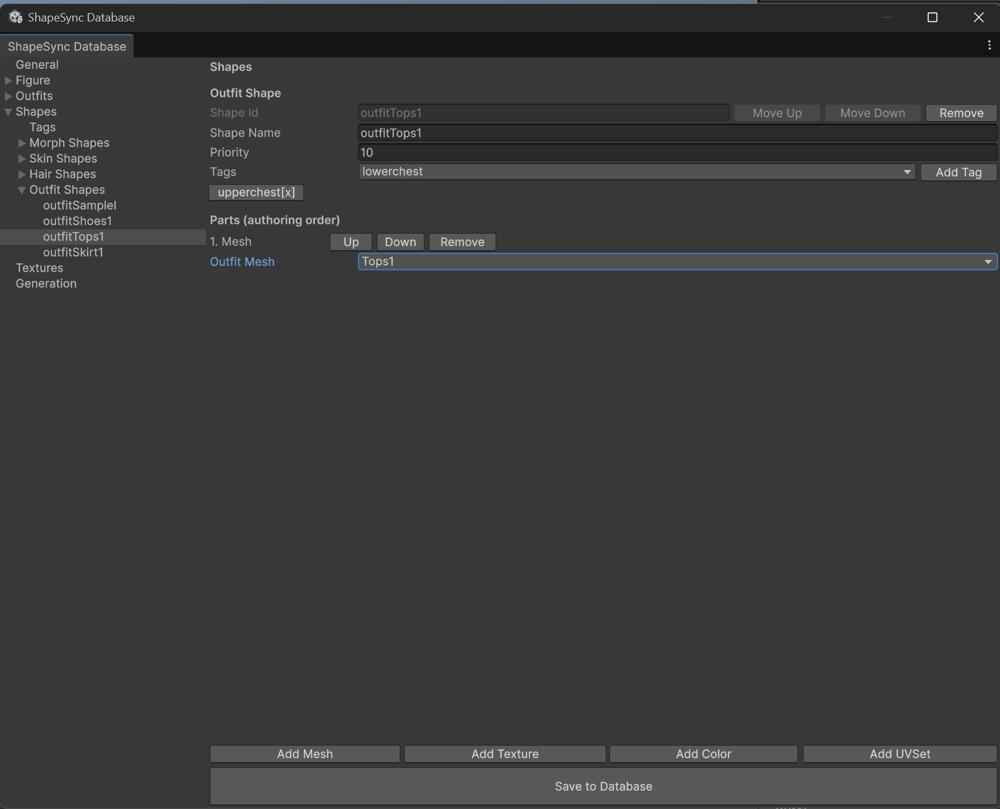 | 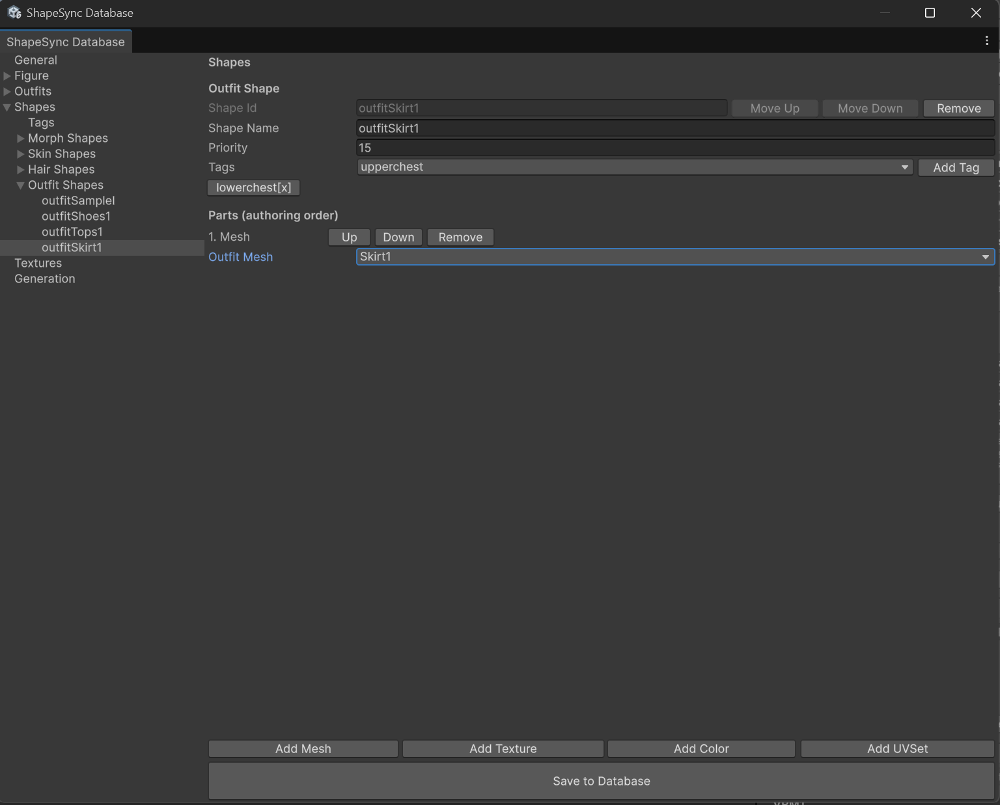 |

| 図 10-13-3: outfitSampleI（Dress）の上書き更新（Priority 20 / 両 Tag 設定） |
| :---: |
| 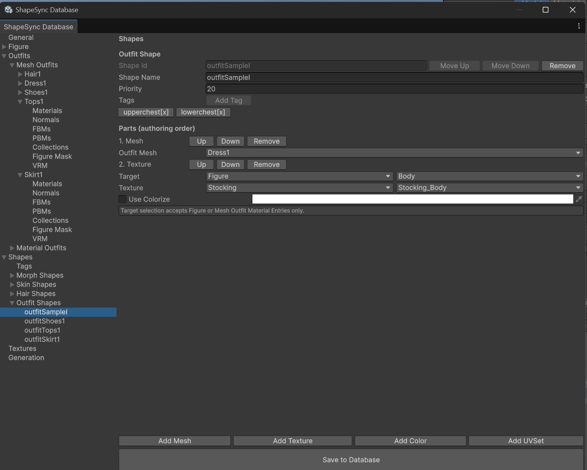 |

| Shape Id | Priority | Tags | リンク先 Mesh Outfit | 役割 |
| :--- | :---: | :--- | :--- | :--- |
| **`outfitTops1`** | `10` | `upperchest` | `Tops1` | 上半身セパレート |
| **`outfitSkirt1`** | `15` | `lowerchest` | `Skirt1` | 下半身セパレート |
| **`outfitSampleI`** | `20` | `upperchest`, `lowerchest` | `Dress1` | 上下一体型ドレス（最高優先度） |

### 3.3 Generation での再 Generate 実行
1. 左側 TreeView から **`Generation`** セクションを選択します。
2. 画面下部の **`Generate`** ボタンをクリックし、出力ルートフォルダー（`Assets/ShapeSync/Generated`）を選択して再生成を実行します。

---

## 4. Play Mode での Priority / Tag 排他制御の検証

### 4.1 3 つの Template 同時登録時の排他表示（Dress1 表示）
1. Scene に配置されている Figure（`BasicFemale`）を選択します。
2. Figure の **`ShapeDirector`** コンポーネントの `Template List` に、以下の Template 群を登録します。
   * `morphSampleI`
   * `skinSampleI`
   * `hairSampleI`
   * `outfitSkirt1`
   * `outfitTops1`
   * `outfitSampleI`（Dress）
3. Unity の **Play ボタン** を押して **Play Mode** に入ります。
4. **排他表示の確認**: `Template List` 上は Tops1・Skirt1・Dress1 の 3 つの衣装が論理登録されていますが、Priority `20` の `Dress1`（`outfitSampleI`）が `upperchest` と `lowerchest` の両 Tag を排他的に支配するため、画面上は **`Dress1` のみ** が表示されることを確認します（図 10-14）。

| 図 10-14: 3 Template 登録時に Priority 20 の Dress1 のみが排他表示される Play Mode 画面 |
| :---: |
|  |

### 4.2 Dress の Remove によるセパレート衣装の表示（Tops1 + Skirt1 表示）
1. Play Mode 中に、`ShapeDirector` Inspector の `Runtime Shapes (Authoritative)` から `OutfitShape — outfitSampleI` を展開し、**`Remove Shape`** ボタンをクリックします（図 10-15-1）。
2. **セパレート衣装の表示確認**: Dress の排他が解除され、次点 Priority を持つ **`Tops1`（Priority 10）** と **`Skirt1`（Priority 15）** が即座に画面上に現れ、上下セパレート衣装（セーラー服風トップス＋プリーツスカート）の組み合わせで表示されることを確認します（図 10-15-2）。

| 図 10-15-1: Runtime Shapes から outfitSampleI を Remove Shape | 図 10-15-2: Dress Remove 後に Tops1 + Skirt1 が即座に表示 |
| :---: | :---: |
|  | 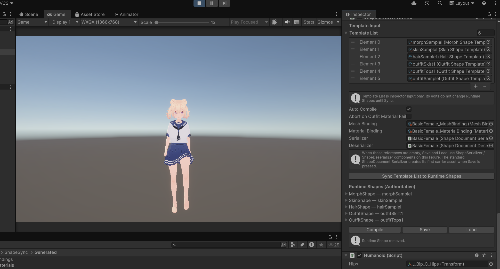 |

---

## 5. Document の保存（Document A / Document B）

### 5.1 Document A（Tops + Skirt 状態）の保存
1. `Tops1` + `Skirt1` が着用されている状態（Runtime Shapes）を確認します。
2. Figure の `ShapeDirector` Inspector 下部にある **`Save`** ボタンをクリックします。
3. `Save Shape Document` ダイアログが表示されたら、保存先フォルダーとしてプロジェクト内の **`Assets/ShapeSync`** を選択し、ファイル名に **`ShapeSyncDocumentA`** と入力して **`保存`** をクリックします（図 10-16-1）。
4. Unity の Project ビューで、`Assets > ShapeSync` 直下に **`ShapeSyncDocumentA`**（`.asset`）が作成されたことを確認します（図 10-16-2）。

| 図 10-16-1: Save Shape Document で ShapeSyncDocumentA として保存 | 図 10-16-2: Assets/ShapeSync に ShapeSyncDocumentA が保存された Project ビュー |
| :---: | :---: |
| 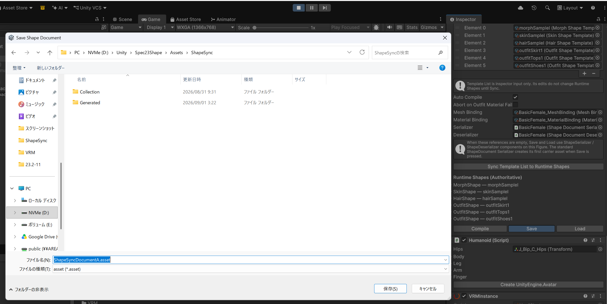 |  |

### 5.2 Document B（Dress 状態）の保存
1. 再度 `Template List` の Sync 等により `outfitSampleI`（Dress）を適用し、`Dress1` が着用されている状態（Runtime Shapes）を作ります。
2. `ShapeDirector` Inspector 下部の **`Save`** ボタンをクリックします。
3. 保存先フォルダーに **`Assets/ShapeSync`** を選択し、ファイル名に **`ShapeSyncDocumentB`** と入力して **`保存`** をクリックします（図 10-17-1）。
4. Project ビューで、`Assets > ShapeSync` に **`ShapeSyncDocumentB`** が追加保存されたことを確認します（図 10-17-2）。

| 図 10-17-1: Save Shape Document で ShapeSyncDocumentB として保存 | 図 10-17-2: Assets/ShapeSync に Document A / B が揃った Project ビュー |
| :---: | :---: |
| 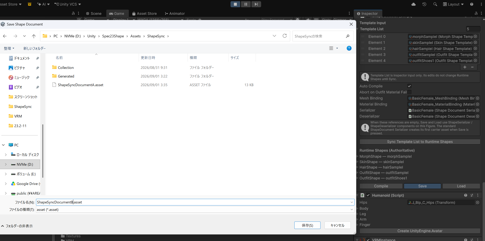 |  |

---

## 6. Template 全解除からの Document 読み込み（Load A / Load B）

保存した Document を使って、衣装状態をワンクリックで復元できることを確認します。

### 6.1 Template List の全解除
1. Unity の **Play ボタン** を押して一度 **Play Mode を停止** します（※Play Mode 中の Template List 編集は停止時に元に戻るため、Edit Mode で削除を行います）。
2. Edit Mode で `ShapeDirector` Inspector の **`Template List`** から、登録されている Template を **1 つずつ削除して全解除**（空の状態）にします。
3. 再度 Unity の **Play ボタン** を押して **Play Mode を開始** します。

### 6.2 Document A の読み込み確認
1. `ShapeDirector` Inspector 下部にある **`Load`** ボタンをクリックします。
2. `Load Shape Document` ダイアログで **`Assets/ShapeSync/ShapeSyncDocumentA.asset`** を選択し、**`開く`** をクリックします（図 10-18-1）。
3. **復元の確認**: Runtime Shapes が即座に更新され、キャラクターが **`Tops1` + `Skirt1`**（セパレート衣装）の状態へ復元されることを確認します（図 10-18-2）。

| 図 10-18-1: Load Shape Document で ShapeSyncDocumentA を選択 | 図 10-18-2: Document A 読み込みにより Tops1 + Skirt1 状態に復元された画面 |
| :---: | :---: |
|  | 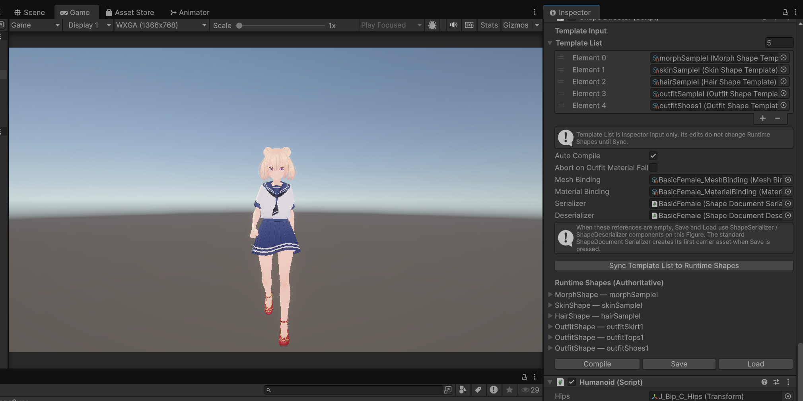 |

### 6.3 Document B の読み込み確認
1. 続けて `ShapeDirector` Inspector 下部の **`Load`** ボタンをクリックします。
2. `Load Shape Document` ダイアログで **`Assets/ShapeSync/ShapeSyncDocumentB.asset`** を選択し、**`開く`** をクリックします（図 10-19-1）。
3. **復元の確認**: Runtime Shapes が即座に切り替わり、キャラクターが **`Dress1`**（ワンピースドレス）の状態へ復元されることを確認します（図 10-19-2）。

| 図 10-19-1: Load Shape Document で ShapeSyncDocumentB を選択 | 図 10-19-2: Document B 読み込みにより Dress1 状態に切り替わり復元された画面 |
| :---: | :---: |
|  |  |

---

## 7. よくあるトラブルと解決策（トラブルシューティング）

### Q1. Tops と Skirt を両方登録したのに Dress しか表示されない
* **原因**:
  これは不具合ではなく、Tag と Priority による正常な排他動作です。`outfitSampleI`（Dress）は Priority `20` かつ `upperchest` と `lowerchest` の両 Tag を持っているため、Priority `10` の `outfitTops1` および Priority `15` の `outfitSkirt1` は自動的に排他（非表示）となります。
* **解決策**:
  Dress を脱がせたい場合は、Director 上で `outfitSampleI` を Remove してください。

### Q2. Play Mode を停止したら Template List の削除が元に戻ってしまった
* **原因**:
  Unity の仕様により、Play Mode 中に行った Inspector のリスト変更は Play Mode 停止時に元の状態へリセットされます。
* **解決策**:
  Template List の全解除を行う際は、必ず一度 Play Mode を停止し、Edit Mode に戻ってから削除を行ってください。

### Q3. Document を Load しても見た目が変わらない
* **原因**:
  * Document を保存した際に、意図した着用状態（Runtime Shapes）になっていなかった可能性があります。
  * `ShapeDirector` の設定や Mesh Binding アセットの参照が外れている可能性があります。
* **解決策**:
  Play Mode 中に目的の Outfit が正しく表示されていることを目視確認してから `Save` ボタンを押して Document を上書き保存し、再度 `Load` を試してください。

---

[← チュートリアル目次へ戻る](./index.html) ｜ [← 第9章: 高度な VRM 連携（Expression・Physics の設定と動作確認）](./vrmintegration.html)
