# Chapter 12: Atlas (VRAM Reduction and Humanoid Regeneration via Texture/Material Consolidation)

[← Back to Tutorial Index](./index.html) ｜ [← Chapter 11: Humanoid Compiler (Generating and Verifying Pure Humanoid from Document)](./humanoidcompiler.html)

This chapter takes over the Pure Humanoid (`BasicFemale.prefab` and `ShapeSyncDocumentA.asset`) created in Chapter 11, and explains the procedure for using the **Atlas Editor** to create an **Atlas Schema** that consolidates multiple part textures and materials, regenerating a model with reduced rendering overhead (Draw Calls) and VRAM usage.

* **Working Environment for This Chapter**: VRoid Studio operations are not performed. All operations are carried out within the **Unity Editor** and **ShapeSync Editor**.
* **Input Assets**: Uses the same Figure (`Assets/ShapeSync/Generated/BasicFemale.prefab`) and Document A (`Assets/ShapeSync/ShapeSyncDocumentA.asset`) as Chapter 11.
* **Output Destination Folder**: Uses a new empty folder **`Assets/ShapeSync/Compiler/AtlasA/`**, separate from the Chapter 11 folder.

---

## 1. Introduction (Purpose and Mechanism of Atlas)

### 1.1 Purpose of Atlas
* **Reduction of Texture Count and VRAM**: Character models have many individual textures across various parts, such as face, body, eyes, hair, and clothing. Rendering these as-is causes significant texture swapping overhead (Draw Calls) and VRAM consumption.
* **Role of Atlas**: An **Atlas** groups corresponding multiple part textures into a single atlas image (large image sheet), reducing material counts and improving rendering efficiency.

### 1.2 Specification Note: Not All Materials Consolidate into a Single Sheet
* **Consolidation by Group**: Atlas divides and assigns textures across multiple pages (`page 0`, `page 1`, etc.) according to use and resolution.
* **Retention of Individual Textures**: Parts configured as excluded from consolidation (such as hairstyles) or textures not consolidated due to material specifications and configurations are retained individually, so not all textures will necessarily be merged into a single sheet.

---

## 2. Launching Atlas Editor and Retrieving Entry List

### 2.1 Launching Atlas Editor
1. Click **`Tools > zgock > ShapeSync > Atlas Editor`** from the top menu of the Unity Editor to open the window.

### 2.2 Specifying Figure and Document A
1. **`Figure`**: Drag and drop **`Assets/ShapeSync/Generated/BasicFemale.prefab`** from the Project window.
2. **`Document`**: Drag and drop **`Assets/ShapeSync/ShapeSyncDocumentA.asset`** saved in Chapter 10.
3. **`Page Size`**: Confirm that **`2048`** is selected in the popup (default: `2048`).

*▲Figure 12-1: Initial state in the Atlas Editor window with Figure (BasicFemale), Document (ShapeSyncDocumentA), and Page Size (2048) specified*

### 2.3 Executing List Entries
1. Click the **`List Entries`** button at the top of the window.
2. The list of materials included in Document A (`Entries`) and the original texture sizes of each part are loaded and displayed (in the initial state, all Entries are set to `Page: 0` and `Occupancy: ignore`).
   > [!IMPORTANT]
   > **About Snapshot Specification**:
   > The result of `List Entries` is a snapshot taken at the time of clicking. It will not update automatically even if you subsequently modify Documents or source assets in the project. If you modify source assets, click `List Entries` again.

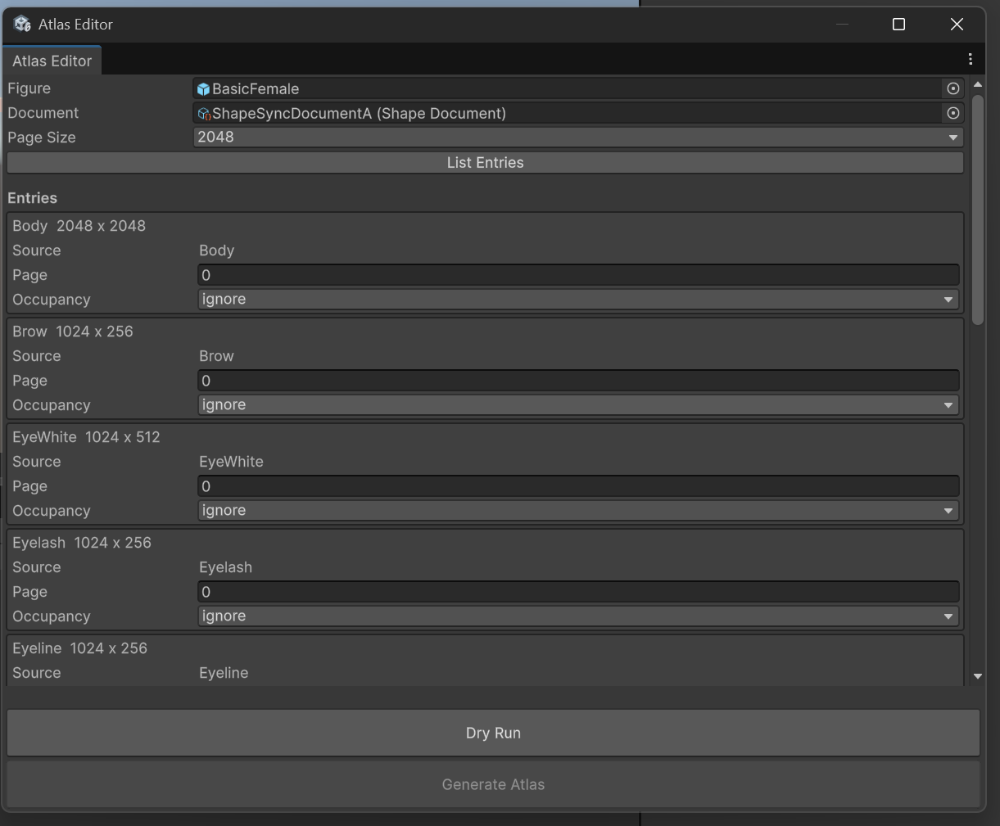
*▲Figure 12-2: Entry list originating from Document A and original texture sizes of each part loaded after executing List Entries*

---

## 3. Configuring Page and Occupancy Allocation

Configure which page (`Page`) and what cell area/orientation (`Occupancy`) to allocate for each Entry.

### 3.1 Allocating Page 0 (Base Body Parts Group)
Group the base body parts into **`Page 0`**. Enter **`0`** in the `Page` field for each Entry, and select the following cell areas from the `Occupancy` popup.

| Entry Name | Original Size | Page | Occupancy (Cell Area / Orientation) |
| :--- | :--- | :---: | :--- |
| **`Body`** | `2048 x 2048` | `0` | **`1/4`** |
| **`Brow`** | `1024 x 256` | `0` | **`1/16 Horizontal`** |
| **`EyeWhite`** | `1024 x 512` | `0` | **`1/32 Horizontal`** |
| **`Eyelash`** | `1024 x 256` | `0` | **`1/16 Horizontal`** |
| **`Eyeline`** | `1024 x 256` | `0` | **`1/16 Horizontal`** |
| **`Face`** | `1024 x 1024` | `0` | **`1/4`** |
| **`Highlight`** | `1024 x 512` | `0` | **`1/8 Horizontal`** |
| **`Iris`** | `1024 x 512` | `0` | **`1/8 Horizontal`** |
| **`Mouth`** | `512 x 512` | `0` | **`1/64`** |

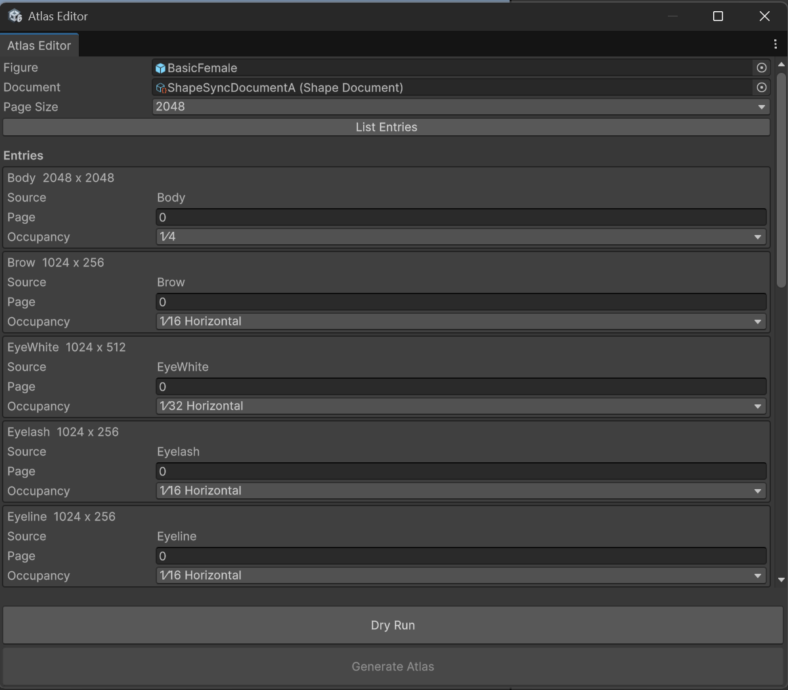
*▲Figure 12-3-1: Page number and Occupancy settings for Page 0 (first half of base body parts: Body, Brow, EyeWhite, Eyelash, Eyeline)*

*▲Figure 12-3-2: Page number and Occupancy settings for Page 0 (second half of base body parts: Face, Highlight, Iris, Mouth)*

### 3.2 Allocating Page 1 (Outfit Parts Group)
Group the outfit parts into **`Page 1`**. Enter **`1`** in the `Page` field for each Entry, and set `Occupancy`.

| Entry Name | Original Size | Page | Occupancy (Cell Area / Orientation) |
| :--- | :--- | :---: | :--- |
| **`Shoes1/Shoes1`** | `512 x 1024` | `1` | **`1/8 Vertical`** |
| **`Skirt1/Skirt1`** | `1024 x 512` | `1` | **`1/8 Horizontal`** |
| **`Tops1/Tops1`** | `2048 x 2048` | `1` | **`1/4`** |

### 3.3 Configuring Exclusions (Ignore) (`Hair1_*`)
Hairstyle parts cause UV overlap errors when atlas consolidation is performed due to their UV structure, so set them as excluded from consolidation (**`ignore`**).

| Entry Name | Original Size | Page | Occupancy |
| :--- | :--- | :---: | :--- |
| **`Hair1/Hair1`** | `512 x 1024` | `0` | **`ignore`** |
| **`Hair1/Hair2`** | `512 x 1024` | `0` | **`ignore`** |

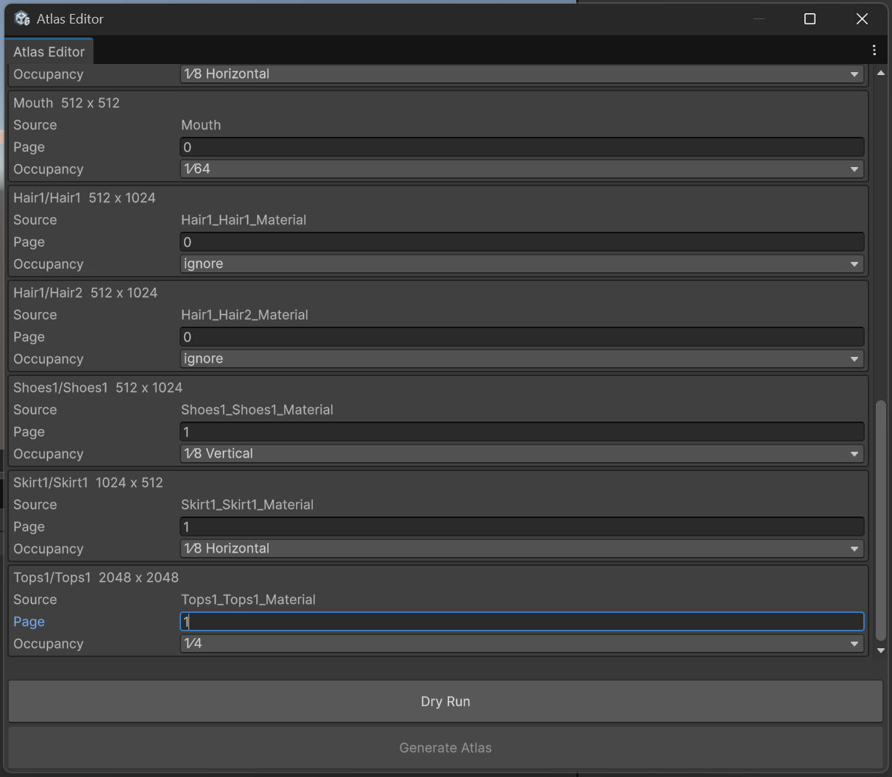
*▲Figure 12-4: Page 1 allocation (outfit parts: Shoes1, Skirt1, Tops1) and ignore (excluded) configuration for Hair1_* (Hair1/Hair1, Hair1/Hair2)*

---

## 4. Dry Run (Verification) and Saving Atlas Schema

### 4.1 Executing Dry Run and Verifying Layout
1. Click the **`Dry Run`** button at the bottom of the window.
2. **Verifying Results**:
   * If there are no issues with the settings, the **`Layout Preview`** (`Page Extent 2048` and the list of layout coordinates/sizes for each part) will appear in the window, and the info box will display `Atlas Dry Run succeeded.`.
   * This enables the **`Generate Atlas`** button at the bottom.
   > [!NOTE]
   > **About Re-Executing Dry Run Upon Modifying Settings**:
   > `Dry Run` only verifies the layout and does not create assets. If you modify settings such as `Occupancy` or `Page Size`, the `Generate Atlas` button will be disabled again. Always click `Dry Run` again after making changes.

*▲Figure 12-7: State after executing Dry Run where Layout Preview is generated, "Atlas Dry Run succeeded." is displayed, and the Generate Atlas button is enabled*

### 4.2 Saving Atlas Schema
1. After `Dry Run` succeeds, click the **`Generate Atlas`** button at the bottom of the window.
2. When the `Save Atlas Schema` dialog appears, save the file as **`AtlasSchema.asset`** in the **`Assets > ShapeSync`** folder.
3. Confirm that `Atlas Schema saved.` is displayed at the bottom of Atlas Editor, and **`AtlasSchema.asset`** is generated directly under `Assets/ShapeSync/` in the Project window.
   * (The Schema asset stores the configuration values for each Entry, not the texture images themselves).

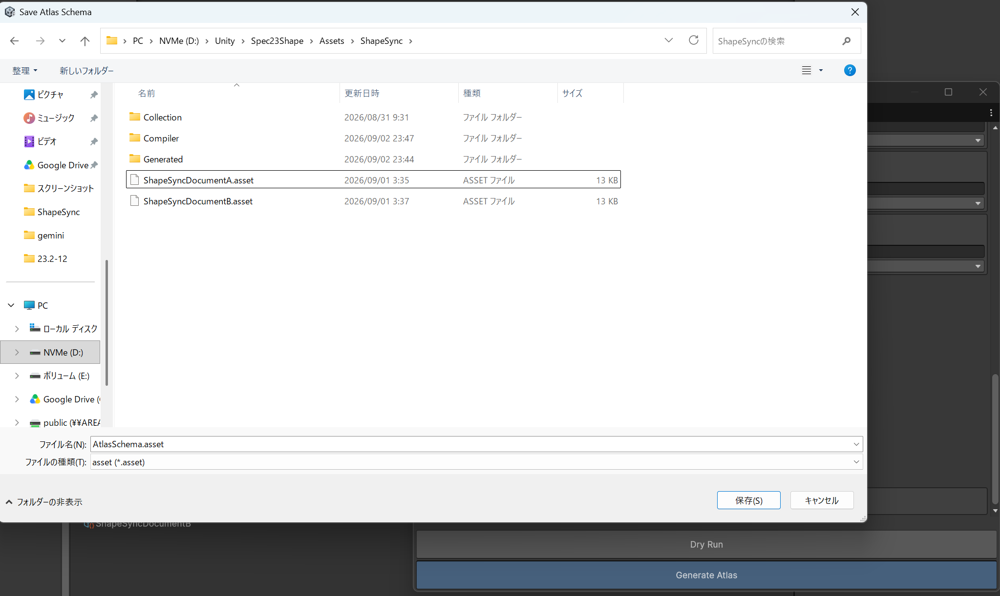
*▲Figure 12-8-1: Operation of specifying and saving AtlasSchema.asset directly under Assets/ShapeSync/ in the Save Atlas Schema dialog*

*▲Figure 12-8-2: Display of Atlas Schema saved. message and confirmation of AtlasSchema.asset generation in the Project window*

---

## 5. Regenerating with Atlas Applied in Humanoid Compiler

Using the created Atlas Schema, regenerate the Pure Humanoid in Humanoid Compiler.

### 5.1 Configuring Humanoid Compiler
1. Open **`Tools > zgock > ShapeSync > Humanoid Compiler`** from the top menu of the Unity Editor.
2. Configure each input field:
   * **`Figure`**: `Assets/ShapeSync/Generated/BasicFemale.prefab`
   * **`Document`**: `Assets/ShapeSync/ShapeSyncDocumentA.asset`
   * **`Atlas Schema (Optional)`**: Specify **`Assets/ShapeSync/AtlasSchema.asset`** saved in Step 4.
   * **`Transport VRM Physics`**: Set to **ON** (`VRM Asset Relative Folder: VRM`) in a VRM integration environment.

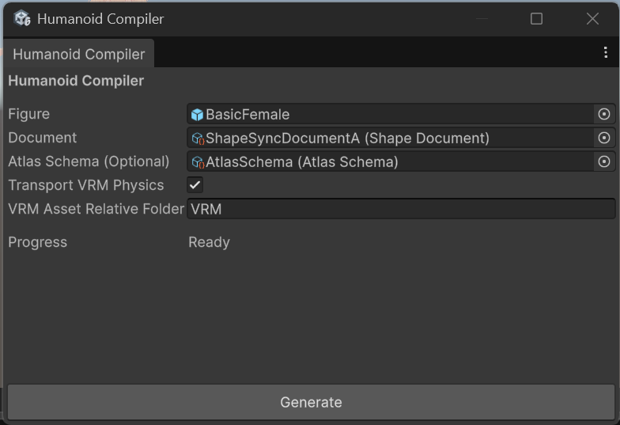
*▲Figure 12-9: Humanoid Compiler with Figure, Document, and Atlas Schema (AtlasSchema) specified, and VRM Physics set to ON*

### 5.2 Specifying Output Destination Folder and Executing Generate
1. Click the **`Generate`** button at the bottom of the Compiler window.
2. In the `Select Empty Pure Humanoid Output Folder` dialog, select a new or empty folder **`Assets/ShapeSync/Compiler/AtlasA`**.
   > [!IMPORTANT]
   > To avoid mixing with the `DocumentA` folder used in Chapter 11, be sure to specify a separate empty folder **`AtlasA`**.
3. Confirm that compilation completes successfully and displays `Progress: Completed` and `Output: Assets/ShapeSync/Compiler/AtlasA`.

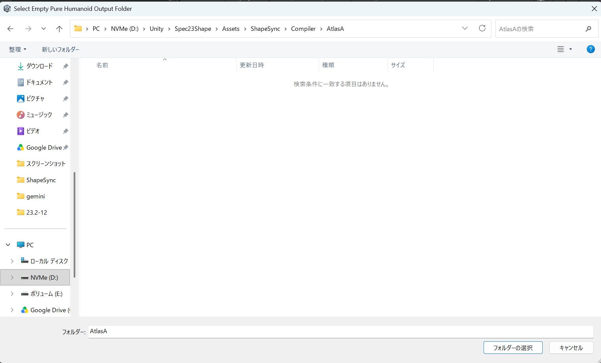
*▲Figure 12-10-1: Selecting the new empty folder AtlasA in the Select Empty Pure Humanoid Output Folder dialog*

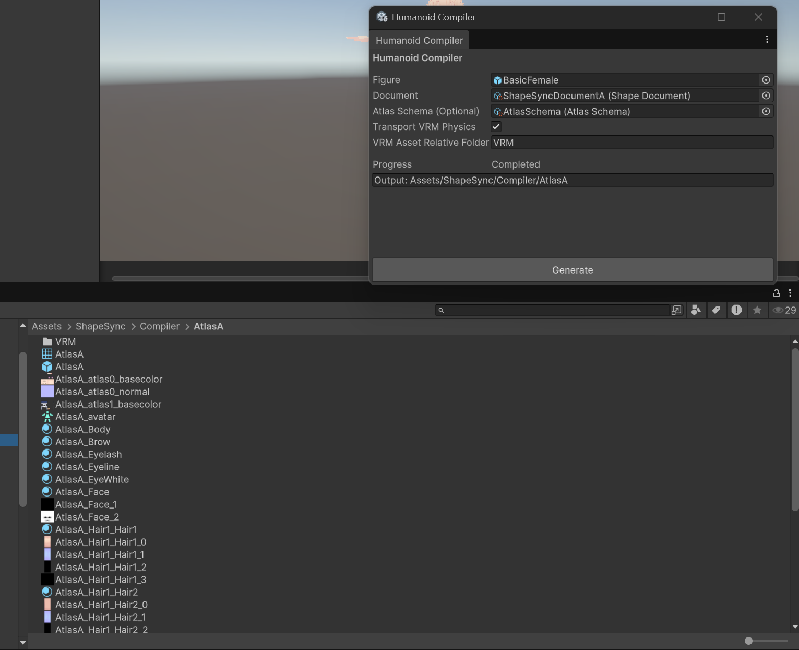
*▲Figure 12-10-2: Compilation completed (Completed) display in Humanoid Compiler and asset group with AtlasA prefix output to the Project view*

---

## 6. Verifying Generated Assets and Motion

### 6.1 Checking Generated Assets and Main Texture Consolidation
1. Open **`Assets > ShapeSync > Compiler > AtlasA`** in the Project window.
2. Confirm the following generated items prefixed with the output folder name (`AtlasA`):
   * Main Prefab: **`AtlasA.prefab`**
   * Consolidated Mesh: **`AtlasA.asset`**
   * Humanoid Avatar: **`AtlasA_avatar.asset`**
   * **Atlas Page Textures**: **`AtlasA_atlas0_basecolor.png`**, **`AtlasA_atlas0_normal.png`**, **`AtlasA_atlas1_basecolor.png`**, etc.
   * **Remaining Individual Textures**: Textures originating from `Hair1` configured as excluded (ignore), etc.
3. **Consolidation Effect on Main Texture**:
   * **In each page subject to Atlas (Page 0 / Page 1), respective Main Textures (BaseColor) are consolidated into a single atlas image.**
   * This significantly reduces texture swapping overhead when rendering the character.

*▲Figure 12-11-1: Preview display of AtlasA_atlas0_basecolor (Page 0 atlas image: base body parts group) in Project view and AtlasA model in Scene*

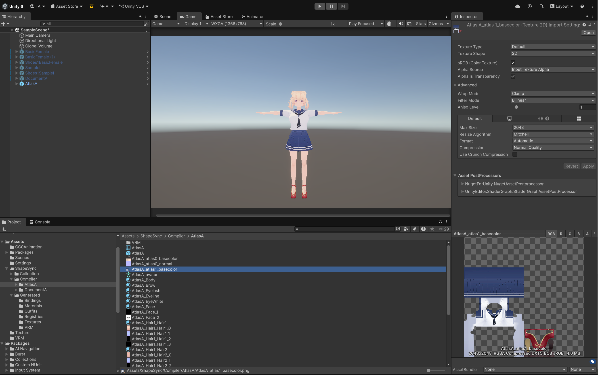
*▲Figure 12-11-2: Preview display of AtlasA_atlas1_basecolor (Page 1 atlas image: outfit parts group) in Project view and AtlasA model in Scene*

### 6.2 Scene Placement and Motion Verification
1. Drag and drop **`Assets/ShapeSync/Compiler/AtlasA/AtlasA.prefab`** from the Project window into the Scene view.
2. **Visual Verification**: Confirm that even with part textures consolidated into atlases, visual appearance and material representations render cleanly without corruption.
3. **Animation Playback Verification**: Assign `Walking.controller` to `Animator` in the Inspector and play in Play Mode. Confirm that walking animation and SpringBone secondary motion operate smoothly and seamlessly together.

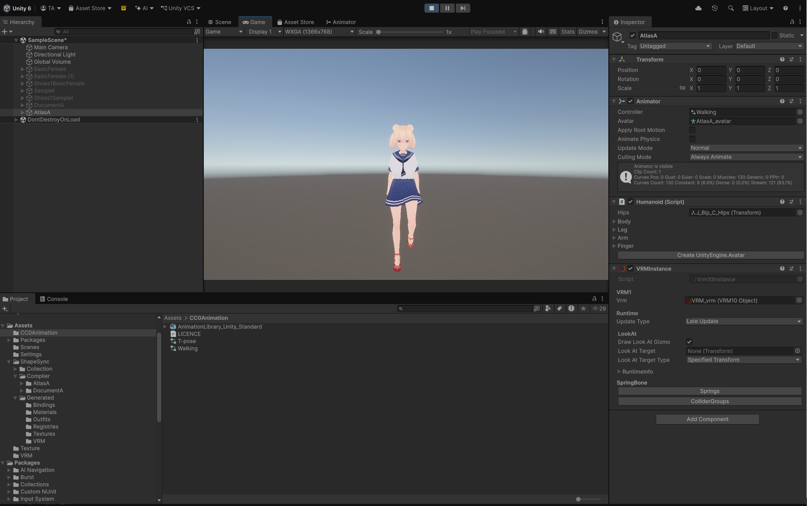
*▲Figure 12-12: State where walking animation via Walking.controller and VRM Physics (hair/skirt sway) operate properly together in Play Mode*

---

## 7. Common Issues and Solutions (Troubleshooting)

### Q1. A warning regarding aspect ratio (yellow HelpBox) appears below the target Entry
* **Warning Example**:
  `Shoes1/Shoes1: source 512 x 1024 does not match Atlas cell 1024 x 1024. PLACE will resample the source into this cell.`
* **Cause**:
  Displayed when the aspect ratio (portrait / landscape) of the original texture does not match the cell orientation specified in `Occupancy` (`Horizontal` / `Vertical` / square `1/4`, etc.).
* **Solution**:
  Do not ignore the warning; re-select an appropriate orientation matching the aspect ratio of the original texture (e.g., `1/8 Vertical` for portrait, `1/8 Horizontal` for landscape).

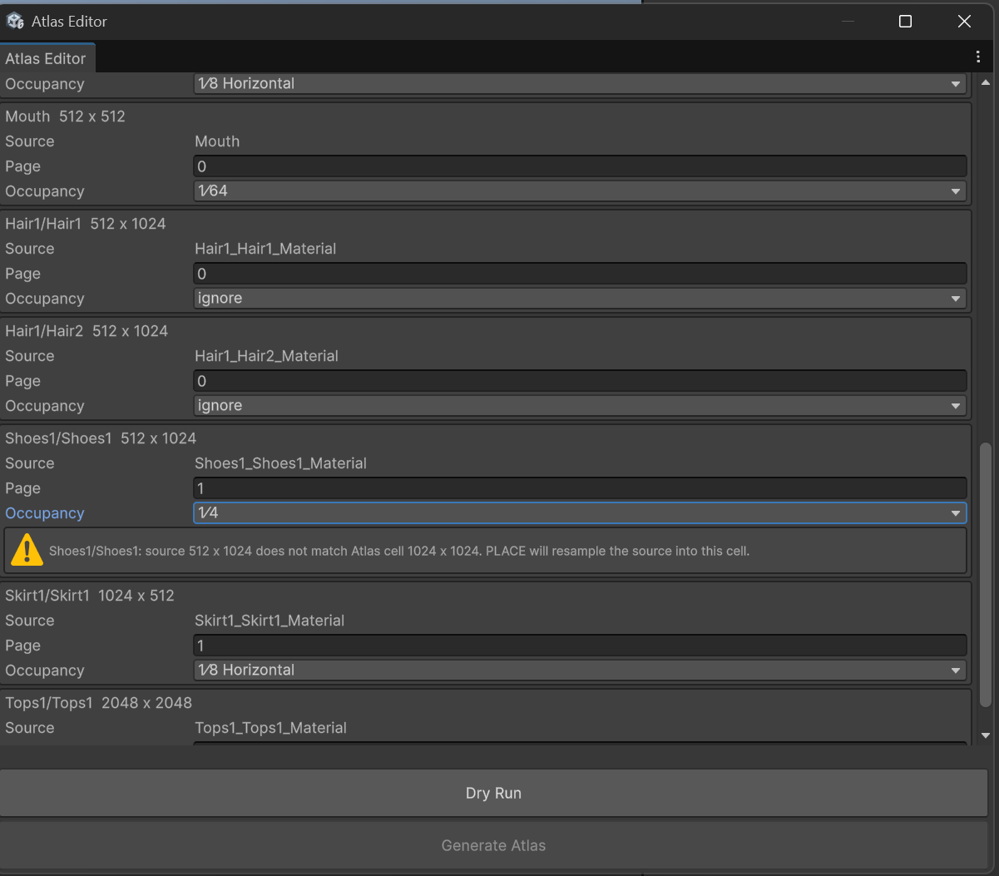
*▲Figure 12-5: Warning regarding aspect ratio mismatch and resampling (yellow HelpBox) displayed because 1/4 was specified for Shoes1/Shoes1*

### Q2. `AtlasUv0OutOfRange` error appears during Dry Run
* **Error Content**:
  `Atlas UV0 must be finite and within [0,1]. owner=Hair1;materialId=Hair1/Hair1;submesh=0;pageIndex=1;cause=`
* **Cause**:
  Occurs when materials with UV tiling or overlapping, such as hairstyles (`Hair1/Hair1` or `Hair1/Hair2`), are included in the Atlas target when executing Dry Run.
* **Solution**:
  Set the `Occupancy` of `Hair1/Hair1` and `Hair1/Hair2` to **`ignore`**, and execute `Dry Run` again.

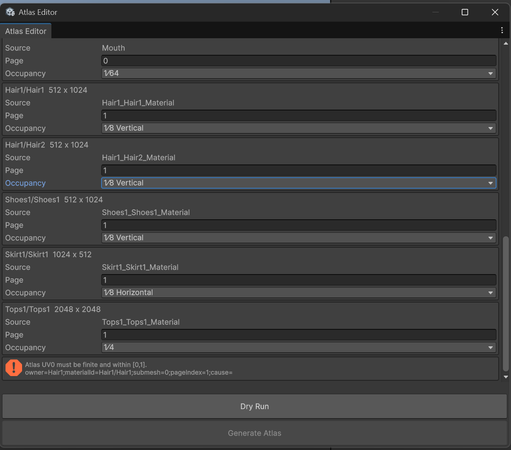
*▲Figure 12-6: AtlasUv0OutOfRange error (red HelpBox) that occurred during Dry Run because Hair1/Hair1 was included in Atlas target*

### Q3. Generate Atlas button became disabled after modifying settings
* **Cause**:
  By design for safety, modifying settings such as `Occupancy` or `Page Size` invalidates the previous Dry Run verification state.
* **Solution**:
  After modifying settings, click the **`Dry Run`** button again to verify the layout. Once Dry Run succeeds, the `Generate Atlas` button will be enabled again.

---

[← Back to Tutorial Index](./index.html) ｜ [← Chapter 11: Humanoid Compiler (Generating and Verifying Pure Humanoid from Document)](./humanoidcompiler.html)
