# Chapter 10: Document Storage and Outfit Tag / Priority (Outfit Conflict Control and State Storage/Restoration)

[← Back to Tutorial Index](./index.html) ｜ [← Chapter 9: Advanced VRM Integration (Expression and Physics Configuration and Verification)](./vrmintegration.html)

This chapter explains how to configure **Outfit Tags** and **Priority** to control wearing regions and precedence among multiple outfits, as well as the procedure for **Document storage and loading** to save and restore a character's current wearing and deformation state (Shapes and Outfits) entirely as an asset.

* **First Half (VRoid Studio / ShapeSync Editor)**: Prepare and register separate outfit VRMs for the upper-body top (`Tops1`) and lower-body skirt (`Skirt1`), and configure Tags (`upperchest`, `lowerchest`) and Priority.
* **Second Half (Unity / ShapeDirector)**: Verify outfit conflict and exclusive display in Play Mode, save current wearing states as **Document A (`ShapeSyncDocumentA`)** and **Document B (`ShapeSyncDocumentB`)**, and confirm that they can be loaded and restored in one click from an empty Template List state.

---

## 1. Introduction (Outfit Conflict Control and Role of Document)

### 1.1 Priority and Tag Exclusive Control for Outfits
When having a character wear multiple outfits simultaneously (tops, bottoms, dresses, etc.), it is necessary to control "which body regions conflict" and "which outfit is displayed when a conflict occurs."
* **Tag (Conflict Region)**: An identifier defining "which region conflicts" (e.g., upper body `upperchest`, lower body `lowerchest`). Outfits sharing the same Tag become subjects of conflict.
* **Priority (Precedence)**: A numerical value determining "which outfit takes precedence" when a conflict occurs. **The outfit with the higher numerical value takes precedence**, and outfits with lower values are automatically hidden (excluded).
* **Separation of Logical Registration and Visual Display**: Even if multiple Templates are registered simultaneously in ShapeDirector, visual display on screen is automatically organized through Tag and Priority exclusive evaluation.

### 1.2 Role of Document
* **What is Document**: A data format that records the current outfit, body proportions (Morph / FBM / PBM), materials, and other states of a character collectively into a single file (`.asset`).
* **Saving and Loading**: By saving a Document, you can instantly switch to a desired coordinate or body proportion simply by loading the Document, without needing to swap individual Templates manually.

---

## 2. VRM Preparation for Tops1 and Skirt1 and Mesh Outfit Registration

### 2.1 VRM Preparation in VRoid Studio
Prepare the upper-body `Tops1` and lower-body `Skirt1` as separate outfits.

* **`Tops1` (4 types in total)**:
  Because it is affected by chest deformation (`BreastSize` PBM), export a total of 4 types including Base / FBM and PBM follow versions:
  1. Equip Tops on `BasicFemale.vroid` and export as `Tops1BasicFemale.vrm` (Figure 10-1, Figure 10-2).
  2. Equip Tops on `SampleI.vroid` and export as `Tops1SampleI.vrm` (Figure 10-3).
  3. Equip Tops on `BreastSizeBasicFemale.vroid` and export as `Tops1BreastSizeBasicFemale.vrm` (Figure 10-4).
  4. Equip Tops on `BreastSizeSampleI.vroid` and export as `Tops1BreastSizeSampleI.vrm` (Figure 10-5).

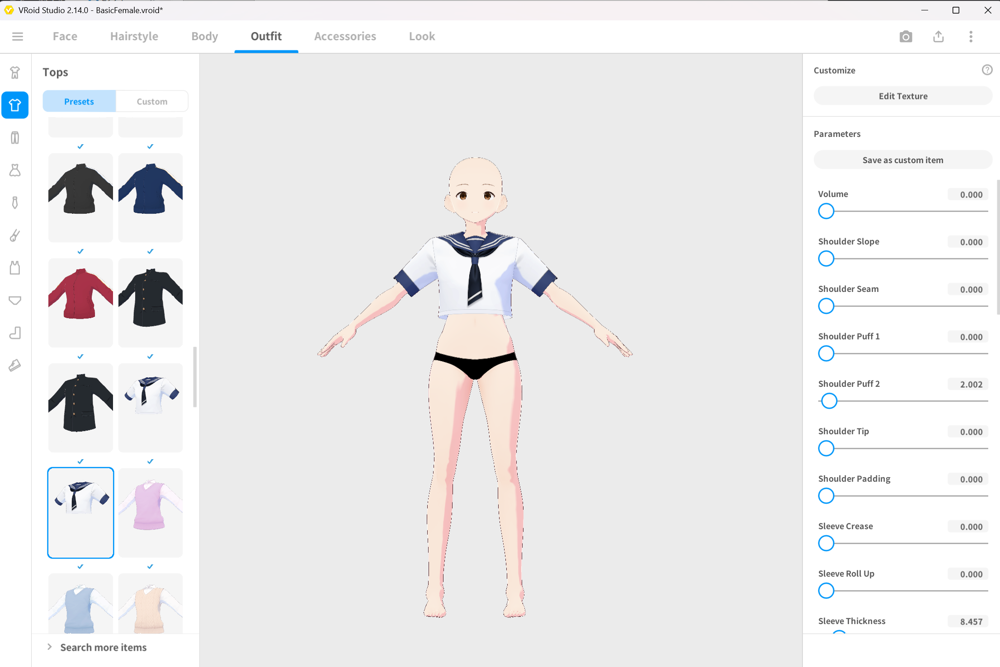
*▲Figure 10-1: Equipping Tops on BasicFemale*

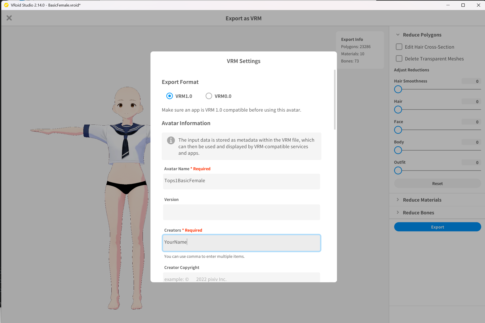
*▲Figure 10-2: Saving Tops1BasicFemale.vrm*

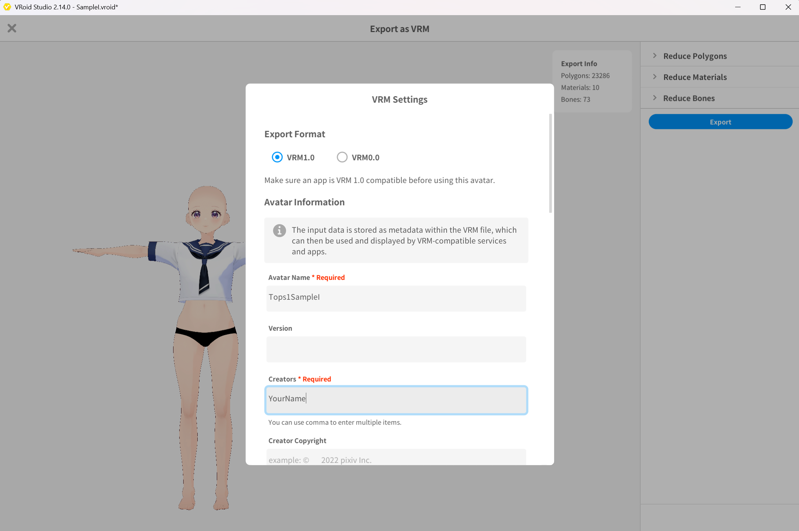
*▲Figure 10-3: Saving Tops1SampleI.vrm*

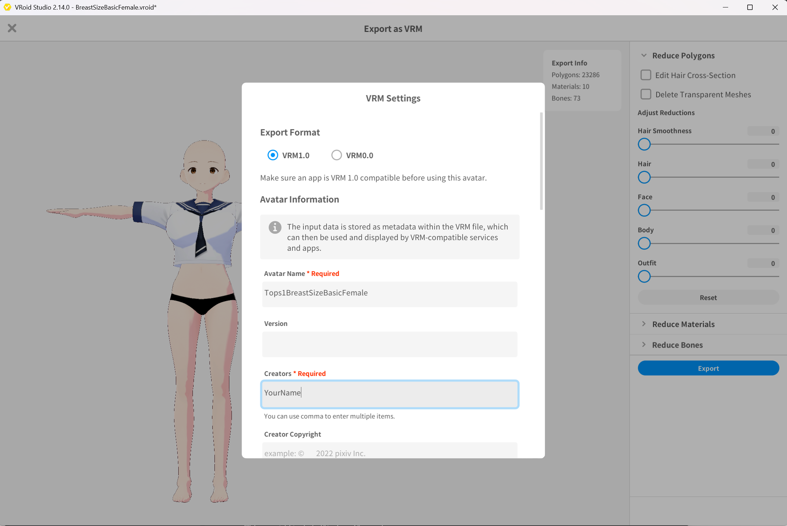
*▲Figure 10-4: Saving Tops1BreastSizeBasicFemale.vrm*

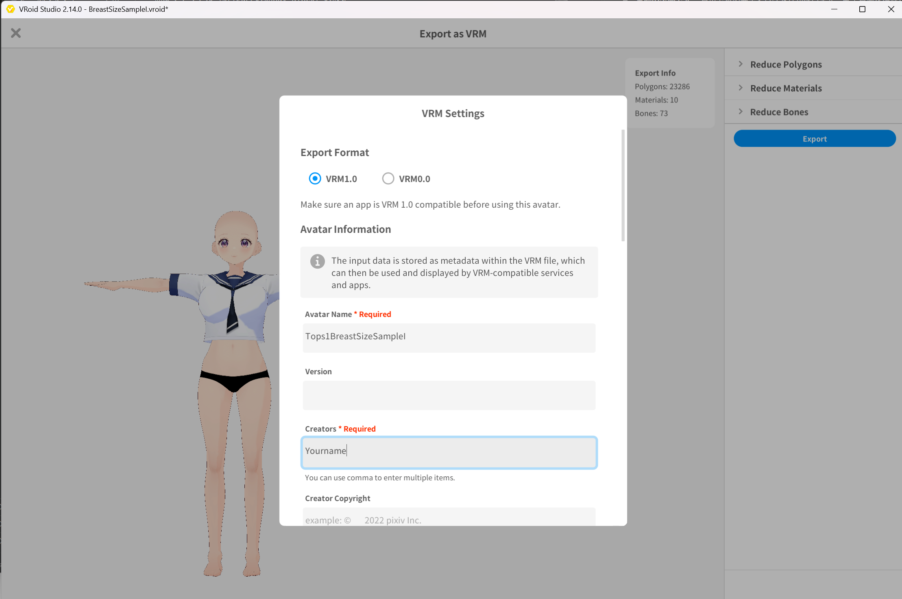
*▲Figure 10-5: Saving Tops1BreastSizeSampleI.vrm*

* **`Skirt1` (2 types in total)**:
  Because it is not affected by chest deformation (`BreastSize`), export a total of 2 types for Base / FBM:
  1. Equip Skirt on `BasicFemale.vroid` and export as `Skirt1BasicFemale.vrm` (Figure 10-6, Figure 10-7).
  2. Equip Skirt on `SampleI.vroid` and export as `Skirt1SampleI.vrm` (Figure 10-8).

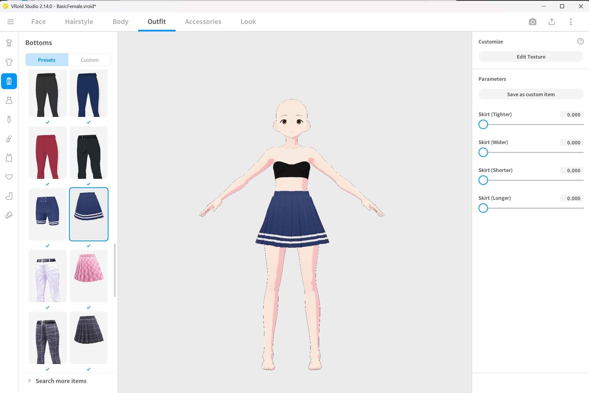
*▲Figure 10-6: Equipping Skirt on BasicFemale*

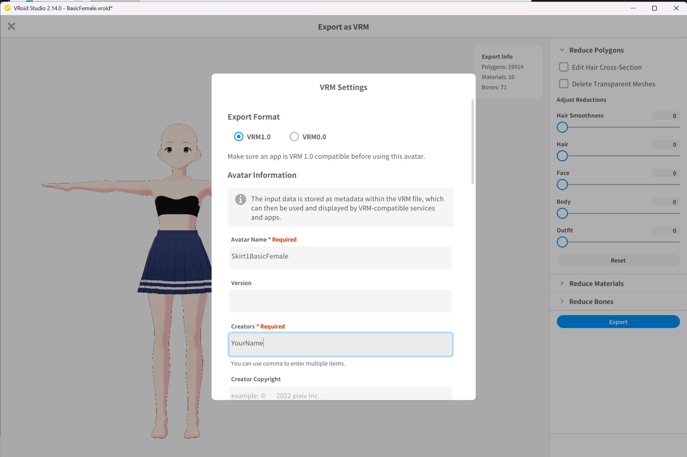
*▲Figure 10-7: Saving Skirt1BasicFemale.vrm*

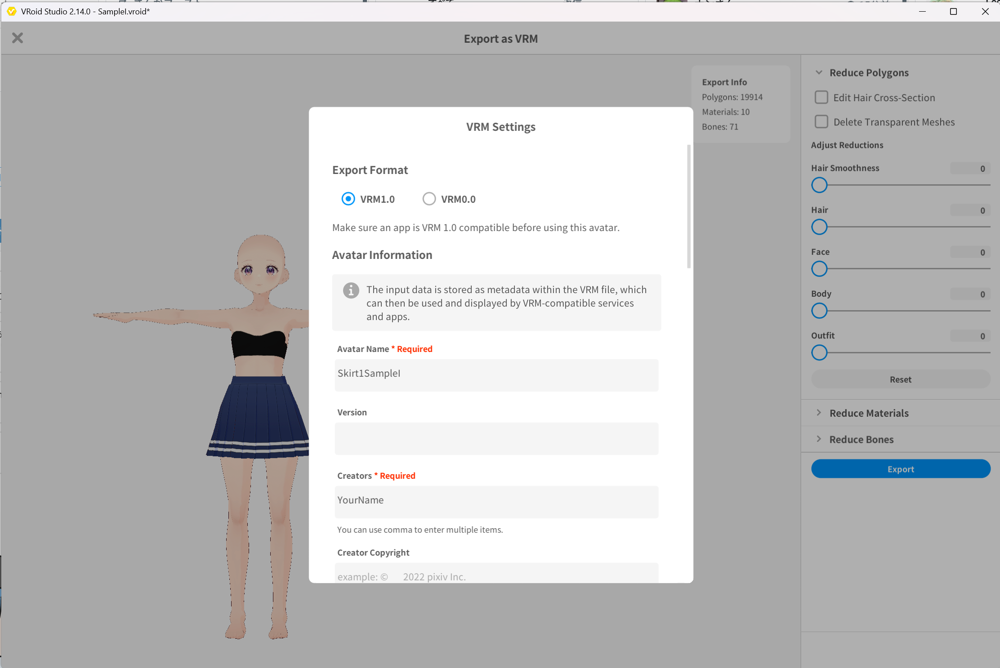
*▲Figure 10-8: Saving Skirt1SampleI.vrm*

### 2.2 Tops1 Registration in ShapeSync Editor
1. Open ShapeSync Editor (**Tools > zgock > ShapeSync > ShapeSync Editor**) in the Unity Editor.
2. In `Outfits > Mesh Outfits` on the left TreeView, create `Tops1`, specifying `Outfit Id: Tops1`, `Outfit Name: Tops1`, and `Outfit Prefab: Tops1BasicFemale`.

*▲Figure 10-9-1: Outfits > Mesh Outfits > Tops1 basic info registration (Outfit Prefab: Tops1BasicFemale)*

3. On the `Materials` screen, classify base body materials such as face, eyes, and skin as **`Exclude`**.

*▲Figure 10-9-2: Classifying base body materials as Exclude in Tops1 > Materials*

4. Set the bottom outfit material (`Tops_01_CLOTH`) to `Entry Name: Tops1` and `Classification: Include`, then click **`Save to Database`**.

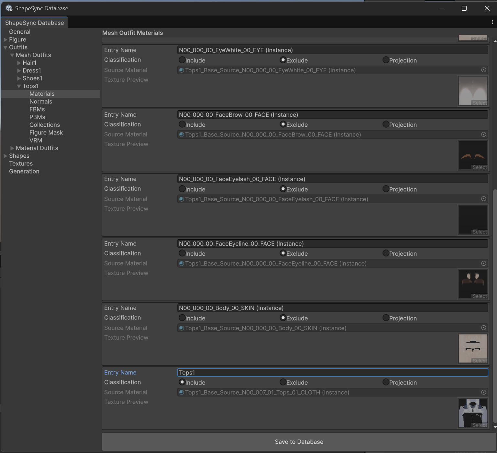
*▲Figure 10-9-3: Setting Tops1 material to Include and saving with Save to Database*

5. On the `FBMs` screen, assign **`Tops1SampleI`** to `FBM Prefab` for `SampleI`.

*▲Figure 10-9-4: Assigning Tops1SampleI to SampleI in Tops1 > FBMs*

6. On the `PBMs` screen, enable **`Follow BreastSize`**, specify **`Tops1BreastSizeBasicFemale`** for `Base Prefab` and **`Tops1BreastSizeSampleI`** for `SampleI Prefab`, then click **`Save to Database`**.

*▲Figure 10-9-5: Enabling Follow BreastSize in Tops1 > PBMs, specifying PBM Prefabs, and saving*

### 2.3 Skirt1 Registration in ShapeSync Editor
1. In `Outfits > Mesh Outfits` on the left TreeView, create `Skirt1`, specifying `Outfit Id: Skirt1`, `Outfit Name: Skirt1`, and `Outfit Prefab: Skirt1BasicFemale`.

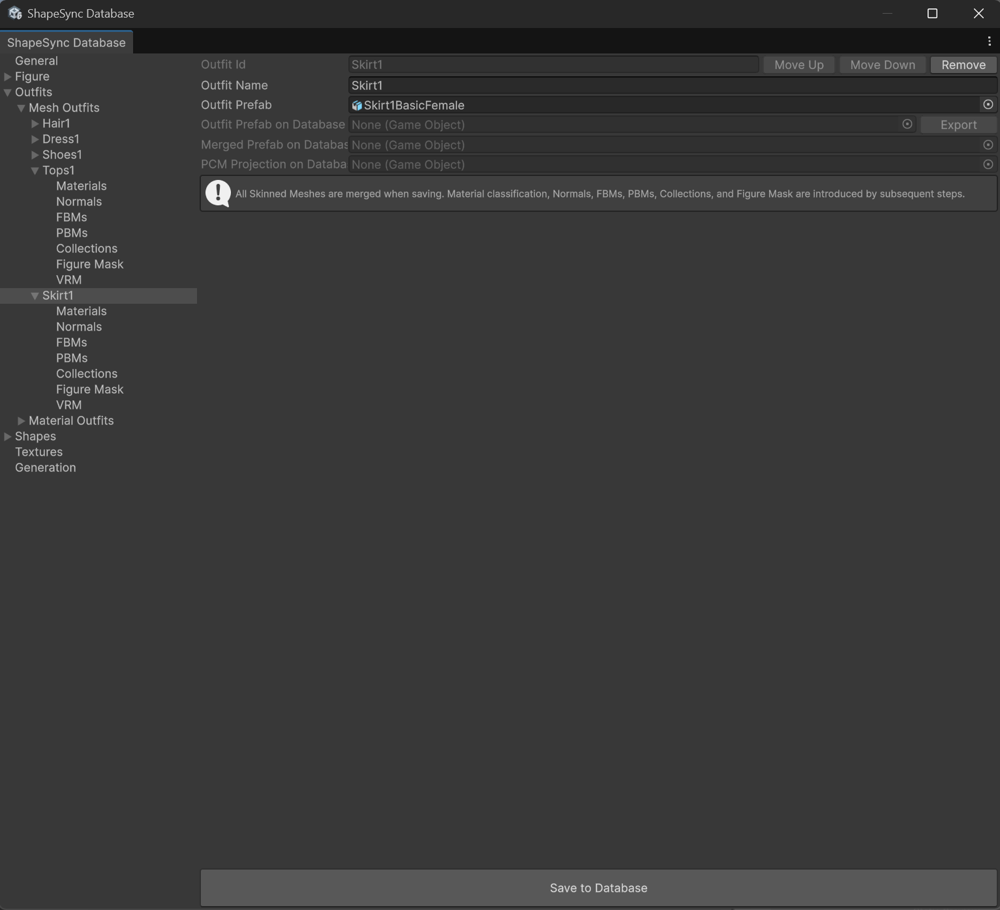
*▲Figure 10-10-1: Outfits > Mesh Outfits > Skirt1 basic info registration (Outfit Prefab: Skirt1BasicFemale)*

2. On the `Materials` screen, classify base body materials as **`Exclude`**.

*▲Figure 10-10-2: Classifying base body materials as Exclude in Skirt1 > Materials*

3. Set the bottom outfit material (`Bottoms_01_CLOTH`) to `Entry Name: Skirt1` and `Classification: Include`, then click **`Save to Database`**.

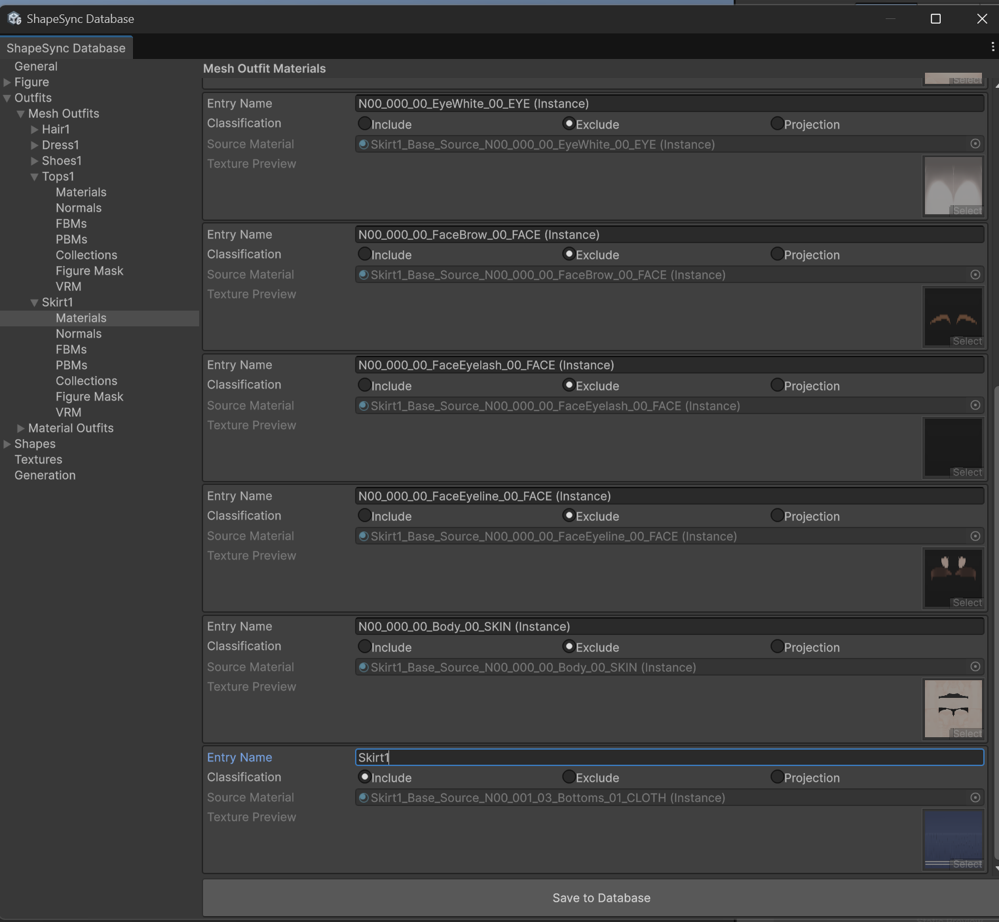
*▲Figure 10-10-3: Setting Skirt1 material to Include and saving with Save to Database*

4. On the `FBMs` screen, assign **`Skirt1SampleI`** to `FBM Prefab` for `SampleI`. (Note: Because Skirt1 is not affected by `BreastSize`, PBM Follow configuration is unnecessary).

*▲Figure 10-10-4: Assigning Skirt1SampleI to SampleI in Skirt1 > FBMs*

5. On the `VRM` screen, specify **`Skirt1BasicFemale`** for `Physics Reference VRM`, then click **`Save to Database`**.

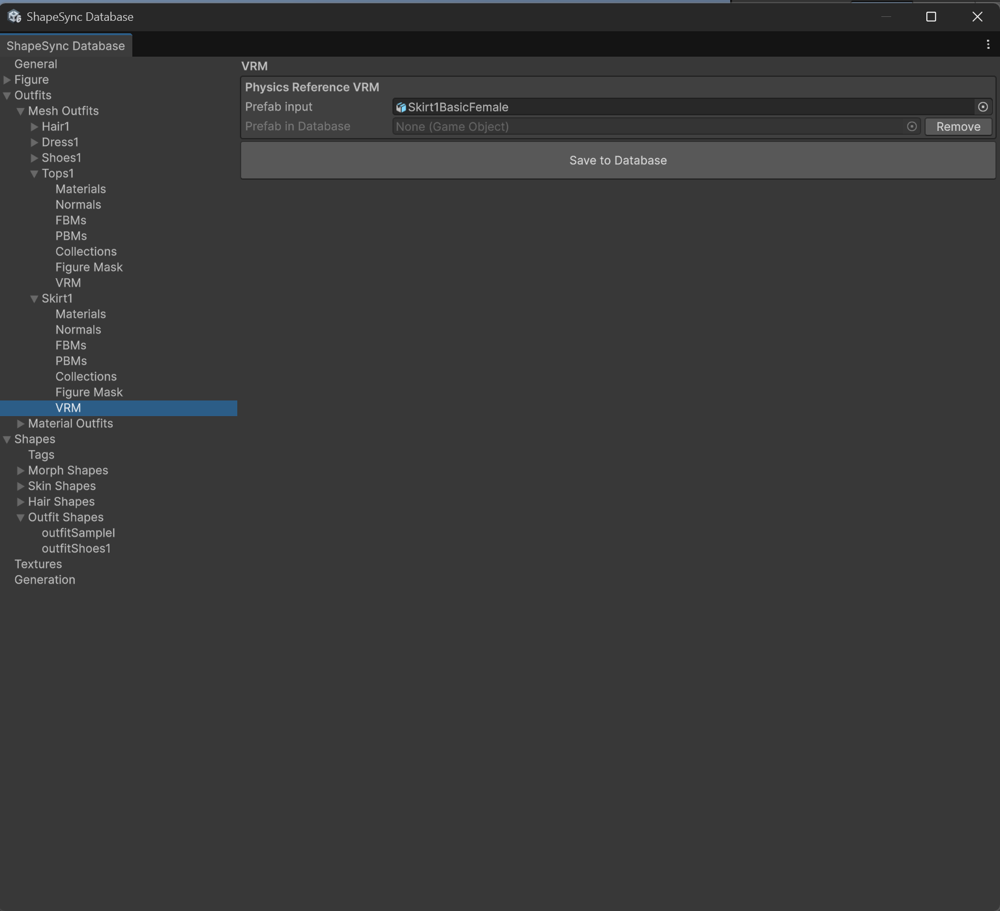
*▲Figure 10-11: Specifying Skirt1BasicFemale in Physics Reference VRM under Skirt1 > VRM and saving*

---

## 3. Creating Outfit Tags and Configuring Priority / Tag on Outfit Shapes

### 3.1 Creating Outfit Tags
Register the tag vocabulary (region names) selectable by Shapes.

1. Select **`Shapes > Tags`** from the left TreeView in ShapeSync Editor.
2. Click the **`Add Tag`** button and enter **`upperchest`** in the input field.
3. Click the **`Add Tag`** button again and enter **`lowerchest`** in the input field.
4. Click the **`Save into Database`** button at the bottom of the screen to save the tag vocabulary.

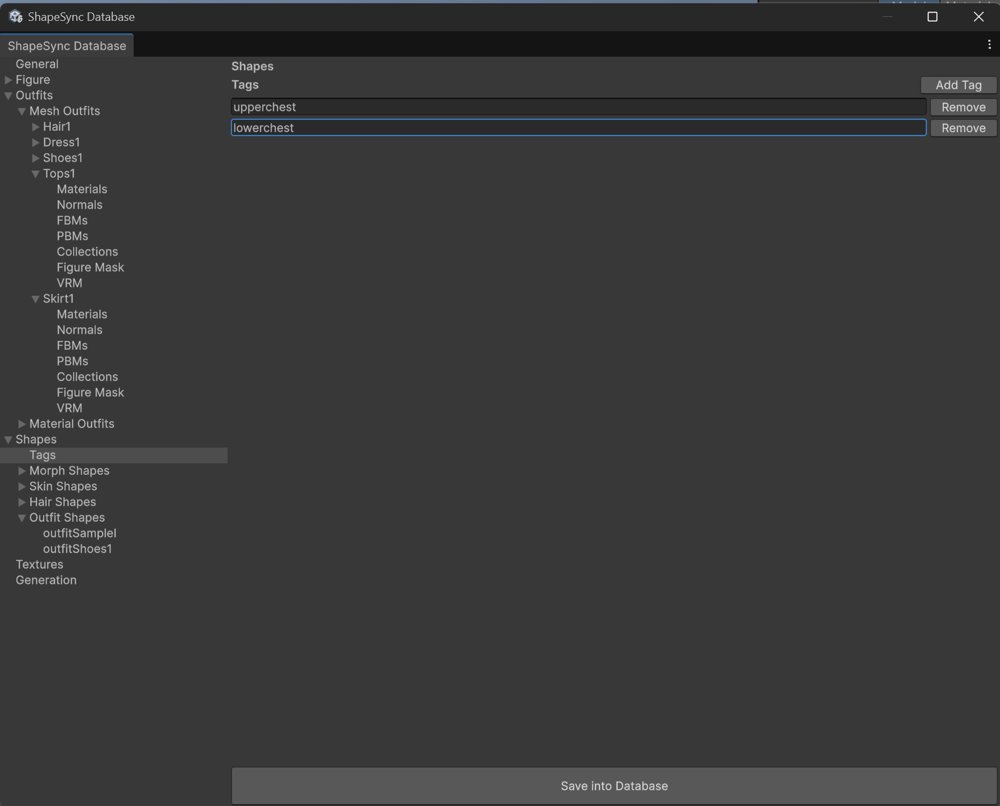
*▲Figure 10-12: Creating upperchest and lowerchest in Shapes > Tags and saving with Save into Database*

### 3.2 Creating/Updating Outfit Shapes and Assigning Priority / Tags
Configure the created tags and Priority values for each Outfit Shape.

1. **New creation of `outfitTops1`**:
   * On the `Shapes` root screen, enter `Shape Id: outfitTops1` and `Shape Name: outfitTops1`, then click **`Create Outfit Shape Template`**.
   * **`Priority`**: Enter **`10`**.
   * **`Tags`**: Select **`upperchest`** from the popup and click **`Add Tag`**.
   * **`Parts`**: Click **`Add Mesh`** and select **`Tops1`** from the `Outfit Mesh` popup.
   * Click **`Save to Database`** at the bottom of the screen.

*▲Figure 10-13-1: Priority (10) and Tag (upperchest) configuration for Shapes > Outfit Shapes > outfitTops1*

2. **New creation of `outfitSkirt1`**:
   * On the `Shapes` root screen, enter `Shape Id: outfitSkirt1` and `Shape Name: outfitSkirt1`, then click **`Create Outfit Shape Template`**.
   * **`Priority`**: Enter **`15`**.
   * **`Tags`**: Select **`lowerchest`** from the popup and click **`Add Tag`**.
   * **`Parts`**: Click **`Add Mesh`** and select **`Skirt1`** from the `Outfit Mesh` popup.
   * Click **`Save to Database`** at the bottom of the screen.

*▲Figure 10-13-2: Priority (15) and Tag (lowerchest) configuration for Shapes > Outfit Shapes > outfitSkirt1*

3. **Overwrite update of `outfitSampleI` (for existing Dress)**:
   * Select the existing **`outfitSampleI`** from `Outfit Shapes` in the left TreeView (Do not create a new one).
   * **`Priority`**: Enter **`20`**.
   * **`Tags`**: Add both **`upperchest`** and **`lowerchest`** from the popup (covering both upper and lower body regions).
   * Click **`Save to Database`** at the bottom of the screen.

*▲Figure 10-13-3: Overwrite update of Priority (20) and both Tags (upperchest, lowerchest) for existing outfitSampleI*

| Shape Id | Priority | Tags | Linked Mesh Outfit | Role |
| :--- | :---: | :--- | :--- | :--- |
| **`outfitTops1`** | `10` | `upperchest` | `Tops1` | Upper-body separate outfit |
| **`outfitSkirt1`** | `15` | `lowerchest` | `Skirt1` | Lower-body separate outfit |
| **`outfitSampleI`** | `20` | `upperchest`, `lowerchest` | `Dress1` | Integrated one-piece dress (highest priority) |

### 3.3 Re-Executing Generate in Generation
1. Select the **`Generation`** section from the left TreeView.
2. Click the **`Generate`** button at the bottom of the screen, select the output root folder (`Assets/ShapeSync/Generated`), and execute regeneration.

---

## 4. Verifying Priority / Tag Exclusive Control in Play Mode

### 4.1 Exclusive Display with 3 Templates Registered Simultaneously (Dress1 Display)
1. Select the Figure (`BasicFemale`) placed in the Scene.
2. In the `Template List` of Figure's **`ShapeDirector`** component, register the following Templates:
   * `morphSampleI`
   * `skinSampleI`
   * `hairSampleI`
   * `outfitSkirt1`
   * `outfitTops1`
   * `outfitSampleI` (Dress)
3. Press Unity's **Play button** to enter **Play Mode**.
4. **Checking exclusive display**: Although 3 outfit templates (Tops1, Skirt1, Dress1) are logically registered in the `Template List`, because Priority `20` `Dress1` (`outfitSampleI`) exclusively dominates both `upperchest` and `lowerchest` tags, confirm that **only `Dress1`** is displayed on screen.

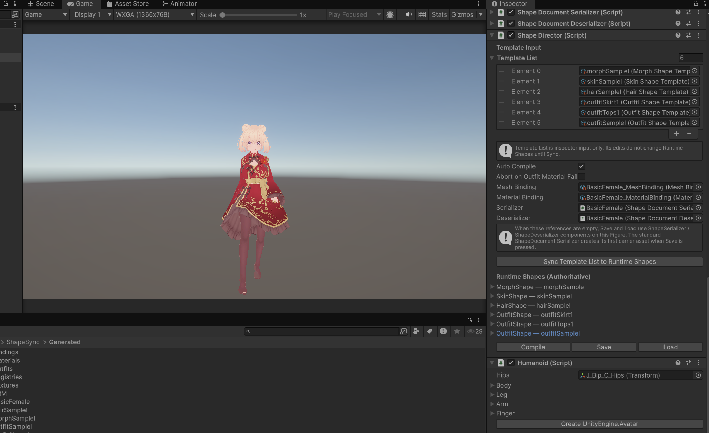
*▲Figure 10-14: Play Mode screen showing only Priority 20 Dress1 exclusively displayed when 3 outfit Templates are registered*

### 4.2 Removing Dress to Display Separate Outfits (Tops1 + Skirt1 Display)
1. During Play Mode, in `Runtime Shapes (Authoritative)` of the `ShapeDirector` Inspector, expand `OutfitShape — outfitSampleI` and click the **`Remove Shape`** button.

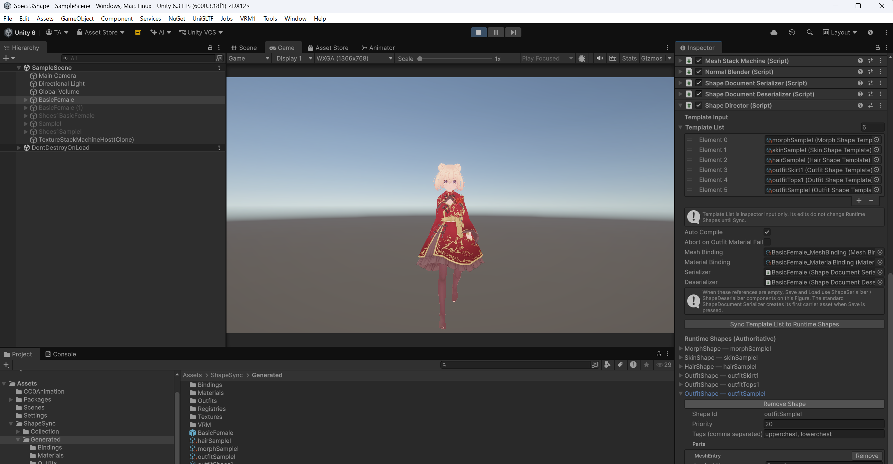
*▲Figure 10-15-1: Clicking Remove Shape from outfitSampleI in Runtime Shapes*

2. **Checking separate outfit display**: Dress exclusion is lifted, and second-priority **`Tops1` (Priority 10)** and **`Skirt1` (Priority 15)** immediately appear on screen, confirming display as a combined separate outfit (sailor-suit style top + pleated skirt).

*▲Figure 10-15-2: Play Mode screen where Tops1 + Skirt1 are immediately displayed after removing Dress*

---

## 5. Saving Documents (Document A / Document B)

### 5.1 Saving Document A (Tops + Skirt State)
1. Confirm the `Tops1` + `Skirt1` wearing state (Runtime Shapes).
2. Click the **`Save`** button at the bottom of Figure's `ShapeDirector` Inspector.
3. When the `Save Shape Document` dialog appears, select the project **`Assets/ShapeSync`** folder, enter **`ShapeSyncDocumentA`** for the file name, and click **`Save`**.

*▲Figure 10-16-1: Saving as ShapeSyncDocumentA in Assets/ShapeSync via Save Shape Document dialog*

4. In Unity's Project view, confirm that **`ShapeSyncDocumentA`** (`.asset`) is created directly under `Assets > ShapeSync`.

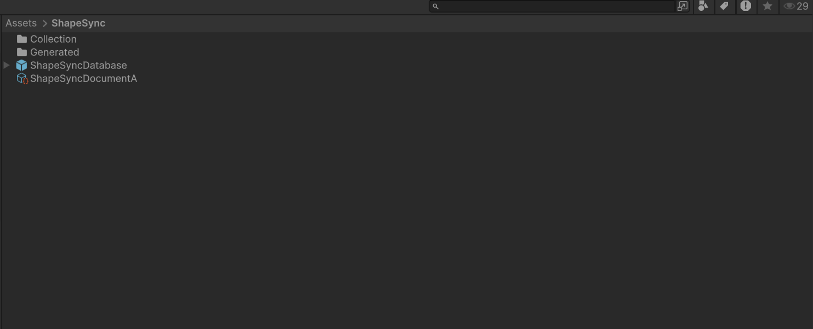
*▲Figure 10-16-2: Project view showing ShapeSyncDocumentA asset saved directly under Assets/ShapeSync*

### 5.2 Saving Document B (Dress State)
1. Re-apply `outfitSampleI` (Dress) via Template List sync or equivalent to establish the `Dress1` wearing state (Runtime Shapes).
2. Click the **`Save`** button at the bottom of the `ShapeDirector` Inspector.
3. Select the **`Assets/ShapeSync`** folder, enter **`ShapeSyncDocumentB`** for the file name, and click **`Save`**.

*▲Figure 10-17-1: Saving as ShapeSyncDocumentB in Assets/ShapeSync via Save Shape Document dialog*

4. In the Project view, confirm that **`ShapeSyncDocumentB`** is additionally saved under `Assets > ShapeSync`.

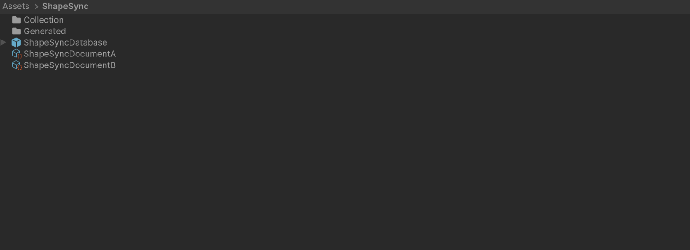
*▲Figure 10-17-2: Project view showing both Document A and Document B saved together under Assets/ShapeSync*

---

## 6. Loading Document after Clearing All Templates (Load A / Load B)

Verify that the outfit state can be restored in one click using saved Documents.

### 6.1 Clearing All Templates from Template List
1. Press Unity's **Play button** to **stop Play Mode** (Because editing the Template List during Play Mode reverts upon stopping, perform deletion in Edit Mode).
2. In Edit Mode, in the **`Template List`** of the `ShapeDirector` Inspector, **delete registered templates one by one to clear all** (empty state).
3. Press Unity's **Play button** again to **start Play Mode**.

### 6.2 Verifying Document A Loading
1. Click the **`Load`** button at the bottom of the `ShapeDirector` Inspector.
2. In the `Load Shape Document` dialog, select **`Assets/ShapeSync/ShapeSyncDocumentA.asset`** and click **`Open`**.

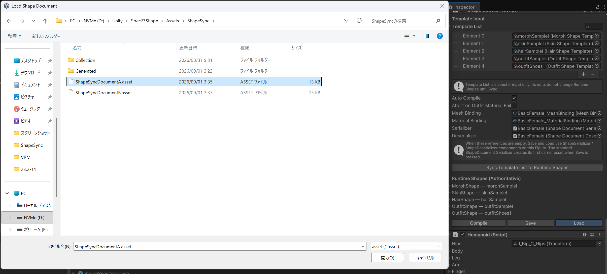
*▲Figure 10-18-1: Selecting ShapeSyncDocumentA.asset in Load Shape Document dialog*

3. **Verifying restoration**: Runtime Shapes are immediately updated, confirming that the character is restored to the **`Tops1` + `Skirt1`** (separate outfit) state.

*▲Figure 10-18-2: Play Mode screen restored to Tops1 + Skirt1 state upon loading Document A*

### 6.3 Verifying Document B Loading
1. Next, click the **`Load`** button at the bottom of the `ShapeDirector` Inspector.
2. In the `Load Shape Document` dialog, select **`Assets/ShapeSync/ShapeSyncDocumentB.asset`** and click **`Open`**.

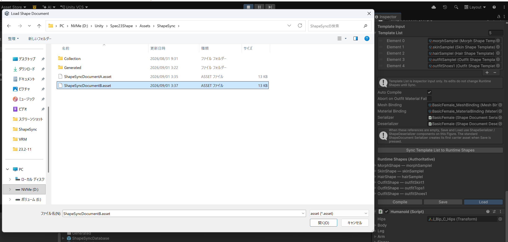
*▲Figure 10-19-1: Selecting ShapeSyncDocumentB.asset in Load Shape Document dialog*

3. **Verifying restoration**: Runtime Shapes immediately switch, confirming that the character is restored to the **`Dress1`** (one-piece dress) state.

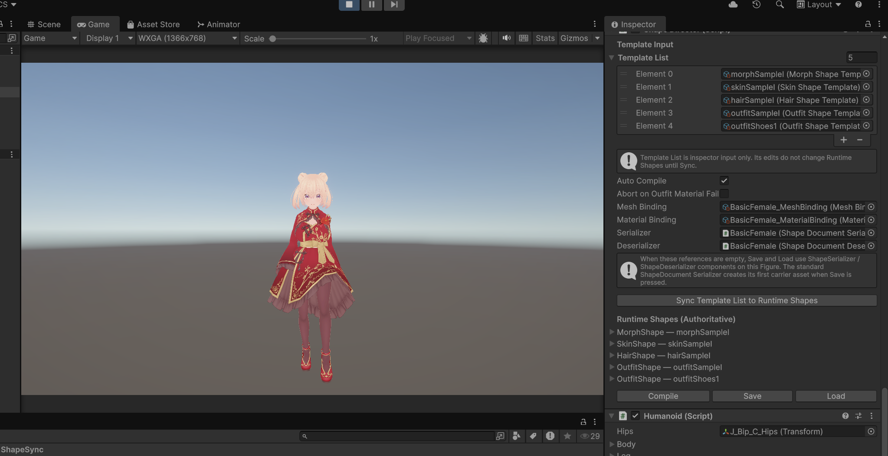
*▲Figure 10-19-2: Play Mode screen switched and restored to Dress1 state upon loading Document B*

---

## 7. Common Issues and Solutions (Troubleshooting)

### Q1. Only Dress is displayed even though both Tops and Skirt are registered
* **Cause**:
  This is not a defect, but normal exclusive behavior via Tag and Priority. Because `outfitSampleI` (Dress) has Priority `20` and both `upperchest` and `lowerchest` Tags, `outfitTops1` with Priority `10` and `outfitSkirt1` with Priority `15` are automatically excluded (hidden).
* **Solution**:
  If you want to undress the character from the Dress, Remove `outfitSampleI` in the Director.

### Q2. Deleting Template List reverted after stopping Play Mode
* **Cause**:
  Due to Unity specifications, Inspector list modifications made during Play Mode reset to their original state upon stopping Play Mode.
* **Solution**:
  When clearing all templates from the Template List, be sure to stop Play Mode first and delete them after returning to Edit Mode.

### Q3. Appearance does not change after Loading Document
* **Cause**:
  * When saving the Document, the intended wearing state (Runtime Shapes) may not have been active.
  * `ShapeDirector` settings or Mesh Binding asset references may have become disconnected.
* **Solution**:
  Visually confirm that the desired Outfit is correctly displayed during Play Mode before pressing the `Save` button to overwrite-save the Document, then try `Load` again.

---

[← Back to Tutorial Index](./index.html) ｜ [← Chapter 9: Advanced VRM Integration (Expression and Physics Configuration and Verification)](./vrmintegration.html)
