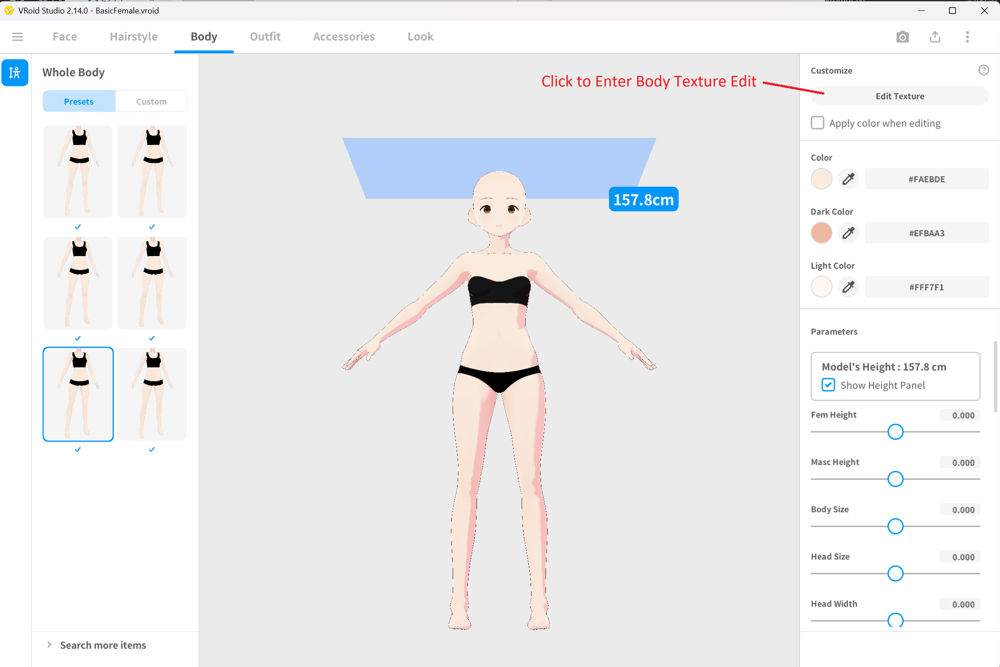
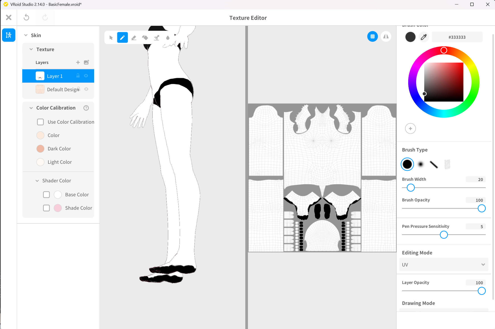
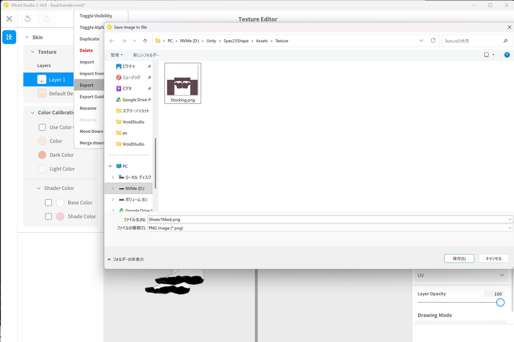
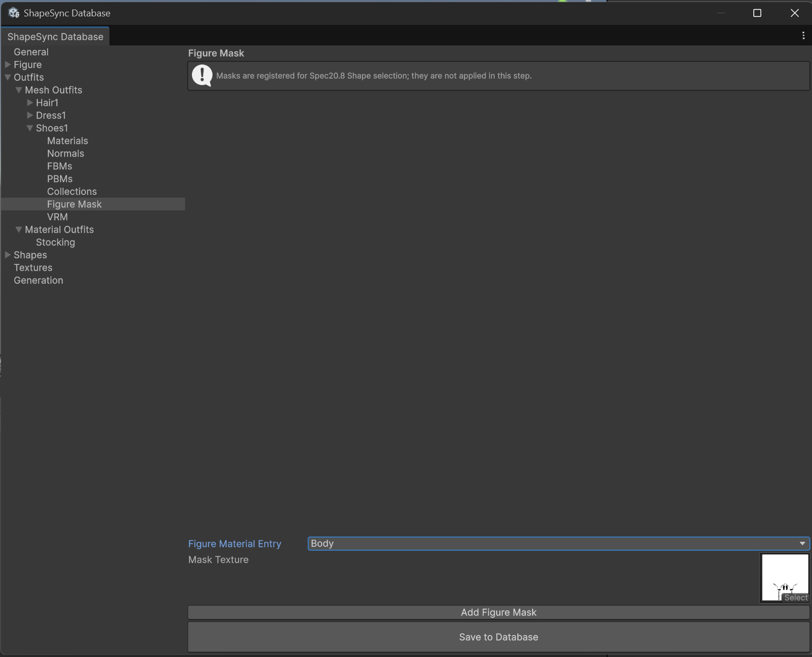
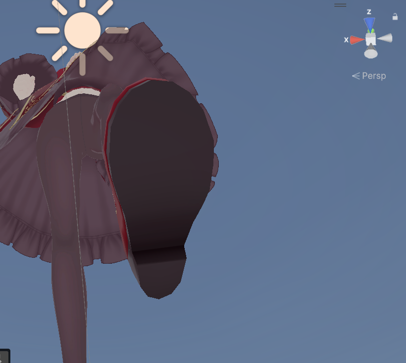

# Chapter 8: Advanced Outfit Registration and Figure Mask (Hiding Base Mesh and Correcting Poke)

[← Back to Tutorial Index](./index.html) ｜ [← Chapter 7: Advanced Outfit Registration and Collection (Shoe Deformation and Alignment)](./outfitcollection.html)

This chapter explains the procedure for eliminating the protrusion (**Poke**) of the base body remaining at the toes and soles of shoes (`Shoes1`) identified at the end of Chapter 7, using the dedicated outfit masking feature **Figure Mask**.

* **First Half (VRoid Studio)**: Using 3D Paint, create a mask image (`Shoes1Mask.png`) painted black only in the areas corresponding to the toes and soles hidden inside the shoes, and save it to `Assets/Texture/Shoes1Mask.png` in the Unity project.
* **Second Half (Unity / ShapeSync)**: In ShapeSync Editor under `Shoes1 > Figure Mask`, register and save the mask texture for the `Body` material, and verify in Play Mode after re-Generate that Poke has been completely resolved (Before / After).

---

## 1. Introduction (Chapter 7 Poke Issue and Mechanism of Figure Mask)

In Chapter 7, the Collection feature was used to fit the shoe position and ankle angles cleanly, but during walking animation playback, a slight protrusion of the base body skin was observed at the tip of the shoe toes (Poke).

*▲Figure 8-1: Base body poking through the tip of the shoe toes identified at the end of Chapter 7 (Before)*

### Figure Mask Mechanism and Polarity Rules
* **What is Figure Mask**: A feature that uses texture masks to erase (make transparent) base body skin mesh that should be completely hidden inside clothes or shoes when wearing an outfit, fundamentally preventing protrusion.
* **Mask Polarity (Black and White Rules)**:
  * **Black (#000000)**: Parts to be **hidden (erased)** from the Figure's `Body`
  * **White (#FFFFFF)**: Parts to **continue being displayed** on the Figure's `Body`
* **Visual Criteria for Black Painted Area**:
  * Paint black only the area corresponding to the toes and soles protruding from the shoes.
  * Take care not to paint black other body parts exposed outside the shoes, such as ankles and legs.

---

## 2. Creating and Saving Mask with 3D Paint in VRoid Studio

Create the mask image in the texture editing screen of VRoid Studio.

### 2.1 Opening the Texture Editing Screen
1. Launch VRoid Studio and open the base body model **`BasicFemale.vroid`**.
2. Select the **`Body`** tab in the top menu, and click the **`Edit Texture`** button on the right panel.

*▲Figure 8-2: Clicking Body tab > Edit Texture to enter texture editing*

### 2.2 Creating Mask Layer and Painting
1. Select **`Skin`** from the categories on the left.
2. In the layer panel, create a **New Layer** (`+` button).
3. Select the **Bucket Tool (Fill)** from the toolbar, set the color to **White (#FFFFFF)**, and fill the entire layer with white.
4. Select the **Brush Tool** from the toolbar, set the brush color to **Black (#000000)**, opacity to **`100`**, and brush size to a suitable thickness (e.g. **`37`**).
5. In the **3D View** on the right, paint black while visually checking only the **toes** and **soles** hidden inside the shoes.

*▲Figure 8-3: On the white-filled layer, painting toes and soles hidden inside shoes black (#000000) from 3D View side*

### 2.3 Exporting the Mask Image
1. Right-click the painted mask layer and select **`Export`** from the context menu.
2. In the save dialog, specify **`Assets/Texture/Shoes1Mask.png`** inside the Unity project and save as PNG format.

*▲Figure 8-4: Right-clicking created layer, selecting Export, and saving as Assets/Texture/Shoes1Mask.png*

### 2.4 Verifying Texture in Unity
1. Return to the Unity Editor and select **`Assets > Texture > Shoes1Mask`** in the Project window.
2. In the Inspector Preview, verify that the texture image has only the toes and soles painted black on a white background (Import Settings can remain `Texture Type: Default` and `Alpha Is Transparency: OFF`).

*▲Figure 8-5: Selecting Shoes1Mask texture in Unity Project window and confirming toes and soles painted black on white background*

---

## 3. Registering Figure Mask in ShapeSync Editor

Register the created mask image into ShapeSync Editor.

1. From the top menu in Unity Editor, open **Tools > zgock > ShapeSync > ShapeSync Editor**.
2. Select **`Outfits > Mesh Outfits > Shoes1 > Figure Mask`** from the left TreeView.
3. In the **`Figure Material Entry`** dropdown, select **`Body`**.
4. In **`Mask Texture`**, drag and drop **`Shoes1Mask.png`** (`Assets/Texture/`) from the Project window.

*▲Figure 8-6-1: Selecting Body in Figure Material Entry and specifying Shoes1Mask.png in Mask Texture*

5. Click the **`Add Figure Mask`** button to add the registration row.
6. Click the **`Save to Database`** button at the bottom of the screen to save.

*▲Figure 8-6-2: Clicking Add Figure Mask to add Body - Shoes1_Body_Mask row, then saving with Save to Database*

> [!NOTE]
> **Note Regarding Material Rows**:
> In this tutorial model structure, base body skin is integrated into the `Body` material, so registering 1 row is sufficient. However, for models where limbs or nails are split into separate materials, additional Figure Mask rows must be added for each material you wish to hide.

> [!TIP]
> **Registration in Textures Section**:
> The mask image specified in Figure Mask is automatically registered as a Texture Resource owned by `Shoes1`. Therefore, manually registering the mask image in ShapeSync Editor's `Textures` section is unnecessary.

---

## 4. Re-Executing Generate and Verifying Poke Resolution in Play Mode (Before / After)

Perform regeneration to apply the Figure Mask settings, and verify operation in Play Mode.

1. Select the **`Generation`** section from the left TreeView in ShapeSync Editor.
2. Leaving each output setting as existing, click the **`Generate`** button at the bottom of the screen.
3. If a folder selection dialog appears, select the existing output root folder (`Assets/ShapeSync/Generated`), click "Select Folder", and execute regeneration.

*▲Figure 8-7: Clicking Generate in Generation section, selecting output root folder (Generated), and executing regeneration*

4. Select the Figure (`BasicFemale`) placed in the Scene.
5. Confirm that **`outfitShoes1.asset`** registered in the previous chapter remains set in the `Template List` of Figure's `ShapeDirector`.
6. Press Unity's **Play button** to enter **Play Mode**.
7. Zoom in on the feet during walking animation playback. Confirm that the toe protrusion (Poke) identified in Chapter 7 has been completely eliminated and the feet fit cleanly inside the shoes (**After**).

*▲Figure 8-8-1: During walking animation playback in Play Mode, toe Poke is completely resolved and fits cleanly into shoes (After)*

*▲Figure 8-8-2: Verification from beneath dress and sole side. Protrusion from sole is also cleanly resolved (After)*

---

## 5. Common Issues and Solutions (Troubleshooting)

### Q1. Toe protrusion (Poke) does not disappear upon entering Play Mode
* **Cause**:
  * You may not have saved via `Save to Database` after clicking `Add Figure Mask` in `Shoes1 > Figure Mask`.
  * You may not have executed `Generate` (re-generation) in `Generation` of ShapeSync Editor after configuring Figure Mask.
* **Solution**:
  Confirm that the `Body` row is saved in `Shoes1 > Figure Mask`, and always re-execute `Generate` in the `Generation` section.

### Q2. Ankles or legs other than shoes disappear and become transparent
* **Cause**:
  In the mask image (`Shoes1Mask.png`) created in VRoid Studio, the black (#000000) painted area may have extended beyond the shoe boundary up to the ankle or upper leg.
* **Solution**:
  Open the mask layer in VRoid Studio, repaint the ankle and leg areas exposed outside the shoes with white (#FFFFFF), export to `Assets/Texture/Shoes1Mask.png` again, and re-execute `Generate` in ShapeSync Editor.

---

[← Back to Tutorial Index](./index.html) ｜ [← Chapter 7: Advanced Outfit Registration and Collection (Shoe Deformation and Alignment)](./outfitcollection.html)
