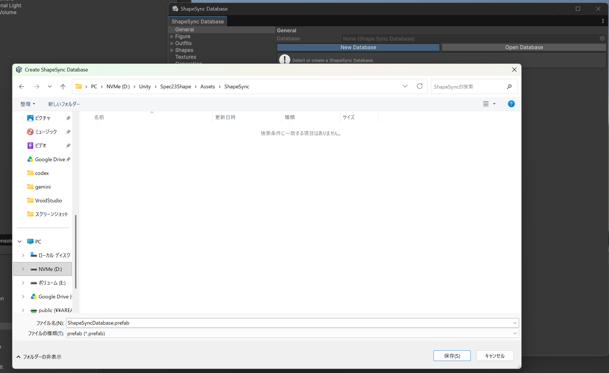
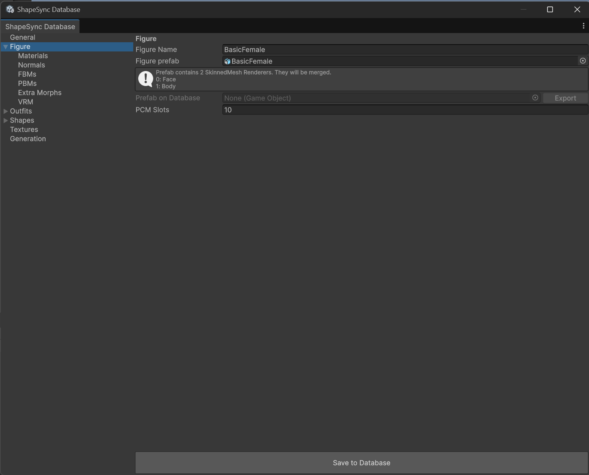
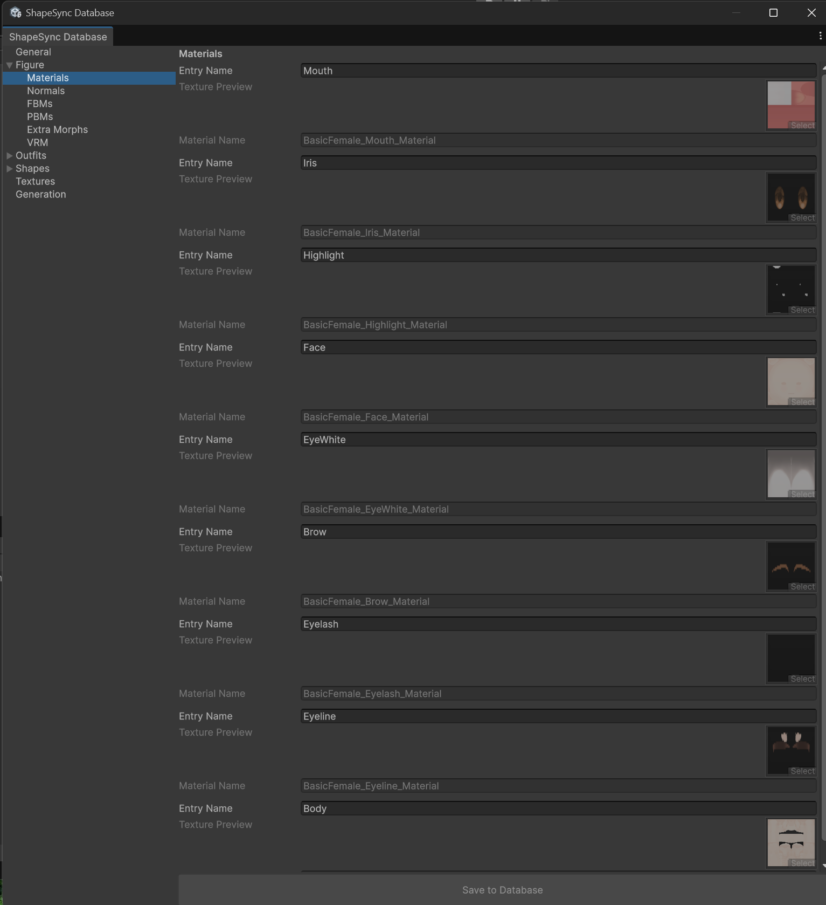
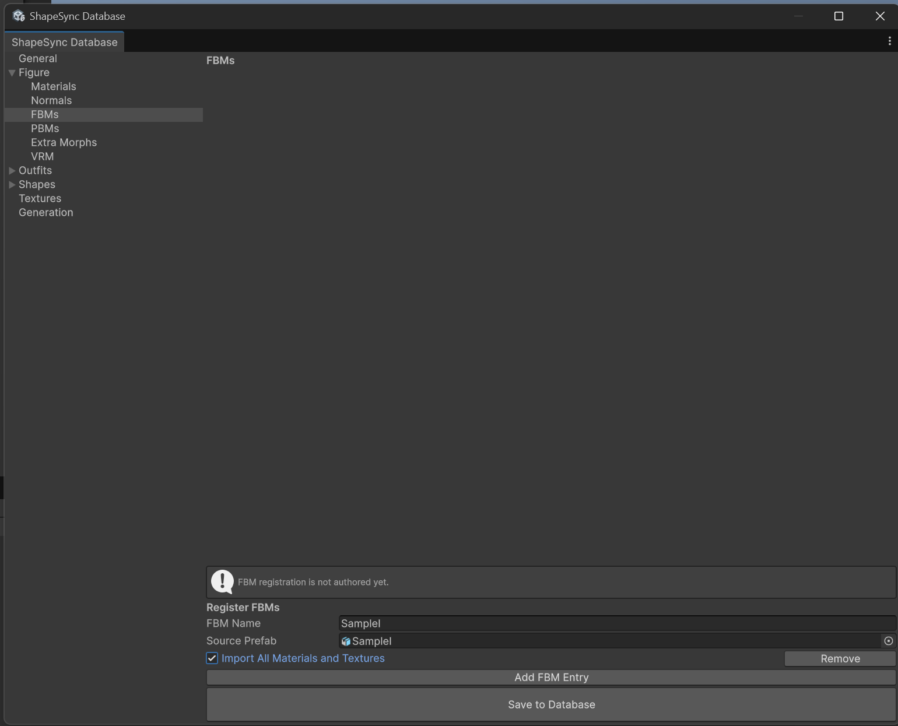
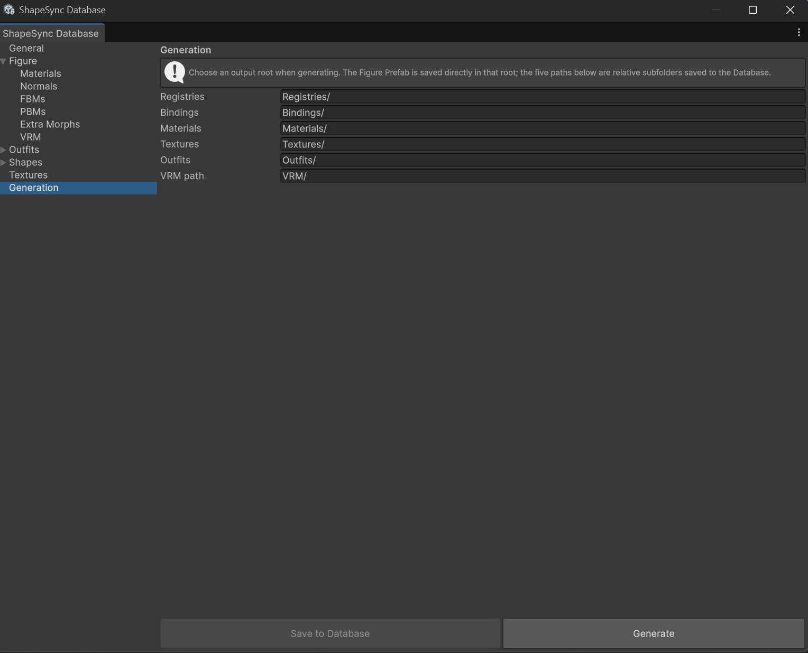
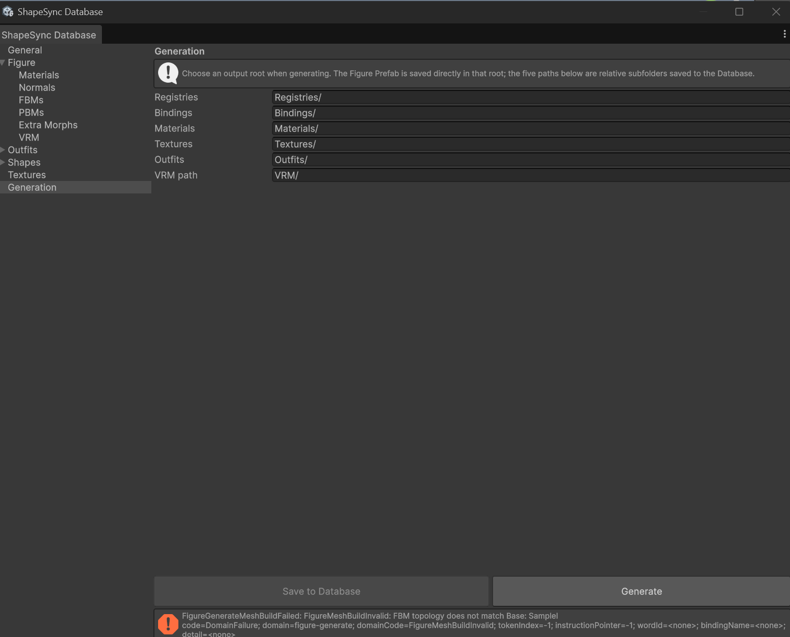

# Chapter 3: Figure Registration and Initial Operation Check

[← Back to Tutorial Index](./index.html) ｜ [← Chapter 2: Initial VRM Data Generation](./initialvrm.html)

This chapter explains the steps to register the **Base VRM (BasicFemale.vrm)** and **FBM VRM (SampleI.vrm)** created in Chapter 2 into **ShapeSync Editor** in Unity, generate a Figure asset capable of body shape deformation, and perform initial operation checks under animation playback.

> [!NOTE]
> Prior mesh combination using Mesh Utility or similar tools is not required for Figure registration. You directly register the created VRM files into ShapeSync Editor.

---

## 1. Introduction (Glossary and Core Concepts for Beginners)

Before starting the tasks, here is an explanation of the core concepts used in this chapter.

* **ShapeSync Editor**: A dedicated editor window for registering, editing, and generating ShapeSync assets in a unified interface. It is launched from the top menu in Unity.
* **Database**: Authoring data used to collectively manage registration data such as Figures, Materials, Textures, and Shapes (File extension: .prefab). *Note: This is a configuration asset for creation and editing, not the runtime itself.
* **Entry**: A management unit within the Database to handle entities such as individual models and materials under logical identification names (Name). Changing an Entry name does not modify the original source asset.
* **Draft and Save**: Changes made in ShapeSync Editor are temporarily held as a Draft. Clicking Save to Database in each section commits and saves the changes to the Database.
* **Generate**: An operation that outputs usable assets, such as Figure Prefabs, in Unity based on the Database settings. Original input assets (such as VRMs) are not modified, and GUIDs are maintained when updating existing outputs.
* **DynamicBoneBlender**: A Unity component attached to the generated Figure that controls the weight values of FBMs (body shape morphs) in real time.

---

## 2. Launching ShapeSync Editor and Creating a Database

First, launch ShapeSync Editor and create a Database to store the project data.

1. From the top menu in Unity Editor, select and open **Tools > zgock > ShapeSync > ShapeSync Editor**.
2. The **General** screen will be displayed.
3. Click the **New Database** button next to the Database field.
4. The **Create ShapeSync Database** save dialog will appear. Select the destination folder and save it with the default file name (ShapeSyncDatabase.prefab).

*▲Figure 3-1: ShapeSync Editor General screen and Database creation dialog*

---

## 3. Registering the Base Model (Figure)

Register the standard body shape baseline model (BasicFemale.vrm) as a Figure.

1. From the left tree in ShapeSync Editor, select the **Figure** section.
2. In **Figure Name**, enter the logical name to register (BasicFemale).
3. In the **Figure prefab** field, drag and drop Assets/VRM/BasicFemale.vrm from the Project window to assign it.
4. Click the **Save to Database** button at the bottom to save the Figure settings to the Database.

*▲Figure 3-2: Assigning BasicFemale.vrm in the Figure section and executing Save to Database*

---

## 4. Organizing and Naming Material Entries

After registering the Figure, organize the names of Material Entries so that materials can be properly managed by logical names within the Database.

1. From the left tree in ShapeSync Editor, select the **Figure > Materials** section.
2. Rename the default Entry names from top to bottom to the following **9 fixed names**:
   1. Mouth
   2. Iris
   3. Highlight
   4. Face
   5. EyeWhite
   6. Brow
   7. Eyelash
   8. Eyeline
   9. Body
3. Click the **Save to Database** button at the bottom to commit and save.

*▲Figure 3-3: Renaming and saving the 9 Material Entry names in the Materials section*

> [!TIP]
> Entry names are identification names used to manage assets logically within the ShapeSync Database. Renaming an Entry does not modify the source asset of the original VRM or materials at all.

---

## 5. Registering the FBM Axis (SampleI)

Register the body shape deformation FBM model (SampleI.vrm) as an FBM axis.

1. From the left tree in ShapeSync Editor, select the **Figure > FBMs** section to open the **Register FBMs** screen.
2. Click the **Add FBM Entry** button to add a new FBM row.
3. In the added row, enter SampleI into **FBM Name**.
4. In the **Source Prefab** field, drag and drop Assets/VRM/SampleI.vrm from the Project window to assign it.
5. Check the **Import All Materials and Textures** checkbox to **ON (checked)**.
   > [!NOTE]
   > This option is OFF by default. It is enabled here to import materials and textures from the FBM side so they can be referenced in Chapter 5 for "Skin Shape (adjusting skin texture and tone)."
6. Click **Save to Database** at the bottom to commit the settings.

*▲Figure 3-4: Adding SampleI in the FBMs section, enabling Import All Materials and Textures, and saving*

---

## 6. Executing Generate and Outputting the Figure Asset

Output (Generate) a Figure asset capable of body shape deformation from the registered data.

1. From the left tree in ShapeSync Editor, select the **Generation** section.
2. Keep each output folder setting (Registries/, Bindings/, Materials/, Textures/, Outfits/, VRM/) **as default without modification**.
3. Click the **Generate** button at the bottom (*Do not use Save to Database in this section).
4. The **Generate ShapeSync Figure** save dialog will appear. Select the destination root folder.
5. The **Figure Prefab** will be generated directly under the output root.

*▲Figure 3-5: Executing Generate with default settings in the Generation section*

---

## 7. Scene Placement and Initial Operation Check with CC0 Animation

Place the generated Figure in the Scene and verify that the body shape deforms smoothly during animation playback.

### Preparing Animation for Operation Check
Use the distributed animation package under CC0 1.0 license for operation checks.

1. Download [CC0Animation.unitypackage](../CC0Animation.unitypackage) and import it into your Unity project.
   * The package contains Walking.controller, T-pose.controller, animation FBX files, and LICENCE.txt.

### Initial Operation Check Steps
1. In the Project window, select the generated **Figure Prefab** and drag and drop it into the Scene view (or Hierarchy window) to place it.
2. Select the placed Figure GameObject, and in the **Animator** component in the Inspector, assign **Walking.controller** to the Controller field.
3. Press Unity's **Play button** to enter Play Mode.
4. In the Scene / Game view, confirm that the character's walking animation is playing.
5. While walking playback is active, open the **DynamicBoneBlender** component in the Figure's Inspector.
6. In the row where blendName is **SampleI**, move the **weight** slider from 0 to 1.
7. Confirm that **the character's body shape deforms smoothly while the walking animation continues seamlessly without interruption**.

*▲Figure 3-6: Operating SampleI weight during Walking.controller playback in Play Mode to verify body shape deformation*

---

## 8. Common Issues and Solutions (Troubleshooting)

### Q1. FigureGenerateMeshBuildFailed is displayed during Generate
* **Symptom**:
  During Generate, the following diagnostic message is displayed and generation fails.
  `	ext
  FigureGenerateMeshBuildFailed: FigureMeshBuildInvalid: FBM topology does not match Base: SampleI
  code=DomainFailure; domain=figure-generate; domainCode=FigureMeshBuildInvalid; tokenIndex=-1; instructionPointer=-1; wordId=<none>; bindingName=<none>; detail=<none>
  `
* **Checkpoints and Solution**:
  This occurs when the mesh structure does not match between Base and FBM. Check if there are any unintended accessories, hair parts, or leftover clothing in the FBM VRM. Return to [Chapter 2: Initial VRM Data Generation](./initialvrm.html), verify on both Base and FBM that all decorative parts have been removed and polygon reduction options are OFF, re-export as VRM 1.0, and re-register.

*▲Figure 3-7: Example of diagnostic message displayed when Generate fails*

### Q2. Walking animation does not play in Play Mode
* **Cause**:
  No Controller is assigned to the Figure's Animator component, or the Animator is disabled.
* **Solution**:
  In the Inspector, check whether Walking.controller is assigned to the Controller field of the Animator component.

---

[← Back to Tutorial Index](./index.html) ｜ [← Chapter 2: Initial VRM Data Generation](./initialvrm.html)