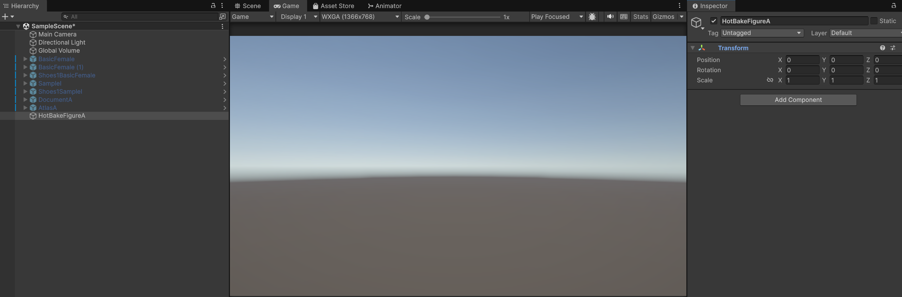
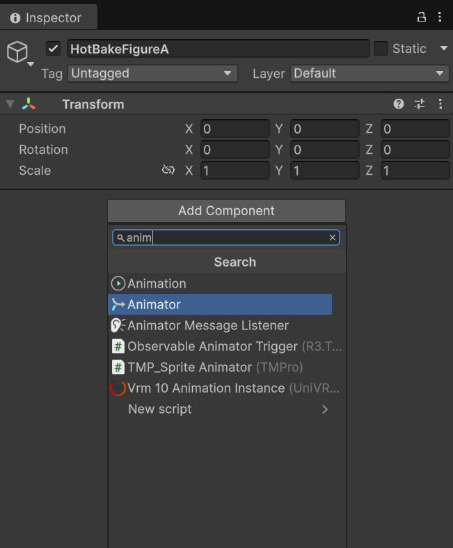
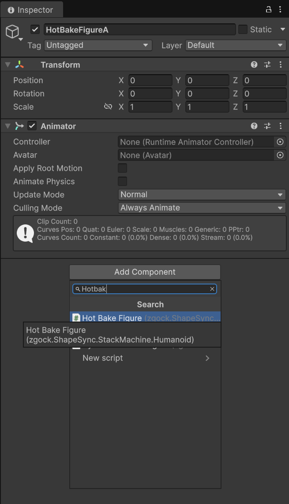
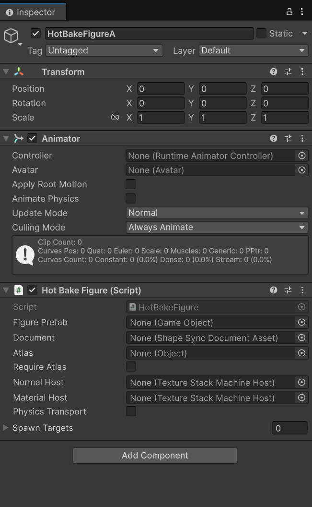
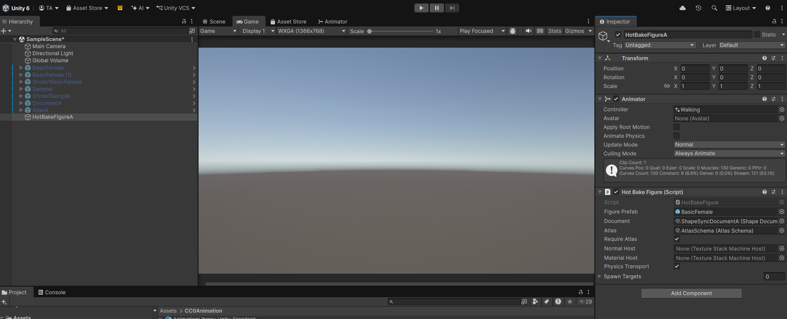
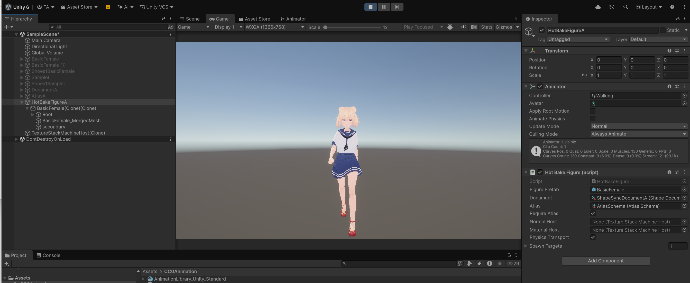
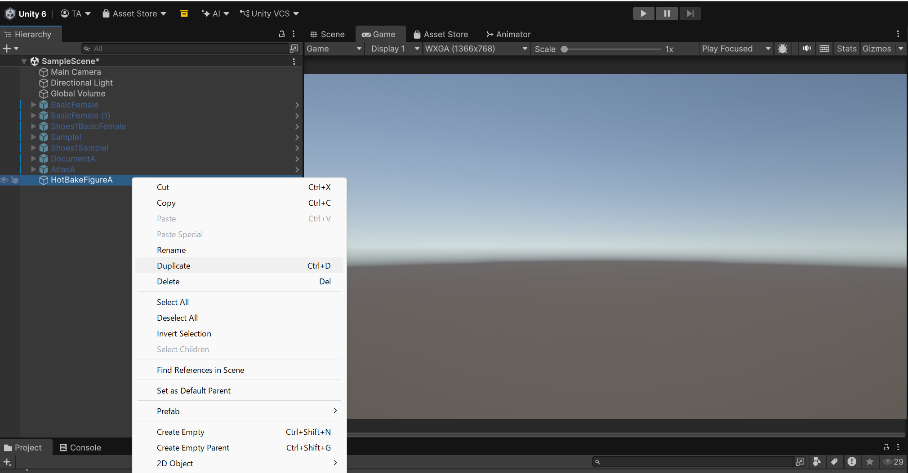
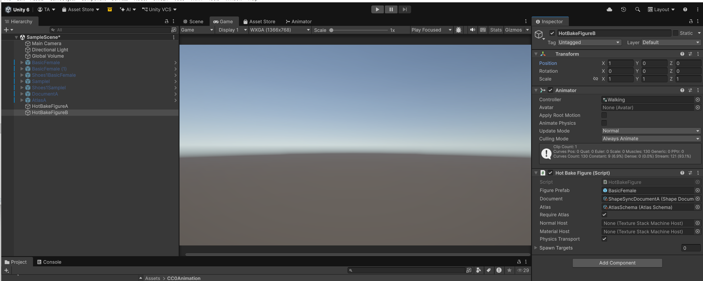
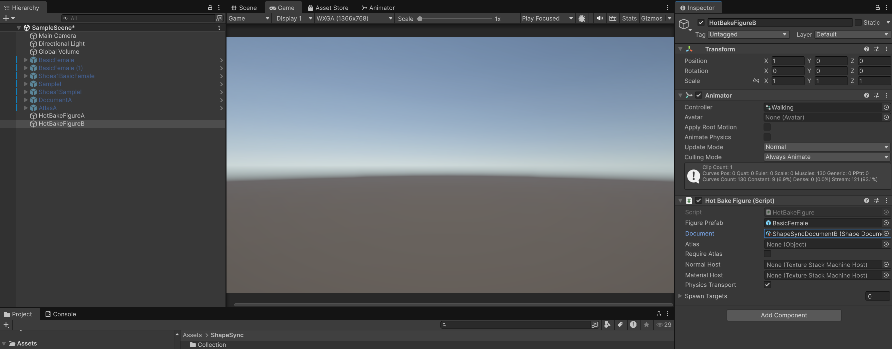
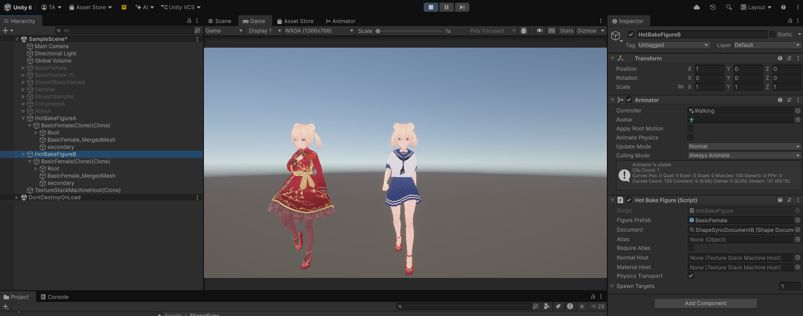

# Chapter 13: Hot Bake (Runtime Humanoid Generation and Multi-Character Simultaneous Walking)

[← Back to Tutorial Index](./index.html) ｜ [← Chapter 12: Atlas (VRAM Reduction and Humanoid Regeneration via Texture/Material Consolidation)](./atlas.html)

This chapter is the **final chapter** of the ShapeSync Asset tutorial (Spec 23).
While **Humanoid Compiler** in Chapter 11 pre-built Humanoids as asset files (`.prefab`, `.asset`) in the Unity Editor, **Hot Bake** explained in this chapter is a feature that dynamically assembles and generates Humanoids in memory at game runtime.

There is no need to place another ShapeSync Figure directly in the Scene. **Simply add the `Animator` and `Hot Bake Figure` components to an empty GameObject, and specify the Figure / Document (and any required Atlas Schema)**, and a complete Humanoid model will be automatically generated in the child hierarchy at runtime.

* **Working Environment for This Chapter**: No VRoid Studio operations are performed. All work is conducted inside the **Unity Editor**.
* **Assets Used**:
  * **Figure Prefab**: `Assets/ShapeSync/Generated/BasicFemale.prefab` (Generated in Chapter 3)
  * **Document A**: `Assets/ShapeSync/ShapeSyncDocumentA.asset` (Saved in Chapter 10: Tops + Skirt outfit)
  * **Document B**: `Assets/ShapeSync/ShapeSyncDocumentB.asset` (Saved in Chapter 10: Dress outfit)
  * **Atlas Schema**: `Assets/ShapeSync/AtlasSchema.asset` (Created in Chapter 12)
  * **Animation Controller**: `Assets/CC0Animation/Walking.controller` (Introduced in Chapter 3)

---

## 1. Creating the First Character (HotBakeFigureA: Document A + Atlas)

First, create the first runtime generation object applying Document A (separate outfit) and the Atlas Schema from Chapter 12.

### 1.1 Creating and Placing an Empty GameObject
1. Right-click in the empty space of the Hierarchy window and select **`Create Empty`** to create an empty GameObject.
2. Change the name to **`HotBakeFigureA`**.
3. In the Inspector, verify that the Transform **`Position`** is set to **`(0, 0, 0)`** (X: 0, Y: 0, Z: 0).

*▲Figure 13-1-1: Creating an empty GameObject by selecting "Create Empty" from the right-click menu in the Hierarchy window*

*▲Figure 13-1-2: Initial state of the created empty GameObject (HotBakeFigureA) and Position (0, 0, 0)*

### 1.2 Adding Components
1. Click the **`Add Component`** button in the Inspector of `HotBakeFigureA`.
2. Type **`anim`** in the search field and click the displayed **`Animator`** to add it.
3. Click **`Add Component`** again, type **`Hotbak`** (or `hotbake`) in the search field, and click **`Hot Bake Figure`** (`zgock.ShapeSync.StackMachine.Humanoid`) to add it.
   > [!NOTE]
   > **Dependency on Animator**:
   > `Hot Bake Figure` operates on the premise that a standard Unity `Animator` component exists on itself or in its parent hierarchy.

*▲Figure 13-2-1: Adding the Animator component by typing "anim" in the Add Component search field*

*▲Figure 13-2-2: Adding the Hot Bake Figure component by typing "Hotbak" in the Add Component search field*

*▲Figure 13-3: Initial Inspector state immediately after adding the Animator and Hot Bake Figure components to HotBakeFigureA*

### 1.3 Configuring Properties for the First Character
Configure the following items in the **`Hot Bake Figure`** component of `HotBakeFigureA`.

| Setting Item | Setting Value | Notes |
| :--- | :--- | :--- |
| **`Figure Prefab`** | **`BasicFemale.prefab`** | Specify `Assets/ShapeSync/Generated/BasicFemale.prefab` |
| **`Document`** | **`ShapeSyncDocumentA.asset`** | Specify `Assets/ShapeSync/ShapeSyncDocumentA.asset` |
| **`Atlas`** | **`AtlasSchema.asset`** | Specify `Assets/ShapeSync/AtlasSchema.asset` |
| **`Require Atlas`** | **ON** (Check) | Applies Atlas Schema as required |
| **`Physics Transport`** | **ON** (Check) | * Only displayed in VRM integration environment |
| **`Spawn Targets`** | Leave empty (0) | Automatically managed at runtime |

### 1.4 Configuring the Controller on Animator
1. Drag and drop **`Assets/CC0Animation/Walking.controller`** into the **`Controller`** field of the **`Animator`** component on `HotBakeFigureA` to assign it.

*▲Figure 13-4: Configured state of each property on HotBakeFigureA (Controller: Walking, Figure: BasicFemale, Document: ShapeSyncDocumentA, Atlas: AtlasSchema, Require Atlas: ON, Physics Transport: ON)*

---

## 2. Verifying Operation of the First Character (Solo Walking in Play Mode)

### 2.1 Starting Play Mode
1. Click the **Play button (▶)** at the top of the Unity Editor to enter Play Mode.
2. **Verifying runtime generation and walking**:
   * Upon game execution, `BasicFemale(Clone)(Clone)` and `TextureStackMachineHost(Clone)` are dynamically generated under the child hierarchy of `HotBakeFigureA`.
   * The generated Avatar is automatically assigned to the `Avatar` property of `Animator`.
   * `Spawn Targets` on `Hot Bake Figure` automatically becomes `1`, indicating generation completion.
   * In the Game view, verify that the model wearing Document A (separate outfit: Tops1 + Skirt1 + Shoes1) walks smoothly (Walking), and secondary animations (VRM Physics) operate in sync.

*▲Figure 13-5: Humanoid dynamically generated under HotBakeFigureA child hierarchy during Play Mode, playing walking animation in separate outfit*

### 2.2 Stopping Play Mode
1. Once operation is verified, click the **Play button (▶)** again to stop Play Mode.

---

## 3. Creating the Second Character (HotBakeFigureB: Document B Without Atlas)

Next, duplicate the first character to create a second character that operates with a different outfit (Document B: One-piece dress) and without Atlas (individual textures).

### 3.1 Duplicating and Placing GameObject
1. In the Hierarchy window, right-click **`HotBakeFigureA`** and select **`Duplicate`** (or press `Ctrl + D`) to duplicate it.
2. Change the name of the duplicated GameObject to **`HotBakeFigureB`**.
3. In the Inspector, set Transform **`Position`** **`X`** to **`1`** (coordinates `(1, 0, 0)`) (placing it to the right of the first character).

*▲Figure 13-6-1: Duplicating by right-clicking HotBakeFigureA in the Hierarchy window and executing "Duplicate"*

*▲Figure 13-6-2: Duplicated GameObject named HotBakeFigureB with Position set to (1, 0, 0)*

### 3.2 Modifying Properties for the Second Character
Modify the settings on `HotBakeFigureB`. The `Animator` Controller (`Walking`), `Figure Prefab`, and `Physics Transport: ON` are retained as-is from duplication.

| Setting Item | Setting Value | Modification Details |
| :--- | :--- | :--- |
| **`Figure Prefab`** | **`BasicFemale.prefab`** | Verify it is retained (or re-specify) |
| **`Document`** | **`ShapeSyncDocumentB.asset`** | **Change to Document B (Dress outfit)** |
| **`Atlas`** | **`None` (Empty)** | **Unassign Atlas** |
| **`Require Atlas`** | **OFF** (Uncheck) | **Remove Atlas requirement** |
| **`Physics Transport`** | **ON** | Keep ON just like the first character (VRM integration environment) |

*▲Figure 13-7: Property configuration for HotBakeFigureB (Document: ShapeSyncDocumentB, Atlas: None, Require Atlas: OFF, Physics Transport: ON)*

---

## 4. Verifying Simultaneous Two-Character Walking (Final Operation Verification)

### 4.1 Starting Play Mode
1. Click the **Play button (▶)** at the top of the Unity Editor to enter Play Mode.

### 4.2 Verifying Simultaneous Generation and Walking of Two Characters
1. **Verifying visual differences and simultaneous walking**:
   * **Right side (`HotBakeFigureA`: coordinates `(0,0,0)` )**: Model wearing Document A separate outfit (Tops1 + Skirt1) with Atlas applied walks.
   * **Left side (`HotBakeFigureB`: coordinates `(1,0,0)` )**: Model wearing Document B one-piece dress (Dress1) generated without Atlas walks.
2. Verify that the two characters with different Document (outfit) and Atlas configurations are dynamically generated simultaneously in the same Scene without glitches, walk side by side (Walking), and their respective secondary physics operate normally in sync.

*▲Figure 13-8: Final screen showing two Humanoids with different outfits (Left: red Dress1, Right: Tops1+Skirt1) dynamically generated simultaneously and walking side by side during Play Mode*

### 4.3 Checking When Generation Fails (Troubleshooting)
* **Checking Unity Console**:
  If the model is not generated or does not display as intended after entering Play Mode, check the Unity **Console window**.
  * Verify that `Figure Prefab` or `Document` is not set to `None` (unassigned).
  * Verify that the `Atlas` field is not `None` when `Require Atlas: ON` is set (if not using Atlas, `Require Atlas: OFF` must be set).
  * Verify that the `Animator` component is correctly added to the GameObject itself or its parent hierarchy.

---

## 5. Conclusion (Tutorial Completion Summary)

Congratulations! You have completed the entire ShapeSync Asset tutorial (all 13 chapters).

Throughout this tutorial, you have mastered the complete workflow of ShapeSync:

1. **Basic Setup**: Installation and preparing identical topology VRMs from VRoid Studio (Chapters 1–2)
2. **Figure Registration & FBM Axes**: Registering base figure and controlling body morphing (Chapter 3)
3. **Outfit Registration & Tracking**: Registering outfits and tracking body shape (Chapters 4–5)
4. **Advanced Outfit Control**: Partial Body Morph (PBM), shoe posture correction (Collection), and poke-through prevention (Figure Mask) (Chapters 6–8)
5. **VRM Integration**: Automatic integration of Facial Expressions and secondary physics (SpringBone Physics) (Chapter 9)
6. **Document Management**: Saving and loading presets for outfit combinations and body shapes (Chapter 10)
7. **Humanoid Compiler**: Standalone Pure Humanoid generation via Editor build (Chapter 11)
8. **Atlas Optimization**: VRAM and Draw Call reduction via texture atlas consolidation (Chapter 12)
9. **Hot Bake**: Dynamic Humanoid generation at game runtime and multi-character control (Chapter 13)

By leveraging ShapeSync, you can achieve versatile outfit customization, body shape modification, and highly efficient character rendering in Unity while preserving the rich expressiveness of VRoid models.

---

[← Back to Tutorial Index](./index.html) ｜ [← Chapter 12: Atlas (VRAM Reduction and Humanoid Regeneration via Texture/Material Consolidation)](./atlas.html)
