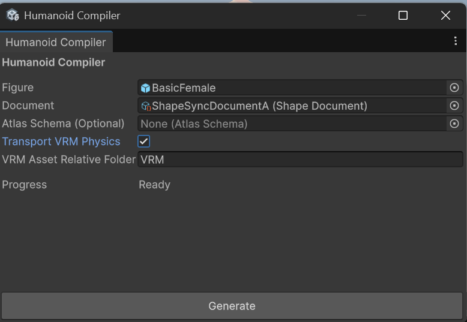
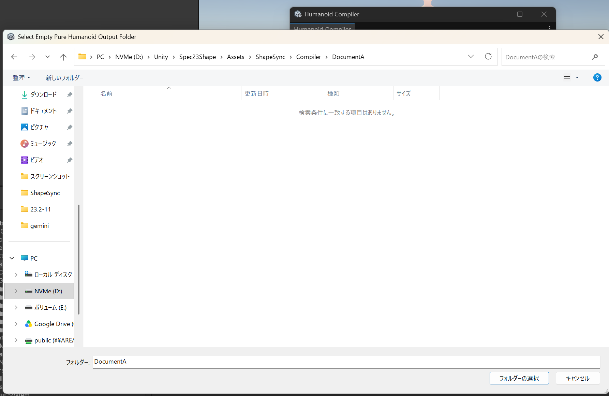
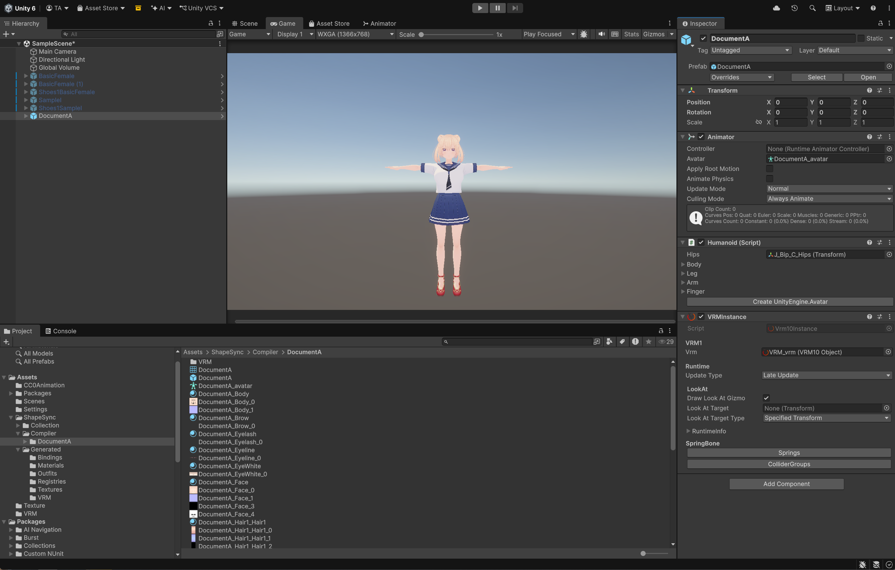

# Chapter 11: Humanoid Compiler (Generating and Verifying Pure Humanoid from Document)

[← Back to Tutorial Index](./index.html) ｜ [← Chapter 10: Document Storage and Outfit Tag / Priority (Outfit Conflict Control and State Storage/Restoration)](./documentstorage.html)

This chapter explains the procedure for taking the **ShapeSync Document (`ShapeSyncDocumentA`)** saved in Chapter 10 as input, and using the **Humanoid Compiler** to generate a clean **Pure Humanoid** (optimized avatar model) composed solely of standard Unity components.

* **Working Environment for This Chapter**: VRoid Studio operations are not performed. All operations are carried out within the **Unity Editor** and **Humanoid Compiler**.
* **Input Asset**: Uses **only Document A (`ShapeSyncDocumentA`, Tops + Skirt state)** saved in Chapter 10 (Document B is not used in this tutorial).

---

## 1. Introduction (Role of Humanoid Compiler and Pure Humanoid)

### 1.1 Pure Humanoid
* **Complete Elimination of Runtime Overhead**: Models normally generated by ShapeSync (Figure and Outfit Prefabs) contain components (`ShapeDirector`, `OutfitAttacher`, StackMachine, etc.) for performing body deformation and outfit switching dynamically at runtime.
* **Characteristics of Pure Humanoid**: Models output by the **Humanoid Compiler** are **standard Unity Humanoid models** where the wearing and deformation state of the specified Document is baked (fixed), and meshes and bone structures are consolidated into one. Because they do not depend on ShapeSync proprietary components in any way, they can be directly imported and used in any environment requiring a standard Humanoid avatar, such as VRChat, game characters, or various metaverse platforms.

### 1.2 Note on VRM Integration Environment
When VRM integration (`SHAPESYNC_USE_UNIVRM`) is enabled as introduced in Chapter 1 and Chapter 9, the **`Transport VRM Physics`** toggle will appear inside the Humanoid Compiler window.
* **When Using VRM Integration**: Set this toggle to **ON** to transfer Physics (SpringBone) (Figure 11-1).
* **When Skipping VRM Integration**: VRM-related items are not displayed or require no configuration. The basic procedures in this chapter can proceed directly in an environment without VRM integration.

---

## 2. Launching Humanoid Compiler and Configuring Inputs

### 2.1 Launching the Humanoid Compiler Window
1. Click **`Tools > zgock > ShapeSync > Humanoid Compiler`** from the top menu of the Unity Editor to open the window.

### 2.2 Specifying Figure and Document
1. **`Figure`**: Drag and drop **`Assets/ShapeSync/Generated/BasicFemale.prefab`** (GameObject) from the Project window (You can also specify the Figure root GameObject placed in the Scene).
2. **`Document`**: Drag and drop **`Assets/ShapeSync/ShapeSyncDocumentA.asset`** saved in Chapter 10.
3. **`Atlas Schema (Optional)`**: **Leave blank (None)**.
   > [!NOTE]
   > **About the Atlas Feature**:
   > Atlas Schema is a feature that groups and consolidates multiple outfit/skin textures and materials to reduce material and texture counts, thereby reducing rendering overhead (Draw Calls) (Note that some materials or shaders may not be eligible, so not all materials will necessarily be consolidated into a single texture). The configuration and generation procedures for Atlas are explained in detail in the next chapter (**Chapter 12: Atlas**), so leave it blank for this chapter.
4. **For VRM Integration Environment**:
   * If you are in an environment where `SHAPESYNC_USE_UNIVRM` is enabled and performed VRM integration in Chapter 9, set the **`Transport VRM Physics`** toggle to **ON** (When ON, `VRM` will appear in the `VRM Asset Relative Folder` input field).

*▲Figure 11-1: Humanoid Compiler window with Figure (BasicFemale) and Document (ShapeSyncDocumentA) specified, Atlas Schema left blank, and VRM Physics configured*

---

## 3. Specifying Output Folder and Executing Generate

### 3.1 Specifying Output Folder
1. Click the **`Generate`** button at the bottom of the Humanoid Compiler window.
2. The **`Select Empty Pure Humanoid Output Folder`** dialog opens to select the output destination for Pure Humanoid.
3. Select **`Assets/ShapeSync/Compiler/DocumentA`** inside the project, and click **`Select Folder`**.
   > [!IMPORTANT]
   > The output destination folder must be a **newly created or empty folder**. You cannot specify a folder containing existing files. If the folder does not exist, create a new `DocumentA` folder under `Assets/ShapeSync/Compiler/` within the dialog before selecting it.

*▲Figure 11-3: Selecting Assets/ShapeSync/Compiler/DocumentA in the Select Empty Pure Humanoid Output Folder dialog*

### 3.2 Executing Compilation
1. Upon selecting the folder, compilation starts automatically.
2. The **`Progress`** bar in the Compiler window advances, and once processing completes, it shows **`Completed`**, with **`Output: Assets/ShapeSync/Compiler/DocumentA`** displayed at the bottom (Figure 11-4).

---

## 4. Verifying Generated Assets (`DocumentA` Prefix)

Once Generate is complete, check the output results in the Project window.

### 4.1 Checking Generated Assets List
1. Open **`Assets > ShapeSync > Compiler > DocumentA`** in the Project window.
2. Confirm that the following generated items prefixed with the output folder name (`DocumentA`) are all present (Figure 11-4).

| Generated Asset | File Name / Naming Convention | Content |
| :--- | :--- | :--- |
| **Main Prefab** | **`DocumentA.prefab`** | Pure Humanoid Prefab with consolidated mesh |
| **Consolidated Mesh** | **`DocumentA.asset`** | Single mesh consolidating Tops + Skirt and base body |
| **Humanoid Avatar** | **`DocumentA_avatar.asset`** | Avatar definition asset for Unity Humanoid |
| **Figure Materials** | `DocumentA_<entryId>.mat` | Materials originating from base body (Body, Brow, Face, etc.) |
| **Figure Textures** | `DocumentA_<entryId>_<index>.png` | Textures originating from base body |
| **Outfit Materials** | `DocumentA_<registryId>_<entryId>.mat` | Materials originating from Tops1 / Skirt1 |
| **Outfit Textures** | `DocumentA_<registryId>_<entryId>_<index>.png` | Textures originating from Tops1 / Skirt1 |

*▲Figure 11-4: Humanoid Compiler showing Completed status and generated assets list with DocumentA prefix in Project view after Generate*

---

## 5. Placing in Scene and Verifying Pure Humanoid Structure

Verify that the generated `DocumentA.prefab` functions properly as a clean Humanoid independent of ShapeSync.

### 5.1 Placing Prefab in Scene and Visual Verification
1. Drag and drop **`Assets/ShapeSync/Compiler/DocumentA/DocumentA.prefab`** from the Project window into the Scene view (or Hierarchy).
2. **Visual Verification**: In the Scene view, confirm that Tops1 (sailor-suit style top) and Skirt1 (pleated skirt) are rendered cleanly integrated with the base body (Figure 11-5).

### 5.2 Verifying Pure Humanoid Structure (Inspector / Hierarchy)
1. Select the placed **`DocumentA`** in the Hierarchy, and inspect it in the Inspector (Figure 11-5).
2. **Checking Standard Unity Components**:
   * Confirm that standard Unity **`Animator`** component is attached to the root object, and **`DocumentA_avatar`** (Humanoid Avatar) is properly assigned in the `Avatar` field.
   * Confirm that a **`SkinnedMeshRenderer`** exists on the child object, with consolidated mesh `DocumentA.asset` assigned.
3. **Confirming Complete Exclusion of ShapeSync Runtime Components**:
   * Confirm that **no ShapeSync runtime scripts** such as **`ShapeDirector`**, **`OutfitAttacher`**, **`DynamicBoneBlender`**, **`MeshStackMachine`**, or Material Proxy / Attacher are included in the Inspector or hierarchy of `DocumentA` (pure GameObject / SkinnedMeshRenderer / Animator configuration).
   * (In a VRM integration environment, only the `VRMInstance` component for SpringBone secondary motion is properly transferred and attached).

*▲Figure 11-5: DocumentA (Tops + Skirt outfit) placed in Scene view and Pure Humanoid configuration in Inspector showing standard Unity Animator / Avatar with no ShapeSync runtime components*

### 5.3 (Optional) Motion Verification via Animation Playback
1. In the `Controller` field of `DocumentA`'s `Animator` component, assign **`Assets/CCOAnimation/Walking.controller`** used in Chapter 3.
2. Press Unity's **Play button** to enter **Play Mode**.
3. Confirm that as a clean Humanoid avatar, the clothed character executes the walking animation smoothly without anomalies. In a VRM integration environment (`Transport VRM Physics: ON`), secondary motion (Physics) for hair and skirt via SpringBone operates properly at the same time (Figure 11-7).

*▲Figure 11-7: Play Mode screen showing walking animation and VRM Physics (hair/skirt sway) operating with Walking.controller assigned*

---

## 6. Common Issues and Solutions (Troubleshooting)

### Q1. Clicking Generate shows an error such as "Folder is not empty"
* **Cause**:
  For safety, Humanoid Compiler prohibits overwriting folders that already contain files.
* **Solution**:
  Empty the contents of the folder specified in the dialog (`Assets/ShapeSync/Compiler/DocumentA/`), or create and specify a new empty folder within the dialog.

### Q2. Concerned about Draw Calls due to large numbers of textures and materials in generated model
* **Cause**:
  Because `Atlas Schema (Optional)` was left blank in this chapter, materials and textures of each original part (base body, tops, skirt) were maintained individually.
* **Solution**:
  By using the **Atlas Editor** explained in the next chapter (**Chapter 12: Atlas**), you can consolidate and reduce corresponding multiple materials and textures by group to generate models with reduced rendering overhead (Draw Calls) (Note that some materials may not be consolidated due to special shaders or settings).

---

[← Back to Tutorial Index](./index.html) ｜ [← Chapter 10: Document Storage and Outfit Tag / Priority (Outfit Conflict Control and State Storage/Restoration)](./documentstorage.html)
