# Chapter 2: Initial VRM Data Generation

[← Back to Tutorial Index](./index.html) ｜ [← Chapter 1: Installation](./installation.html)

This chapter explains the steps to prepare base models (**Base VRM** and **FBM VRM**) using **VRoid Studio** for character body shape deformation tracking in ShapeSync.

> [!NOTE]
> All tasks in this chapter are performed within **VRoid Studio**. Registering models in ShapeSync Editor and Unity will be covered in subsequent chapters (Chapter 3 onwards).

---

## 1. Introduction (Glossary for Beginners)

Before starting the tasks, here is a simple explanation of terms used in this chapter.

* **VRoid Studio**: A free 3D modeling software provided by pixiv Inc. that allows you to intuitively create humanoid 3D characters (Version 2.14.0 is used in this tutorial).
* **VRM / VRM 1.0**: A file format designed to handle 3D avatars uniformly across various applications. ShapeSync uses **VRM 1.0** format models.
* **Figure**: The base character model that wears and tracks outfits in ShapeSync.
* **Base (Base Model)**: The standard body shape model that serves as the baseline for body deformation.
* **FBM (Full Body Morph)**: Unlike facial expression animations, this model is used to morph and deform the character's entire body shape.
* **Topology**: The total number of vertices and the connection structure (ordering of faces and lines) in a 3D mesh. When the mesh structures of the Base and FBM match completely, it is referred to as "identical topology."

---

## 2. Reasons for Creating Two Models: Base and FBM

ShapeSync calculates body shape deformation by comparing the meshes of the **standard body model (Base)** and the **deformed body model (FBM)**, computing the amount of shape change from the vertex position deltas.

Therefore, the following **strict conditions** are required for both Base and FBM models:

1. **Identical Topology**:
   The vertex count and mesh structure of the base body must match completely between Base and FBM.
2. **Remove All Hair, Outfits, and Accessories**:
   If hair, clothing, or accessories remain, the vertex count and mesh structure will differ between models, breaking the identical topology.
3. **Do Not Reduce Polygons**:
   Using polygon reduction features during VRM export alters the vertex structure. Therefore, all reduction settings must be consistently turned OFF.

> [!WARNING]
> **If Identical Topology is Broken**
> If the vertex counts between Base and FBM do not match, an error will occur in subsequent steps (when importing into ShapeSync) and the process will fail. Since it is difficult to identify "which accessory caused the issue" from the error message alone, it is extremely critical to align the composition of both models before exporting the VRM files.

---

## 3. Creating the Base Model in VRoid Studio

First, create the standard body shape model (`BasicFemale`) that serves as the baseline, and export it as VRM 1.0.

### Step 1: Creating a New Model and Selecting Female Model

1. Launch VRoid Studio and click **Create New** (+ icon) on the home screen.
2. When the "Select base" screen appears, select **Female**.

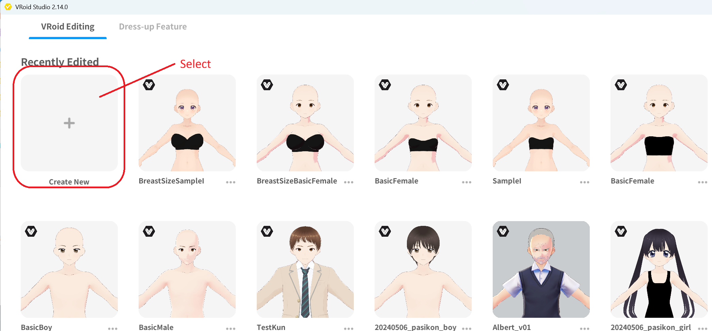
*▲Figure 2-1: Selecting "Create New" on the VRoid Studio home screen*

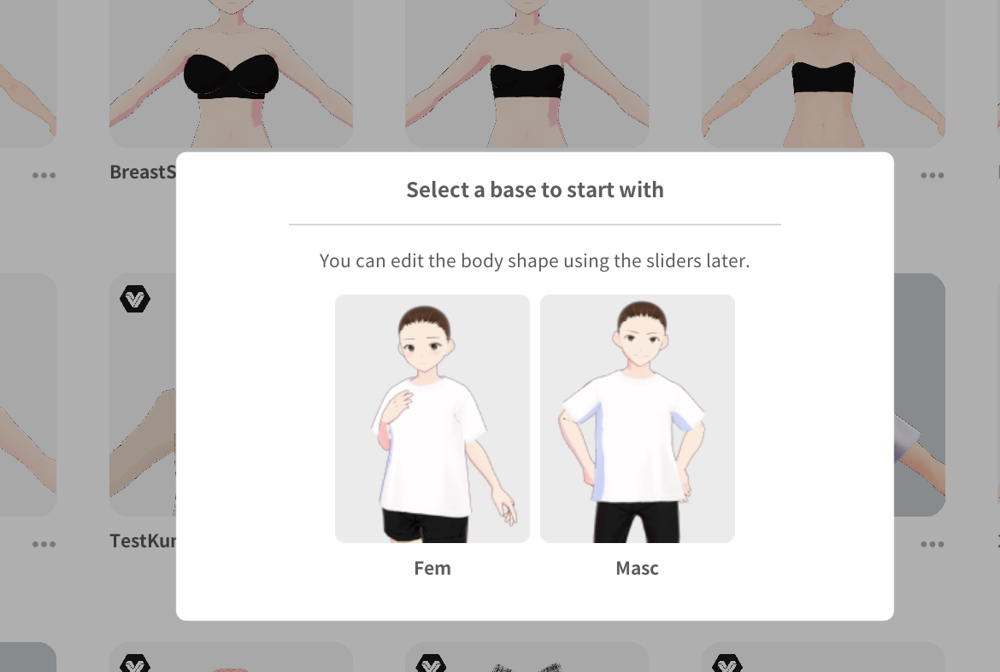
*▲Figure 2-2: Selecting "Female" in base selection*

---

### Step 2: Removing All Hair, Outfits, and Accessories

The newly created model is equipped with default hair, clothing, shoes, etc. To create a base body with identical topology, remove all of these items.

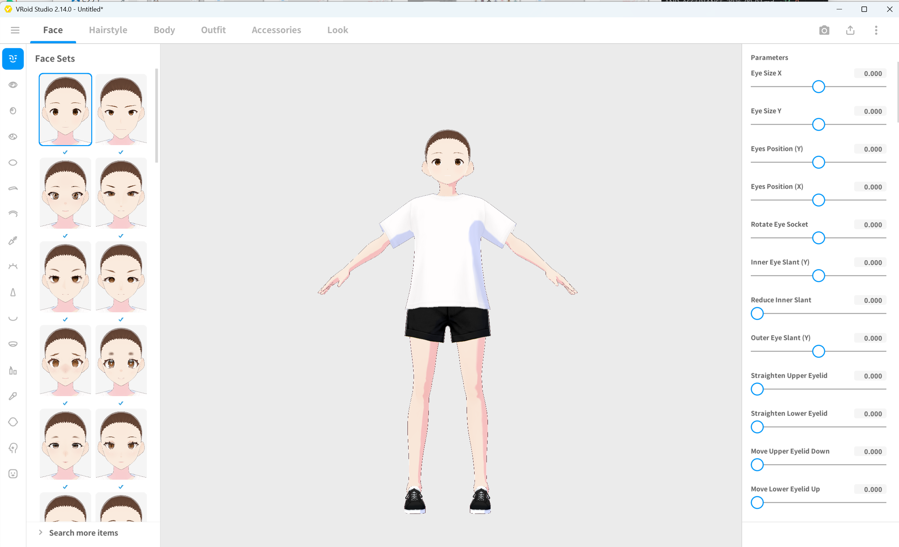
*▲Figure 2-3: Initial state immediately after creation (default outfit and hair applied)*

1. Open the **Hairstyles** tab and unequip all applied hairstyle items (set them to unselected/unapplied).
2. Open the **Outfits** tab and unequip all outfit items such as tops, bottoms, shoes, and socks, leaving only the base body (inner underwear).
3. Open the **Accessories** tab and confirm that no accessories are equipped.

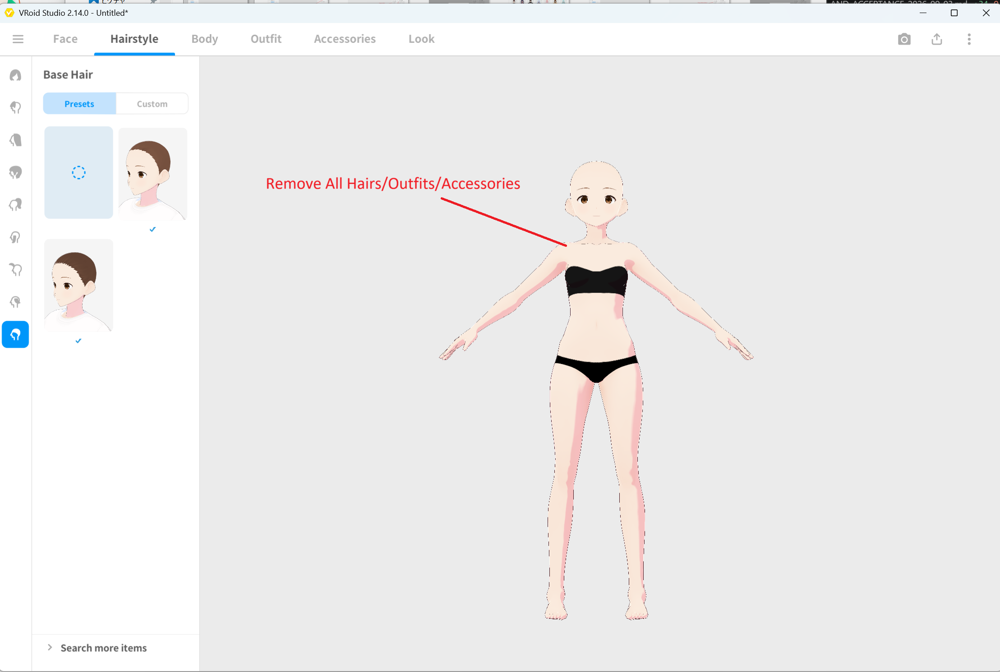
*▲Figure 2-4: State after removing all hair, outfits, and accessories, leaving only the base body*

4. From the top-left menu, save the file as `BasicFemale.vroid`.

---

### Step 3: VRM Export Settings and Value Verification

Export the base body in VRM 1.0 format.

1. Click the export icon in the upper right corner and select **Export VRM** from the menu.

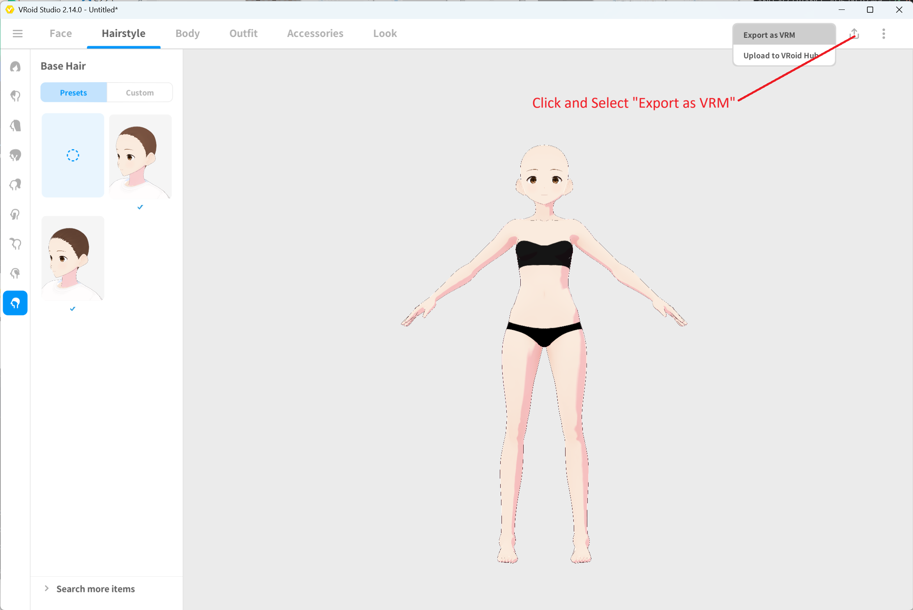
*▲Figure 2-5: Selecting "Export VRM" from the top-right menu*

2. In the settings panel on the right, open **Reduce Polygons**.
3. Turn **OFF (uncheck)** both **Edit Hair Cross-Section** and **Delete Transparent Meshes**.
4. Confirm that all reduction adjustment sliders (Hair smoothness, Hair, Face, Body, Outfits) are set to `0`.
5. Check the **Polygon count, Material count, and Bone count** displayed in the **Export Info** at the top right of the screen, and take note of them.

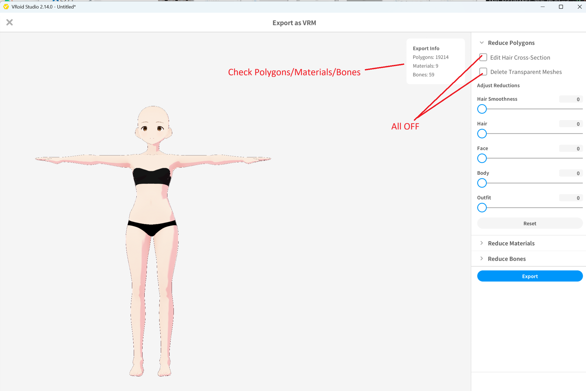
*▲Figure 2-6: Turn OFF all polygon reduction options and verify Export Info (Example measured values: Polygons: 19214 / Materials: 9 / Bones: 59)*

> [!IMPORTANT]
> **Regarding Export Info Values**
> Standard measured values in VRoid Studio 2.14.0 are "Polygons: 19214 / Materials: 9 / Bones: 59", but numbers may vary depending on the VRoid Studio version.
> What is essentially important is that **the values on the FBM model side created next match the values on the Base model side completely**.

---

### Step 4: Exporting VRM 1.0

1. Click the **Export** button in the lower right.
2. In the "VRM Settings" dialog, configure the following:
   * **Export Format**: Make sure to select **VRM1.0** (*Do not select VRM0.0).
   * **Avatar Name (Required)**: Enter `BasicFemale`.
   * **Creators (Required)**: Enter an author name (your name or handle).
3. Execute export at the bottom and save the file as `BasicFemale.vrm`.

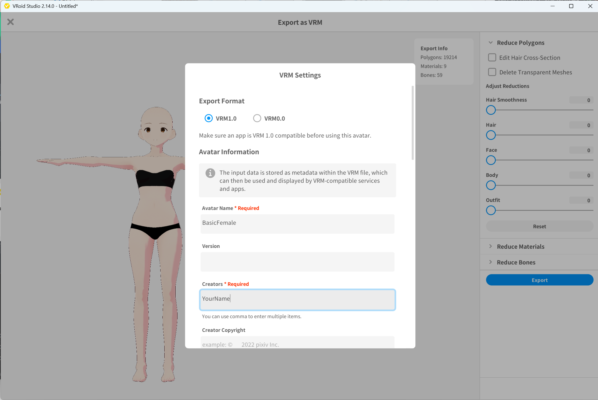
*▲Figure 2-7: Selecting VRM1.0 format and setting avatar name to BasicFemale*

---

## 4. Creating the FBM Model in VRoid Studio

Next, create the FBM model (`SampleI`) that serves as the reference for body shape deformation.

### Step 1: Selecting Built-in Preset `AvatarSample_I`

1. In the VRoid Studio model selection screen, select and open **AvatarSample_I** from the built-in sample presets list.

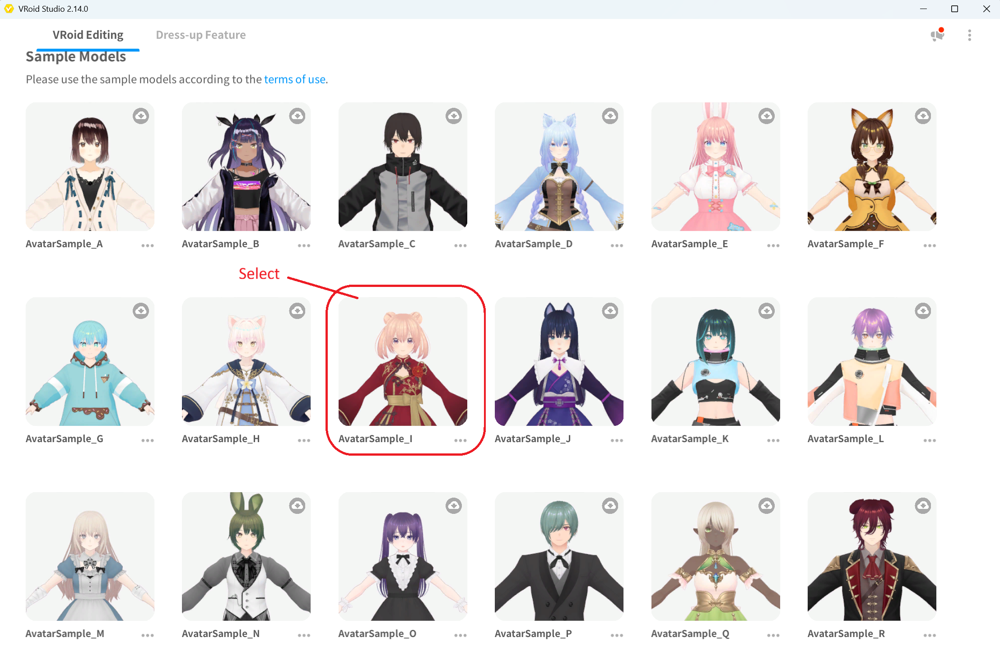
*▲Figure 2-8: Selecting AvatarSample_I from the sample models list*

---

### Step 2: Removing All Hair, Outfits, and Accessories

Just like the Base model, remove all model-specific decorative items.

1. Open the **Hairstyles** tab and unequip all hair items.
2. Open the **Outfits** tab and unequip all clothing, shoes, socks, etc.
3. Open the **Accessories** tab and confirm that no accessories are equipped.

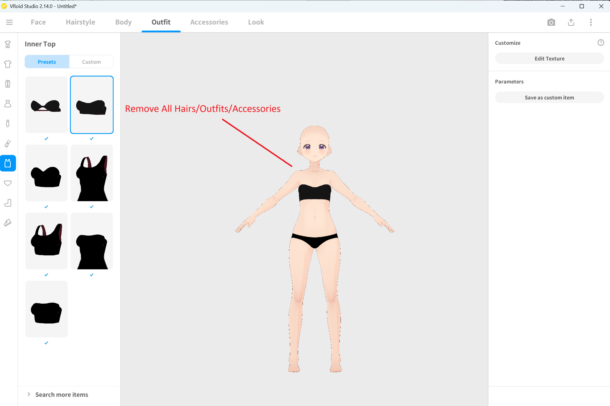
*▲Figure 2-9: State after removing all hair, outfits, and accessories from AvatarSample_I*

4. From the top-left menu, save the file as `SampleI.vroid`.

---

### Step 3 (FBM Side): VRM Export Settings and Value Match Verification

1. Click the export icon in the upper right and select **Export VRM**.
2. Under **Reduce Polygons** in the right panel, **turn OFF all checkboxes** and confirm all sliders are set to `0`.
3. Check the **Polygon count, Material count, and Bone count** in the Export Info, and verify that **they match the values verified on the Base (BasicFemale) completely**.

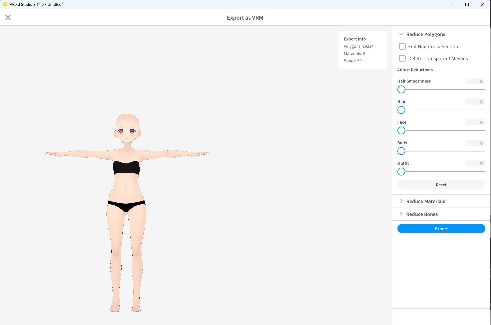
*▲Figure 2-10: Turn OFF polygon reduction and verify that polygon, material, and bone counts are identical to BasicFemale*

> [!CAUTION]
> If the values do not match the Base model, unremoved hair parts, accessories, or clothing may remain, or polygon reduction options may be enabled. Be sure to return to previous steps and verify.

---

### Step 4: Exporting VRM 1.0

1. Click the **Export** button in the lower right.
2. In the "VRM Settings" dialog, configure the following:
   * **Export Format**: Make sure to select **VRM1.0**.
   * **Avatar Name (Required)**: Enter `SampleI`.
   * **Creators (Required)**: Enter an author name.
3. Execute export and save the file as `SampleI.vrm`.

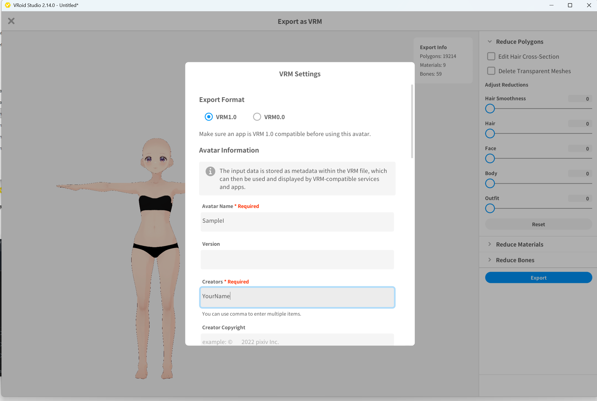
*▲Figure 2-11: Selecting VRM1.0 format and setting avatar name to SampleI*

---

## 5. Summary of Base and FBM Deliverables

Through the steps in this chapter, the following files will be created. These will be used as input data in the next chapter (Figure Registration) and beyond.

| Role | VRoid Project File | Output VRM File | VRM Avatar Name | FBM Axis Name in ShapeSync |
| :--- | :--- | :--- | :--- | :--- |
| **Base (Reference Base Body)** | `BasicFemale.vroid` | `BasicFemale.vrm` | `BasicFemale` | (None, as it is the baseline) |
| **FBM (Body Shape Deformation)** | `SampleI.vroid` | `SampleI.vrm` | `SampleI` | `SampleI` |

### Terms of Use for VRoid Studio Sample Models
* The built-in sample models in VRoid Studio (`AvatarSample_I`, etc.) can be **freely used for both commercial and non-commercial purposes** based on pixiv's terms of use (credit attribution is not required).
* However, **they are not CC0 (public domain)**. Redistributing the sample model files themselves for a fee or redistributing them under CC0 is prohibited.
* These sample model data files are not bundled or distributed within the ShapeSync package. When proceeding with the tutorial, please follow the steps in this chapter to generate and prepare the models in your own environment.

---

## 6. Common Issues and Solutions (Troubleshooting)

### Q1. Polygon, material, or bone counts do not match between Base and FBM
* **Cause**:
  1. Items remain equipped under one of the Hairstyles, Outfits, or Accessories tabs.
  2. "Edit Hair Cross-Section" or "Delete Transparent Meshes" is checked on the VRM export screen.
* **Solution**:
  Return to the VRoid Studio editing screen, check all three tabs ("Hairstyles", "Outfits", "Accessories"), and unequip items completely. Also, verify that all polygon reduction options are turned OFF on the export screen.

### Q2. Topology mismatch error (`FBM topology does not match Base`) occurs during Generate in subsequent steps
* **Cause**:
  The mesh vertex structure (topology) differs between Base and FBM (diagnostics such as `FigureGenerateMeshBuildFailed: FigureMeshBuildInvalid: FBM topology does not match Base: SampleI` will be displayed during Generate in Chapter 3). The vertex composition may be misaligned due to tiny leftover accessory or outfit parts, or differences in polygon reduction settings.
* **Solution**:
  Return to [Step 3](#step-3-vrm-export-settings-and-value-verification) and [Step 3 (FBM Side)](#step-3-fbm-side-vrm-export-settings-and-value-match-verification) in this chapter, confirm that the polygon, material, and bone counts displayed on the export screen match each other completely, and re-export as VRM 1.0.

### Q3. Exported as VRM 0.0 by mistake
* **Cause**:
  "VRM0.0" was selected as the Export Format in the VRM Settings dialog.
* **Solution**:
  ShapeSync requires **VRM 1.0**. Open the export screen again, select **VRM1.0** under Export Format, and overwrite-export the file.

---

[← Back to Tutorial Index](./index.html) ｜ [← Chapter 1: Installation](./installation.html)
