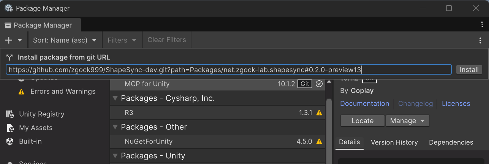

# Chapter 1: Installing and Configuring ShapeSync

[← Back to Tutorial Index](./index.html)

This chapter explains the installation steps and initial project configuration required to start using **ShapeSync** in Unity.

---

## 1. Introduction (Glossary for Beginners)

Before proceeding with the installation steps, here is a simple explanation of commonly used technical terms.

* **Package Manager**: Unity's standard tool for easily importing and managing extensions and external libraries.
* **Scoped Registry**: A registration setting to obtain packages from safe public servers other than official Unity registries.
* **OpenUPM**: A public registry service hosting many open-source packages for Unity.
* **NuGet / NuGetForUnity**: An extension tool that makes NuGet—the library distribution system widely used in the C# / .NET ecosystem—convenient to use in Unity.
* **R3**: A high-performance C# library for asynchronous processing and reactive programming (data change notifications and event management). ShapeSync uses it internally.
* **URP (Universal Render Pipeline)**: Unity's standard high-quality, high-performance rendering system. ShapeSync is designed exclusively for the URP environment.
* **Graphics API (DirectX 12 / Vulkan / DirectX 11)**: The method used to send rendering commands to your computer's graphics card (GPU). ShapeSync's texture transformation requires **DirectX 12 (D3D12)** or **Vulkan**, which supports modern parallel processing (Async Compute).
* **Color Space (Linear)**: The standard calculation used for brightness and color blending. ShapeSync's material calculations are standardized to **Linear**.
* **Asset Serialization Mode (Mixed)**: The format Unity uses to save asset data. It must be set to **Mixed** to handle ShapeSync's large-capacity database.
* **UniVRM**: The standard package for handling VRM-format 3D avatars in Unity. This is only required if you use VRM integration.
* **Scripting Define Symbols**: Project-wide switches (flags) to enable specific features. Used when enabling VRM integration.

---

## 2. System Requirements

Ensure the following environment is prepared to run ShapeSync:

| Item | Requirement | Notes / Recommended Value |
| :--- | :--- | :--- |
| **Unity Version** | Unity 6.0 LTS or higher | Verification standard: **Unity 6000.3.18f1** |
| **Render Pipeline** | Universal Render Pipeline (URP) 17.0.0 or higher | Verification standard: **URP 17.3.0** (Built-in RP / HDRP / Custom SRP are not supported) |
| **Graphics API** | DirectX 12 or Vulkan | Async Compute Queue support is required (*D3D11 is not supported) |
| **Git** | Git 2.14 or higher | Required to fetch packages from GitHub via HTTPS |
| **NuGetForUnity** | 4.5.0 | Used to install .NET core dependencies for R3 |
| **UniVRM** | 0.131.1 | **Required only when using VRM integration features** |

---

## 3. Creating a Project and Recommended Template

When creating a new project in Unity Hub, it is strongly recommended to select the **"Universal 3D"** template.

> [!TIP]
> **Why the Universal 3D Template is Recommended**
> In Unity 6 (`6000.3.18f1`), the Universal 3D template comes pre-configured with URP `17.0.1` or higher and Color Space set to `Linear`. This eliminates the need to manually migrate renderers or change the color space.
>
> If you create a project from another template such as Built-in RP, follow the steps below to manually install and configure URP.

---

## 4. Step-by-Step Installation

The order of resolving dependencies is crucial when installing ShapeSync. Please follow **Step 1 through Step 6** strictly in order (up to Step 8 if using VRM).

### Step 1: Adding the OpenUPM Scoped Registry

Configure Unity to obtain related packages from OpenUPM.

1. In the Unity Editor menu, open **Edit > Project Settings**.
2. Select **Package Manager** from the left-side menu, enter the following information in the **Scoped Registries** list, and click **Save**.

```text
Name: OpenUPM
URL: https://package.openupm.com
Scopes: com.cysharp, com.vrmc, com.github-glitchenzo
```


*▲Figure 1-1: Scoped Registries settings in Project Settings > Package Manager*

---

### Step 2: Installing NuGetForUnity and NuGet Version of R3

Install the core R3 library required by ShapeSync via NuGet.

1. In the Unity menu, open **Window > Package Manager**.
2. Click the "**+**" button in the upper left corner and select **Add package by name...**.
3. Enter the following in the Name field and click **Add**:
   ```text
   com.github-glitchenzo.nugetforunity
   ```
   If a version specification is needed, enter `4.5.0`.
4. Once installation is complete, a **NuGet** menu will be added to the top menu of Unity. Open **NuGet > Manage NuGet Packages**.
5. Type `R3` in the search box, locate `R3` (version `1.3.1`) from the list, and click **Install**.


*▲Figure 1-2: Installing R3 (1.3.1) in NuGet > Manage NuGet Packages*

> [!IMPORTANT]
> **Important Checkpoints**
> * The `R3 1.3.1` displayed in Unity Package Manager (described in Step 3 below) and the NuGet version of `R3` are different packages. Make sure to install from the NuGet window.
> * After installation, verify that `<package id="R3" version="1.3.1" manuallyInstalled="true" />` is written in `Assets/packages.config` of your project, and that `Assets/Packages/R3.1.3.1/lib/.../R3.dll` has been generated.

---

### Step 3: Installing the R3 Unity Adapter

Install the Unity adapter package to ensure seamless integration of R3 within Unity.

1. Open **Window > Package Manager**.
2. Click the "**+**" button in the upper left corner and select **Add package by name...**.
3. Enter the following and click **Add**:
   ```text
   com.cysharp.r3
   ```
   Specify version `1.3.1`.


*▲Figure 1-3: Confirming and adding the com.cysharp.r3 package in Package Manager*

---

### Step 4: Confirming/Installing URP and Configuring the Graphics API

1. **Confirming URP**:
   * If you used the Universal 3D template, URP 17.x is automatically installed, and the URP Asset is configured in **Project Settings > Graphics** (verification only is sufficient).
   * If you used a different template, install `com.unity.render-pipelines.universal` (17.0.0 or higher, verification standard 17.3.0) from the Package Manager, and assign the URP Asset in the Graphics settings.
2. **Graphics API Configuration on Windows**:
   * Open **Edit > Project Settings > Player**.
   * Under the **Other Settings > Rendering** section, uncheck **Auto Graphics API for Windows**.
   * Place **Direct3D12** at the top of the list (or select **Vulkan**).
   * After changing this setting, **make sure to restart the Unity Editor**.


*▲Figure 1-4: Graphics APIs settings in Project Settings > Player (Direct3D12 set to the top)*

---

### Step 5: Installing the ShapeSync Core Package

Install the main ShapeSync package by specifying the Git URL.

1. Open **Window > Package Manager**.
2. Click the "**+**" button in the upper left corner and select **Add package from git URL...**.
3. Copy and paste the following URL exactly as it is and click **Add**:
   ```text
   https://github.com/zgock999/ShapeSync-dev.git?path=Packages/net.zgock-lab.shapesync#0.2.0-preview13
   ```

> [!WARNING]
> In the URL, `?path=Packages/net.zgock-lab.shapesync` must be placed before `#0.2.0-preview13`. If the order is different, a Git fetch error (pathspec error) will occur.


*▲Figure 1-5: Adding ShapeSync Core from Git URL in Package Manager*

---

### Step 6: Checking and Modifying Project Settings

Adjust project settings to properly handle ShapeSync's large-capacity data and materials.

1. **Changing Asset Serialization Mode**:
   * Open **Edit > Project Settings > Editor**.
   * Change **Mode** under **Asset Serialization** to **Mixed** (*make sure to change it from the default "Force Text" in a new project).
2. **Checking Color Space**:
   * Open **Edit > Project Settings > Player > Other Settings > Rendering**.
   * Verify that **Color Space** is set to **Linear** (if it is set to Gamma, change it to Linear).


*▲Figure 1-6: Asset Serialization Mode settings in Project Settings > Editor (Selecting Mixed)*

---

### Step 7: [Optional] Installing UniVRM (Only When Using VRM Integration)

If you use ShapeSync with VRM 1.0 format avatar models, add the following packages (*skip this step if using ShapeSync Core alone):

1. From **Add package by name...** in **Window > Package Manager**, add the following two packages in order:
   * `com.vrmc.gltf` (Version: `0.131.1`)
   * `com.vrmc.vrm` (Version: `0.131.1`)

---

### Step 8: [Optional] Installing ShapeSync VRM Integration Companion

Add the extension package for VRM integration and enable the integration flag.

1. From **Add package from git URL...** in **Window > Package Manager**, add the following:
   ```text
   https://github.com/zgock999/ShapeSync-dev.git?path=Packages/net.zgock-lab.shapesync.vrm#0.2.0-preview13
   ```
2. Open **Edit > Project Settings > Player > Other Settings**.
3. Add `SHAPESYNC_USE_UNIVRM` to **Scripting Define Symbols** and click **Apply**.


*▲Figure 1-7: Scripting Define Symbols settings in Project Settings > Player (Adding SHAPESYNC_USE_UNIVRM)*

---

## 5. [Important Note] DirectX 12 Configuration When Using Unity 6000.0 (Unity 6.0 LTS)

There are important notes regarding Graphics API configuration when using **Unity 6.0 LTS (`6000.0.x`)** on Windows.

### 1. Why is DirectX 12 (or Vulkan) Required?
ShapeSync's texture transformation engine (Texture StackMachine) generates and composites textures in real time using the GPU's high-speed **Async Compute Queue** and **GraphicsFence**.
Because legacy **DirectX 11 (D3D11)** does not support these features, running texture processing under D3D11 causes a runtime error (`NotSupportedException`). D3D11 is unsupported.

### 2. Conditions and Version Differences
* **When using Unity 6.0 LTS (`6000.0.x`) [Manual change required]**:
  * Unity 6.0 defaults to **D3D11** as the Graphics API on Windows. Therefore, you must manually change it to **Direct3D12** (or Vulkan).
* **When using Unity 6.3 LTS (`6000.3.x`) [Verification only]**:
  * In the Unity 6.3 verification environment, **Direct3D12** is selected by default. Open the settings screen and confirm that Direct3D12 is at the top.

### 3. Configuration Steps
1. Open **Edit > Project Settings > Player > Other Settings > Rendering**.
2. Uncheck **Auto Graphics API for Windows**.
3. Place **Direct3D12** at the top of the list (or select Vulkan).
4. **Restart the Unity Editor** (*The new Graphics API will not take effect until restarted).

### 4. Reference and Rationale
This note is based on the following descriptions in the public documentation `README.md`:
* `## Requirements`: Async compute requirements for D3D12 / Vulkan, behavior differences between Unity 6.0 (D3D11 default) and Unity 6.3 (D3D12 default), and explicit note on D3D11 non-support.
* `### Choose the project template`: Note requiring manual change from D3D11 to D3D12 in Unity 6.0.
* `### 4. Confirm or install URP`: Graphics APIs configuration steps on Windows and the necessity of restarting the Editor.
* `### Troubleshooting > Texture processing fails on Windows`: `NotSupportedException` occurrence in D3D11 and steps to change to D3D12.

---

## 6. Common Issues and Solutions (Troubleshooting)

### Q1. Compiler errors related to R3 occur
* **Symptom**: Errors such as `The type or namespace name 'Collections' does not exist in the namespace 'R3'`, or missing `FrameProvider`, `Observable<>`, etc.
* **Cause**: The NuGet version of R3 in Step 2 is not properly installed (only the Package Manager Unity adapter is installed).
* **Solution**: Open **NuGet > Manage NuGet Packages** and install the NuGet version of `R3` (1.3.1). Verify that R3 is listed in `Assets/packages.config` of your project.

### Q2. Error occurs during texture processing
* **Symptom**: An error `NotSupportedException: Cannot determine if this AsyncQueueSynchronisation Graphics...` occurs.
* **Cause**: The Graphics API remains set to DirectX 11 (D3D11).
* **Solution**: Refer to [Section 5 Important Note](#5-important-note-directx-12-configuration-when-using-unity-60000-unity-60-lts), change the Graphics API to **Direct3D12** or **Vulkan**, and restart Unity.

### Q3. Error indicating Core cannot be found occurs in VRM Companion
* **Symptom**: An error occurs when adding the VRM Companion package.
* **Cause**: VRM Companion was imported before ShapeSync Core.
* **Solution**: Remove VRM Companion, install ShapeSync Core from Step 5 first, and then add VRM Companion again.

### Q4. Error occurs with Git URL specification
* **Symptom**: An error `Cannot checkout repository ... pathspec ... did not match any file(s) known to git` occurs.
* **Cause**: The Git URL format is incorrect.
* **Solution**: Verify that `?path=Packages/net.zgock-lab.shapesync` is placed before `#0.2.0-preview13`.

---

## 7. Verifying Installation (Running Package Tests)

After completing the installation, you can verify that it was installed correctly by running tests.

1. Open `Packages/manifest.json` of your project in a text editor and add `"net.zgock-lab.shapesync"` to the `"testables"` field.
   ```json
   "testables": [
     "net.zgock-lab.shapesync"
   ]
   ```
2. Return to the Unity Editor and open **Window > General > Test Runner** from the menu.
3. Run **EditMode** and **PlayMode** tests and confirm that all tests pass successfully (approx. 1,175 EditMode tests and 136 PlayMode tests in a Core-only configuration).

---

[← Back to Tutorial Index](./index.html)
