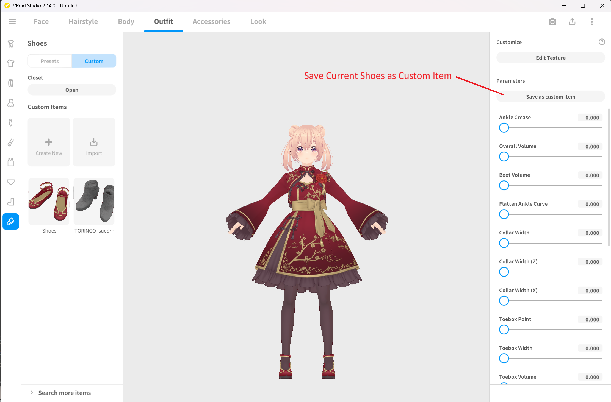
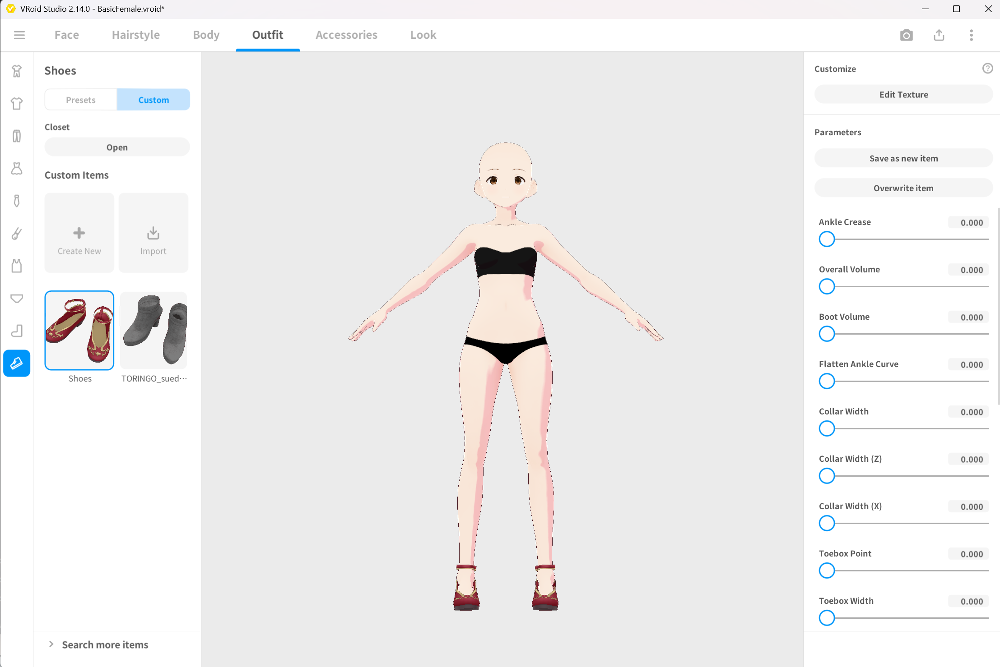
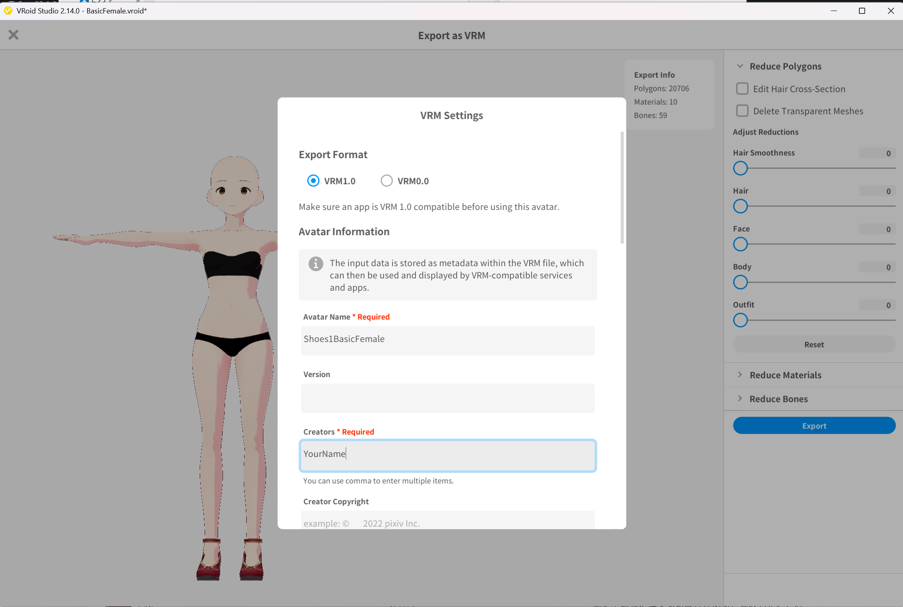
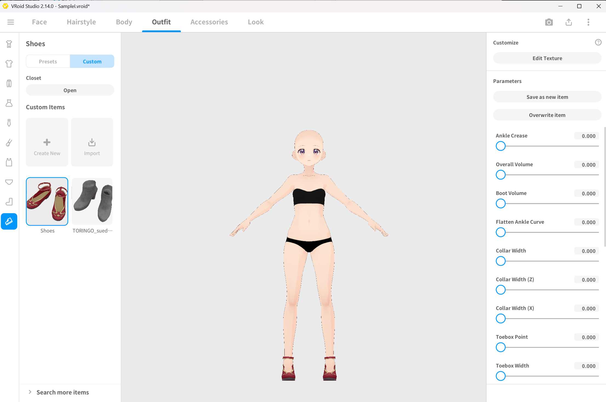
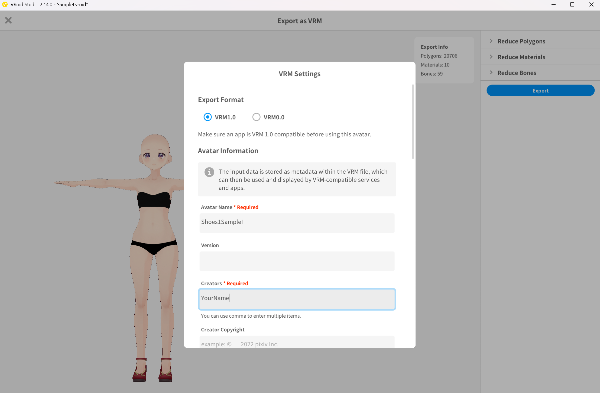
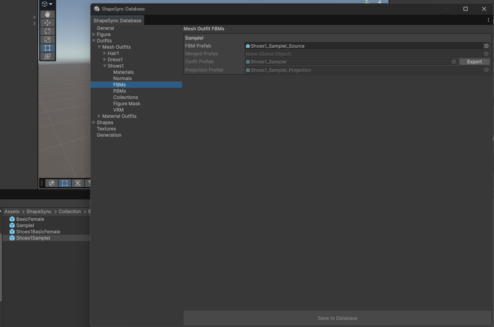
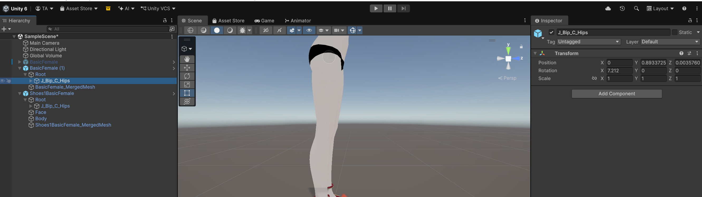
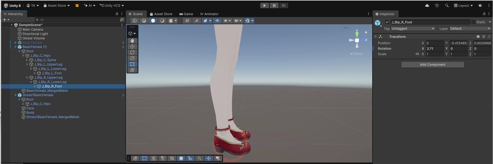
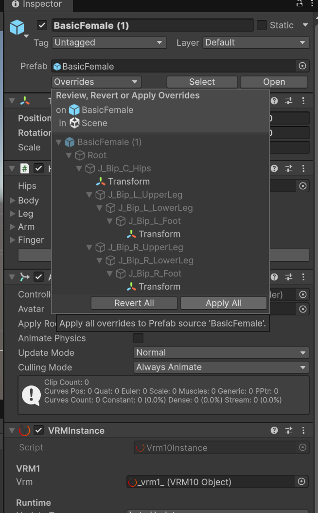
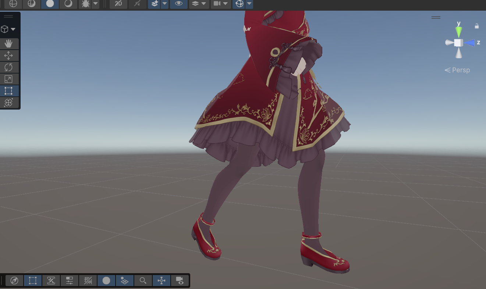

# Chapter 7: Advanced Outfit Registration and Collection (Shoe Deformation and Alignment)

[← Back to Tutorial Index](./index.html) ｜ [← Chapter 6: Advanced Figure Registration and Partial Body Deformation (PBM)](./pbmregistration.html)

This chapter explains the procedure for using the **Collection** feature, which corrects discrepancies in ankle angles and hip height that occur when a character wears shoes (such as heels or platform shoes).

* **First Half (VRoid Studio)**: Convert shoes from the sample model into custom items, equip them on Base and FBM base bodies, and export 2 shoe VRMs in total.
* **Second Half (Unity / ShapeSync)**: Confirm position discrepancies on the Scene, register Shoes1 in ShapeSync Editor, adjust postures (Hip Y / Foot X rotation) on Collection base body Prefabs and save Overrides, configure **Full Collection (vertex Projection enabled)**, and verify Fit operations.

---

## 1. Introduction (Shoe Position/Posture Discrepancies and Collection Concept)

* **Posture Discrepancy Caused by Shoes**: When wearing shoes with heels or thick soles, ankle angles (Foot tilt) and hip height (Hip Y) change relative to the default standing pose of the base body.
* **Collection Feature**: A feature that automatically tracks and corrects bone postures and mesh vertices when wearing outfits by registering Prefabs with base body postures adjusted to match the shoes.
* **Difference Between Bone and Full**:
  * **Bone**: Corrects only the position and rotation of bones.
  * **Full**: In addition to bone correction, also performs deformation (Projection) of body mesh vertices. This chapter uses **Full** for a reliable fit to the shoes.

---

## 2. Converting Shoes into Custom Items and Exporting Equipped VRMs (VRoid Studio)

First, use VRoid Studio to extract shoes from the model, equip them on Base / FBM base bodies, and export VRMs.

### 2.1 Converting Shoes into Custom Items
1. Launch VRoid Studio and open the preset model **AvatarSample_I**.
2. Select the **Outfits** tab in the top menu, and select **Shoes** from the left menu.
3. Switch category to **Custom**, and click **Save as Custom Item** on the displayed shoes item.

*▲Figure 7-1: Opening AvatarSample_I, going to Outfits > Shoes > Save as Custom Item*

### 2.2 Exporting Shoes1BasicFemale.vrm
1. Open the base body model **BasicFemale.vroid** created in Chapter 2.
2. Select **Outfits** tab > **Shoes** > **Custom**, and select and equip the custom shoes item saved earlier.

*▲Figure 7-2: Opening BasicFemale and equipping custom shoes*

3. Select **Export VRM** from the export button in the top right.
4. Select **VRM1.0** and verify the Export Info (Polygon count: **20706**, Material count: **10**, Bone count: **59**).

*▲Figure 7-3: Checking polygon count, material count, bone count, and exporting as Shoes1BasicFemale.vrm*

5. Enter Shoes1BasicFemale in Avatar Name, and export as **Shoes1BasicFemale.vrm** into the Unity project.

### 2.3 Exporting Shoes1SampleI.vrm
1. Next, open the FBM base body model **SampleI.vroid**.
2. Select **Outfits** tab > **Shoes** > **Custom**, and equip the same shoes item.

*▲Figure 7-4: Opening SampleI and equipping custom shoes*

3. Select **Export VRM** (VRM 1.0) from the export button in the top right, and verify Export Info (Polygon count: **20706**, Material count: **10**, Bone count: **59**).

*▲Figure 7-5: Checking polygon count, material count, bone count, and exporting as Shoes1SampleI.vrm*

4. Enter Shoes1SampleI in Avatar Name, and export as **Shoes1SampleI.vrm** into the Unity project.

---

## 3. Checking Position and Posture Discrepancies in Scene

Return to the Unity Editor and check the initial relative positions of base body and shoes.

1. Place base body **BasicFemale.vrm** and shoes **Shoes1BasicFemale.vrm** into the Unity Scene.
2. Set Transform Position of both to the identical coordinates **(0, 0, 0)**.
3. Checking the feet in Scene view reveals that the position and posture of base body feet and shoes do not match and are heavily misaligned. Collection is used to correct this discrepancy.

*▲Figure 7-6: Placing BasicFemale and Shoes1BasicFemale at identical coordinates (0,0,0) and checking position discrepancies at feet and hips*

---

## 4. Registering Outfit (Shoes1) and Classifying Materials

Register the exported shoe VRMs into ShapeSync Editor.

1. From the top menu in Unity Editor, open **Tools > zgock > ShapeSync > ShapeSync Editor**.
2. Select **Outfits** from the left TreeView.
3. Enter **Shoes1** in **Outfit Id** and **Shoes1** in **Outfit Name**, and click the **Create Mesh Outfit** button.
4. Select the created **Outfits > Mesh Outfits > Shoes1**.
5. In **Outfit Prefab**, drag and drop **Shoes1BasicFemale.vrm** from the Project window, and click **Save to Database** at the bottom of the screen.
6. Next, open **Shoes1 > Materials** (Mesh Outfit Materials) from TreeView.
7. Set the **Classification** for body material rows such as face and body to **Projection** instead of Exclude.
8. Keep the shoe material (Shoes_01_CLOTH) as **Include**, set Entry Name to **Shoes1**, and click **Save to Database** at the bottom of the screen.
   > [!IMPORTANT]
   > Classifying body parts as Projection enables the vertex correction (Projection) of Full Collection described later.

*▲Figure 7-7-1: Setting body materials such as face and eyes to Projection in Shoes1 > Materials*

*▲Figure 7-7-2: Setting Body_00_SKIN to Projection and shoe material to Include (Entry Name: Shoes1), then saving with Save to Database*

9. Open **Shoes1 > FBMs** from TreeView.
10. In **FBM Prefab** for the existing Figure FBM axis **SampleI** row, drag and drop **Shoes1SampleI.vrm** from the Project window, and click **Save to Database** at the bottom of the screen.

---

## 5. Exporting Collection Base Body Prefabs and Adjusting Posture

Create Collection Prefabs with base body postures adjusted to match the shoes.

### 5.1 Exporting Prefabs
1. Open **Figure** (Base screen) in TreeView, and click the **Export** button in the Prefab on Database row.
2. In the "Export Figure Prefab" dialog, specify destination as **Assets/ShapeSync/Collection/Shoes1/BasicFemale.prefab** and save (maintain default file name).
3. Open the SampleI row in TreeView under **Figure > FBMs**, and click the **Export** button for Prefab on Database.
4. In the "Export FBM Prefab" dialog, specify destination as **Assets/ShapeSync/Collection/Shoes1/SampleI.prefab** and save.
5. Similarly, from **Export** in the Outfit Prefab on Database row of the **Shoes1** Base screen, save **Assets/ShapeSync/Collection/Shoes1/Shoes1BasicFemale.prefab**.
6. From **Export** for Outfit Prefab in the SampleI row of **Shoes1 > FBMs**, save **Assets/ShapeSync/Collection/Shoes1/Shoes1SampleI.prefab**.

*▲Figure 7-8-1: State where 4 Prefabs are exported to Assets/ShapeSync/Collection/Shoes1/*

### 5.2 Posture Adjustment in Scene and Saving Overrides
1. Place the created Collection base body **BasicFemale.prefab** and comparison shoe **Shoes1BasicFemale.prefab** into the Scene, setting both to **(0, 0, 0)**.

*▲Figure 7-8-2: Placing BasicFemale (for Collection) and Shoes1BasicFemale at identical coordinates in Scene*

2. Check the Position Y coordinate (e.g. `0.9225485`) of `Root/J_Bip_C_Hips` on the shoe Prefab (`Shoes1BasicFemale`).

*▲Figure 7-8-3: Checking Position Y coordinate (0.9225485) of J_Bip_C_Hips on Shoes1BasicFemale*

3. Copy and enter the confirmed value (`0.9225485`) into the Position Y coordinate of `Root/J_Bip_C_Hips` on the Collection base body (`BasicFemale`).

*▲Figure 7-8-4: Entering 0.9225485 into Position Y of J_Bip_C_Hips on BasicFemale*

4. Adjust **Rotation X** of left and right ankle bones (J_Bip_L_Foot and J_Bip_R_Foot) on the Collection base body to fit the shoe tilt snugly (e.g. Rotation X = **3.71**).

*▲Figure 7-8-5: Setting Rotation X of J_Bip_R_Foot on BasicFemale to 3.71 to match shoe tilt*

5. Once adjustments are complete, select the Collection base body (BasicFemale) in Hierarchy, and click **Apply All** from the **Overrides** dropdown in the top right of Inspector to overwrite-save to the Prefab.
   > [!WARNING]
   > If you do not save Overrides (Apply All), adjusted postures will not be reflected in Collection corrections. Do not create a separate dedicated Prefab; always save to this BasicFemale.prefab."

*▲Figure 7-8-6: Clicking Apply All from Overrides dropdown in Inspector to overwrite-save to BasicFemale.prefab*

6. Similarly, place **SampleI.prefab** and **Shoes1SampleI.prefab** in the Scene, copy Hip Y, adjust left and right Foot X rotations, and save Overrides (Apply All) to **SampleI.prefab**.

---

## 6. Configuring Collection (Full and Projection)

Register the adjusted Prefabs into ShapeSync Editor's Collection settings.

1. Select **Outfits > Mesh Outfits > Shoes1 > Collections** from the left TreeView in ShapeSync Editor.
2. Select **Full** in the **Collection** dropdown.
3. Check **Use Projection for Full Collection** to **ON**.
4. Assign each Collection Prefab:
   * **Base Collection Prefab**: Assets/ShapeSync/Collection/Shoes1/BasicFemale.prefab
   * **SampleI Collection Prefab**: Assets/ShapeSync/Collection/Shoes1/SampleI.prefab
5. Click the **Save to Database** button at the very bottom of the screen to save.

*▲Figure 7-9: Setting Collection to Full, turning ON Use Projection for Full Collection, assigning Base/SampleI Collection Prefabs, and saving with Save to Database*

---

## 7. Registering Outfit Shape and Executing Generate

Create an Outfit Shape for shoes and generate Shape Templates.

1. Select **Shapes** from the left TreeView in ShapeSync Editor.
2. Enter **outfitShoes1** in **Shape Id** and outfitShoes1 in **Shape Name**, and click the **Create Outfit Shape Template** button.
3. Open **Shapes > Outfit Shapes > outfitShoes1** in TreeView.
4. Click the **Add Mesh** button and assign **Shoes1** to **Outfit Mesh**.
5. Click the **Save to Database** button at the bottom of the screen to save.

*▲Figure 7-10-1: Assigning Shoes1 to Outfit Mesh in outfitShoes1 Outfit Shape and saving with Save to Database*

6. Select the **Generation** section from TreeView.
7. Keep each output relative path at default values, and click the **Generate** button at the bottom of the screen.
8. Select destination root folder (Assets/ShapeSync/Generated), click "Select Folder", and execute generation.

*▲Figure 7-10-2: Clicking Generate in Generation section, selecting destination root folder (Generated), and executing generation*

---

## 8. Scene Placement and Operation Check with Shape Director, Verifying Poke

Apply shoes to Figure in Scene and check Fit status and remaining issues.

1. Select the Figure (BasicFemale) placed in the Scene.
2. Inspect the **ShapeDirector** component on the Figure.
3. Drag and drop the newly generated **outfitShoes1.asset** into **Template List** (Perform registration before entering Play Mode).
4. Verify that Walking.controller is assigned to Figure's Animator, and press Unity's **Play button** to enter **Play Mode**.
5. While walking animation is playing, confirm that shoe positions and ankle angles fit naturally and track correctly with walking.

*▲Figure 7-11-1: Shoe positions and angles fitting and tracking correctly during walking animation playback in Play Mode*

*▲Figure 7-11-2: Tracking state of shoes and feet viewed from beneath dress*

6. Zooming in closely on the feet reveals that base body skin/toes slightly poke out through parts such as the toe area of shoes (**Poke**).

*▲Figure 7-11-3: State of Poke where base body skin slightly protrudes from tip of shoe toe*

> [!NOTE]
> This remaining Poke at the toes is completely resolved using the **Figure Mask** feature explained in the next chapter (Chapter 8).

---

## 9. Common Issues and Solutions (Troubleshooting)

### Q1. Shoe position or ankle angle is not corrected upon entering Play Mode
* **Cause**:
  After adjusting postures on Collection base body Prefabs (BasicFemale.prefab, etc.), overwrite-saving to the Prefab via **Overrides > Apply All** in the Inspector may not have been performed.
* **Solution**:
  Select the adjusted base body Prefab in the Scene and be sure to click Overrides > Apply All to save. Afterwards, re-execute Generate in Generation of ShapeSync Editor.

### Q2. Body mesh around shoes does not deform cleanly
* **Cause**:
  In Shoes1 > Materials, body part materials may be set to Exclude instead of Projection, or Use Projection for Full Collection may not be enabled in the Collections screen.
* **Solution**:
  Confirm that body materials are set to Projection in Shoes1 > Materials, and that Full and Use Projection for Full Collection is ON in Shoes1 > Collections, save, and re-generate.

---

[← Back to Tutorial Index](./index.html) ｜ [← Chapter 6: Advanced Figure Registration and Partial Body Deformation (PBM)](./pbmregistration.html)