# Chapter 4: Outfit Registration and Attach/Detach Operation Check

[← Back to Tutorial Index](./index.html) ｜ [← Chapter 3: Figure Registration and Initial Operation Check](./figureregistration.html)

This chapter explains the steps to create **Hairstyle (Hair1)** and **Outfit (Dress1)** to be worn by the character, register them as Outfits in ShapeSync Editor, and verify attach/detach operations on the Figure as well as body shape deformation tracking.

* **First Half (VRoid Studio)**: Create and export VRM files with hairstyles and outfits equipped from presets.
* **Second Half (Unity / ShapeSync)**: Register exported VRMs into ShapeSync Editor's Database to generate assets, and attach them to the Figure using OutfitAttacher.

> [!NOTE]
> This chapter assumes that the Base VRM (BasicFemale.vrm), FBM axis (SampleI.vrm), and generated Figure Prefab created in the previous chapter ([Chapter 3: Figure Registration and Initial Operation Check](./figureregistration.html)) are prepared.

---

## 1. Introduction (Core Concepts of Outfits and VRMs to Prepare)

* **Outfit**: Decorative assets such as clothing and hairstyles worn by the character. In ShapeSync, these are managed as **Mesh Outfits** accompanied by meshes.
* **Mesh Outfit Materials (Material Classification)**: When registering an Outfit, the materials included in the model are classified into "parts to retain as the Outfit (**Include**)" and "body parts on the wearer side not included in the Outfit (**Exclude**)". By designating body parts as Exclude, only the mesh of the outfit or hairstyle is correctly extracted.
* **OutfitAttacher**: A Unity component attached to the generated Figure that allows attaching, detaching, and synchronizing arbitrary Outfit Prefabs during Play Mode.

### 4 VRMs to Prepare in This Chapter
Because Outfits are required for both the Base body shape and the FBM body shape, create the following 4 files:

1. **Hair1BasicFemale.vrm**: Model with hairstyle equipped on BasicFemale (Base)
2. **Hair1SampleI.vrm**: Model with hairstyle equipped on SampleI (FBM)
3. **Dress1BasicFemale.vrm**: Model with outfit equipped on BasicFemale (Base)
4. **Dress1SampleI.vrm**: Model with outfit equipped on SampleI (FBM)

---

## 2. Registering Custom Hair and Exporting Equipped VRMs (VRoid Studio)

First, use VRoid Studio to save hairstyles from the preset model as custom items, equip them on Base and FBM models, and export them.

### 2.1 Saving Hairstyles as Custom Items from AvatarSample_I
1. Launch VRoid Studio and open the preset model **AvatarSample_I**.
2. Select the **Hairstyles** tab in the top menu.
3. Select **Front** from the left menu, switch to the **Custom** tab, and select **Save as Custom Item** for the equipped front hair.

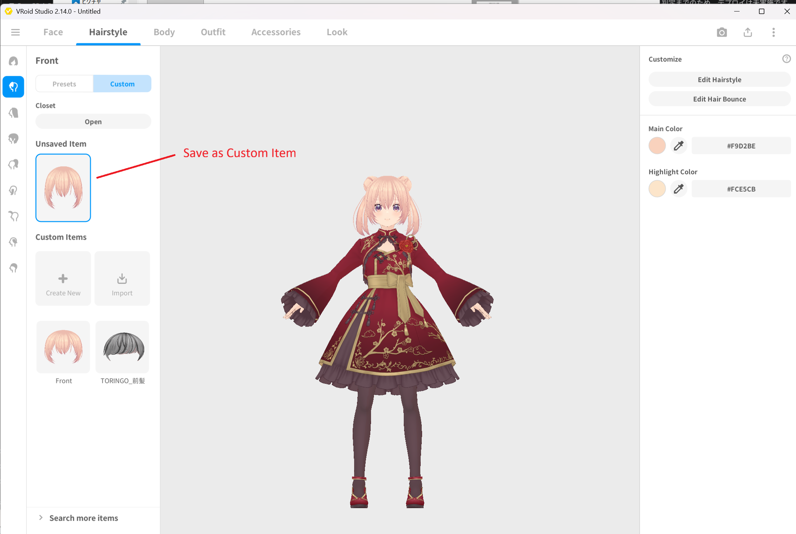
*▲Figure 4-1: Saving AvatarSample_I front hair as custom item*

4. Similarly, select **Back** from the left menu, switch to the **Custom** tab, and select **Save as Custom Item**.

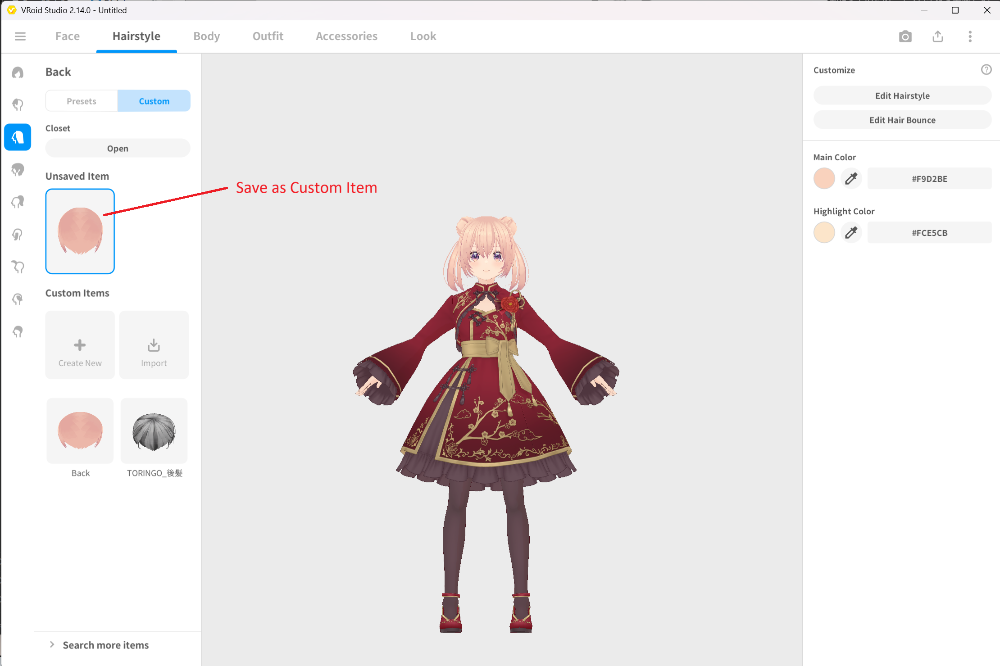
*▲Figure 4-2: Saving AvatarSample_I back hair as custom item*

5. Similarly, select **Extensions** from the left menu, switch to the **Custom** tab, and select **Save as Custom Item**.

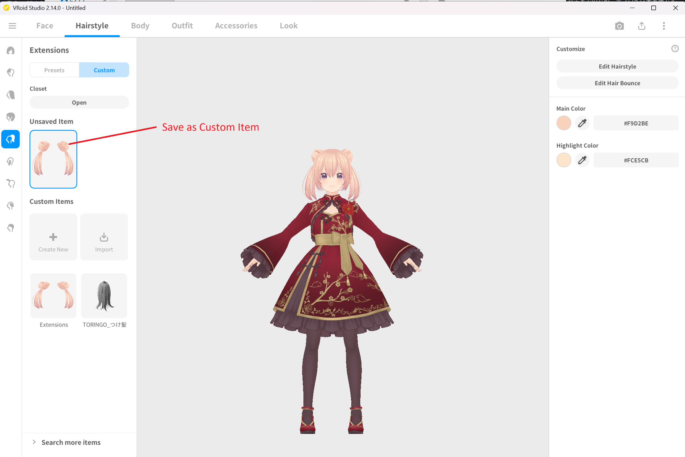
*▲Figure 4-3: Saving AvatarSample_I extensions hair as custom item*

---

### 2.2 Equipping Custom Hair on SampleI and Exporting (Hair1SampleI.vrm)
1. Open **SampleI.vroid** (base body model) created in Chapter 2.
2. Open the **Hairstyles** tab and select and equip each of the 3 custom items (Front, Back, Extensions) saved in 2.1.

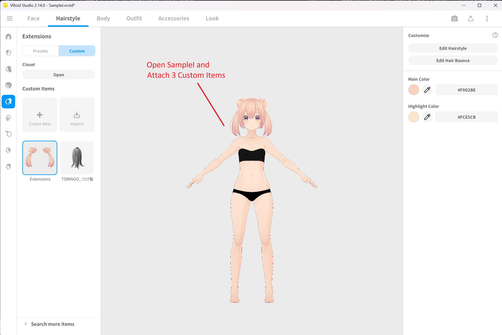
*▲Figure 4-4: Equipping the 3 custom hair items saved on SampleI.vroid*

3. Select **Export VRM** from the export button in the top right.
4. In the export settings on the right, confirm that **all polygon reduction options are OFF (unchecked, reduction degree 0)**.
   * Verify the Export Info (Reference: Polygon count 42006 / Material count 12 / Bone count 95).

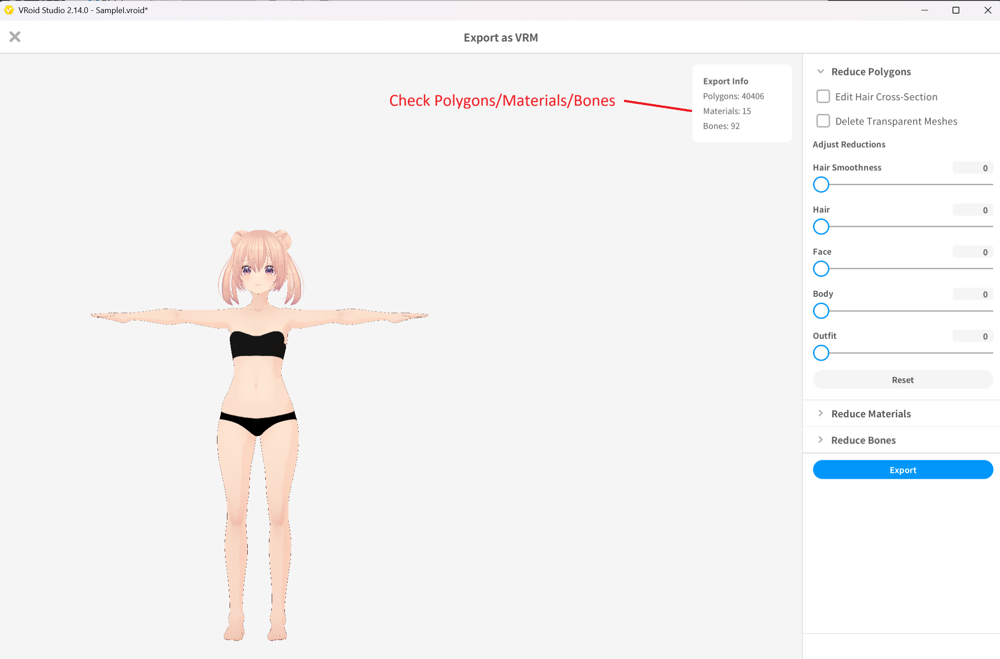
*▲Figure 4-5: Verifying all polygon reduction options are OFF and checking export info*

5. Click the **Export** button, select **VRM1.0** as format, enter **Hair1SampleI** in Avatar Name, and export.
   * Destination: Assets/VRM/Hair1SampleI.vrm

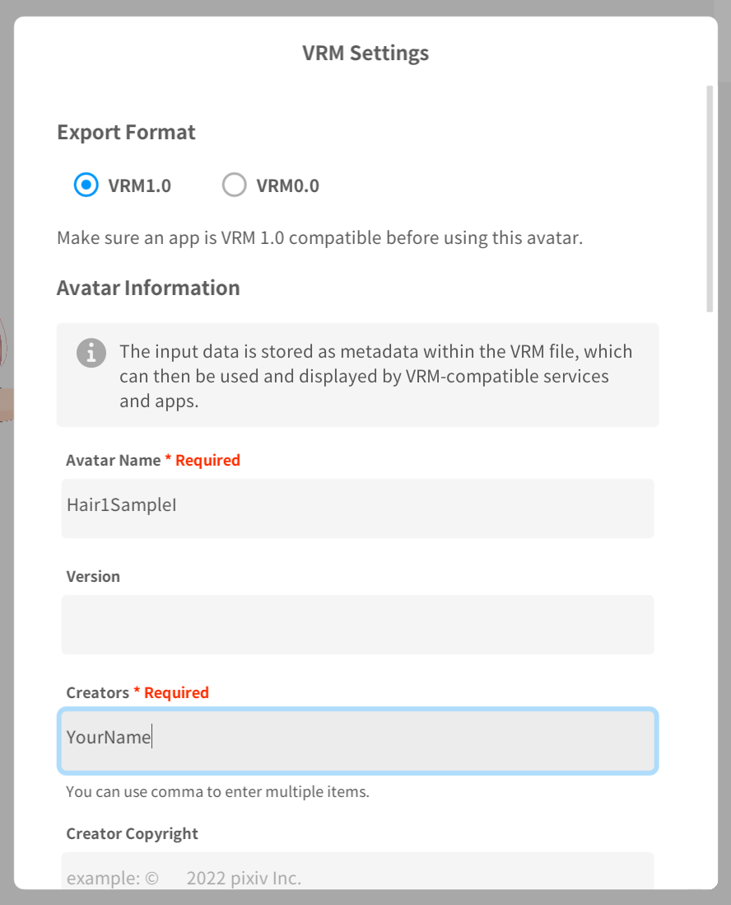
*▲Figure 4-6: Exporting with format VRM1.0 and avatar name Hair1SampleI*

---

### 2.3 Equipping Custom Hair on BasicFemale and Exporting (Hair1BasicFemale.vrm)
1. Open **BasicFemale.vroid** (base body model) created in Chapter 2.
2. Open the **Hairstyles** tab and equip the 3 registered custom hair items (Front, Back, Extensions).
3. Open **Export VRM**, confirm that all polygon reduction options are OFF, and verify the Export Info (Reference: Polygon count 40406 / Material count 12 / Bone count 95).

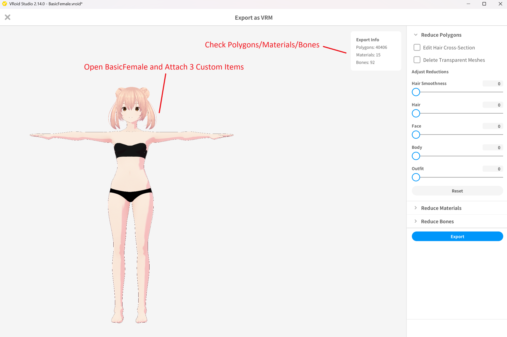
*▲Figure 4-7: Equipping custom hair on BasicFemale, confirming all polygon reduction OFF and info*

4. Select **VRM1.0** as format, enter **Hair1BasicFemale** in Avatar Name, and export.
   * Destination: Assets/VRM/Hair1BasicFemale.vrm

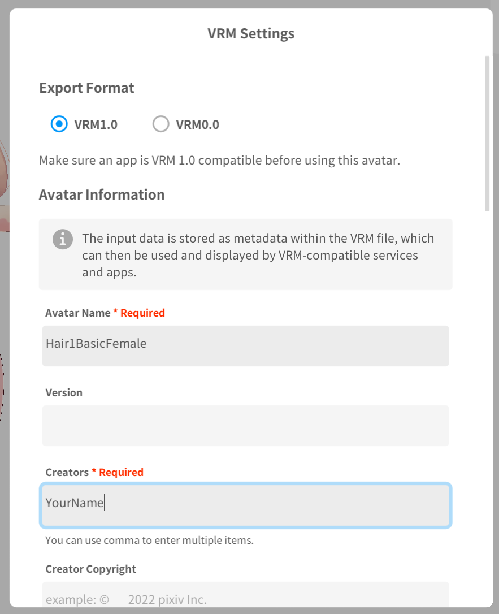
*▲Figure 4-8: Exporting with format VRM1.0 and avatar name Hair1BasicFemale*

---

## 3. Equipping Preset Dress and Exporting Outfit VRMs (VRoid Studio)

Next, equip the one-piece dress from presets on Base and FBM models and export them.

### 3.1 Equipping Dress on BasicFemale and Exporting (Dress1BasicFemale.vrm)
1. Open **BasicFemale.vroid** (Hairstyle remains unequipped / base body state).
2. Select the **Outfits** tab in the top menu, and select **Dresses** from the left menu.
3. Select and equip the AvatarSample_I dress (Chinese-style dress) from **Presets**.

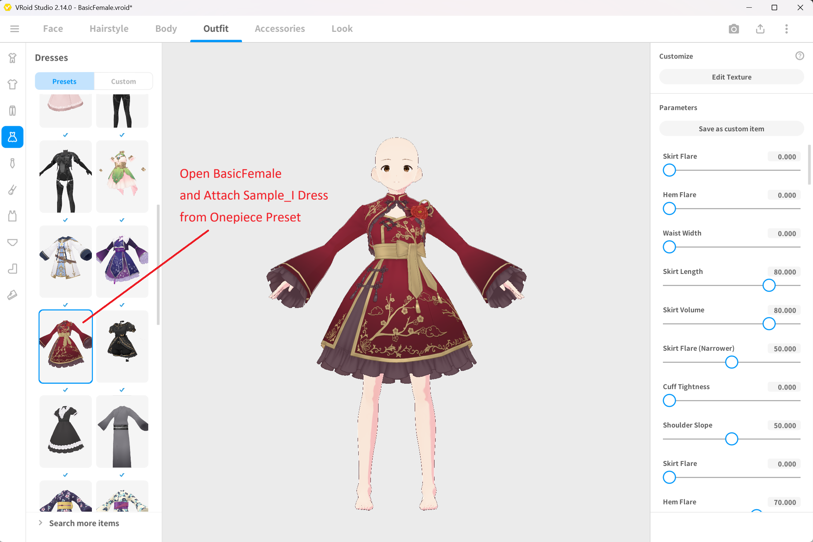
*▲Figure 4-9: Equipping dress from Dresses presets on BasicFemale.vroid*

4. Open **Export VRM**, confirm all polygon reduction options are OFF, and verify Export Info (Reference: Polygon count 32368 / Material count 14 / Bone count 159).
5. Enter format **VRM1.0**, avatar name **Dress1BasicFemale**, and export.
   * Destination: Assets/VRM/Dress1BasicFemale.vrm

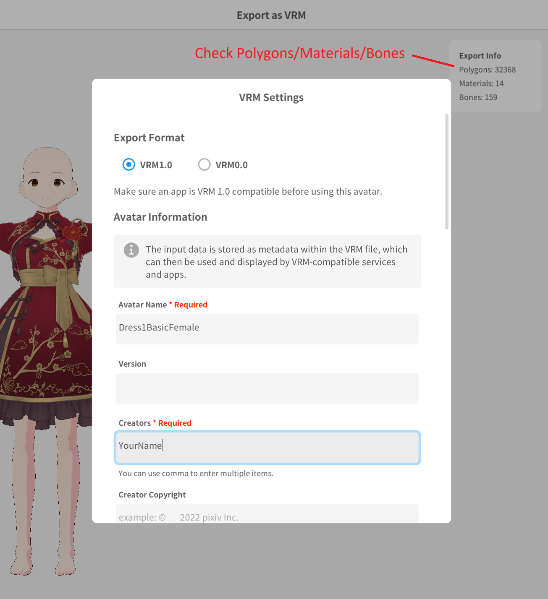
*▲Figure 4-10: Exporting with format VRM1.0 and avatar name Dress1BasicFemale*

---

### 3.2 Equipping Dress on SampleI and Exporting (Dress1SampleI.vrm)
1. Open **SampleI.vroid**.
2. Open **Outfits** tab > **Dresses** > **Presets** and select and equip the dress in the same way.

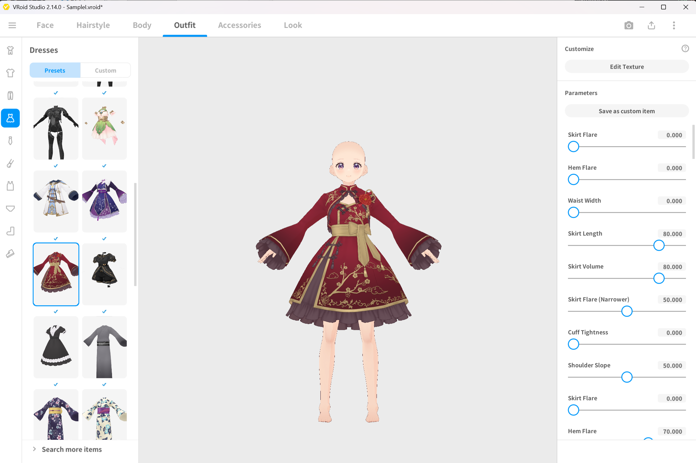
*▲Figure 4-11: Equipping dress from Dresses presets on SampleI.vroid*

3. Open **Export VRM**, confirm all polygon reduction options are OFF, and verify Export Info (Reference: Polygon count 32368 / Material count 14 / Bone count 159).
4. Enter format **VRM1.0**, avatar name **Dress1SampleI**, and export.
   * Destination: Assets/VRM/Dress1SampleI.vrm

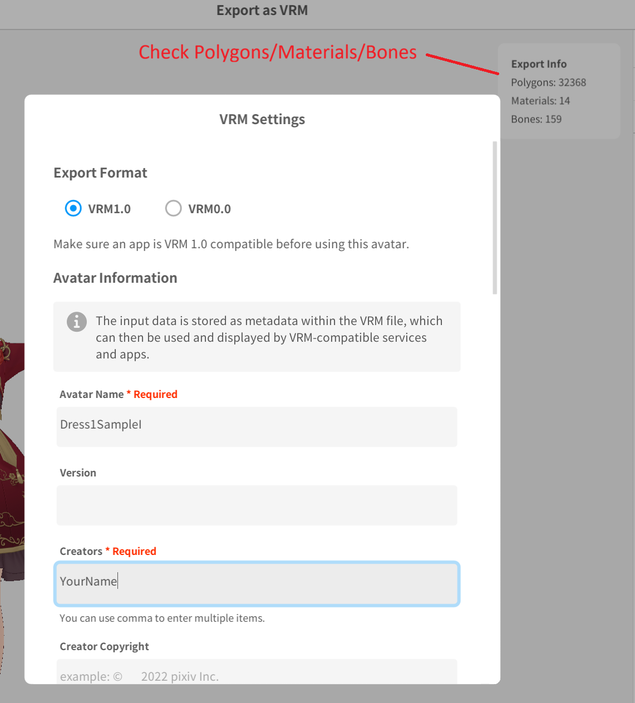
*▲Figure 4-12: Exporting with format VRM1.0 and avatar name Dress1SampleI*

---

## 4. Registering Outfits in ShapeSync Editor

Import the 4 exported VRMs into your Unity project and register them into the Database using ShapeSync Editor.

### 4.1 Registering Hairstyle Outfit (Hair1)
1. From the top menu in Unity Editor, open **Tools > zgock > ShapeSync > ShapeSync Editor**.
2. From the left TreeView, select **Outfits**.
3. Enter Hair1 in **Outfit Id** and Hair1 in **Outfit Name**, and click the **Create Mesh Outfit** button.

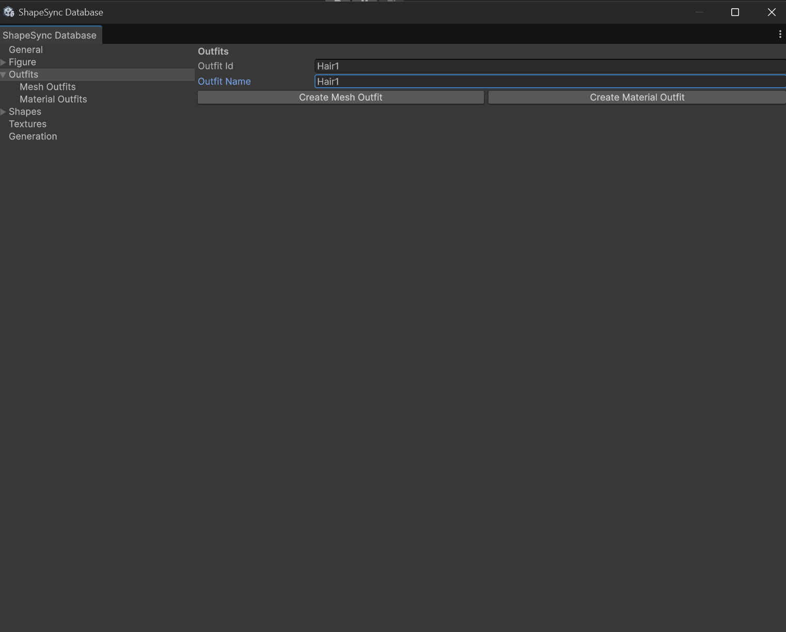
*▲Figure 4-13: Entering Outfit Id / Outfit Name and clicking Create Mesh Outfit in Outfits section*

4. In the created Hair1 basic settings screen, drag and drop Assets/VRM/Hair1BasicFemale.vrm from the Project window into **Outfit Prefab**, and click **Save to Database** at the bottom.

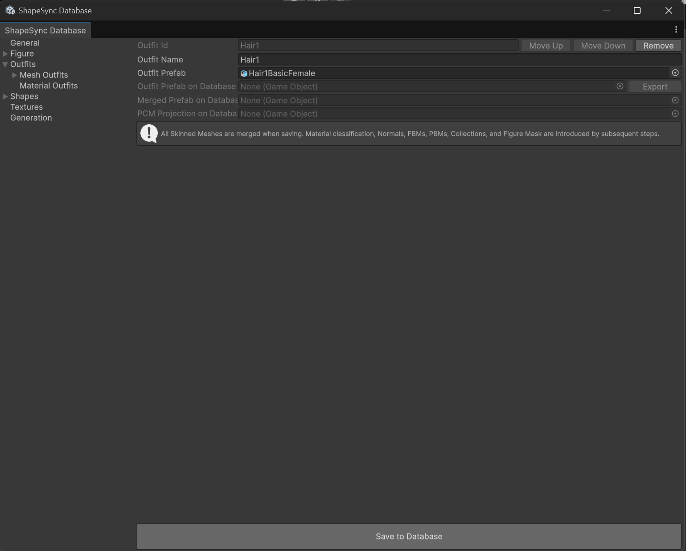
*▲Figure 4-14: Assigning Hair1BasicFemale to Outfit Prefab in Hair1 basic screen and saving*

5. Open **Hair1 > Materials** (Mesh Outfit Materials screen) in TreeView.
   * Set body materials (FaceMouth, EyeIris, Face_SKIN, EyeWhite, FaceBrow, FaceEyelash, FaceEyeline, Body_00_SKIN, etc.) to **Exclude**.

*▲Figure 4-15: Setting body-related materials to Exclude in Materials screen*

   * Set hairstyle materials (Hair1, Hair2) to **Include**, and click **Save to Database** at the bottom to commit and save.

*▲Figure 4-16: Setting hair materials (Hair1, Hair2) to Include and saving*

6. Open **Hair1 > FBMs** (Mesh Outfit FBMs screen) in TreeView.
   * In the **SampleI** row in the list, drag and drop Assets/VRM/Hair1SampleI.vrm from the Project window into the **FBM Prefab** field.
   * Click **Save to Database** at the bottom to commit and save.

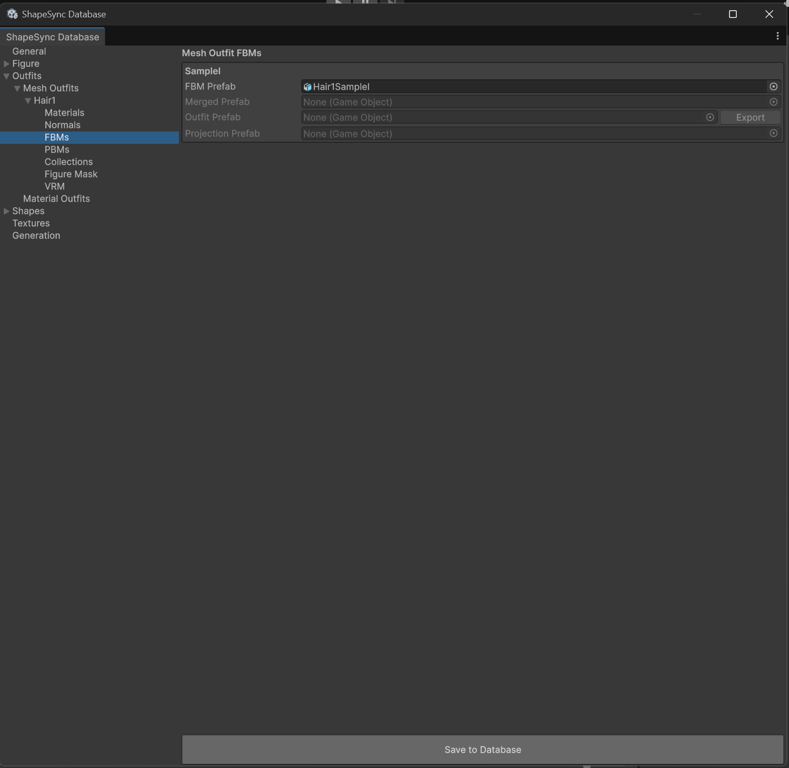
*▲Figure 4-17: Assigning Hair1SampleI to SampleI row in FBMs screen and saving*

---

### 4.2 Registering Outfit (Dress1)
1. Select **Outfits** again from TreeView.
2. Enter Dress1 in **Outfit Id** and Dress1 in **Outfit Name**, and click **Create Mesh Outfit**.
3. In the created Dress1 basic screen, assign Assets/VRM/Dress1BasicFemale.vrm to **Outfit Prefab**, and click **Save to Database** at the bottom.
4. Open **Dress1 > Materials** in TreeView.
   * Set the wearer body materials (Body_00_SKIN, etc.) to **Exclude**, and outfit materials (Cloth1 to Cloth5) to **Include**.
   * Click **Save to Database** at the bottom.
   > [!IMPORTANT]
   > If wearer body materials are not properly set to Exclude, the outfit mesh cannot be isolated and extracted. Always ensure body parts are set to Exclude.

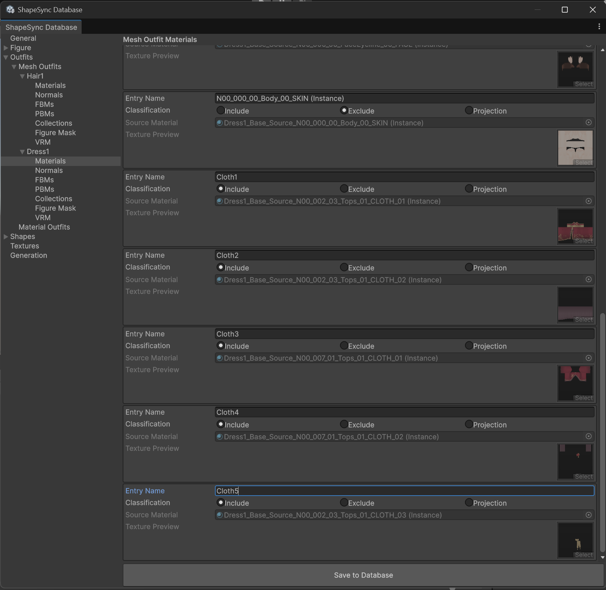
*▲Figure 4-18: Setting body to Exclude and outfit to Include in Dress1 Materials screen and saving*

5. Open **Dress1 > FBMs** in TreeView.
   * Assign Assets/VRM/Dress1SampleI.vrm to **FBM Prefab** in the **SampleI** row, and click **Save to Database** at the bottom.

*▲Figure 4-19: Assigning Dress1SampleI to SampleI row in Dress1 FBMs screen and saving*

---

## 5. Executing Generate and Outputting Outfit Assets

Generate the registered Outfit assets.

1. From the left TreeView in ShapeSync Editor, select the **Generation** section.
2. Keep each output folder setting (Registries, Bindings, Materials, Textures, Outfits) **as default without modification**.
3. Click the **Generate** button at the bottom.
4. In the "Generate ShapeSync Figure" save window, select the output root folder (e.g. Assets/ShapeSync/Generated) and execute generation.

*▲Figure 4-20: Executing Generate in Generation section and selecting output root*

5. Under the Outfits/ folder in the generation root, **Hair1.prefab** and **Dress1.prefab** (as well as auxiliary assets such as skinning and meshes) will be output.

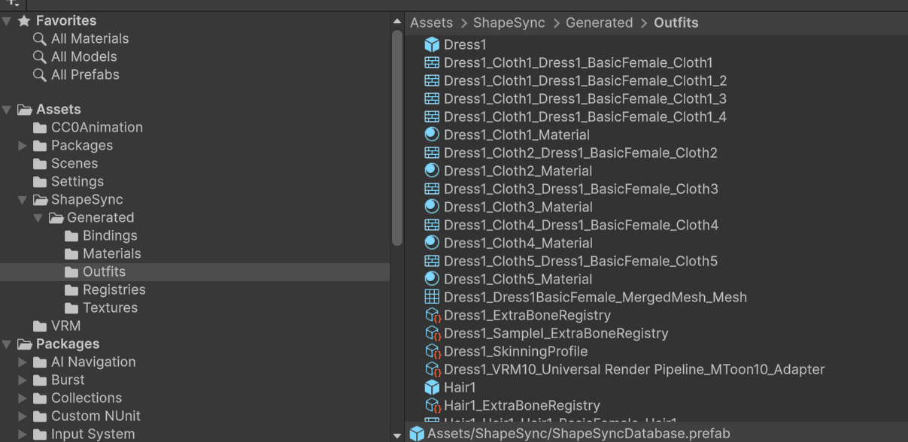
*▲Figure 4-21: Verifying Outfit Prefabs output to Outfits folder in Project window*

---

## 6. Scene Placement and Attach/Detach and Operation Check with OutfitAttacher

Attach the generated Outfit Prefabs to the Figure in the Scene, and verify real-time attaching/detaching and body shape deformation tracking.

### Attach/Detach and Operation Check Steps
1. Place the **Figure Prefab** generated in Chapter 3 in the Scene (or Hierarchy).
2. Confirm the **OutfitAttacher** component attached to the root GameObject of the Figure.
   * Outside Play Mode, `Enter Play Mode to attach an Outfit Prefab.` is displayed, and attach operations cannot be performed.
3. Press Unity's **Play button** to enter **Play Mode**.
4. In the Figure's Inspector, open the **Outfit Prefab Attach** section of OutfitAttacher.
5. Drag and drop Outfits/Hair1.prefab from the Project window into the **Drop Outfit Prefab Here** area.
   * The hairstyle is immediately attached to the Figure, and Hair1 is added to the **Attached Outfits** list.
6. Similarly, drag and drop Outfits/Dress1.prefab from the Project window into the **Drop Outfit Prefab Here** area.
   * The dress is attached to the Figure, and Dress1 is added to the Attached Outfits list.
7. Confirm that clicking the **Delete** button on each row in the Attached Outfits list removes the corresponding Outfit.

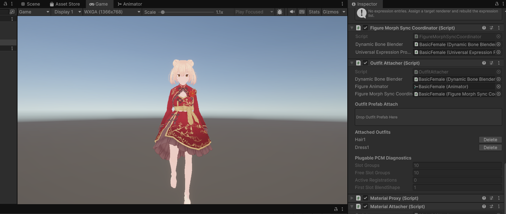
*▲Figure 4-22: Inspector and Game view with Hair1 / Dress1 attached to OutfitAttacher in Play Mode*

### Verifying Body Shape Deformation and Animation Tracking
1. Assign Walking.controller to the **Animator** in Figure's Inspector and play the walking animation.
2. While walking is playing, move the **weight** slider for SampleI in the **DynamicBoneBlender** component.
3. Confirm that **during walking animation, the attached hairstyle (Hair1) and outfit (Dress1) smoothly and perfectly follow the body shape deformation of the Figure without breaking**.

*▲Figure 4-23: Operating SampleI weight during walking playback to confirm outfit and hairstyle deform smoothly and track properly*

---

## 7. Common Issues and Solutions (Troubleshooting)

### Q1. Nothing happens when dropping onto Drop Outfit Prefab Here in OutfitAttacher
* **Cause**:
  You may not be in Play Mode, or you may be dropping the original .vrm file directly instead of the generated Prefab with ShapeSyncOutfit (Outfits/Hair1.prefab, etc.).
* **Solution**:
  Enter Play Mode (playback active in Unity), and drop the .prefab output to the Outfits/ folder by running Generation.

### Q2. Character body pokes through outfit or renders doubly when outfit is attached
* **Cause**:
  In Materials (Mesh Outfit Materials) during Outfit registration, wearer body materials may not have been set to Exclude.
* **Solution**:
  Open Outfits > [Target Outfit] > Materials in ShapeSync Editor, confirm all body materials other than the outfit are set to Exclude, press Save to Database, and execute Generate again from Generation.

---

[← Back to Tutorial Index](./index.html) ｜ [← Chapter 3: Figure Registration and Initial Operation Check](./figureregistration.html)