# Chapter 6: Advanced Figure Registration and Partial Body Deformation (PBM)

[← Back to Tutorial Index](./index.html) ｜ [← Chapter 5: Shape Registration and Shape Director Operation Check](./shaperegistration.html)

This chapter explains the procedure for registering **Partial Body Morph (PBM)**, which deforms only specific parts of the character (in this tutorial, chest BreastSize), and how to configure outfits (Dress) to follow partial body deformation of the base body.

* **First Half (VRoid Studio)**: Create Base and FBM .vroid data with modified chest sizes, and export 4 PBM VRMs in total for base body (Figure) and outfit-equipped model (Dress).
* **Second Half (Unity / ShapeSync)**: Register PBM (BreastSize) on the Figure side in ShapeSync Editor, configure PBM tracking on the Dress side, override and redefine the Morph Shape (morphSampleI), and verify synchronized operations using ShapeDirector.

---

## 1. Introduction (Concept of PBM: Partial Body Morph)

* **FBM (Full Body Morph)**: Overall body shape changes of the character (e.g. SampleI) covered in Chapters 2 to 4.
* **PBM (Partial Body Morph)**: Partial body deformations that independently deform specific parts of the character such as chest size, shoulder width, or leg length.
* **ShapeSync Core Feature**: PBM is a basic mesh deformation feature built natively into ShapeSync Core (it is not a VRM facial expression feature or an external extension package feature).

---

## 2. Creating .vroid Data for BreastSize (VRoid Studio)

First, use VRoid Studio to create .vroid data with modified chest sizes for the Base body and FBM body.

### 2.1 Creating Base PBM Data
1. Launch VRoid Studio and open the base body model **BasicFemale.vroid** created in Chapter 2.
2. Select the **Body** tab in the top menu, and set the **Chest Size** slider in the parameter list to **1.000** (maximum).

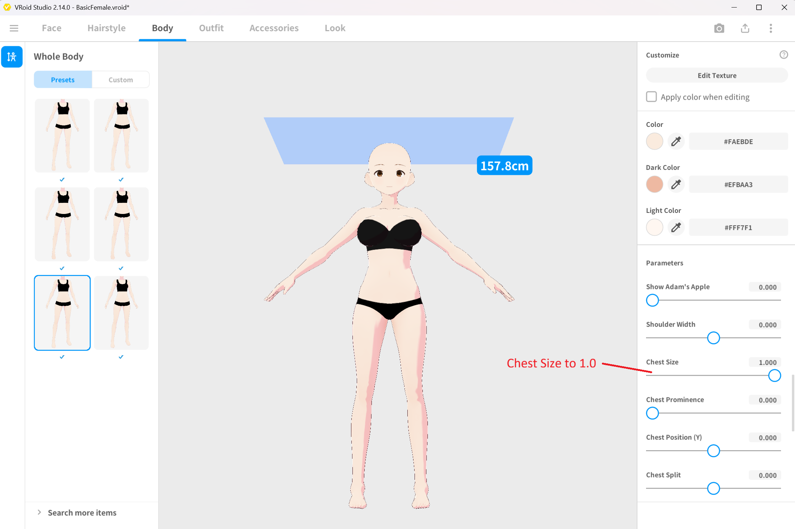
*▲Figure 6-1: Opening BasicFemale, going to Body > Chest Size, and setting to 1.0*

3. From the top left menu, select "Save As" and save the file with the name **BreastSizeBasicFemale.vroid**.

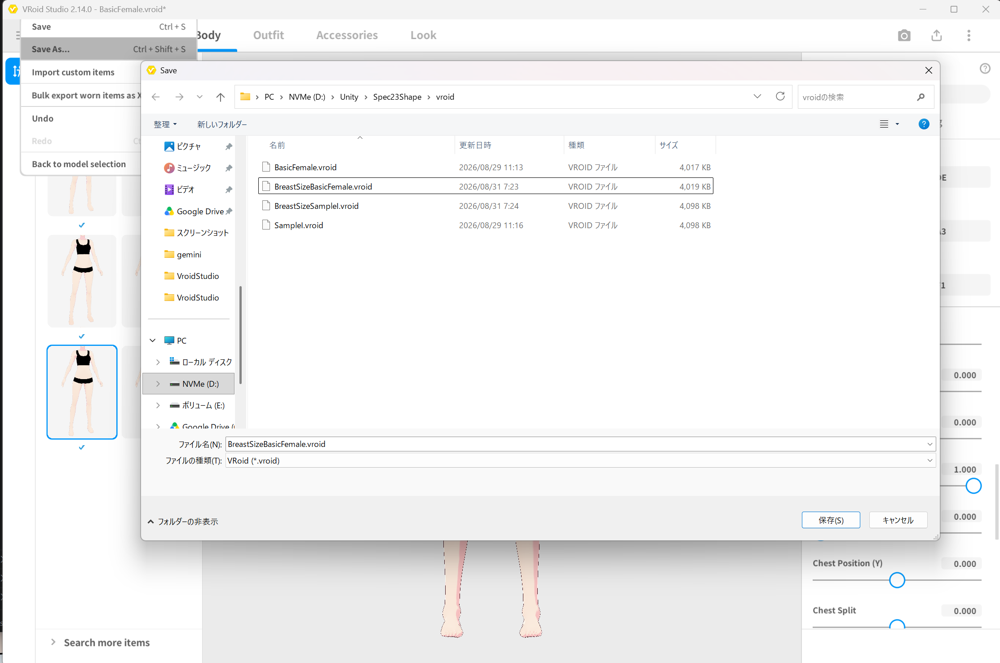
*▲Figure 6-2: Saving as BreastSizeBasicFemale.vroid using Save As*

### 2.2 Creating FBM PBM Data
1. Next, open the FBM base body model **SampleI.vroid** created in Chapter 2.
2. Select the **Body** tab, and similarly set the **Chest Size** slider to **1.000**.

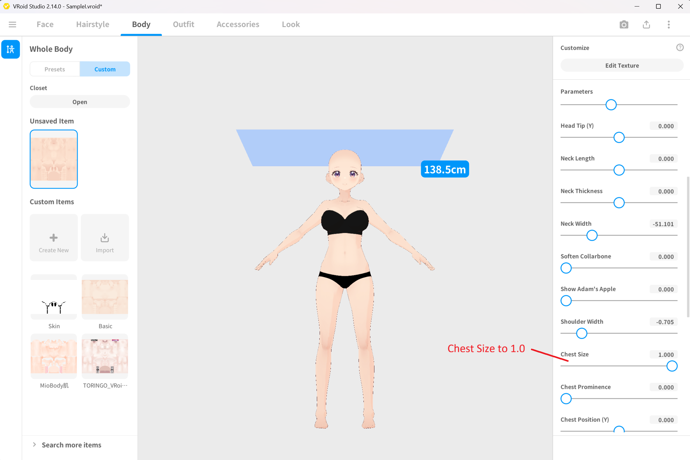
*▲Figure 6-3: Opening SampleI, going to Body > Chest Size, and setting to 1.0*

3. From the top left menu, select "Save As" and save the file with the name **BreastSizeSampleI.vroid**.

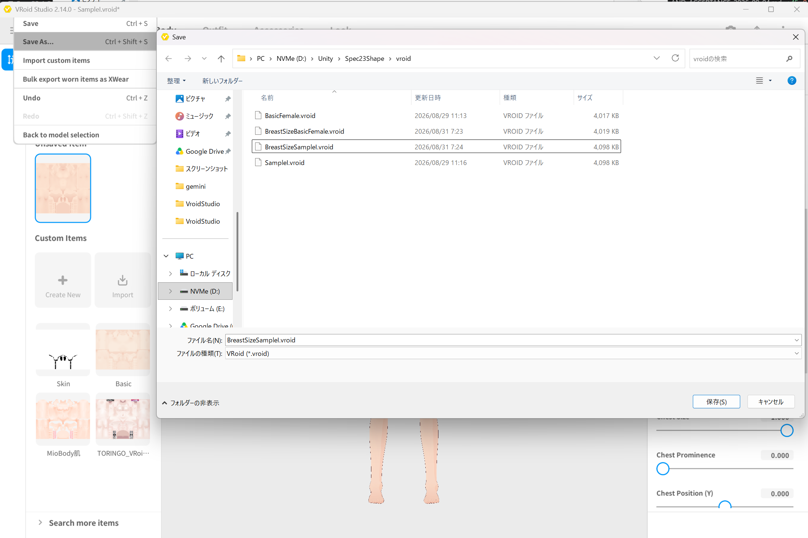
*▲Figure 6-4: Saving as BreastSizeSampleI.vroid using Save As*

---

## 3. Exporting PBM VRMs for Figure (VRoid Studio)

Export PBM VRMs for the base body (Figure) from the 2 created .vroid files.

### 3.1 Exporting BreastSizeBasicFemale.vrm
1. With BreastSizeBasicFemale.vroid open, select **Export VRM** from the export button in the top right.
2. Select **VRM1.0** and open the export screen without configuring reduction settings.
3. Confirm that the polygon count (**19214**), material count (**9**), and bone count (**59**) match the Base body model.

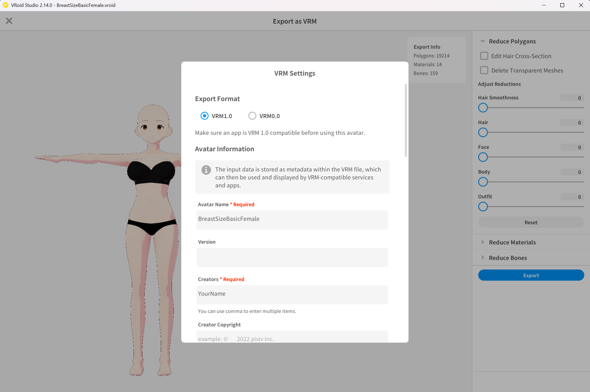
*▲Figure 6-5: Checking polygon count, material count, bone count, and exporting as BreastSizeBasicFemale.vrm*

4. Enter BreastSizeBasicFemale in Avatar Name, and export as **BreastSizeBasicFemale.vrm** into a folder within the Unity project.

### 3.2 Exporting BreastSizeSampleI.vrm
1. With BreastSizeSampleI.vroid open, similarly select **Export VRM**.
2. Select **VRM1.0** and verify polygon count (**19214**), material count (**9**), and bone count (**59**).

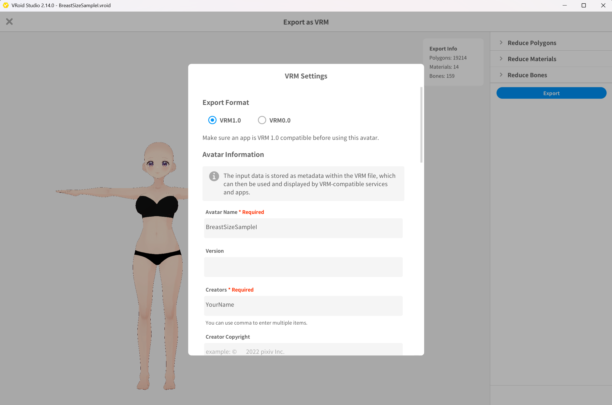
*▲Figure 6-6: Checking polygon count, material count, bone count, and exporting as BreastSizeSampleI.vrm*

3. Enter BreastSizeSampleI in Avatar Name, and export as **BreastSizeSampleI.vrm** into the Unity project.

---

## 4. Exporting PBM VRMs for Dress (VRoid Studio)

Next, export 2 PBM VRMs with the outfit (Dress) equipped.

### 4.1 Exporting Dress1BreastSizeBasicFemale.vrm
1. In VRoid Studio, open BreastSizeBasicFemale.vroid.
2. Select the **Outfits** tab and equip the preset dress (Dress) used in Chapter 4.

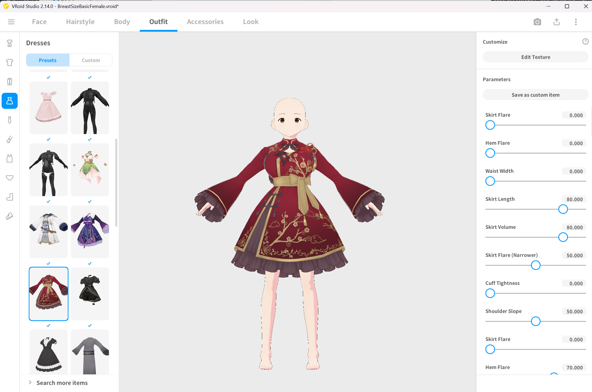
*▲Figure 6-7: Opening BreastSizeBasicFemale and equipping Dress*

3. From the export button in the top right, open export with **VRM1.0**.
4. Verify polygon count (**32368**), material count (**14**), and bone count (**159**).

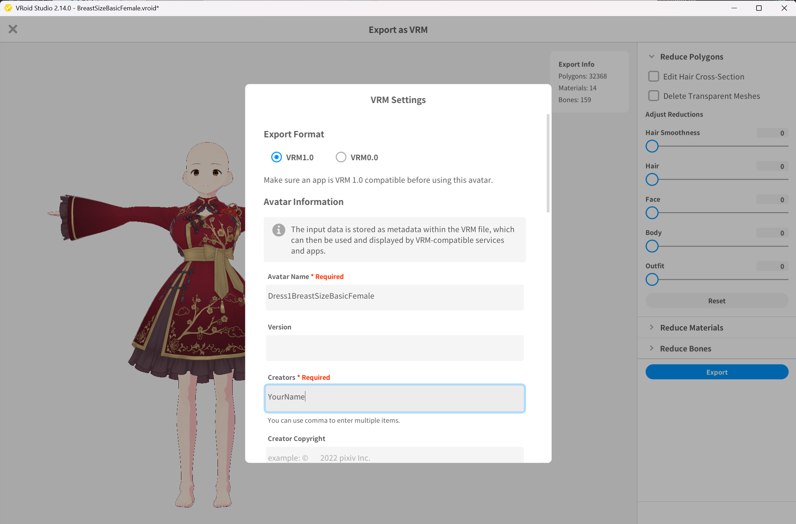
*▲Figure 6-8: Checking polygon count, material count, bone count, and exporting as Dress1BreastSizeBasicFemale.vrm*

5. Enter Dress1BreastSizeBasicFemale in Avatar Name, and export as **Dress1BreastSizeBasicFemale.vrm** into the Unity project.

### 4.2 Exporting Dress1BreastSizeSampleI.vrm
1. In VRoid Studio, open BreastSizeSampleI.vroid.
2. Select the **Outfits** tab and similarly equip the preset dress (Dress).

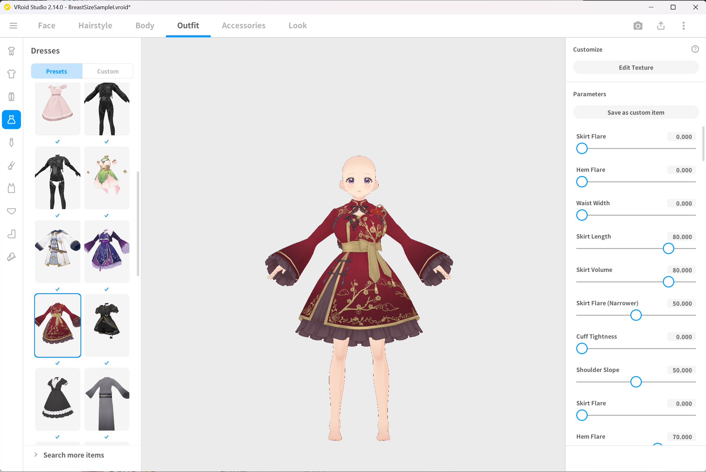
*▲Figure 6-9: Opening BreastSizeSampleI and equipping Dress*

3. From the export button in the top right, open export with **VRM1.0**.
4. Verify polygon count (**32368**), material count (**14**), and bone count (**159**).

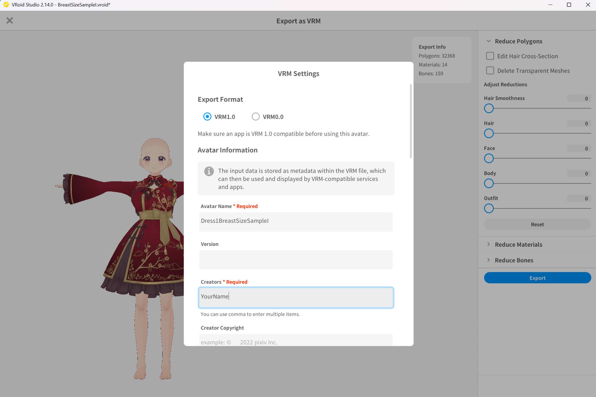
*▲Figure 6-10: Checking polygon count, material count, bone count, and exporting as Dress1BreastSizeSampleI.vrm*

5. Enter Dress1BreastSizeSampleI in Avatar Name, and export as **Dress1BreastSizeSampleI.vrm** into the Unity project.

---

## 5. Registering Figure PBM (BreastSize)

From here, the work is performed in the Unity Editor. First, register the PBM (BreastSize) on the Figure side.

1. From the top menu in Unity Editor, open **Tools > zgock > ShapeSync > ShapeSync Editor**.
2. Select **Figure > PBMs** from the left TreeView.
3. Click the **Add PBM Entry** button.
4. In the displayed "Register PBMs" section, enter **BreastSize** into **PBM Name**.
5. Figure axes are displayed in the **PBM Prefabs** list.
   * In the **BasicFemale** row (Base body), drag and drop **BreastSizeBasicFemale.vrm** from the Project window.
   * In the **SampleI** row (FBM axis), drag and drop **BreastSizeSampleI.vrm** from the Project window.
6. Click the **Save to Database** button at the very bottom of the screen to save (The Prefab on Database column on the right displays saved state and is not directly edited).

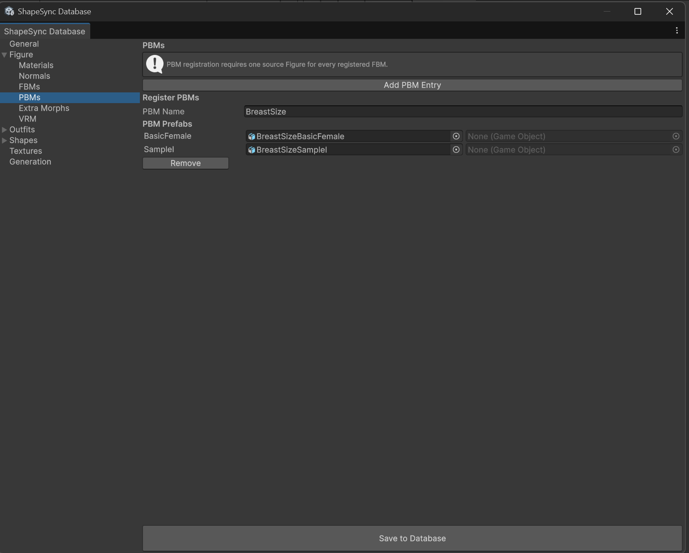
*▲Figure 6-11: Entering BreastSize for PBM Name in Figure > PBMs, assigning Base / FBM VRMs, and saving*

---

## 6. Registering PBM Tracking on Dress

After registering the Figure PBM, configure the outfit (Dress1) to follow that PBM.

> [!IMPORTANT]
> Always **register the Figure PBM first** before configuring outfit tracking. The outfit side selects tracking relationships based on the PBM axes registered to the Figure.

1. From the left TreeView in ShapeSync Editor, select **Outfits > Mesh Outfits > Dress1 > PBMs**.
2. In the displayed "Mesh Outfit PBMs" list, check **Follow BreastSize** to **enable** it.
3. Once enabled, VRM assignment rows will appear.
   * In the **Base Prefab** row, drag and drop **Dress1BreastSizeBasicFemale.vrm** from the Project window.
   * In the **SampleI Prefab** row, drag and drop **Dress1BreastSizeSampleI.vrm** from the Project window.
4. Click the **Save to Database** button at the very bottom of the screen to save.

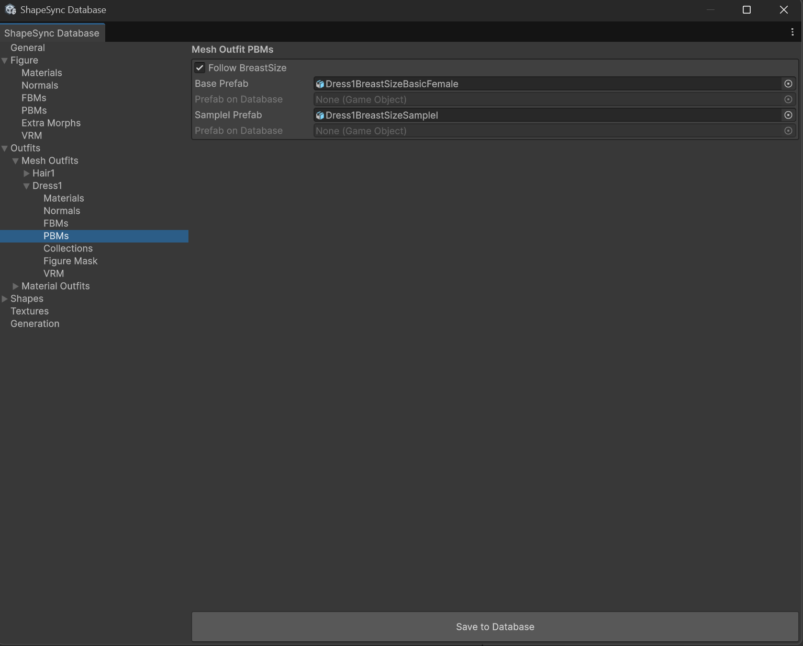
*▲Figure 6-12: Enabling Follow BreastSize in Outfits > Mesh Outfits > Dress1 > PBMs, assigning Base / FBM VRMs, and saving*

---

## 7. Overriding and Redefining Morph Shape (morphSampleI)

Add deformation weights for the newly added PBM (BreastSize) to the Morph Shape (morphSampleI) created in Chapter 5, and overwrite-save it.

1. From the left TreeView in ShapeSync Editor, select **Shapes > Morph Shapes > morphSampleI** (Do not create a new Shape Id).
2. Check the **Morphs** list on the details screen. SampleI and BreastSize are automatically displayed from the Figure axes.
   * **SampleI** weight: **1** (Maintain existing value)
   * **BreastSize** weight: Set to **0.8** (via slider or numeric input)
   > [!NOTE]
   > In the Shape configuration screen, it is displayed as the logical name **BreastSize** (the physical internal management name after generation becomes PBM_BreastSize).
3. Click the **Save to Database** button at the very bottom of the screen to overwrite-save the existing morphSampleI.

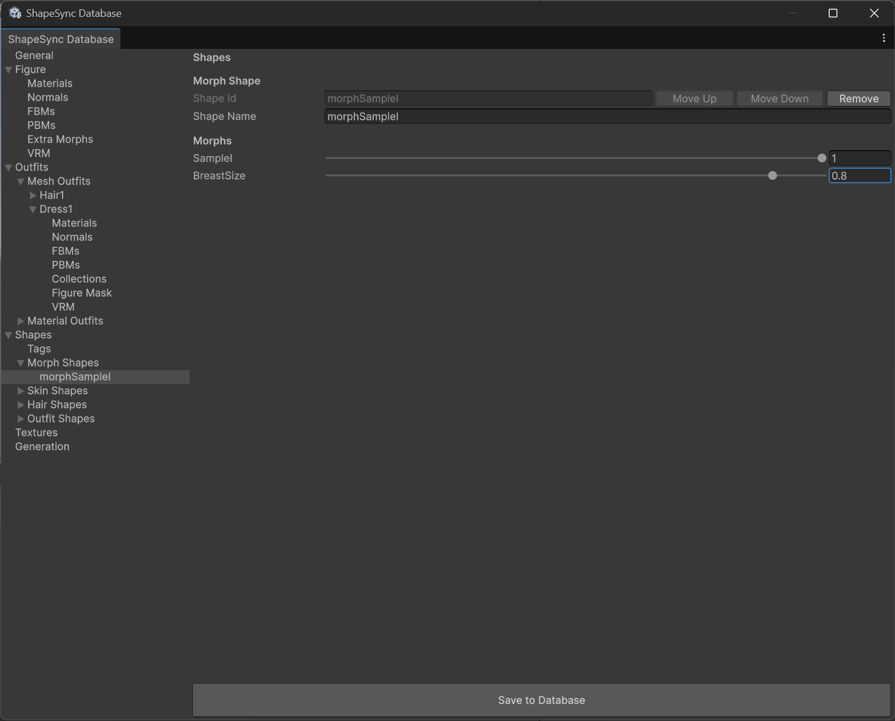
*▲Figure 6-13: Maintaining SampleI = 1 and setting BreastSize = 0.8 in Shapes > Morph Shapes > morphSampleI, then overwrite-saving*

---

## 8. Executing Re-Generate and Updating Shape Templates

Regenerate Shape Template assets from the updated Database.

1. Select the **Generation** section from the left TreeView in ShapeSync Editor.
2. Keep each output relative path at default values, and click the **Generate** button at the bottom of the screen.
3. In the "Generate ShapeSync Figure" dialog, select the output root folder (e.g. Assets/ShapeSync/Generated), click "Select Folder", and execute regeneration.
4. Shape Template assets directly under the output root (morphSampleI.asset, etc.) will be updated.

*▲Figure 6-14: Clicking Generate in Generation section, selecting output folder, and executing regeneration*

---

## 9. Scene Placement and PBM Operation Check with Shape Director

Verify on the Figure in the Scene that PBM (BreastSize) deformation applies synchronously to both Figure and Dress.

1. Select the Figure (BasicFemale) placed in the Scene.
   * Templates are already registered in the Template List of the **ShapeDirector** component from Chapter 5 (No manual re-registration is required).
2. Press Unity's **Play button** to enter **Play Mode**.
   * Because Auto Compile is ON by default, the latest Template is automatically synchronized initially upon entering Play Mode.
3. Expand **Morphs** under **morphSampleI** inside **Runtime Shapes (Authoritative)** of ShapeDirector.
4. Move the **BreastSize** (PBM_BreastSize) slider.
5. Confirm that **while the walking animation continues playing, the chest of the base body (Figure) and the chest of the outfit (Dress) expand and shrink in perfect synchronization, and the outfit does not lag behind or detach**.

*▲Figure 6-15: Operating BreastSize during walking animation playback in Play Mode to confirm Figure and Dress chests deform synchronously*

---

## 10. Common Issues and Solutions (Troubleshooting)

### Q1. Follow BreastSize is not displayed in Dress PBM configuration screen
* **Cause**:
  PBM (BreastSize) may not have been registered and saved on the Figure side.
* **Solution**:
  Open Figure > PBMs first, enter PBM Name: BreastSize, assign VRMs, and press Save to Database. After saving, Follow BreastSize will be displayed when you open Outfits > Mesh Outfits > Dress1 > PBMs.

### Q2. Chest does not deform or Dress does not follow when moving BreastSize in Play Mode
* **Cause**:
  Generate may not have been re-executed after overwrite-saving Morph Shape (morphSampleI), or topology (polygon/bone count) may have changed during VRM export.
* **Solution**:
  Confirm that you re-executed Generate in Generation of ShapeSync Editor. Also verify that polygon count, material count, and bone count of VRMs exported from VRoid Studio match the Base model exactly.

---

[← Back to Tutorial Index](./index.html) ｜ [← Chapter 5: Shape Registration and Shape Director Operation Check](./shaperegistration.html)