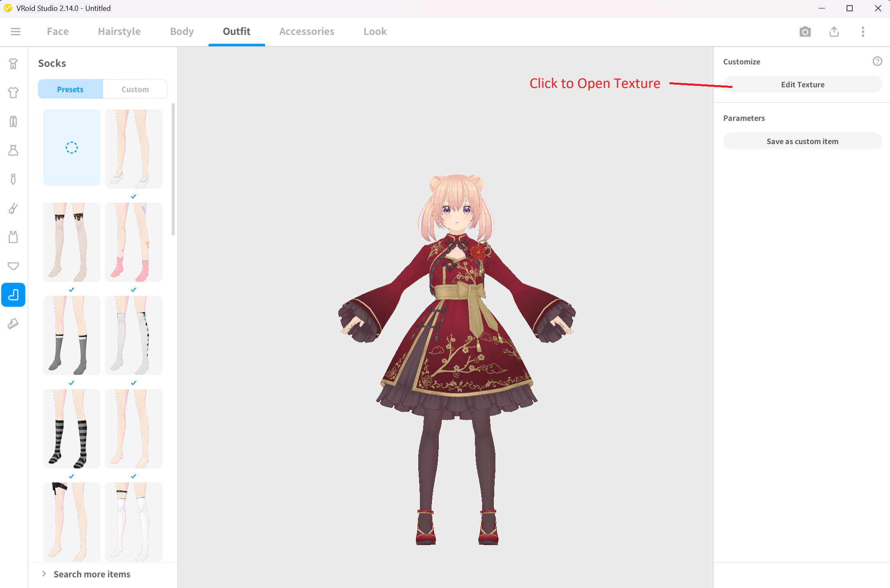
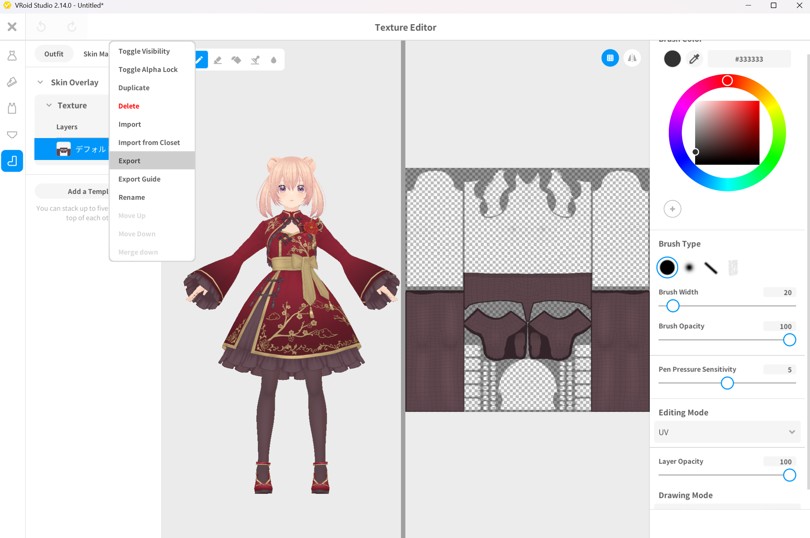
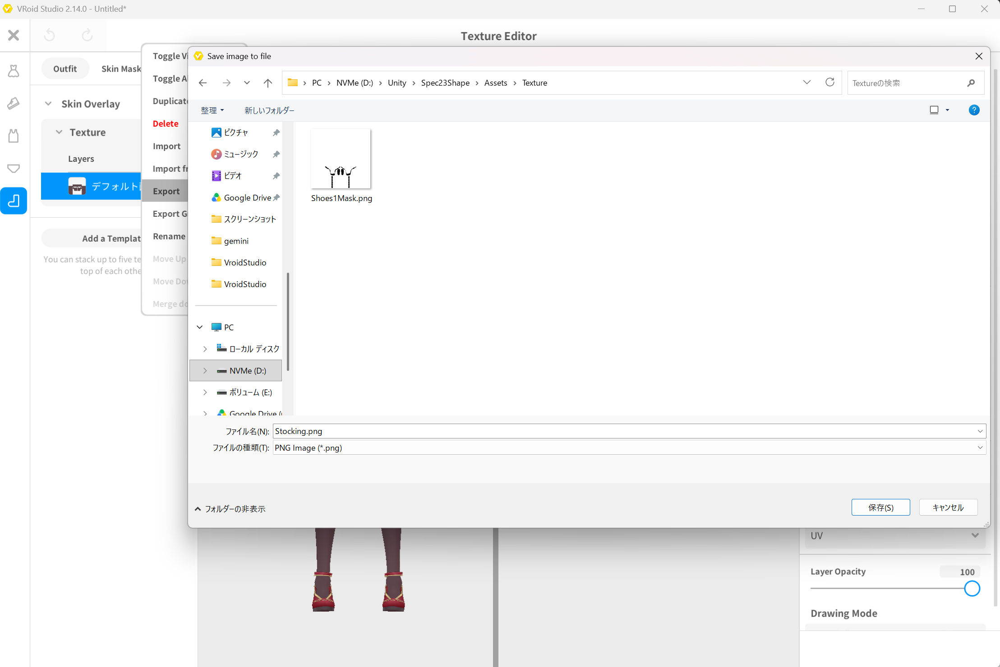
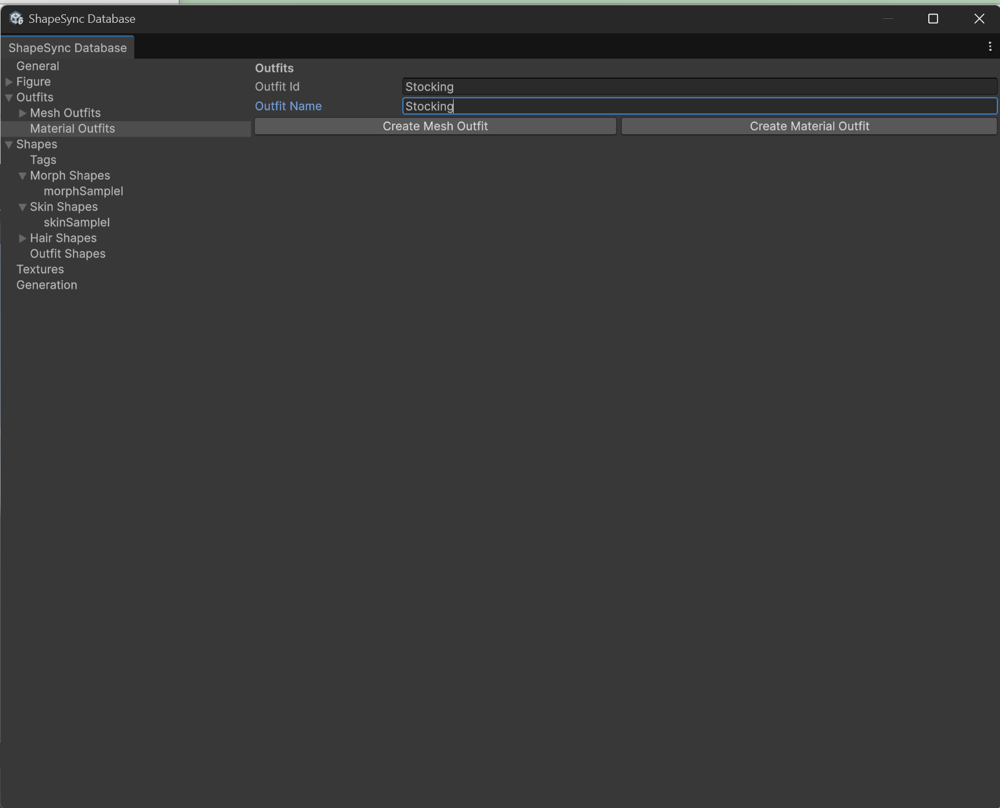
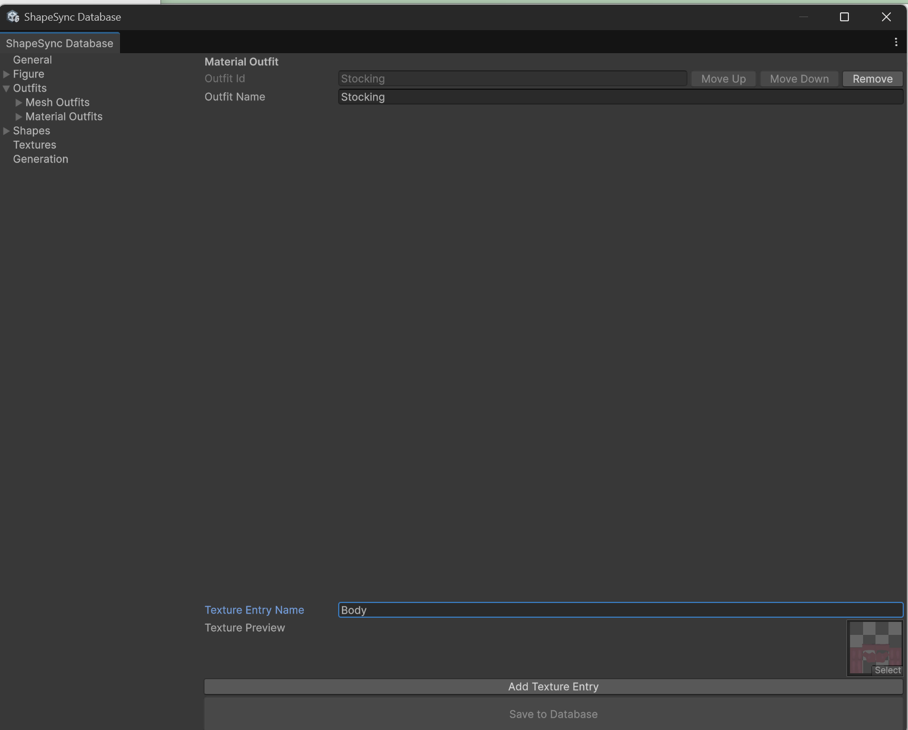
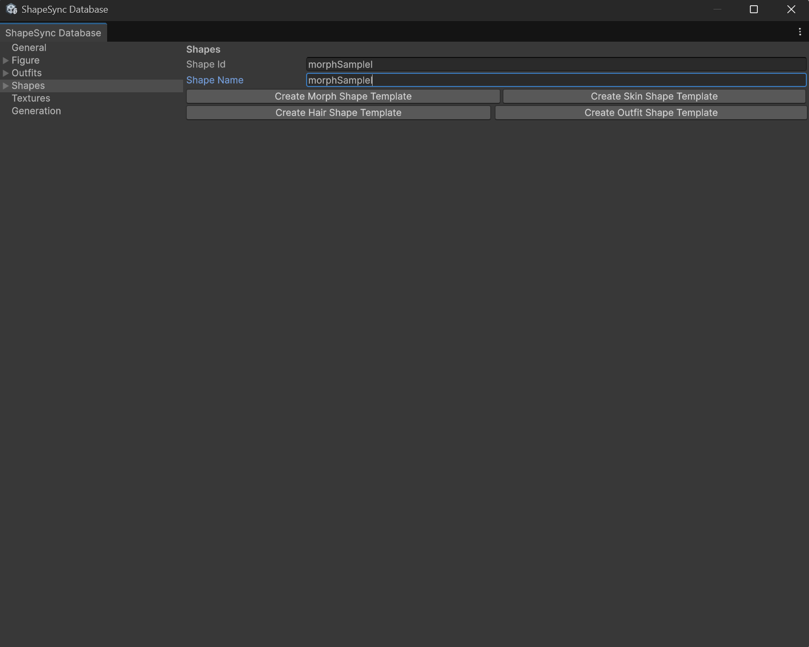
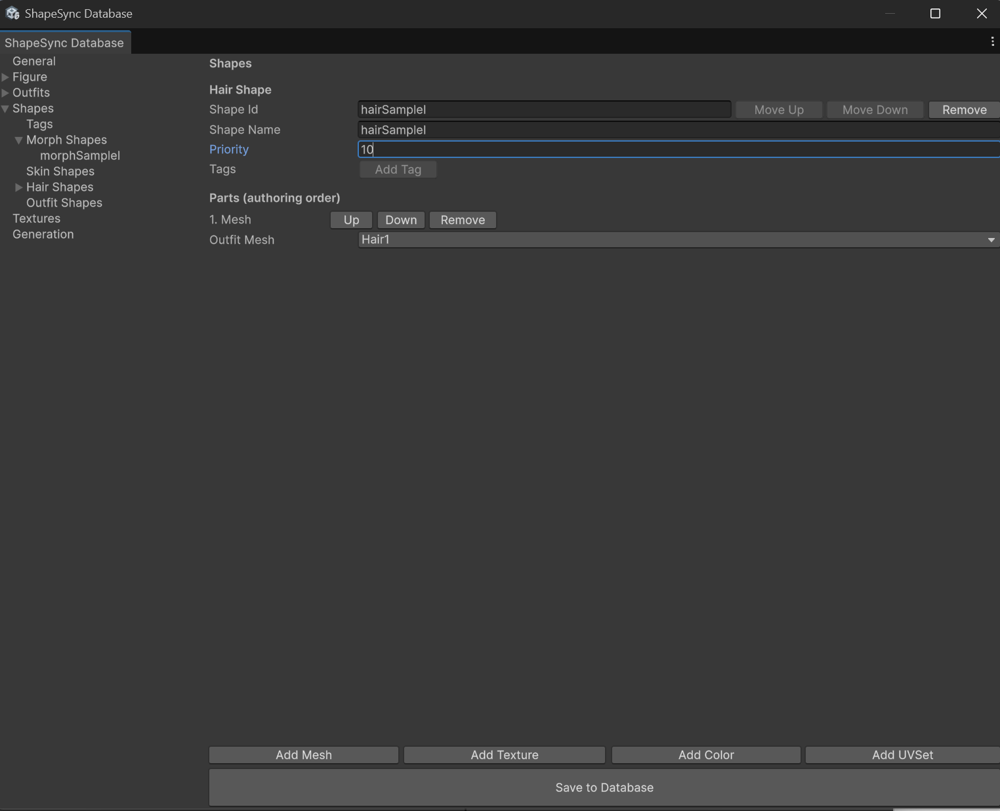
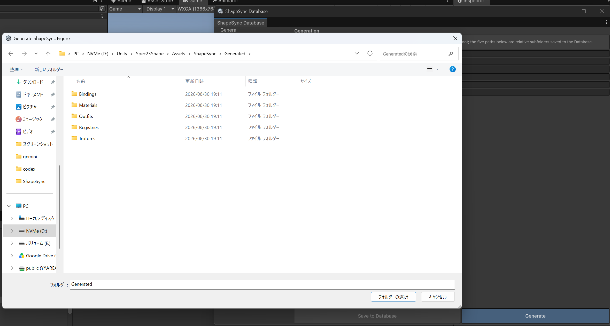

# Chapter 5: Shape Registration and Shape Director Operation Check

[← Back to Tutorial Index](./index.html) ｜ [← Chapter 4: Outfit Registration and Attach/Detach Operation Check](./outfitregistration.html)

This chapter explains the steps to register **various Shapes (Morph / Hair / Skin / Outfit)** into ShapeSync Editor to link and transform character body shape, outfit, hairstyle, and textures (appearance), and collectively control and verify operations on the Scene using **ShapeDirector**.

* **First Half (VRoid Studio)**: Export legwear stocking texture as PNG and import into Unity project.
* **Second Half (Unity / ShapeSync)**: Register stocking as a **Material Outfit**, create 4 types of Shapes (Morph / Hair / Skin / Outfit) to generate Shape Templates, and verify operations with ShapeDirector.

---

## 1. Introduction (Concepts of Various Shapes and Material Outfits)

* **Material Outfit**: A decorative asset without mesh that swaps material textures of existing body or outfits (stockings are used in this chapter).
* **Morph Shape**: A Shape that holds weights for body shape deformation (FBM).
* **Hair Shape**: A Shape that defines the application of hairstyle Mesh Outfits (Hair1).
* **Skin Shape**: A Shape that defines texture switching for character skin, face, etc. (Base ⇔ SampleI).
* **Outfit Shape**: A Shape that defines the combination of mesh outfits (Dress1) and material outfits (Stocking).
* **Shape Template**: Settings of each Shape defined in the Editor exported as assets usable at Runtime.
* **ShapeDirector**: A Unity component attached to the Figure that loads and collectively controls and synchronizes registered Shape Templates at Runtime.

---

## 2. Exporting Stocking Texture (VRoid Studio)

First, use VRoid Studio to export the stocking texture image from the model's legwear as a PNG.

### 2.1 Stocking Texture Export Steps
1. Launch VRoid Studio and open the preset model **AvatarSample_I**.
2. Select the **Outfits** tab in the top menu, select **Legwear** from the left menu, and click **Edit Texture**.

*▲Figure 5-1: Opening AvatarSample_I, going to Outfits > Legwear > Edit Texture*

3. Select the stocking image from the layer list, and select **Export** from the right-click menu or options.

*▲Figure 5-2: Exporting stocking texture image*

4. Specify a folder in the Unity project as destination (e.g. Assets/Textures/) and save it with the file name **Stocking.png**.

*▲Figure 5-3: Saving as Stocking.png in Unity project*

5. Return to Unity Editor, select Stocking.png in the Project window, and open the Inspector.
6. In the Inspector, check **Alpha is Transparency** to **ON**, and click the **Apply** button in the bottom right to apply.
7. Confirm in the preview at the bottom of Inspector that the image is transparent and properly treated as a transparent texture.

*▲Figure 5-4: Turning ON Alpha is Transparency in Unity Inspector, clicking Apply, and verifying transparency*

---

## 3. Registering Material Outfit (Stocking)

Register the exported stocking PNG into ShapeSync Editor as a **Material Outfit** for texture swapping.

1. From the top menu in Unity Editor, open **Tools > zgock > ShapeSync > ShapeSync Editor**.
2. Select **Outfits** from the left TreeView.
3. Enter Stocking in **Outfit Id** and Stocking in **Outfit Name**, and click the **Create Material Outfit** button.

*▲Figure 5-5: Entering Stocking for Outfit Id and Outfit Name in Outfits and clicking Create Material Outfit*

4. From TreeView, select the created **Outfits > Material Outfits > Stocking**.
5. In the new entry section, enter **Body** into **Texture Entry Name** as the texture name to handle within the Material Outfit (Do not specify Figure's Material Entry here).
6. In the **Texture Preview** field, drag and drop Stocking.png from the Project window, and click the **Add Texture Entry** button.

*▲Figure 5-6: Specifying Body for Texture Entry Name, Stocking.png for Texture Preview, and clicking Add Texture Entry*

7. Confirm that the texture name **Body** and the specified image are displayed in the list, and click **Save to Database** at the bottom to save.

*▲Figure 5-7: Confirming Body and image in list and saving with Save to Database*

> [!NOTE]
> A Material Outfit only registers texture names and images. There is no step to specify the Figure's Material Entry, no field to directly specify body materials, no Include / Exclude classification, and no blend settings. Because Texture Resources (such as Stocking_Body) are automatically generated upon saving, separate registration in the Textures section is also unnecessary.

---

## 4. Registering Morph Shape (morphSampleI)

Create a Morph Shape that controls body shape deformation (FBM).

1. Select **Shapes** from the left TreeView in ShapeSync Editor.
2. Enter **morphSampleI** in **Shape Id** and morphSampleI in **Shape Name**, and click the **Create Morph Shape Template** button.

*▲Figure 5-8: Entering morphSampleI for Shape Id and Shape Name in Shapes and clicking Create Morph Shape Template*

3. Open **Shapes > Morph Shapes > morphSampleI** in TreeView.
4. Registered FBM axes are displayed in the **Morphs** list on the details screen. Set the weight for the **SampleI** row to **1**.
5. Click **Save to Database** at the bottom to save.

*▲Figure 5-9: Setting SampleI weight to 1 and saving with Save to Database*

---

## 5. Registering Hair Shape (hairSampleI)

Create a Hair Shape that applies the hairstyle Outfit (Hair1).

1. Select **Shapes** from TreeView.
2. Enter **hairSampleI** in **Shape Id** and hairSampleI in **Shape Name**, and click the **Create Hair Shape Template** button.
3. Open **Shapes > Hair Shapes > hairSampleI** in TreeView.
4. In the **Parts (authoring order)** section, click the **Add Mesh** button.
5. In the added Mesh part, select **Hair1** from the **Outfit Mesh** dropdown.
6. Click **Save to Database** at the bottom to save.

*▲Figure 5-10: Specifying Hair1 for Outfit Mesh in Parts (authoring order) and saving with Save to Database*

---

## 6. Registering Skin Shape (skinSampleI)

Create a Skin Shape that applies skin and face textures from the body shape axis SampleI.

1. Select **Shapes** from TreeView.
2. Enter **skinSampleI** in **Shape Id** and skinSampleI in **Shape Name**, and click the **Create Skin Shape Template** button.
3. Open **Shapes > Skin Shapes > skinSampleI** in TreeView.
4. Click the **Add Texture** button **9 times** to create 9 Texture parts.
5. In each Texture part, configure **Target** (Owner: Figure, Proxy Entry) and **Texture** (Source: SampleI, Main Texture resource) according to the table below.

### Skin Shape Configuration Mapping Table (9 Main Textures)
| # | Target (Owner / Proxy Entry) | Texture (Source / Resource Name) |
| :--- | :--- | :--- |
| 1 | Figure / Mouth | SampleI / SampleI_Mouth |
| 2 | Figure / Iris | SampleI / SampleI_Iris |
| 3 | Figure / Highlight | SampleI / SampleI_Highlight |
| 4 | Figure / Face | SampleI / SampleI_Face |
| 5 | Figure / EyeWhite | SampleI / SampleI_EyeWhite |
| 6 | Figure / Brow | SampleI / SampleI_Brow |
| 7 | Figure / Eyelash | SampleI / SampleI_Eyelash |
| 8 | Figure / Eyeline | SampleI / SampleI_Eyeline |
| 9 | Figure / Body | SampleI / SampleI_Body |

> [!IMPORTANT]
> Targets are only the Main Texture of each material. Do not include auxiliary textures such as MatCaps starting with _2 (e.g. SampleI_Face_2 or SampleI_Body_2).

6. After configuring all 9 items, click **Save to Database** at the bottom to save.

*▲Figure 5-11: Mapping 9 Main Textures and saving with Save to Database*

---

## 7. Registering Outfit Shape (outfitSampleI)

Create an Outfit Shape that combines the mesh outfit (Dress1) and the material outfit (Stocking).

1. Select **Shapes** from TreeView.
2. Enter **outfitSampleI** in **Shape Id** and outfitSampleI in **Shape Name**, and click the **Create Outfit Shape Template** button.
3. Open **Shapes > Outfit Shapes > outfitSampleI** in TreeView.
4. Click the **Add Mesh** button and set **Outfit Mesh** to **Dress1**.
5. Click the **Add Texture** button to add a Texture part.
   * **Target**: Select Figure for Owner, and **Body** for Proxy Entry (This is where you specify the target Material Entry of the Figure for the first time).
   * **Texture**: Select **Stocking** for Owner, and select **Stocking_Body** generated from the Material Outfit Body entry for resource.
   > [!NOTE]
   > A Material Outfit is selected as the Texture Source (Owner), not the Target. Which part of the Figure to apply it to is determined by specifying Figure's Body in Target.
6. Click **Save to Database** at the bottom to save.

*▲Figure 5-12: Setting Dress1 and Stocking_Body and saving with Save to Database*

---

## 8. Executing Generate and Outputting Shape Templates

Generate Shape Template assets from the registered Shape settings.

1. Select the **Generation** section from the left TreeView in ShapeSync Editor.
2. Keep each output relative path (Registries/, Bindings/, Materials/, Textures/, Outfits/) **as default without modification**.
3. Click the **Generate** button at the bottom (Do not use Save to Database).
4. In the "Generate ShapeSync Figure" dialog, select the destination root folder (e.g. Assets/ShapeSync/Generated) and click "Select Folder".

*▲Figure 5-13: Clicking Generate and specifying Assets/ShapeSync/Generated for output destination*

5. After generation completes, verify that the following Shape Template assets and catalog file are output directly under the selected output root.
   * **morphSampleI.asset** (MorphShapeTemplate)
   * **skinSampleI.asset** (SkinShapeTemplate)
   * **hairSampleI.asset** (HairShapeTemplate)
   * **outfitSampleI.asset** (OutfitShapeTemplate)
   * **ShapeSyncShapeCatalog.txt**

*▲Figure 5-14: State where Shape Template assets and catalog are output directly under Assets/ShapeSync/Generated*

---

## 9. Scene Placement and Operation Check with Shape Director

Register the generated Shape Templates into the Figure's **ShapeDirector** and verify linked operations in Play Mode.

### 9.1 Registering Template List
1. Place the generated **Figure Prefab** (BasicFemale) into the Scene (or Hierarchy).
2. Inspect the **ShapeDirector** component on the root of the Figure.
3. Drag and drop the 4 generated Shape Template assets (morphSampleI.asset, skinSampleI.asset, hairSampleI.asset, outfitSampleI.asset) into the **Template List** to add them.

*▲Figure 5-15: Registering 4 Shape Templates into Template List in Figure ShapeDirector Inspector*

> [!NOTE]
> In Edit Mode before entering Play Mode, registering in Template List does not synchronize to Runtime Shapes, and the Sync Template List to Runtime Shapes button does not function. Synchronization to Runtime Shapes is executed automatically when Play Mode starts.

### 9.2 Operation Check in Play Mode
1. Assign Walking.controller to the **Animator** in the Figure's Inspector.
2. Press Unity's **Play button** to enter **Play Mode**.
   * Initial synchronization is performed automatically upon entering Play Mode, displaying each Shape under **Runtime Shapes (Authoritative)** in the Inspector and applying hair, outfit, skin, and stockings to the character in the Game view.
   * (If you edit the Template List during Play Mode, you can immediately apply changes by clicking `Sync Template List to Runtime Shapes`.)

*▲Figure 5-16: Entering Play Mode synchronizes to Runtime Shapes, applying hair, outfit, skin, and stockings*

3. While walking animation is playing, expand **morphSampleI** (SampleI) inside Runtime Shapes (Authoritative) of ShapeDirector, and move the **weight slider**.
4. Confirm that **while the walking animation continues, the character's body shape, hairstyle, outfit (dress and stockings), and skin texture smoothly transform in linked coordination**.

*▲Figure 5-17: Changing SampleI weight during walking animation playback to confirm body shape, outfit, hair, and skin transform in coordination*

---

## 10. Common Issues and Solutions (Troubleshooting)

### Q1. Not reflected in Runtime Shapes despite registering in Template List / Sync button does not function
* **Cause**:
  When not in Play Mode (in Edit Mode), synchronization to Runtime Shapes does not occur, and the Sync Template List to Runtime Shapes button does not function.
* **Solution**:
  Press Unity's **Play button** to enter **Play Mode**. Upon entering Play Mode, the contents of the Template List are automatically synchronized to Runtime Shapes (if you edit Template List during Play Mode, you can apply them with the Sync button).

### Q2. Stockings do not appear on body or blend glitchily with skin
* **Cause**:
  Alpha is Transparency may not be enabled in the Inspector of the imported Stocking.png, or Target / Texture mapping in the Outfit Shape may be incorrect.
* **Solution**:
  Select Stocking.png in the Project window, verify that Alpha is Transparency is ON in Inspector, and click Apply. Also, in ShapeSync Editor under Shapes > Outfit Shapes > outfitSampleI, verify that Target = Figure / Body and Texture = Stocking / Stocking_Body, and re-generate.

---

[← Back to Tutorial Index](./index.html) ｜ [← Chapter 4: Outfit Registration and Attach/Detach Operation Check](./outfitregistration.html)