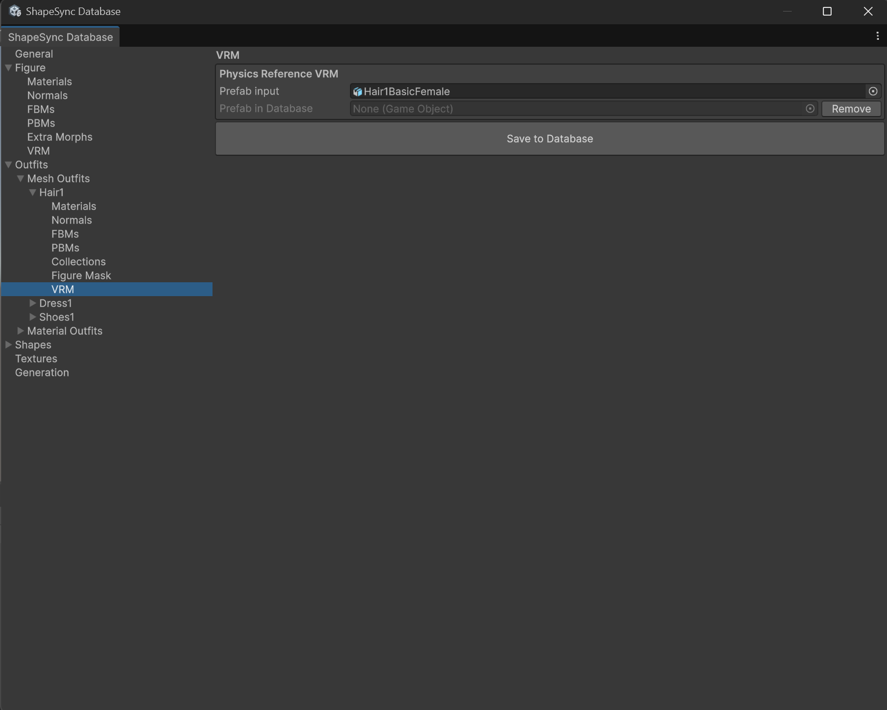

# Chapter 9: Advanced VRM Integration (Expression and Physics Configuration and Verification)

[← Back to Tutorial Index](./index.html) ｜ [← Chapter 8: Advanced Outfit Registration and Figure Mask (Hiding Base Mesh and Correcting Poke)](./figuremask.html)

This chapter explains the procedure for using ShapeSync Asset's **VRM Integration features** to configure **Expression (facial expressions)** and **Physics (secondary motion / SpringBone for hair and outfits)** for Figure and Outfits, and verifying their operation after Generate.

> [!NOTE]
> **About the Working Environment for This Chapter**:
> VRoid Studio operations are not performed in this chapter. All operations are carried out within the **Unity Editor** and **ShapeSync Editor**.

---

## 1. Introduction (Overview of VRM Integration and Prerequisites)

### 1.1 Verifying Prerequisites
To use VRM integration features, the following packages and scripting define symbol settings introduced in Chapter 1 installation procedures are required.
1. **VRM-Related Packages**:
   * `com.vrmc.gltf` (`0.131.1`)
   * `com.vrmc.vrm` (`0.131.1`)
   * **ShapeSync VRM Integration Companion**
2. **Scripting Define Symbols**:
   * **`SHAPESYNC_USE_UNIVRM`** must be added under Scripting Define Symbols in `Edit > Project Settings > Player > Other Settings`, and applied via `Apply`.

### 1.2 Skipping VRM Integration
* **When Not Using VRM Integration**:
  If avatar facial expressions in VRM format or SpringBone secondary motion integration are not required, you can proceed without adding UniVRM / Companion packages or define symbols, and **skip this chapter to proceed directly to Chapter 10 onwards** (Chapter 10 onwards can proceed without VRM integration).
* **Important Considerations When Enabling VRM Integration**:
  A Database in which VRM settings have been saved by executing this chapter must subsequently be handled in an environment where `SHAPESYNC_USE_UNIVRM` is enabled. Please decide whether to use VRM integration before saving settings to the Database.

---

## 2. Configuring Expression and Physics Reference for Figure

In ShapeSync Editor, configure reference VRMs for facial expressions and secondary motion on the Figure (base body) side.

1. From the top menu in Unity Editor, open **Tools > zgock > ShapeSync > ShapeSync Editor**.
2. Select **`Figure > VRM`** from the left TreeView.
3. Configure the **`Expression Reference VRM`** section.
   * In the **`BasicFemale`** row (Base) `Prefab input`, drag and drop **`BasicFemale.vrm`** from the Project window.
   * In the **`SampleI`** row (FBM) `Prefab input`, drag and drop **`SampleI.vrm`** from the Project window.
   > [!IMPORTANT]
   > For Expression Reference, make sure to specify all registered Base and FBM rows without omission (in this setup, the 2 rows `BasicFemale` and `SampleI`).
4. Configure the **`Physics Reference VRM`** section.
   * In `Prefab input`, drag and drop **`Hair1BasicFemale.vrm`** from the Project window.
   > [!NOTE]
   > The Physics Reference on the Figure side is arbitrary as long as it is a "VRM containing secondary motion (SpringBone)". There is no special restriction in selecting `Hair1BasicFemale.vrm` in this procedure, and specifying `Dress1BasicFemale.vrm` will operate identically.
5. Click the **`Save to Database`** button at the bottom of the screen to save.

*▲Figure 9-1: Configuring 2 Expression References and 1 Physics Reference in Figure > VRM, and saving with Save to Database*

---

## 3. Configuring Physics Reference for Outfits (Hair1 / Dress1)

Configure the outfit-specific secondary motion reference VRMs for the hairstyle (`Hair1`) and dress (`Dress1`) Outfits.

### 3.1 Physics Reference Configuration for `Hair1`
1. Select **`Outfits > Mesh Outfits > Hair1`** from the left TreeView, and open the **`VRM`** section in the details pane.
2. In `Prefab input` of **`Physics Reference VRM`**, drag and drop **`Hair1BasicFemale.vrm`** from the Project window.
3. Click the **`Save to Database`** button at the bottom of the screen to save.

*▲Figure 9-2: Specifying Hair1BasicFemale in Physics Reference VRM under Outfits > Mesh Outfits > Hair1 > VRM and saving*

### 3.2 Physics Reference Configuration for `Dress1`
1. Select **`Outfits > Mesh Outfits > Dress1`** from the left TreeView, and open the **`VRM`** section in the details pane.
2. In `Prefab input` of **`Physics Reference VRM`**, drag and drop **`Dress1BasicFemale.vrm`** from the Project window.
3. Click the **`Save to Database`** button at the bottom of the screen to save.

*▲Figure 9-3: Specifying Dress1BasicFemale in Physics Reference VRM under Outfits > Mesh Outfits > Dress1 > VRM and saving*

---

## 4. Executing Generate in Generation (Expression Bake / Physics Transfer)

To reflect the configured VRM integration settings, execute generation of Figure and Outfits.

1. Select the **`Generation`** section from the left TreeView in ShapeSync Editor.
2. Verify each output setting (Output Root: `Assets/ShapeSync/Generated`, VRM Relative Path default: `VRM/`).
3. Click the **`Generate`** button at the bottom of the screen, select the output folder, and execute generation.

*▲Figure 9-4: Clicking Generate in Generation section, selecting output root folder, and executing regeneration*

> [!NOTE]
> **About Automatic Post-Processing**:
> **Expression Bake** (creating VRM Expression data for generated Figure from shared Expressions of Base and all FBMs) and **Physics Transfer** (transferring SpringBone physics data to generated Prefabs of Figure and each Mesh Outfit) are batch-processed as automatic post-processing upon executing `Generate`. There is no need to click individual Bake buttons or open dedicated windows.

---

## 5. Verifying Facial Expressions (Expression) in Play Mode

After Generate is complete, verify independently in Play Mode whether facial expressions (Expression) operate correctly.

1. Select the generated Figure (`BasicFemale`) placed in the Scene.
2. Press Unity's **Play button** to enter **Play Mode**.
3. Select Figure in the Hierarchy, and check the **`UniversalExpressionProxy`** component in the Inspector.
4. From the **`Expressions`** list, enable the **`On`** checkbox for the facial BlendShape row you wish to check (e.g. **`VRM_happy`**).
5. Drag and move the **`Weight`** slider (`0.0` to `1.0`) for that row.
6. Observe the character's face in the Game view, and confirm that facial expressions (smile, eye and mouth movements) change in real time in response to slider operations.

*▲Figure 9-5: Enabling VRM_happy in UniversalExpressionProxy during Play Mode and confirming facial change to a smile via Weight slider*

---

## 6. Verifying Secondary Motion (Physics) in Play Mode

Next, verify independently whether secondary motion (Physics / SpringBone) for hair and outfits follows character movement.

1. Confirm that `Hair1` and `Dress1` are attached to Figure, and that **`Walking.controller`** is set in `Animator`.
2. Play the walking animation while remaining in Play Mode.
3. Enable Gizmos in the Scene view to display SpringBone colliders and physics gizmos.
4. In response to the character's walking motion, confirm that the **twintails and hair tips of `Hair1`** and the **skirt hem and cloth edges of `Dress1`** naturally sway with a slight delay relative to body movement, and that physics simulation is actively tracking character footsteps.

*▲Figure 9-6: Confirming that hair tips and dress hem naturally sway and follow along with SpringBone gizmos during walking animation playback in Play Mode*

---

## 7. Common Issues and Solutions (Troubleshooting)

### Q1. The `VRM` section does not appear in ShapeSync Editor, or an error occurs
* **Cause**:
  * UniVRM packages (`com.vrmc.gltf`, `com.vrmc.vrm`) or ShapeSync VRM Integration Companion may not be installed properly.
  * **`SHAPESYNC_USE_UNIVRM`** may not be set under Scripting Define Symbols in `Project Settings > Player > Other Settings`.
* **Solution**:
  Review the installation procedures in Chapter 1, install the necessary packages, and add and apply the `SHAPESYNC_USE_UNIVRM` symbol.

### Q2. Facial expressions do not change when operating `UniversalExpressionProxy` in Play Mode
* **Cause**:
  * You may not have clicked `Save to Database` after setting Expression Reference VRM in `Figure > VRM`, or you may not have re-executed `Generate` in `Generation` after configuration.
  * The `On` checkbox for the corresponding expression row in the `UniversalExpressionProxy` Inspector may not be enabled.
* **Solution**:
  Confirm that Base and FBM VRMs are properly saved in `Figure > VRM`, and re-execute `Generate`. In Play Mode, always check `On` before operating the `Weight` slider.

### Q3. Hair or dress secondary motion does not move during walking
* **Cause**:
  * After specifying and saving Physics Reference VRM in the `VRM` section of `Outfits > Mesh Outfits > Hair1` or `Dress1`, you may not have re-executed `Generate`.
* **Solution**:
  Confirm that Physics Reference VRM is saved in each Outfit's `VRM` section, and re-execute `Generate` in the `Generation` section.

---

[← Back to Tutorial Index](./index.html) ｜ [← Chapter 8: Advanced Outfit Registration and Figure Mask (Hiding Base Mesh and Correcting Poke)](./figuremask.html)
