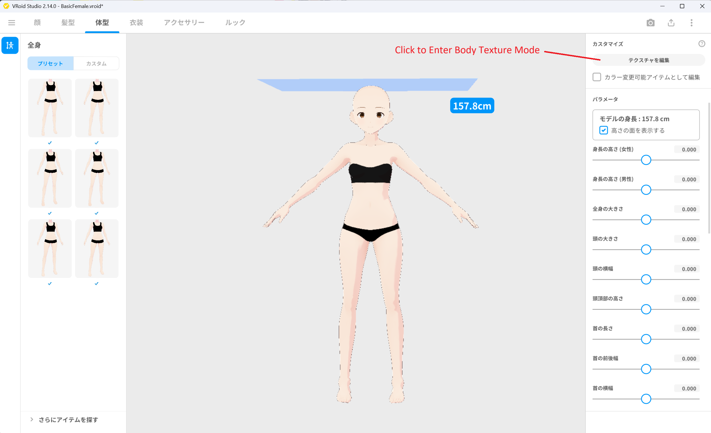
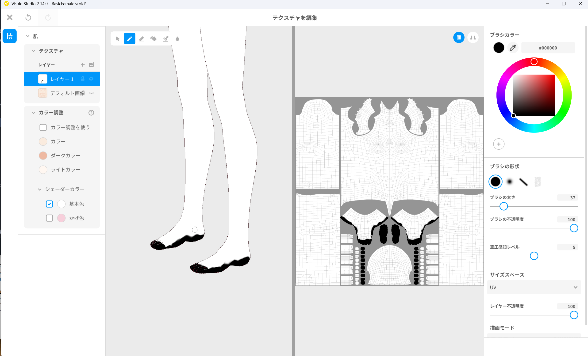
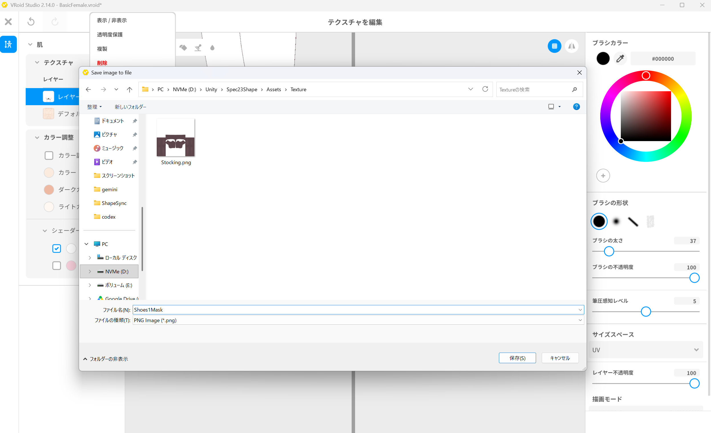
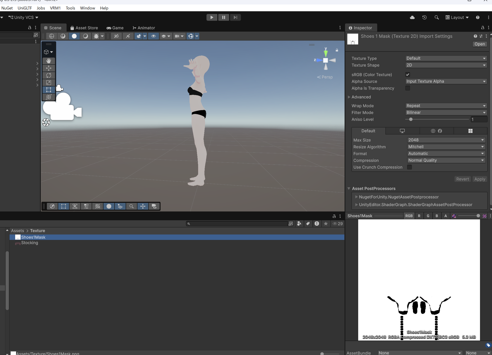
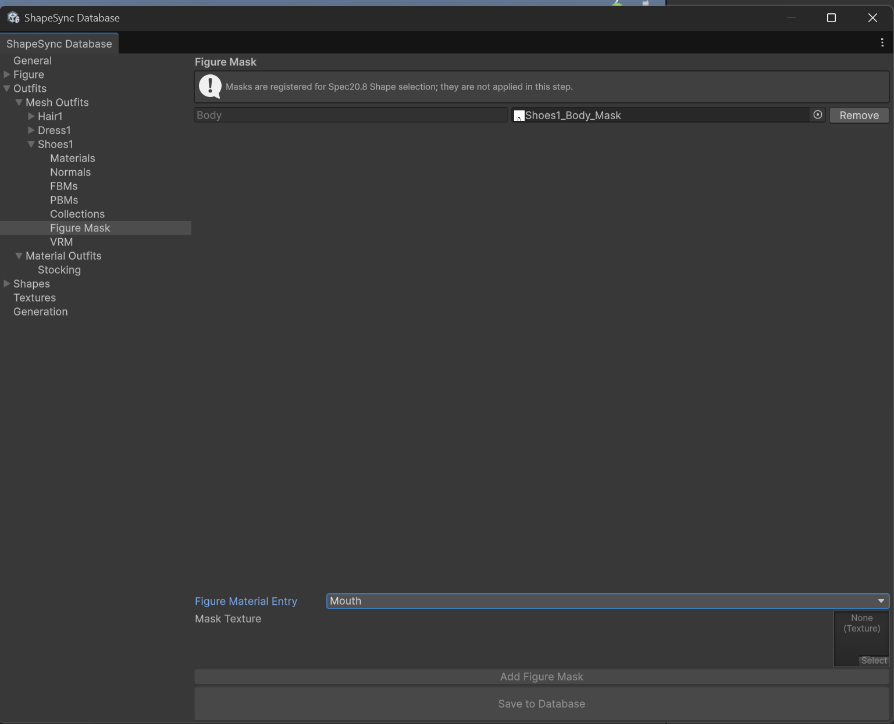
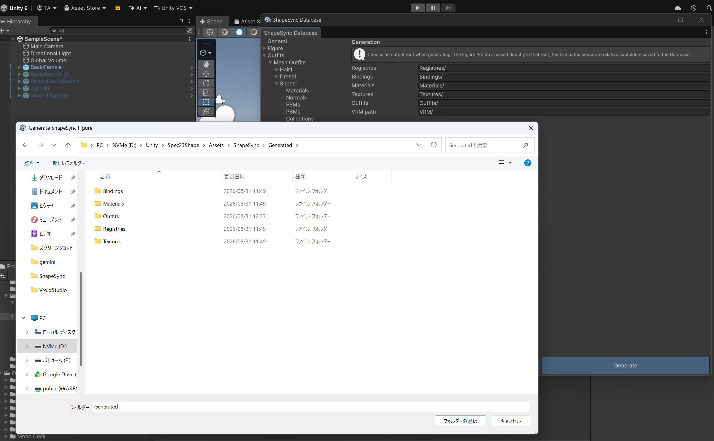
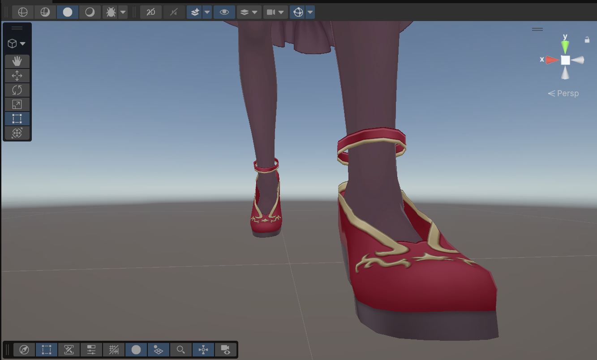

# 第8章: 高度な Outfit 登録と Figure Mask（衣装による素体メッシュの消去・Poke 補正）

[← チュートリアル目次へ戻る](./index.html) ｜ [← 第7章: 高度な Outfit 登録と Collection（靴の変形・位置補正）](./outfitcollection.html)

本章では、第7章の最後に確認した靴（`Shoes1`）のつま先や足裏に残る素体の突き抜け（**Poke**）を、衣装専用のマスク機能 **Figure Mask（フィギュアマスク）** を使って解消する手順を解説します。

* **前半（VRoid Studio）**: 3D Paint を使用して、靴に隠れるつま先と足裏に対応する範囲だけを黒く塗ったマスク画像（`Shoes1Mask.png`）を作成し、Unity プロジェクト内の `Assets/Texture/Shoes1Mask.png` に保存します。
* **後半（Unity / ShapeSync）**: ShapeSync Editor の `Shoes1 > Figure Mask` にて `Body` マテリアルに対してマスクテクスチャを登録・保存し、再 Generate 後の Play Mode で Poke が完全に解消されたこと（Before / After）を確認します。

---

## 1. はじめに（第7章の Poke 課題と Figure Mask の仕組み）

第7章では Collection 機能によって靴の位置や足首の角度を綺麗にフィットさせましたが、歩行アニメーション中に靴のつま先先端など一部に素体の肌がわずかに突き出る現象（Poke）が確認されました。

*▲図 8-1: 第7章の最後に確認された靴のつま先先端からの素体突き抜け（Before）*

### Figure Mask の仕組みと極性ルール
* **Figure Mask とは**: 衣装を着用した際に、衣服や靴に完全に隠れるべき素体側の肌メッシュをテクスチャマスクによって消去（透過）し、突き抜けを根本的に防止する機能です。
* **マスクの極性（白黒のルール）**:
  * **黒（#000000）**: Figure の `Body` から**隠れる（非表示になる）**部分
  * **白（#FFFFFF）**: Figure の `Body` に**表示され続ける**部分
* **黒く塗る範囲の目視基準**:
  * 靴から突き出しているつま先と足裏に対応する範囲だけを黒く塗ります。
  * 靴から露出する足首や脚など、他の身体部分まで黒く塗り広げないよう注意してください。

---

## 2. VRoid Studio の 3D Paint によるマスク作成と保存

VRoid Studio のテクスチャ編集画面でマスク画像を作成します。

### 2.1 テクスチャ編集画面を開く
1. VRoid Studio を起動し、素体モデル **`BasicFemale.vroid`** を開きます。
2. 上部メニューの **`体型`** タブを選択し、右側パネルの **`テクスチャを編集`** ボタンをクリックします。

*▲図 8-2: 体型タブ ＞ テクスチャを編集 をクリックしてテクスチャ編集へ入る*

### 2.2 マスクレイヤーの作成とペイント
1. 左側のカテゴリから **`肌`** を選択します。
2. レイヤーパネルで **新しいレイヤー**（`+` ボタン）を作成します。
3. ツールバーの **バケツツール（塗りつぶし）** を選択し、カラーを **白（#FFFFFF）** に設定して、レイヤー全体を白で塗りつぶします。
4. ツールバーの **ブラシツール** を選択し、ブラシ色を **黒（#000000）**、不透明度を **`100`**、ブラシの太さを適度なサイズ（例: **`37`**）に設定します。
5. 右側の **3D ビュー** 上で、靴に隠れる **つま先** および **足の裏** だけを目視しながら黒色でペイントします。

*▲図 8-3: 白で塗りつぶしたレイヤー上で、3D ビュー側から靴に隠れるつま先と足裏を黒（#000000）でペイント*

### 2.3 マスク画像のエクスポート
1. ペイントしたマスクレイヤーを右クリックし、コンテキストメニューから **`エクスポート`** を選択します。
2. 保存ダイアログで、Unity プロジェクト内の **`Assets/Texture/Shoes1Mask.png`** を指定し、PNG 形式で保存します。

*▲図 8-4: 作成したレイヤーを右クリックして「エクスポート」を選び、Assets/Texture/Shoes1Mask.png として保存*

### 2.4 Unity 上でのテクスチャ確認
1. Unity エディタに戻り、Project ウィンドウで **`Assets > Texture > Shoes1Mask`** を選択します。
2. Inspector の Preview で、白地に足先・足裏のみが黒く塗られたテクスチャ画像になっていることを確認します（Import Settings は `Texture Type: Default`, `Alpha Is Transparency: OFF` のままで問題ありません）。

*▲図 8-5: Unity の Project ウィンドウで Shoes1Mask テクスチャを選択し、白地に足先・足裏が黒く描かれた状態を確認*

---

## 3. ShapeSync Editor での Figure Mask 登録

作成したマスク画像を ShapeSync Editor に登録します。

1. Unity エディタの上部メニューから **Tools > zgock > ShapeSync > ShapeSync Editor** を開きます。
2. 左側 TreeView から **`Outfits > Mesh Outfits > Shoes1 > Figure Mask`** を選択します。
3. **`Figure Material Entry`** ドロップダウンで **`Body`** を選択します。
4. **`Mask Texture`** に、Project ウィンドウの **`Shoes1Mask.png`**（`Assets/Texture/`）をドラッグ＆ドロップして指定します。

*▲図 8-6-1: Figure Material Entry に Body を選択し、Mask Texture に Shoes1Mask.png を指定*

5. **`Add Figure Mask`** ボタンをクリックして登録行を追加します。
6. 画面下部の **`Save to Database`** ボタンをクリックして保存します。

*▲図 8-6-2: Add Figure Mask をクリックして Body - Shoes1_Body_Mask 行を追加し、Save to Database で保存*

> [!NOTE]
> **マテリアル行数についての注意**:
> 本チュートリアルのモデル構成では素体の肌が `Body` マテリアルに統合されているため 1 行の登録で足ります。ただし、手足や爪などが別マテリアルに分かれているモデルでは、隠したいマテリアルごとに Figure Mask 行を追加する必要があります。

> [!TIP]
> **Textures セクションへの登録について**:
> Figure Mask に指定したマスク画像は、`Shoes1` が所有する Texture Resource として自動登録されます。そのため、ShapeSync Editor の `Textures` セクションへ手動でマスク画像を登録する手順は不要です。

---

## 4. 再 Generate と Play Mode での Poke 解消確認（Before / After）

Figure Mask の設定を反映するために再生成を行い、Play Mode で動作を確認します。

1. ShapeSync Editor の左側 TreeView から **`Generation`** セクションを選択します。
2. 各出力設定は既存のまま、画面下部の **`Generate`** ボタンをクリックします。
3. フォルダー選択ダイアログが表示された場合は、既存の出力ルートフォルダー（`Assets/ShapeSync/Generated`）を選択して「フォルダーの選択」をクリックし、再生成を実行します。

*▲図 8-7: Generation セクションで Generate をクリックし、出力ルートフォルダー（Generated）を選択して再生成を実行*

4. Scene に配置されている Figure（`BasicFemale`）を選択します。
5. Figure の `ShapeDirector` の `Template List` には前章で登録済みの **`outfitShoes1.asset`** がそのまま設定されていることを確認します。
6. Unity の **Play ボタン** を押して **Play Mode** に入ります。
7. 歩行アニメーション再生中に足元を拡大して確認します。第7章で確認されたつま先の突き抜け（Poke）が完全に消去され、靴の中に足が綺麗に収まっていること（**After**）を確認します。

*▲図 8-8-1: Play Mode で歩行アニメーション再生中、つま先の Poke が完全に解消されて綺麗に靴に収まっている様子（After）*

*▲図 8-8-2: ドレス下部・足裏側からの確認。足裏からの突き抜けも綺麗に解消されている様子（After）*

---

## 5. よくあるトラブルと解決策（トラブルシューティング）

### Q1. Play Mode に入ってもつま先の突き抜け（Poke）が消えない
* **原因**:
  * `Shoes1 > Figure Mask` で `Add Figure Mask` を押した後に `Save to Database` による保存を行っていない可能性があります。
  * Figure Mask を設定した後に、ShapeSync Editor の `Generation` で `Generate`（再生成）を実行していない可能性があります。
* **解決策**:
  `Shoes1 > Figure Mask` で `Body` 行が保存されていることを確認し、必ず `Generation` セクションで `Generate` を再実行してください。

### Q2. 靴以外の足首や脚の部分まで消えて透明になってしまう
* **原因**:
  VRoid Studio で作成したマスク画像（`Shoes1Mask.png`）において、黒色（#000000）のペイント範囲が靴の境界を越えて足首や脚の上部まで塗り広げられている可能性があります。
* **解決策**:
  VRoid Studio でマスクレイヤーを開き、靴から露出する足首や脚の部分を白色（#FFFFFF）で塗り直して再度 `Assets/Texture/Shoes1Mask.png` へエクスポートし、ShapeSync Editor で `Generate` を再実行してください。

---

[← チュートリアル目次へ戻る](./index.html) ｜ [← 第7章: 高度な Outfit 登録と Collection（靴の変形・位置補正）](./outfitcollection.html)
