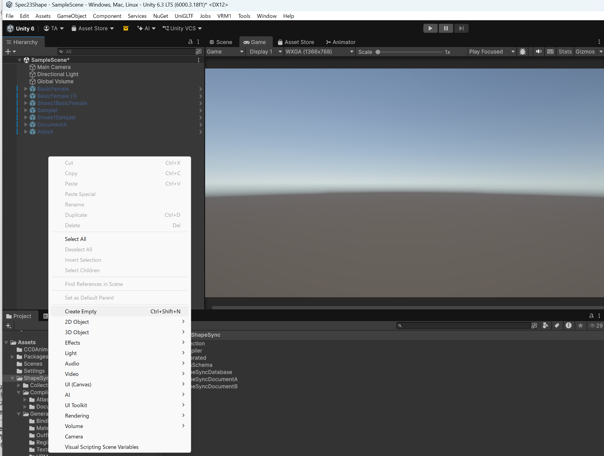

# 第13章: Hot Bake（実行時 Humanoid 生成と複数キャラクターの同時歩行）

[← チュートリアル目次へ戻る](./index.html) ｜ [← 第12章: Atlas（テクスチャ・マテリアルの統合による VRAM 削減と Humanoid 再生成）](./atlas.html)

本章は ShapeSync Asset チュートリアル（Spec 23）の **最終章** です。
第11章の **Humanoid Compiler** では Unity エディタ上で事前にアセットファイル（`.prefab`, `.asset`）として Humanoid をビルドしましたが、本章で解説する **Hot Bake** は、ゲーム実行時（Runtime）にメモリ上で動的に Humanoid を組み立てて生成する機能です。

Scene 上に別の ShapeSync Figure を直接置く必要はありません。**空の GameObject に `Animator` と `HotBake Figure` コンポーネントを追加し、Figure / Document（および必要な Atlas Schema）を指定するだけ** で、実行時に子階層へ完全な Humanoid モデルが自動生成されます。

* **本章の作業環境**: VRoid Studio の操作は行いません。すべての作業は **Unity エディタ** 内で行います。
* **使用するアセット**:
  * **Figure Prefab**: `Assets/ShapeSync/Generated/BasicFemale.prefab`（第3章で生成）
  * **Document A**: `Assets/ShapeSync/ShapeSyncDocumentA.asset`（第10章で保存: Tops + Skirt 姿）
  * **Document B**: `Assets/ShapeSync/ShapeSyncDocumentB.asset`（第10章で保存: Dress 姿）
  * **Atlas Schema**: `Assets/ShapeSync/AtlasSchema.asset`（第12章で作成）
  * **Animation Controller**: `Assets/CC0Animation/Walking.controller`（第3章で導入）

---

## 1. 1体目の作成（HotBakeFigureA: Document A + Atlas）

まずは、Document A（セパレート衣装）と第12章の Atlas Schema を適用した 1 体目の実行時生成オブジェクトを作成します。

### 1.1 Empty GameObject の作成と配置
1. Hierarchy ウィンドウの余白を右クリックし、**`Create Empty`** を選択して空の GameObject を作成します。
2. 名前を **`HotBakeFigureA`** に変更します。
3. Inspector で Transform の **`Position`** が **`(0, 0, 0)`**（X: 0, Y: 0, Z: 0）になっていることを確認します。

*▲図 13-1-1: Hierarchy ウィンドウの右クリックメニューから「Create Empty」を選択して空の GameObject を作成する操作*

*▲図 13-1-2: 作成した空の GameObject（HotBakeFigureA）と Position (0, 0, 0) の初期状態*

### 1.2 コンポーネントの追加
1. `HotBakeFigureA` の Inspector で **`Add Component`** ボタンをクリックします。
2. 検索欄に **`anim`** と入力し、表示された **`Animator`** をクリックして追加します。
3. 再度 **`Add Component`** をクリックし、検索欄に **`Hotbak`**（または `hotbake`）と入力して **`Hot Bake Figure`**（`zgock.ShapeSync.StackMachine.Humanoid`）をクリックして追加します。
   > [!NOTE]
   > **Animator との依存関係**:
   > `HotBake Figure` は、自身または親階層に Unity 標準の `Animator` コンポーネントが存在することを前提として動作します。

*▲図 13-2-1: Add Component の検索欄で「anim」と入力して Animator コンポーネントを追加する操作*

*▲図 13-2-2: Add Component の検索欄で「Hotbak」と入力して Hot Bake Figure コンポーネントを追加する操作*

*▲図 13-3: HotBakeFigureA に Animator および Hot Bake Figure コンポーネントが追加された直後の Inspector 初期状態*

### 1.3 1体目のプロパティ設定
`HotBakeFigureA` の **`Hot Bake Figure`** コンポーネントに、以下の項目を設定します。

| 設定項目 | 設定値 | 備考 |
| :--- | :--- | :--- |
| **`Figure Prefab`** | **`BasicFemale.prefab`** | `Assets/ShapeSync/Generated/BasicFemale.prefab` を指定 |
| **`Document`** | **`ShapeSyncDocumentA.asset`** | `Assets/ShapeSync/ShapeSyncDocumentA.asset` を指定 |
| **`Atlas`** | **`AtlasSchema.asset`** | `Assets/ShapeSync/AtlasSchema.asset` を指定 |
| **`Require Atlas`** | **ON**（チェックを入れる） | Atlas Schema を必須として適用 |
| **`Physics Transport`** | **ON**（チェックを入れる） | ※VRM 連携環境でのみ表示されます |
| **`Spawn Targets`** | 空のまま（0） | 実行時に自動管理されます |

### 1.4 Animator への Controller 設定
1. `HotBakeFigureA` の **`Animator`** コンポーネントの **`Controller`** 欄に、**`Assets/CC0Animation/Walking.controller`** をドラッグ＆ドロップして指定します。

*▲図 13-4: HotBakeFigureA の各プロパティ（Controller: Walking, Figure: BasicFemale, Document: ShapeSyncDocumentA, Atlas: AtlasSchema, Require Atlas: ON, Physics Transport: ON）を設定した状態*

---

## 2. 1体目の動作確認（Play Mode での単独歩行）

### 2.1 Play Mode の開始
1. Unity エディタ上部の **Play ボタン（▶）** をクリックして Play Mode を開始します。
2. **実行時生成と歩行の確認**:
   * ゲーム実行と同時に、`HotBakeFigureA` の子階層へ `BasicFemale(Clone)(Clone)` や `TextureStackMachineHost(Clone)` が動的に生成されます。
   * `Animator` の `Avatar` に生成された Avatar が自動的に割り当てられます。
   * `Hot Bake Figure` の `Spawn Targets` が自動的に `1` となり、生成完了が示されます。
   * Game ビューにて、Document A（セパレート衣装: Tops1 + Skirt1 + Shoes1）を着用したモデルが滑らかに歩行（Walking）し、揺れ物（VRM Physics）も連動して動作することを確認します。

*▲図 13-5: Play Mode 中に HotBakeFigureA の子階層へ Humanoid が動的生成され、セパレート衣装で歩行アニメーションが再生されている状態*

### 2.2 Play Mode の停止
1. 動作確認ができたら、再度 **Play ボタン（▶）** をクリックして Play Mode を停止します。

---

## 3. 2体目の作成（HotBakeFigureB: Document B・Atlas なし）

次に、1体目を複製して、異なる服装（Document B: ワンピースドレス）および Atlas なし（個別テクスチャ）で動作する 2 体目を作成します。

### 3.1 GameObject の複製と配置
1. Hierarchy ウィンドウで **`HotBakeFigureA`** を右クリックし、**`Duplicate`**（または `Ctrl + D`）を選択して複製します。
2. 複製された GameObject の名前を **`HotBakeFigureB`** に変更します。
3. Inspector で Transform の **`Position`** の **`X`** を **`1`**（座標 `(1, 0, 0)`）に設定します（1体目の右側に並べます）。

*▲図 13-6-1: Hierarchy ウィンドウで HotBakeFigureA を右クリックして「Duplicate」を実行する操作*

*▲図 13-6-2: 複製した GameObject を HotBakeFigureB と命名し Position を (1, 0, 0) に設定した状態*

### 3.2 2体目のプロパティ変更
`HotBakeFigureB` の設定を変更します。`Animator` の Controller（`Walking`）、`Figure Prefab`、および `Physics Transport: ON` は複製によりそのまま保持されています。

| 設定項目 | 設定値 | 変更内容 |
| :--- | :--- | :--- |
| **`Figure Prefab`** | **`BasicFemale.prefab`** | 保持されていることを確認（または再指定） |
| **`Document`** | **`ShapeSyncDocumentB.asset`** | **Document B（Dress 姿）に変更** |
| **`Atlas`** | **`None`（空欄）** | **Atlas の割り当てを解除** |
| **`Require Atlas`** | **OFF**（チェックを外す） | **Atlas 必須を解除** |
| **`Physics Transport`** | **ON** | 1体目と同様に ON を維持（VRM 連携環境） |

*▲図 13-7: HotBakeFigureB のプロパティ設定（Document: ShapeSyncDocumentB, Atlas: None, Require Atlas: OFF, Physics Transport: ON）*

---

## 4. 2体同時歩行の確認（最終動作検証）

### 4.1 Play Mode の開始
1. Unity エディタ上部の **Play ボタン（▶）** をクリックして Play Mode を開始します。

### 4.2 2体の同時生成と歩行確認
1. **外見の違いと同時歩行の確認**:
   * **右側（`HotBakeFigureA`: 座標 `(0,0,0)`）**: Document A のセパレート衣装（Tops1 + Skirt1）を着用し、Atlas が適用されたモデルが歩行します。
   * **左側（`HotBakeFigureB`: 座標 `(1,0,0)`）**: Document B のワンピースドレス（Dress1）を着用し、Atlas なしで生成されたモデルが歩行します。
2. 異なる Document（服装）と Atlas 設定を持つ 2 体のキャラクターが、同じ Scene 内で同時に破綻なく動的生成され、並んで歩行（Walking）し、それぞれの揺れ物 Physics も正常に連動動作することを確認します。

*▲図 13-8: Play Mode 中に服装の異なる 2体の Humanoid（左: 赤い Dress1, 右: Tops1+Skirt1）が同時に動的生成され並んで歩行している最終画面*

### 4.3 うまく生成されない場合の確認（トラブルシューティング）
* **Unity Console の確認**:
  もし Play Mode を開始してもモデルが生成されない、あるいは意図した表示にならない場合は、Unity の **Console ウィンドウ** を確認してください。
  * `Figure Prefab` や `Document` が `None`（未割り当て）になっていないか確認してください。
  * `Require Atlas: ON` にもかかわらず `Atlas` 欄が `None` になっていないか確認してください（Atlas を使わない場合は `Require Atlas: OFF` にする必要があります）。
  * 自身または親階層に `Animator` コンポーネントが正しく追加されているか確認してください。

---

## 5. おわりに（チュートリアル完走のまとめ）

お疲れ様でした！ これで ShapeSync Asset チュートリアル（全13章）はすべて完了です。

本チュートリアルを通じて、以下の ShapeSync の全ワークフローを習得しました：

1. **基本セットアップ**: インストールと VRoid Studio からの同一トポロジ VRM 準備（第1章〜第2章）
2. **Figure 登録と FBM 軸**: 素体登録と体型モーフィング制御（第3章）
3. **Outfit 登録と追従**: 衣装の登録と体型追従（第4章〜第5章）
4. **高度な衣装制御**: 局所変形（PBM）、靴の姿勢補正（Collection）、突き抜け防止（Figure Mask）（第6章〜第8章）
5. **VRM 連携**: 表情（Expression）と揺れ物（SpringBone Physics）の自動統合（第9章）
6. **Document 管理**: 衣装組み合わせ・体型のプリセット保存と読み込み（第10章）
7. **Humanoid Compiler**: Editor ビルドによるスタンドアロン Pure Humanoid 生成（第11章）
8. **Atlas 最適化**: テクスチャアトラス統合による VRAM / Draw Call 削減（第12章）
9. **Hot Bake**: ゲーム実行時（Runtime）の動的 Humanoid 生成とマルチキャラクター制御（第13章）

ShapeSync を活用することで、VRoid モデルの豊かな表現力を保ったまま、Unity 上で自由自在な衣装カスタマイズ、体型変更、および高効率なキャラクター描画を実現できます。

---

[← チュートリアル目次へ戻る](./index.html) ｜ [← 第12章: Atlas（テクスチャ・マテリアルの統合による VRAM 削減と Humanoid 再生成）](./atlas.html)
