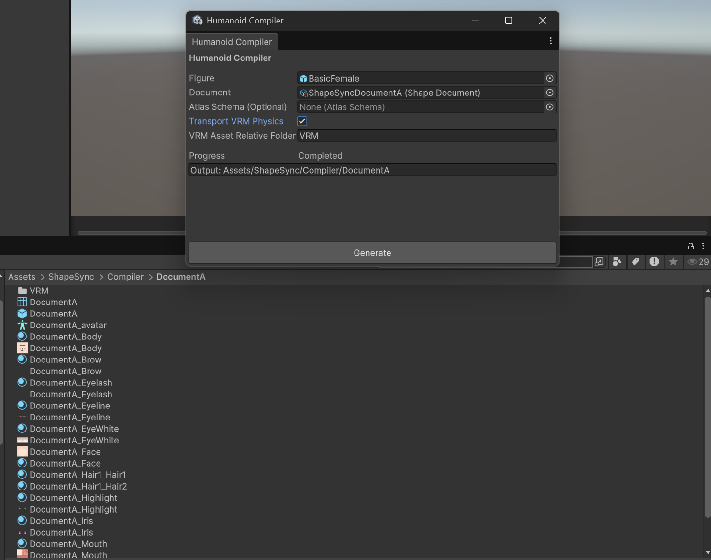
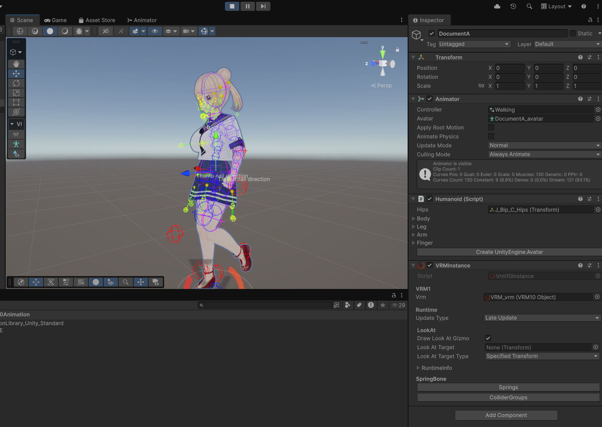

# 第11章: Humanoid Compiler（Document からの Pure Humanoid 生成と確認）

[← チュートリアル目次へ戻る](./index.html) ｜ [← 第10章: Document 保存と Outfit Tag / Priority（衣装の競合制御と状態保存・復元）](./documentstorage.html)

本章では、第10章で保存した **ShapeSync Document（`ShapeSyncDocumentA`）** を入力にして、**Humanoid Compiler** を使用して Unity 標準のコンポーネントのみで構成された素の **Pure Humanoid**（最適化済みアバターモデル）を生成する手順を解説します。

* **本章の作業環境**: VRoid Studio の操作は行いません。すべての作業は **Unity エディタ** および **Humanoid Compiler** 内で行います。
* **入力アセット**: 第10章で保存した **Document A（`ShapeSyncDocumentA`、Tops + Skirt 状態）のみ** を使用します（※Document B は本編では使用しません）。

---

## 1. はじめに（Humanoid Compiler の役割と Pure Humanoid）

### 1.1 Pure Humanoid とは
* **実行時負荷の完全排除**: ShapeSync の通常生成モデル（Figure や Outfit Prefab）は、実行時にリアルタイムで体型変形や着脱を行うためのコンポーネント（`ShapeDirector`、`OutfitAttacher`、StackMachine など）を持っています。
* **Pure Humanoid の特徴**: **Humanoid Compiler** で出力されたモデルは、指定した Document の着用・変形状態を固定（ベイク）し、メッシュやボーン構造を 1 つに統合した **Unity 標準の Humanoid モデル** です。ShapeSync の独自コンポーネントに一切依存しないため、VRChat、ゲームキャラクター、各種メタバースプラットフォームなど、標準的な Humanoid アバターを要求するあらゆる環境へそのまま投入できます。

### 1.2 VRM 連携環境に関する注記
第1章および第9章で VRM 連携（`SHAPESYNC_USE_UNIVRM`）を有効にしている場合、Humanoid Compiler ウィンドウ内に **`Transport VRM Physics`** トグルが表示されます。
* **VRM 連携を行っている場合**: このトグルを **ON** にして Physics（SpringBone）転送を行います（図 11-1）。
* **VRM 連携をスキップした場合**: VRM 関連の項目は表示されないか設定不要です。本章の基本手順は VRM 連携なしの環境でもそのまま進行できます。

---

## 2. Humanoid Compiler の起動と入力設定

### 2.1 Humanoid Compiler ウィンドウの起動
1. Unity エディタの上部メニューから **`Tools > zgock > ShapeSync > Humanoid Compiler`** をクリックして開きます。

### 2.2 Figure および Document の指定
1. **`Figure`**: Project ウィンドウの **`Assets/ShapeSync/Generated/BasicFemale.prefab`**（GameObject）をドラッグ＆ドロップして指定します（※Scene 上の Figure ルート GameObject を指定することも可能です）。
2. **`Document`**: 第10章で保存した **`Assets/ShapeSync/ShapeSyncDocumentA.asset`** をドラッグ＆ドロップして指定します。
3. **`Atlas Schema (Optional)`**: **空欄（None）のまま** にします。
   > [!NOTE]
   > **Atlas 機能について**:
   > Atlas Schema は、複数の衣装・肌テクスチャやマテリアルをグループごとに統合してマテリアル数・テクスチャ枚数を削減し、描画負荷（Draw Call）を低減する機能です（※対象外のマテリアルやシェーダー等もあるため、すべてのマテリアルが必ず1枚にまとまるわけではありません）。Atlas の設定と生成手順は次章（**第12章: Atlas**）で詳しく解説するため、本章では空欄のまま進めます。
4. **VRM 連携環境の場合**:
   * `SHAPESYNC_USE_UNIVRM` が有効な環境で第9章の VRM 連携を行っている場合は、**`Transport VRM Physics`** トグルを **ON** にします（ON にすると `VRM Asset Relative Folder` 入力欄に `VRM` が表示されます）。

*▲図 11-1: Humanoid Compiler で Figure（BasicFemale）と Document（ShapeSyncDocumentA）を指定し、Atlas Schema を空欄のまま VRM Physics を設定した画面*

---

## 3. 出力先フォルダーの指定と Generate 実行

### 3.1 出力先フォルダーの指定
1. Humanoid Compiler ウィンドウ下部の **`Generate`** ボタンをクリックします。
2. Pure Humanoid の出力先を選択する **`Select Empty Pure Humanoid Output Folder`** ダイアログが開きます。
3. プロジェクト内の **`Assets/ShapeSync/Compiler/DocumentA`** を選択し、**`フォルダーの選択`** をクリックします。
   > [!IMPORTANT]
   > 出力先フォルダーは **新規作成または空のフォルダー** である必要があります。既存ファイルが存在するフォルダーは指定できません。フォルダーが存在しない場合は、ダイアログ内で `Assets/ShapeSync/Compiler/` 配下に `DocumentA` フォルダーを新規作成してから選択してください。

*▲図 11-3: Select Empty Pure Humanoid Output Folder ダイアログで Assets/ShapeSync/Compiler/DocumentA を選択した画面*

### 3.2 コンパイルの実行
1. フォルダーを選択すると、コンパイル処理が自動的に開始されます。
2. Compiler ウィンドウの **`Progress`** バーが進み、処理が完了すると **`Completed`** となり、下部に **`Output: Assets/ShapeSync/Compiler/DocumentA`** と表示されます（図 11-4）。

---

## 4. 生成アセットの確認（`DocumentA` 接頭語）

Generate が完了したら、Project ウィンドウで出力結果を確認します。

### 4.1 出力アセット一覧の確認
1. Project ウィンドウで **`Assets > ShapeSync > Compiler > DocumentA`** を開きます。
2. 出力フォルダー名（`DocumentA`）を接頭語とする以下の生成物が揃っていることを確認します（図 11-4）。

| 生成アセット | ファイル名 / 命名規則 | 内容 |
| :--- | :--- | :--- |
| **主 Prefab** | **`DocumentA.prefab`** | メッシュ統合済みの Pure Humanoid Prefab |
| **統合 Mesh** | **`DocumentA.asset`** | Tops + Skirt と素体が統合された単一メッシュ |
| **Humanoid Avatar** | **`DocumentA_avatar.asset`** | Unity Humanoid 用のアバター定義アセット |
| **Figure 側 Material** | `DocumentA_<entryId>.mat` | 素体由来のマテリアル群（Body, Brow, Face 等） |
| **Figure 側 Texture** | `DocumentA_<entryId>_<index>.png` | 素体由来のテクスチャ群 |
| **Outfit 側 Material** | `DocumentA_<registryId>_<entryId>.mat` | Tops1 / Skirt1 由来のマテリアル群 |
| **Outfit 側 Texture** | `DocumentA_<registryId>_<entryId>_<index>.png` | Tops1 / Skirt1 由来のテクスチャ群 |

*▲図 11-4: Generate 完了後の Humanoid Compiler（Completed）および Project ビューで確認できる DocumentA 接頭語の生成アセット一覧*

---

## 5. Scene 配置と Pure Humanoid の構造確認

生成された `DocumentA.prefab` が、ShapeSync に依存しない素の Humanoid として正しく機能することを確認します。

### 5.1 Scene への Prefab 配置と見た目の確認
1. Project ウィンドウの **`Assets/ShapeSync/Compiler/DocumentA/DocumentA.prefab`** を Scene ビュー（または Hierarchy）へドラッグ＆ドロップして配置します。
2. **見た目の確認**: Scene ビュー上で、素体に Tops1（セーラー服風トップス）と Skirt1（プリーツスカート）が綺麗に統合されて描画されていることを確認します（図 11-5）。

### 5.2 Pure Humanoid 構造（Inspector / Hierarchy）の確認
1. Hierarchy で配置した **`DocumentA`** を選択し、Inspector を確認します（図 11-5）。
2. **Unity 標準コンポーネントの確認**:
   * ルートオブジェクトに Unity 標準の **`Animator`** コンポーネントがアタッチされており、`Avatar` 欄に **`DocumentA_avatar`**（Humanoid Avatar）が正しく割り当てられていることを確認します。
   * 子オブジェクトに **`SkinnedMeshRenderer`** が存在し、統合メッシュ `DocumentA.asset` が設定されていることを確認します。
3. **ShapeSync 実行時コンポーネントの完全排除の確認**:
   * `DocumentA` の Inspector および階層内に、**`ShapeDirector`**、**`OutfitAttacher`**、**`DynamicBoneBlender`**、**`MeshStackMachine`**、Material Proxy / Attacher などの **ShapeSync 実行時スクリプトが一切含まれていない（素の GameObject / SkinnedMeshRenderer / Animator 構成）** ことを確認します。
   * （※VRM 連携環境の場合は、SpringBone 揺れ物用の `VRMInstance` コンポーネントのみが正しく転送・付与されています）

*▲図 11-5: Scene ビューに配置された DocumentA（Tops + Skirt 姿）と Inspector で確認できる Unity 標準 Animator / Avatar および ShapeSync 実行時コンポーネント無しの Pure Humanoid 構成*

### 5.3 （任意）Animation 再生による動作確認
1. `DocumentA` の `Animator` コンポーネントの `Controller` 欄に、第3章で使用した **`Assets/CCOAnimation/Walking.controller`** を割り当てます。
2. Unity の **Play ボタン** を押して **Play Mode** に入ります。
3. 素の Humanoid アバターとして、衣装を着たキャラクターが破綻なく滑らかに歩行アニメーションを実行することを確認します。VRM 連携環境（`Transport VRM Physics: ON`）の場合は、SpringBone による髪やスカートの揺れ物（Physics）も同時に正しく動作します（図 11-7）。

*▲図 11-7: Walking.controller を割り当てて Play Mode で歩行アニメーションおよび VRM Physics（髪・スカートの揺れ）が動作している画面*

---

## 6. よくあるトラブルと解決策（トラブルシューティング）

### Q1. Generate ボタンを押しても「フォルダーが空ではありません」等のエラーが出る
* **原因**:
  Humanoid Compiler は安全のため、すでにファイルが存在するフォルダーへの上書き出力を禁止しています。
* **解決策**:
  ダイアログで指定するフォルダー（`Assets/ShapeSync/Compiler/DocumentA/`）の中身を空にするか、ダイアログ上で新しい空フォルダーを作成して指定してください。

### Q2. 生成されたモデルのテクスチャやマテリアル数が多くて Draw Call が気になる
* **原因**:
  本章では `Atlas Schema (Optional)` を空欄にして出力したため、元の各パーツ（素体、トップス、スカート）のマテリアルとテクスチャが個別に維持されています。
* **解決策**:
  次章（**第12章: Atlas**）で解説する **Atlas Editor** を使用することで、対応する複数のマテリアルやテクスチャをグループごとに統合・削減し、描画負荷（Draw Call）を抑えたモデルを生成できます（※特殊なシェーダーや設定により統合対象外となるマテリアルもあるため、必ずすべてが1枚に統合されるわけではありません）。

---

[← チュートリアル目次へ戻る](./index.html) ｜ [← 第10章: Document 保存と Outfit Tag / Priority（衣装の競合制御と状態保存・復元）](./documentstorage.html)
