# 第2章: 初期 VRM データ生成

[← チュートリアル目次へ戻る](./index.html) ｜ [← 第1章: インストール](./installation.html)

本章では、**VRoid Studio** を使用して、ShapeSync でキャラクターの体型追従を行うための素体モデル（**Base VRM** と **FBM VRM**）を準備する手順を解説します。

> [!NOTE]
> 本章の作業はすべて **VRoid Studio** 上で行います。ShapeSync Editor や Unity 側へのモデル登録作業は、次章（第3章以降）で行います。

---

## 1. はじめに（ビギナー向け用語集）

作業に入る前に、本章で使用する用語を分かりやすく説明します。

* **VRoid Studio**: ピクシブ株式会社が提供する、人型3Dキャラクターを直感的に作成できる無料の 3D モデリングソフトです（本チュートリアルではバージョン 2.14.0 を使用します）。
* **VRM / VRM 1.0**: 3D アバターを様々なアプリケーションで統一して扱うためのファイル形式です。ShapeSync では **VRM 1.0** 形式のモデルを使用します。
* **Figure（フィギュア）**: ShapeSync において、衣装を着用・追従させる対象となるベースキャラクターモデルです。
* **Base（ベースモデル）**: 体型変形の基準となる、標準体型の素体モデルです。
* **FBM (Full Body Morph)**: 表情用のアニメーションとは異なり、キャラクターの「体型全体」をモーフィング変形させるためのモデルです。
* **トポロジ (Topology)**: 3D メッシュの「頂点の総数や面・線の並び順・接続構造」のことです。Base と FBM のメッシュ構造が完全に一致している状態を「同一トポロジ」と呼びます。

---

## 2. Base と FBM の2体を作成する理由

ShapeSync は、**標準体型のモデル（Base）** と **変形後の体型モデル（FBM）** のメッシュを比較し、頂点位置の差分から体型の変化量を計算します。

そのため、Base と FBM の2体には以下の **厳格な条件** が求められます。

1. **同一トポロジであること**:
   Base と FBM で、素体の頂点数やメッシュ構造が完全に一致している必要があります。
2. **髪型・衣装・アクセサリーをすべて除去すること**:
   髪や服、アクセサリーが残っていると、モデルごとに頂点数やメッシュ構造が異なってしまい、同一トポロジが崩れてしまいます。
3. **ポリゴン削減を行わないこと**:
   VRM エクスポート時にポリゴン削減機能を使うと頂点構造が変化してしまうため、削減設定はすべて OFF に統一します。

> [!WARNING]
> **同一トポロジが崩れた場合**
> Base と FBM で頂点数が一致していないと、後工程（ShapeSync への取り込み時）でエラーが発生して失敗します。このエラーメッセージから「どのアクセサリーが原因か」を特定することは困難なため、VRM 出力前に必ず両モデルの構成を揃えることが極めて重要です。

---

## 3. VRoid Studio での Base モデル作成

まずは基準となる標準体型の素体モデル（`BasicFemale`）を作成し、VRM 1.0 としてエクスポートします。

### 手順 1: 新規モデルの作成と女性モデルの選択

1. VRoid Studio を起動し、ホーム画面で **「新規作成」**（＋マーク）をクリックします。
2. 「ベースの選択」画面が表示されたら、**「女性」** を選択します。

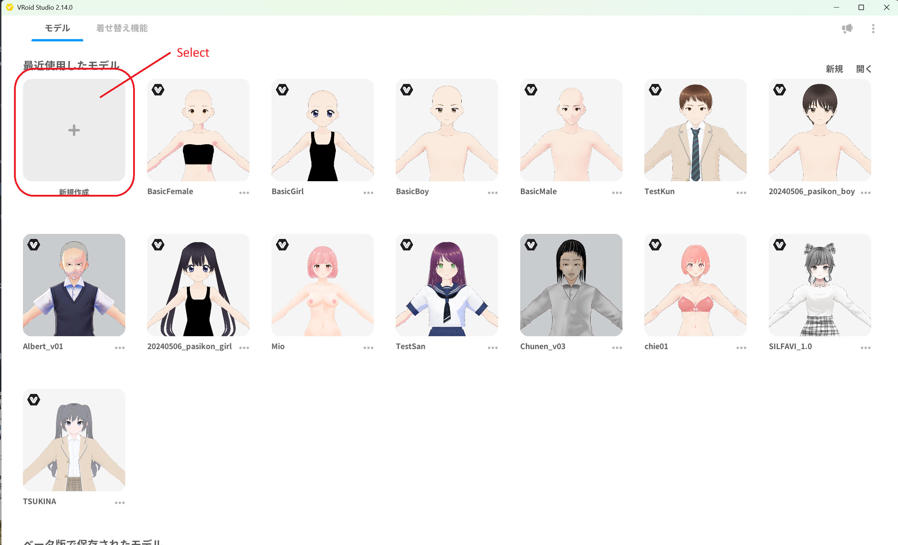
*▲図 2-1: VRoid Studio ホーム画面で「新規作成」を選択*

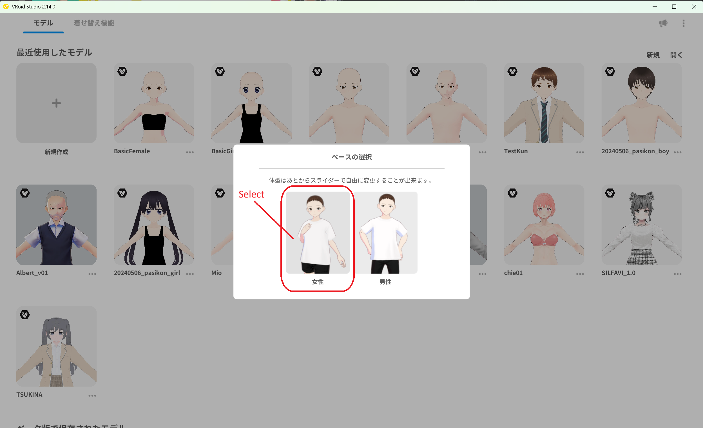
*▲図 2-2: ベースの選択で「女性」を選択*

---

### 手順 2: 髪型・衣装・アクセサリーの全除去

作成直後のモデルには、初期設定の髪型や衣服、靴などが着用されています。同一トポロジの素体を作成するため、これらをすべて外します。

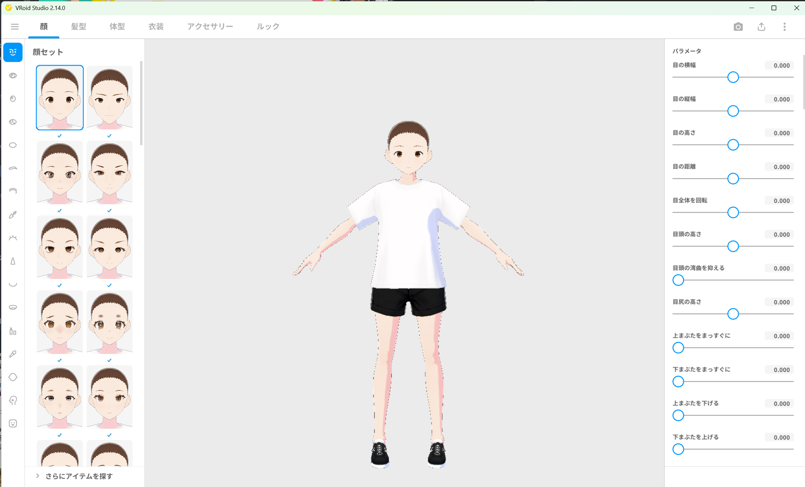
*▲図 2-3: 作成直後の状態（初期衣装と髪型が適用されている）*

1. **「髪型」タブ** を開き、適用されているヘアスタイルアイテムをすべて外します（未選択・未適用の状態にします）。
2. **「衣装」タブ** を開き、トップス・ボトムス・靴・靴下などの衣装アイテムをすべて外し、素体（インナー下着）のみの状態にします。
3. **「アクセサリー」タブ** を開き、アクセサリーが何も装着されていないことを確認します。

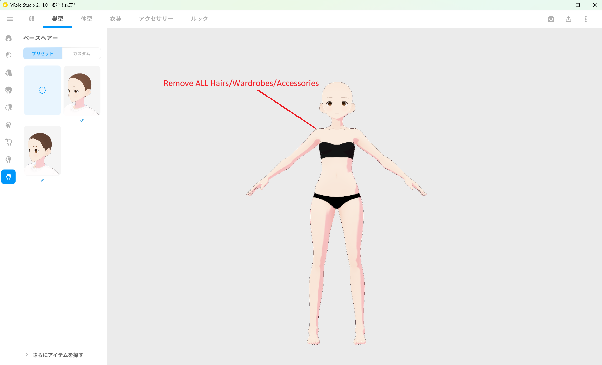
*▲図 2-4: 髪型・衣装・アクセサリーをすべて外し、素体のみになった状態*

4. 画面左上のメニューから、ファイルを `BasicFemale.vroid` という名前で保存します。

---

### 手順 3: VRM エクスポート設定と数値の確認

素体を VRM 1.0 形式で書き出します。

1. 画面右上のエクスポートアイコンをクリックし、メニューから **「VRMエクスポート」** を選択します。

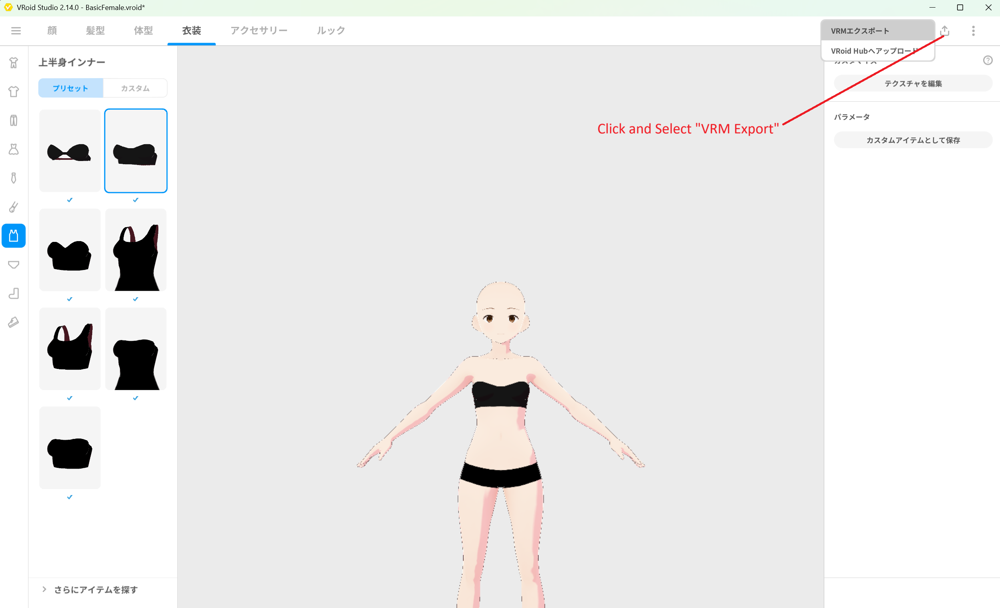
*▲図 2-5: 右上メニューから「VRMエクスポート」を選択*

2. 右側の設定パネルにある **「ポリゴンの削減」** を開きます。
3. **「髪の断面形状を変更する」** および **「透明メッシュを削除する」** のチェックを **すべてOFF（未チェック）** にします。
4. 削減度の調整スライダー（髪の滑らかさ、髪、顔、体、衣装）がすべて `0` になっていることを確認します。
5. 画面右上の **エクスポート情報** に表示されている **ポリゴン数・マテリアル数・ボーン数** を確認し、メモしておきます。

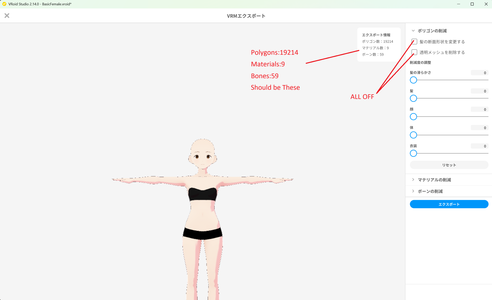
*▲図 2-6: ポリゴン削減をすべてOFFにし、エクスポート情報を確認（実測例: ポリゴン数 19214 / マテリアル数 9 / ボーン数 59）*

> [!IMPORTANT]
> **エクスポート情報の数値について**
> VRoid Studio 2.14.0 での標準実測値は「ポリゴン数: 19214 / マテリアル数: 9 / ボーン数: 59」ですが、VRoid Studio のバージョン等によって数値が異なる場合があります。
> 本質的に重要なのは、**このあと作成する FBM モデル側の数値と、Base モデル側の数値が完全に一致すること** です。

---

### 手順 4: VRM 1.0 エクスポート

1. 右下の **「エクスポート」** ボタンをクリックします。
2. 「VRMエクスポート設定」画面で、以下を設定します。
   * **フォーマット**: 必ず **「VRM1.0」** を選択します（※VRM0.0 は選択しないでください）。
   * **アバター名（必須）**: `BasicFemale` と入力します。
   * **作者（必須）**: 任意の作者名（お名前やハンドルネーム）を入力します。
3. 下部のエクスポートを実行し、ファイル名を `BasicFemale.vrm` として保存します。

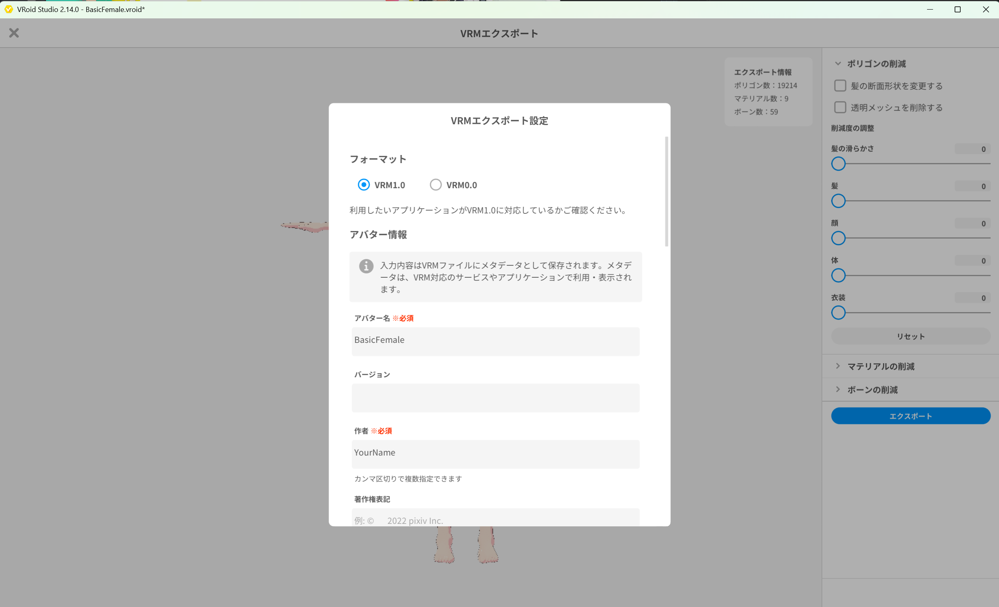
*▲図 2-7: フォーマットに VRM1.0 を選択し、アバター名を BasicFemale に設定*

---

## 4. VRoid Studio での FBM モデル作成

続いて、体型変形の基準となる FBM モデル（`SampleI`）を作成します。

### 手順 1: 内蔵プリセット `AvatarSample_I` の選択

1. VRoid Studio のモデル選択画面で、内蔵サンプルプリセット一覧から **「AvatarSample_I」** を選択して開きます。

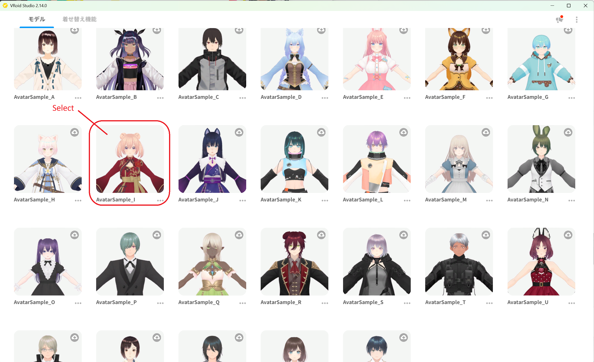
*▲図 2-8: サンプルモデル一覧から AvatarSample_I を選択*

---

### 手順 2: 髪型・衣装・アクセサリーの全除去

Base モデルと同様に、モデル固有の装飾アイテムをすべて外します。

1. **「髪型」タブ** を開き、すべてのヘアアイテムを外します。
2. **「衣装」タブ** を開き、衣服、靴、靴下等をすべて外します。
3. **「アクセサリー」タブ** を開き、アクセサリーが装着されていないことを確認します。

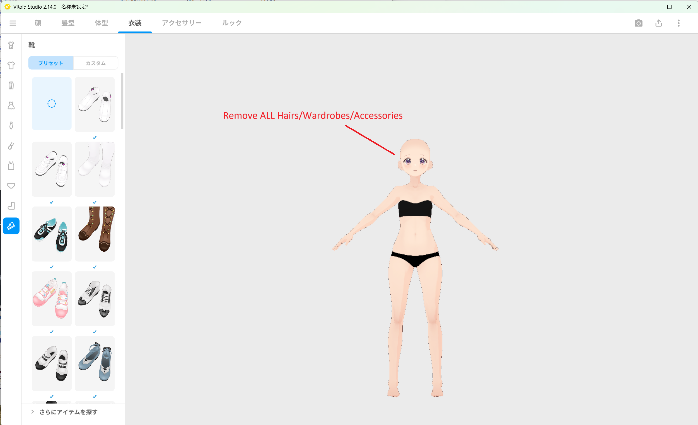
*▲図 2-9: AvatarSample_I から髪型・衣装・アクセサリーをすべて外した状態*

4. 左上メニューから、ファイルを `SampleI.vroid` という名前で保存します。

---

### 手順 3（FBM側）: VRM エクスポート設定と数値一致の確認

1. 画面右上のエクスポートアイコンから **「VRMエクスポート」** を選択します。
2. 右側パネルの **「ポリゴンの削減」** で、**すべてのチェックをOFF** にし、スライダーがすべて `0` であることを確認します。
3. エクスポート情報の **ポリゴン数・マテリアル数・ボーン数** を確認し、**Base（BasicFemale）で確認した数値と完全に一致していること** を確かめます。

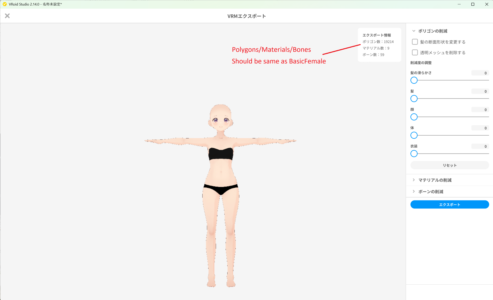
*▲図 2-10: ポリゴン削減をOFFにし、ポリゴン数・マテリアル数・ボーン数が BasicFemale と同一であることを確認*

> [!CAUTION]
> もし数値が Base と一致しない場合は、外していない髪型パーツやアクセサリー、衣装が残っているか、ポリゴン削減オプションが有効になっています。必ず前のステップに戻って確認してください。

---

### 手順 4: VRM 1.0 エクスポート

1. 右下の **「エクスポート」** ボタンをクリックします。
2. 「VRMエクスポート設定」画面で、以下を設定します。
   * **フォーマット**: 必ず **「VRM1.0」** を選択します。
   * **アバター名（必須）**: `SampleI` と入力します。
   * **作者（必須）**: 任意の作者名を入力します。
3. エクスポートを実行し、ファイル名を `SampleI.vrm` として保存します。

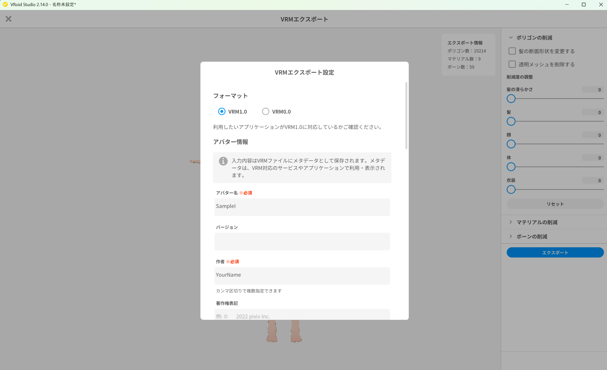
*▲図 2-11: フォーマットに VRM1.0 を選択し、アバター名を SampleI に設定*

---

## 5. Base と FBM の成果物一覧

本章の作業により、以下のファイルが手元に作成されます。これらは次章（Figure 登録）以降の入力データとして使用します。

| 役割 | VRoid プロジェクトファイル | 出力 VRM ファイル | VRM アバター名 | ShapeSync 側の FBM 軸名 |
| :--- | :--- | :--- | :--- | :--- |
| **Base（基準素体）** | `BasicFemale.vroid` | `BasicFemale.vrm` | `BasicFemale` | （基準のためなし） |
| **FBM（体型変形）** | `SampleI.vroid` | `SampleI.vrm` | `SampleI` | `SampleI` |

### VRoid Studio サンプルモデルの利用条件について
* VRoid Studio の内蔵サンプルモデル（`AvatarSample_I` 等）は、pixiv の利用規約に基づき、**営利・非営利を問わず自由に利用可能** です（クレジット表記も不要です）。
* ただし **CC0（著作権放棄）ではありません**。サンプルモデル自体を有償で再配布することや、CC0 として再配布することは禁止されています。
* ShapeSync パッケージ側にはこれらのサンプルモデルデータは同梱・配布されていません。チュートリアルを進める際は、本章の手順に従って各自の環境でモデルを生成してご用意ください。

---

## 6. よくあるトラブルと解決策（トラブルシューティング）

### Q1. Base と FBM でポリゴン数・マテリアル数・ボーン数が一致しない
* **原因**:
  1. 髪型・衣装・アクセサリーのいずれかのタブでアイテムが外れておらず残っている。
  2. VRM エクスポート画面で「髪の断面形状を変更する」「透明メッシュを削除する」のチェックが入っている。
* **解決策**:
  VRoid Studio の編集画面に戻り、「髪型」「衣装」「アクセサリー」の3つのタブをすべて確認して完全に外してください。また、エクスポート画面でポリゴン削減オプションがすべて OFF になっているか確認してください。

### Q2. 後工程で FBM 取り込み時に「頂点数不一致」エラーが発生する
* **原因**:
  Base と FBM の間でメッシュの頂点構造（トポロジ）が異なっています。微小なアクセサリーや衣装パーツが残ったまま書き出された場合、Unity 上の診断メッセージからは「何が原因で不一致になったのか」を特定することが困難です。
* **解決策**:
  本章の [手順 3](#手順-3-vrm-エクスポート設定と数値の確認) および [手順 3（FBM側）](#手順-3fbm側-vrm-エクスポート設定と数値一致の確認) に戻り、エクスポート画面で表示されるポリゴン数・マテリアル数・ボーン数が互いに完全一致していることを確認した上で、再度 VRM 1.0 でエクスポートし直してください。

### Q3. VRM 0.0 でエクスポートしてしまった
* **原因**:
  VRM エクスポート設定画面のフォーマットで「VRM0.0」を選択して出力した。
* **解決策**:
  ShapeSync は **VRM 1.0** を前提としています。再度エクスポート画面を開き、フォーマットで **「VRM1.0」** を選択して上書きエクスポートを行ってください。

---

[← チュートリアル目次へ戻る](./index.html) ｜ [← 第1章: インストール](./installation.html)
