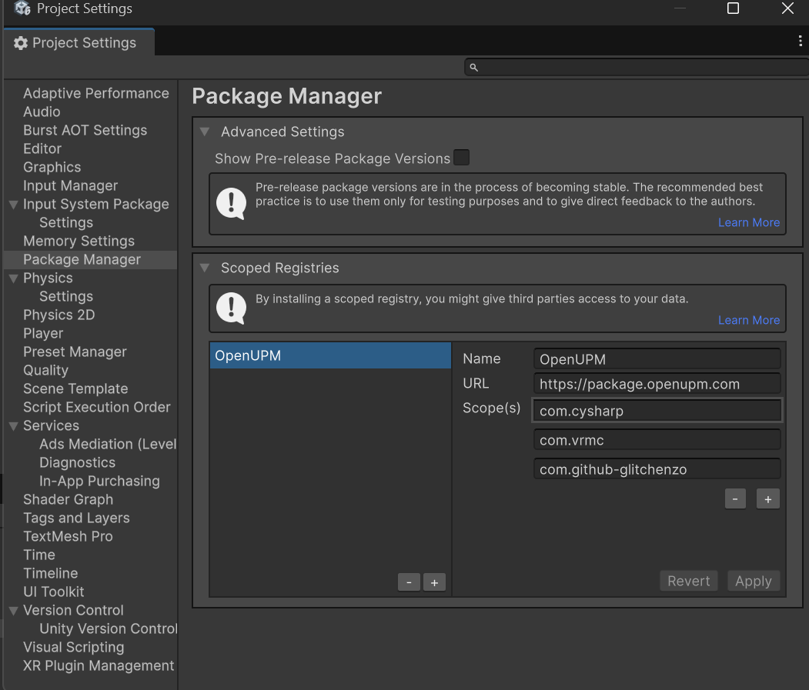
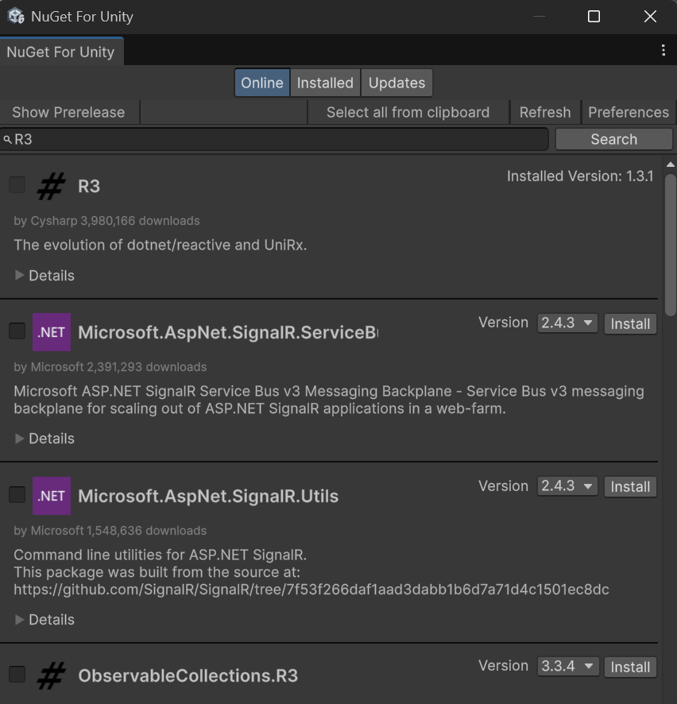
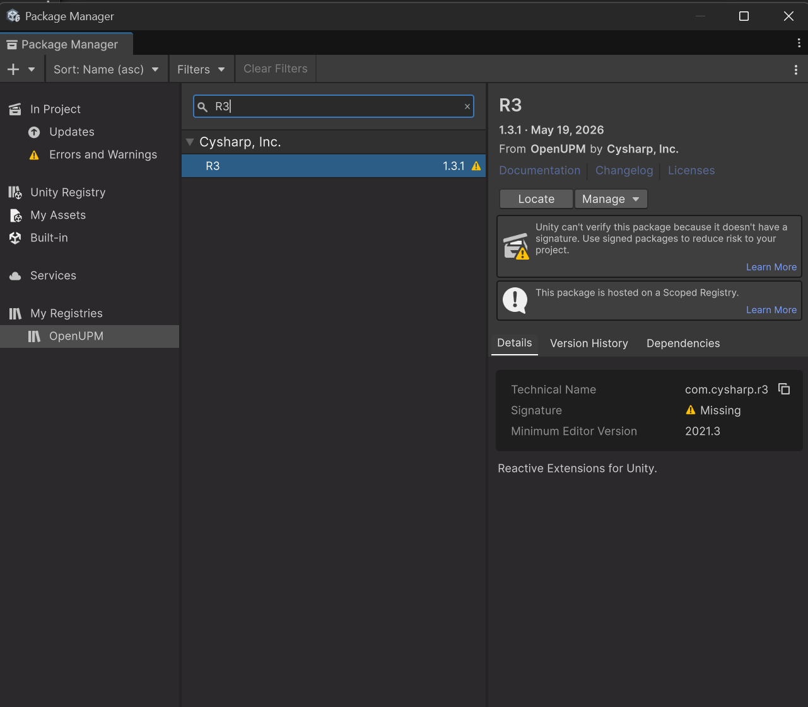
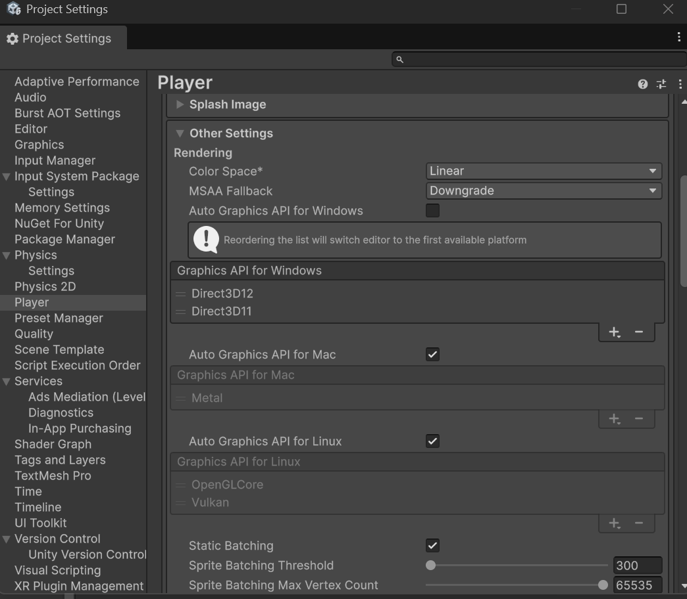
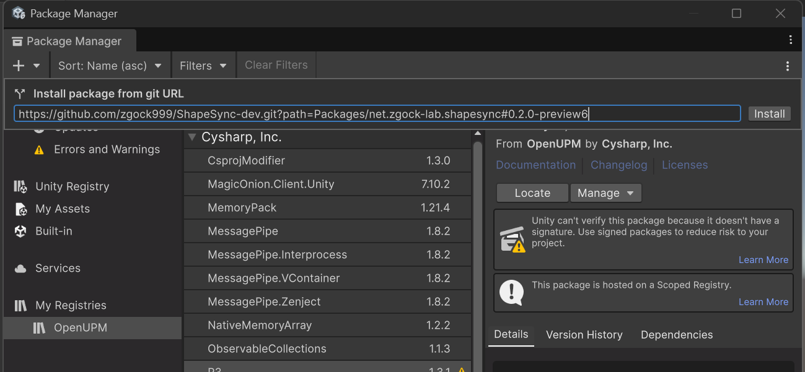
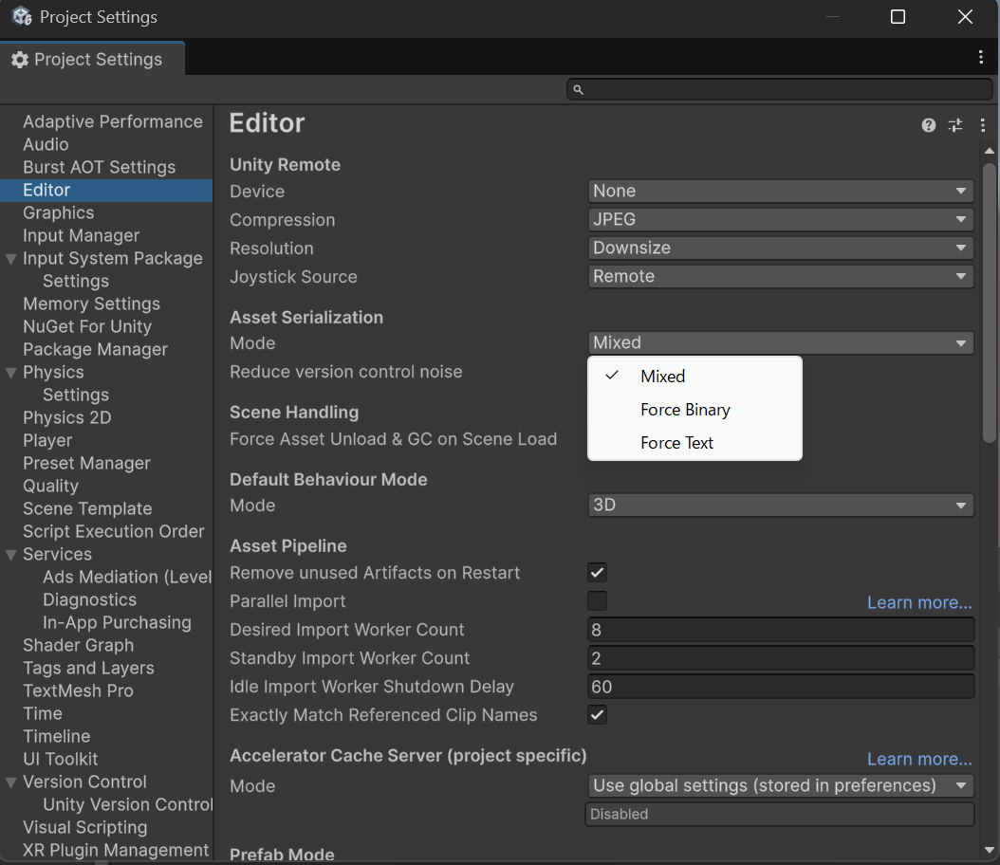
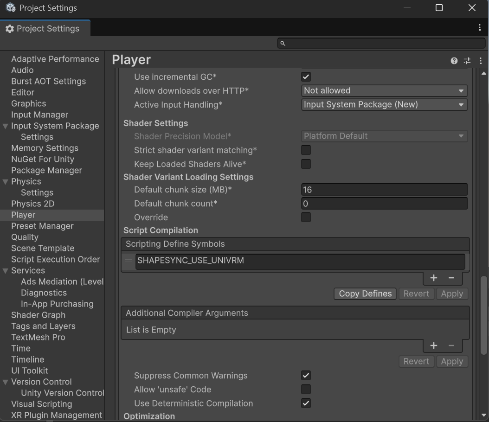

# 第1章: ShapeSync のインストールと環境設定

[← チュートリアル目次へ戻る](./index.html)

本章では、Unity で **ShapeSync（シェイプシンク）** を使い始めるためのインストール手順とプロジェクトの初期設定について解説します。

---

## 1. はじめに（ビギナー向け用語集）

インストール手順を進める前に、よく登場する専門用語を分かりやすく説明します。

* **Package Manager（パッケージマネージャー）**: Unity に拡張機能や外部ライブラリを簡単に導入・管理するための Unity 標準ツールです。
* **Scoped Registry（スコープドレジストリ）**: Unity 公式以外の安全な公開サーバーからパッケージを取得するための登録設定です。
* **OpenUPM**: Unity 向けのオープンソースパッケージが多く集まる公開レジストリサービスです。
* **NuGet / NuGetForUnity**: C# / .NET の世界で広く使われているライブラリ配布システム（NuGet）を、Unity 上で手軽に利用できるようにする拡張ツールです。
* **R3**: 非同期処理やリアクティブプログラミング（データ変化の通知やイベント管理）を高速に行うための C# ライブラリです。ShapeSync が内部で利用しています。
* **URP (Universal Render Pipeline)**: Unity の標準的な高品質・高性能描画システムです。ShapeSync は URP 環境専用に設計されています。
* **Graphics API (DirectX 12 / Vulkan / DirectX 11)**: パソコンのグラフィックボード（GPU）に描画命令を伝える方式です。ShapeSync のテクスチャ変形には、最新の並列処理（非同期コンピュート）をサポートする **DirectX 12 (D3D12)** または **Vulkan** が必要です。
* **Color Space (Linear)**: 色の明るさや混色を計算する基準です。ShapeSync のマテリアル計算は **Linear（リニア）** に統一されています。
* **Asset Serialization Mode (Mixed)**: Unity がアセットデータを保存する形式です。ShapeSync の大容量データベースを扱うため、**Mixed** に設定します。
* **UniVRM**: VRM 形式の 3D アバターを Unity で扱うための標準パッケージです。VRM 連携を行う場合のみ導入します。
* **Scripting Define Symbols**: プロジェクト全体で有効にする機能のスイッチ（フラグ）です。VRM 連携を有効化する際に設定します。

---

## 2. 必要な動作環境（システム要件）

ShapeSync を動作させるために、以下の環境を用意してください。

| 項目 | 必要条件 | 補足・推奨値 |
| :--- | :--- | :--- |
| **Unity バージョン** | Unity 6.0 LTS 以上 | 動作検証基準: **Unity 6000.3.18f1** |
| **レンダーパイプライン** | Universal Render Pipeline (URP) 17.0.0 以上 | 検証基準: **URP 17.3.0**（Built-in RP / HDRP / カスタム SRP は非対応） |
| **Graphics API** | DirectX 12 または Vulkan | 非同期コンピュートキュー対応が必須（※D3D11 は非サポート） |
| **Git** | Git 2.14 以上 | HTTPS 経由で GitHub からパッケージを取得するために必要 |
| **NuGetForUnity** | 4.5.0 | R3 の .NET コア依存関係を導入するために使用 |
| **UniVRM** | 0.131.1 | **※VRM 連携機能を使用する場合のみ必要** |

---

## 3. プロジェクトの作成と推奨テンプレート

Unity Hub で新規プロジェクトを作成する際は、**「Universal 3D」** テンプレートを選択することを強く推奨します。

> [!TIP]
> **Universal 3D テンプレートを推奨する理由**
> Unity 6 (`6000.3.18f1`) の Universal 3D テンプレートでは、URP `17.0.1` 以上の設定および Color Space の `Linear` 設定が最初から適用されています。そのため、手動でのレンダラー移行や色空間の変更作業を省くことができます。
>
> ※Built-in RP などの別テンプレートから作成した場合は、後述のステップに従って手動で URP の導入と設定を行ってください。

---

## 4. インストール手順（ステップ・バイ・ステップ）

ShapeSync のインストールは、依存関係の解決順序が重要です。必ず以下の **Step 1 〜 Step 6** を順番に実行してください（VRM を利用する場合は Step 8 まで）。

### Step 1: OpenUPM スコープドレジストリの追加

OpenUPM から関連パッケージを取得できるように設定します。

1. Unity エディタのメニューから **Edit > Project Settings** を開きます。
2. 左側メニューの **Package Manager** を選択し、**Scoped Registries** の一覧に以下の情報を入力して **Save** をクリックします。

```text
Name: OpenUPM
URL: https://package.openupm.com
Scopes: com.cysharp, com.vrmc, com.github-glitchenzo
```


*▲図 1-1: Project Settings > Package Manager での Scoped Registries 設定*

---

### Step 2: NuGetForUnity と NuGet 版 R3 のインストール

ShapeSync で必要な R3 の基本コアライブラリを NuGet 経由で導入します。

1. Unity メニューの **Window > Package Manager** を開きます。
2. 左上の「**+**」ボタンをクリックし、**Add package by name...** を選択します。
3. Name に以下を入力して **Add** をクリックします。
   ```text
   com.github-glitchenzo.nugetforunity
   ```
   ※バージョン指定が必要な場合は `4.5.0` を入力します。
4. インストール完了後、Unity 上部メニューに **NuGet** が追加されます。**NuGet > Manage NuGet Packages** を開きます。
5. 検索欄に `R3` と入力し、一覧から `R3`（バージョン `1.3.1`）を探して **Install** をクリックします。


*▲図 1-2: NuGet > Manage NuGet Packages での R3 (1.3.1) のインストール*

> [!IMPORTANT]
> **重要な確認事項**
> * Unity Package Manager 上に表示される `R3 1.3.1`（後述の Step 3）と、NuGet 版の `R3` は別物です。必ず NuGet ウィンドウからインストールを行ってください。
> * インストール後、プロジェクトの `Assets/packages.config` 内に `<package id="R3" version="1.3.1" manuallyInstalled="true" />` が記載され、`Assets/Packages/R3.1.3.1/lib/.../R3.dll` が生成されていることを確認してください。

---

### Step 3: R3 Unity アダプターのインストール

Unity 上で R3 をスムーズに連携させるための Unity アダプターパッケージを導入します。

1. **Window > Package Manager** を開きます。
2. 左上の「**+**」ボタンから **Add package by name...** を選択します。
3. 以下を入力して **Add** をクリックします。
   ```text
   com.cysharp.r3
   ```
   ※バージョン `1.3.1` を指定します。


*▲図 1-3: Package Manager での com.cysharp.r3 パッケージ確認・追加*

---

### Step 4: URP の確認・インストールと Graphics API の設定

1. **URP の確認**:
   * Universal 3D テンプレートを使用した場合は、URP 17.x が自動的に導入され、**Project Settings > Graphics** に URP アセットが設定されています（確認のみでOK）。
   * 別テンプレートの場合は、Package Manager から `com.unity.render-pipelines.universal`（17.0.0 以上、検証基準 17.3.0）をインストールし、Graphics 設定で URP アセットを割り当ててください。
2. **Windows での Graphics API 設定**:
   * **Edit > Project Settings > Player** を開きます。
   * **Other Settings > Rendering** セクションにある **Auto Graphics API for Windows** のチェックを外します。
   * 一覧の最上位に **Direct3D12** を配置します（または **Vulkan** を選択）。
   * 設定変更後、**必ず Unity エディタを再起動** してください。


*▲図 1-4: Project Settings > Player での Graphics APIs 設定（Direct3D12 を最上位に設定）*

---

### Step 5: ShapeSync Core パッケージのインストール

Git の URL を指定して、ShapeSync の本体パッケージをインストールします。

1. **Window > Package Manager** を開きます。
2. 左上の「**+**」ボタンから **Add package from git URL...** を選択します。
3. 以下の URL をそのままコピー＆ペーストして **Add** をクリックします。
   ```text
   https://github.com/zgock999/ShapeSync-dev.git?path=Packages/net.zgock-lab.shapesync#0.2.0-preview6
   ```

> [!WARNING]
> URL 内の `?path=Packages/net.zgock-lab.shapesync` は必ず `#0.2.0-preview6` より前に記述してください。順序が異なると Git の取得エラー（pathspec error）が発生します。


*▲図 1-5: Package Manager での Git URL からの ShapeSync Core 追加*

---

### Step 6: プロジェクト設定の確認と変更

ShapeSync の大容量データおよびマテリアルを正常に扱うため、プロジェクト設定を調整します。

1. **Asset Serialization Mode の変更**:
   * **Edit > Project Settings > Editor** を開きます。
   * **Asset Serialization** の **Mode** を **Mixed** に変更します（※新規プロジェクト初期値の「Force Text」から必ず変更してください）。
2. **Color Space の確認**:
   * **Edit > Project Settings > Player > Other Settings > Rendering** を開きます。
   * **Color Space** が **Linear** になっていることを確認します（Gamma になっている場合は Linear に変更します）。


*▲図 1-6: Project Settings > Editor での Asset Serialization Mode 設定（Mixed を選択）*

---

### Step 7: [任意] UniVRM のインストール（VRM 連携を行う場合のみ）

VRM 1.0 形式のアバターモデルで ShapeSync を利用する場合は、以下のパッケージを追加します（※ShapeSync Core 単体で利用する場合はスキップしてください）。

1. **Window > Package Manager** の **Add package by name...** から、以下の2つを順に追加します。
   * `com.vrmc.gltf` (バージョン: `0.131.1`)
   * `com.vrmc.vrm` (バージョン: `0.131.1`)

---

### Step 8: [任意] ShapeSync VRM Integration Companion のインストール

VRM 連携用の拡張パッケージを追加し、連携スイッチを有効化します。

1. **Window > Package Manager** の **Add package from git URL...** から以下を追加します。
   ```text
   https://github.com/zgock999/ShapeSync-dev.git?path=Packages/net.zgock-lab.shapesync.vrm#0.2.0-preview6
   ```
2. **Edit > Project Settings > Player > Other Settings** を開きます。
3. **Scripting Define Symbols** に `SHAPESYNC_USE_UNIVRM` を追加して **Apply** をクリックします。


*▲図 1-7: Project Settings > Player での Scripting Define Symbols 設定（SHAPESYNC_USE_UNIVRM を追加）*

---

## 5. 【重要付記】Unity 6000.0 (Unity 6.0 LTS) 使用時の DirectX 12 設定について

Windows 環境で **Unity 6.0 LTS (`6000.0.x`)** を使用する場合の Graphics API 設定に関して、重要な注意事項があります。

### 1. なぜ DirectX 12（または Vulkan）が必要なのか？
ShapeSync のテクスチャ変形エンジン（Texture StackMachine）は、GPU の高速な **非同期コンピュートキュー（Async Compute Queue）** および **同期フェンス（GraphicsFence）** を利用してリアルタイムにテクスチャを生成・合成します。
従来の **DirectX 11 (D3D11)** はこれらの機能を備えていないため、D3D11 環境下ではテクスチャ処理時に実行時エラー（`NotSupportedException`）が発生します。D3D11 はサポート対象外となっています。

### 2. 適用条件とバージョンの違い
* **Unity 6.0 LTS (`6000.0.x`) を使用する場合【手動変更が必須】**:
  * Unity 6.0 は Windows のデフォルト Graphics API が **D3D11** に設定されています。そのため、手動で **Direct3D12**（または Vulkan）に変更する必要があります。
* **Unity 6.3 LTS (`6000.3.x`) を使用する場合【確認のみ】**:
  * Unity 6.3 の検証環境ではデフォルトで **Direct3D12** が選択されています。設定画面を開き、Direct3D12 が最上位になっていることを確認してください。

### 3. 設定手順
1. **Edit > Project Settings > Player > Other Settings > Rendering** を開く。
2. **Auto Graphics API for Windows** のチェックを外す。
3. リストの先頭に **Direct3D12** を配置する（または Vulkan を選択）。
4. **Unity エディタを再起動する**（※再起動するまで新しい Graphics API は適用されません）。

### 4. 設定の根拠（参照資料）
本付記は、公開資料 `Docs/codex/README.md` の以下の各記述に基づいています。
* `## Requirements`: D3D12 / Vulkan の非同期コンピュート要求、Unity 6.0 (D3D11初期値) と Unity 6.3 (D3D12初期値) の挙動、D3D11 非サポートの明記。
* `### Choose the project template`: Unity 6.0 での D3D11 から D3D12 への変更必須の記述。
* `### 4. Confirm or install URP`: Windows における Graphics APIs 設定手順とエディタ再起動の必要性。
* `### Troubleshooting > Texture processing fails on Windows`: D3D11 での `NotSupportedException` 例外発生と D3D12 への変更手順。

---

## 6. よくあるトラブルと解決策（トラブルシューティング）

### Q1. R3 関連のコンパイルエラーが発生する
* **症状**: `The type or namespace name 'Collections' does not exist in the namespace 'R3'` や `FrameProvider`、`Observable<>` 等が見つからないエラーが出る。
* **原因**: Step 2 の NuGet 版 R3 が正しくインストールされていません（Package Manager の Unity アダプターのみ入っている状態）。
* **解決策**: **NuGet > Manage NuGet Packages** を開き、NuGet 版 `R3`（1.3.1）をインストールしてください。プロジェクトの `Assets/packages.config` に R3 が記載されているか確認してください。

### Q2. テクスチャ処理時にエラーが発生する
* **症状**: `NotSupportedException: Cannot determine if this AsyncQueueSynchronisation Graphics...` というエラーが出る。
* **原因**: Graphics API が DirectX 11 (D3D11) のままになっています。
* **解決策**: [第5項の付記](#5-重要付記unity-60000-unity-60-lts-使用時の-directx-12-設定について) を参照し、Graphics API を **Direct3D12** または **Vulkan** に変更して Unity を再起動してください。

### Q3. VRM コンパニオンで Core が見つからないエラーが出る
* **症状**: VRM Companion パッケージ追加時にエラーが発生する。
* **原因**: ShapeSync Core より先に VRM Companion を導入してしまった。
* **解決策**: 一度 VRM Companion を削除し、先に Step 5 の ShapeSync Core をインストールしてから再度 VRM Companion を追加してください。

### Q4. Git の URL 指定でエラーが出る
* **症状**: `Cannot checkout repository ... pathspec ... did not match any file(s) known to git` というエラーが出る。
* **原因**: Git URL の書式が間違っています。
* **解決策**: `?path=Packages/net.zgock-lab.shapesync` を `#0.2.0-preview6` の前に記述しているか確認してください。

---

## 7. 動作確認（パッケージテストの実行）

インストールの完了後、正しく導入できたかテストを実行して確認できます。

1. プロジェクトの `Packages/manifest.json` をテキストエディタで開き、`"testables"` の項目に `"net.zgock-lab.shapesync"` を追加します。
   ```json
   "testables": [
     "net.zgock-lab.shapesync"
   ]
   ```
2. Unity エディタに戻り、メニューから **Window > General > Test Runner** を開きます。
3. **EditMode** および **PlayMode** のテストを実行し、テストが正常にパスすることを確認します（Core 単体構成で EditMode 約 1,175 件、PlayMode 約 136 件）。

---

[← チュートリアル目次へ戻る](./index.html)
