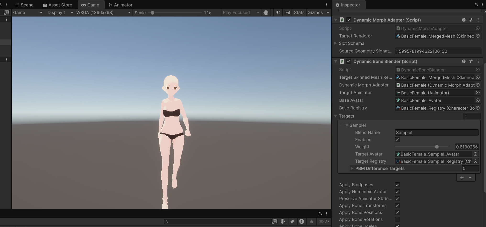

# 第3章: Figure 登録と初期動作確認

[← チュートリアル目次へ戻る](./index.html) ｜ [← 第2章: 初期 VRM データ生成](./initialvrm.html)

本章では、第2章で作成した **Base VRM（`BasicFemale.vrm`）** と **FBM VRM（`SampleI.vrm`）** を Unity 上の **ShapeSync Editor** に登録し、体型変形が可能な Figure アセットを生成して、アニメーション再生下での初期動作確認を行う手順を解説します。

> [!NOTE]
> Figure 登録において、Mesh Utility 等による事前のメッシュ結合作業は不要です。作成した VRM ファイルをそのまま ShapeSync Editor に登録します。

---

## 1. はじめに（ビギナー向け用語集と基本概念）

作業に入る前に、本章で使用する基本概念を説明します。

* **ShapeSync Editor**: ShapeSync のアセット登録・編集・生成を一括して行う専用のエディタウィンドウです。Unity 上部メニューから起動します。
* **Database（データベース）**: Figure、Material、Texture、Shape などの登録データをまとめて管理するオーサリング用データです（拡張子: `.prefab`）。※Runtime そのものではなく、作成・編集用の設定アセットです。
* **Entry（エントリ）**: Database 内に登録された個々のモデルやマテリアルなどの実体を、識別用の論理名（Name）で扱うための管理単位です。Entry 名を変更しても、元の source asset は変更されません。
* **Draft（ドラフト）と Save**: ShapeSync Editor で行った変更は一時的に Draft（下書き）として保持されます。各セクションの `Save to Database` を実行することで Database に確定保存されます。
* **Generate（生成）**: Database の設定に基づいて、Unity で実際に使用できる Figure Prefab などのアセットを出力する操作です。元の入力アセット（VRM 等）は変更されず、既存出力を更新する際は GUID が維持されます。
* **DynamicBoneBlender**: 生成された Figure にアタッチされ、FBM（体型変形）の weight 値をリアルタイムに制御する Unity コンポーネントです。

---

## 2. ShapeSync Editor の起動と Database の作成

まずは ShapeSync Editor を起動し、作業データを保存する Database を作成します。

1. Unity エディタの上部メニューから **Tools > zgock > ShapeSync > ShapeSync Editor** を選択して開きます。
2. **General** 画面が表示されます。
3. `Database` フィールドの横にある **`New Database`** ボタンをクリックします。
4. **`Create ShapeSync Database`** 保存ウィンドウが表示されるので、保存先フォルダを選択し、初期ファイル名（`ShapeSyncDatabase.prefab`）のまま保存します。


*▲図 3-1: ShapeSync Editor の General 画面と Database 作成ダイアログ*

---

## 3. Base モデル（Figure）の登録

基準となる標準体型モデル（`BasicFemale.vrm`）を Figure として登録します。

1. ShapeSync Editor 内の左側ツリーから **`Figure`** セクションを選択します。
2. **`Figure Name`** に、登録する論理名（`BasicFemale`）を入力します。
3. **`Figure prefab`** フィールドに、Project ウィンドウの `Assets/VRM/BasicFemale.vrm` をドラッグ＆ドロップして指定します。
4. 下部の **`Save to Database`** ボタンをクリックして、Figure の設定を Database に保存します。


*▲図 3-2: Figure セクションで BasicFemale.vrm を指定し Save to Database を実行*

---

## 4. Material Entry の整理と命名

Figure 登録後、Database 内でマテリアルを論理名で正しく管理するため、Material Entry の名前を整理します。

1. ShapeSync Editor 内の左側ツリーから **`Figure > Materials`** セクションを選択します。
2. 既定の Entry 名を、上から順に以下の **9つの固定名** に変更します。
   1. `Mouth`
   2. `Iris`
   3. `Highlight`
   4. `Face`
   5. `EyeWhite`
   6. `Brow`
   7. `Eyelash`
   8. `Eyeline`
   9. `Body`
3. 下部の **`Save to Database`** ボタンをクリックして確定保存します。


*▲図 3-3: Materials セクションで 9 件の Material Entry 名を変更して保存*

> [!TIP]
> Entry 名は ShapeSync の Database 内で論理的に扱うための識別名です。Entry 名を変更しても、元の VRM やマテリアルの source asset 自体は一切変更されません。

---

## 5. FBM 軸（SampleI）の登録

体型変形用の FBM モデル（`SampleI.vrm`）を FBM 軸として登録します。

1. ShapeSync Editor 内の左側ツリーから **`Figure > FBMs`** セクションを選択し、**`Register FBMs`** 画面を開きます。
2. **`Add FBM Entry`** ボタンをクリックして、新しい FBM 行を追加します。
3. 追加された行の **`FBM Name`** に `SampleI` と入力します。
4. **`Source Prefab`** フィールドに、Project ウィンドウの `Assets/VRM/SampleI.vrm` をドラッグ＆ドロップして指定します。
5. **`Import All Materials and Textures`** のチェックボックスを **ON（チェックあり）** にします。
   > [!NOTE]
   > この項目は初期状態では OFF になっています。第5章で扱う「Skin Shape（肌の質感や色味の調整）」で参照するために、FBM 側のマテリアルとテクスチャを取り込む目的で有効化します。
6. 下部の **`Save to Database`** をクリックして設定を確定します。


*▲図 3-4: FBMs セクションで SampleI を追加し、Import All Materials and Textures を ON にして保存*

---

## 6. Generate の実行と Figure アセットの出力

登録したデータから、体型変形に対応した Figure アセットを出力（Generate）します。

1. ShapeSync Editor 内の左側ツリーから **`Generation`** セクションを選択します。
2. 各出力フォルダー設定（`Registries/`、`Bindings/`、`Materials/`、`Textures/`、`Outfits/`、`VRM/`）は **既定のまま変更しません**。
3. 下部の **`Generate`** ボタンをクリックします（※このセクションの `Save to Database` は使用しません）。
4. **`Generate ShapeSync Figure`** 保存ウィンドウが表示されるので、出力先となるルートフォルダを選択します。
5. 出力ルートの直下に **Figure Prefab** が生成されます。


*▲図 3-5: Generation セクションで既定設定のまま Generate を実行*

---

## 7. Scene 配置と CC0 Animation による初期動作確認

生成された Figure を Scene に配置し、アニメーション再生下で体型がスムーズに変形することを確認します。

### 動作確認用アニメーションの準備
動作確認には、配布用の CC0 1.0 ライセンスのアニメーションパッケージを使用します。

1. [CC0Animation.unitypackage](../CC0Animation.unitypackage) をダウンロードし、Unity プロジェクトにインポートします。
   * パッケージには `Walking.controller`、`T-pose.controller`、アニメーション FBX、および `LICENCE.txt` が含まれています。

### 初期動作確認手順
1. Project ウィンドウで出力された **Figure Prefab** を選択し、Scene ビュー（または Hierarchy ウィンドウ）へドラッグ＆ドロップして配置します。
2. 配置した Figure の GameObject を選択し、Inspector の **`Animator`** コンポーネントにある `Controller` に **`Walking.controller`** を割り当てます。
3. Unity の **Play ボタン（再生ボタン）** を押して Play Mode に入ります。
4. Scene / Game ビューで、キャラクターの歩行アニメーションが再生されていることを確認します。
5. 歩行を再生したまま、Figure の Inspector にある **`DynamicBoneBlender`** コンポーネントを開きます。
6. `blendName` が **`SampleI`** となっている対象行の **`weight`** スライダーを `0` から `1` に動かします。
7. **歩行アニメーションが途切れることなく継続したまま、キャラクターの体型がスムーズに変形すること** を確認します。


*▲図 3-6: Play Mode で Walking.controller 再生中に SampleI の weight を操作して体型変化を確認*

---

## 8. よくあるトラブルと解決策（トラブルシューティング）

### Q1. Generate 実行時に `FigureGenerateMeshBuildFailed` が表示される
* **症状**:
  Generate 実行時に以下の診断メッセージが表示されて生成に失敗する。
  ```text
  FigureGenerateMeshBuildFailed: FigureMeshBuildInvalid: FBM topology does not match Base: SampleI
  code=DomainFailure; domain=figure-generate; domainCode=FigureMeshBuildInvalid; tokenIndex=-1; instructionPointer=-1; wordId=<none>; bindingName=<none>; detail=<none>
  ```
* **確認事項と対処**:
  Base と FBM のメッシュ構成が一致していない場合に発生します。FBM 用 VRM に意図しないアクセサリー、髪型パーツ、衣装の消し残しがないか確認してください。[第2章: 初期 VRM データ生成](./initialvrm.html) に戻り、Base と FBM の双方で全装飾パーツの除去およびポリゴン削減オプションが OFF になっていることを確認し、VRM 1.0 として再エクスポートして再登録してください。


*▲図 3-7: Generate 失敗時に表示される診断メッセージ例*

### Q2. Play Mode で歩行アニメーションが再生されない
* **原因**:
  Figure の `Animator` コンポーネントに `Controller` が割り当てられていないか、Animator が無効になっています。
* **解決策**:
  Inspector で `Animator` コンポーネントの `Controller` フィールドに `Walking.controller` が指定されているか確認してください。

---

[← チュートリアル目次へ戻る](./index.html) ｜ [← 第2章: 初期 VRM データ生成](./initialvrm.html)
