# 第7章: 高度な Outfit 登録と Collection（靴の変形・位置補正）

[← チュートリアル目次へ戻る](./index.html) ｜ [← 第6章: 高度な Figure 登録と局所変形（PBM）](./pbmregistration.html)

本章では、キャラクターが靴（ヒールや厚底など）を履く際に生じる足首の角度や腰の高さのずれを補正する **Collection（コレクション）** 機能の手順を解説します。

* **前半（VRoid Studio）**: サンプルモデルから靴をカスタムアイテム化し、Base 素体および FBM 素体に着用させて靴用 VRM（計 2 個）をエクスポートします。
* **後半（Unity / ShapeSync）**: Scene 上で位置のずれを確認した上で、ShapeSync Editor にて `Shoes1` を登録し、Collection 用素体 Prefab の姿勢（Hip Y / Foot X 回転）を調整・Override 保存して **Full Collection（頂点 Projection 有効）** を設定し、Fit 動作確認を行います。

---

## 1. はじめに（靴の位置・姿勢ずれと Collection の概念）

* **靴による姿勢のずれ**: ヒール付きの靴や厚底靴を着用すると、素体のデフォルト立ちポーズに対して足首の角度（Foot の傾き）や腰の高さ（Hip Y）が変化します。
* **Collection 機能**: 素体の姿勢を靴に合わせて調整した Prefab を登録することで、衣装着用時に自動的に骨の姿勢やメッシュ頂点を追従・補正する機能です。
* **`Bone` と `Full` の違い**:
  * **`Bone`**: 骨（ボーン）の位置・回転のみを補正します。
  * **`Full`**: 骨の補正に加えて、身体メッシュ頂点の変形（Projection）も合わせて行います。本章では靴への確実なフィットのため **`Full`** を使用します。

---

## 2. 靴のカスタムアイテム化と着用 VRM のエクスポート（VRoid Studio）

まずは VRoid Studio を使用して、モデルから靴を取り出して Base / FBM 素体に着用させ、VRM をエクスポートします。

### 2.1 靴のカスタムアイテム化
1. VRoid Studio を起動し、プリセットモデル **`AvatarSample_I`** を開きます。
2. 上部メニューの **`衣装`** タブを選択し、左側メニューから **`靴`** を選択します。
3. カテゴリを **`カスタム`** に切り替え、表示されている靴の項目で **`カスタムアイテムとして保存`** をクリックします。

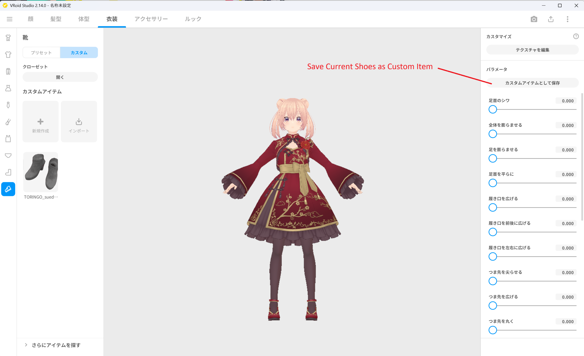
*▲図 7-1: AvatarSample_I を開き、衣装 ＞ 靴 ＞ カスタムアイテムとして保存を選択*

### 2.2 `Shoes1BasicFemale.vrm` のエクスポート
1. 第2章で作成した素体モデル **`BasicFemale.vroid`** を開きます。
2. **`衣装`** タブ ＞ **`靴`** ＞ **`カスタム`** から、先ほど保存した靴アイテムを選択して着用させます。

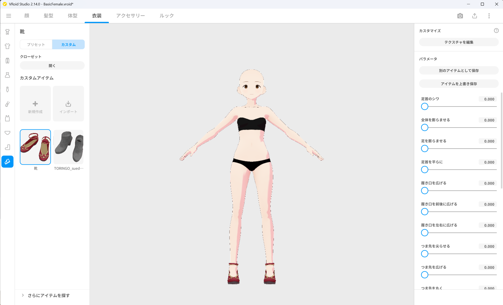
*▲図 7-2: BasicFemale を開き、カスタム靴を着用させる*

3. 右上のエクスポートボタンから **`VRMエクスポート`** を選択します。
4. **`VRM1.0`** を選択し、エクスポート情報（ポリゴン数: **`20706`**、マテリアル数: **`10`**、ボーン数: **`59`**）を確認します。

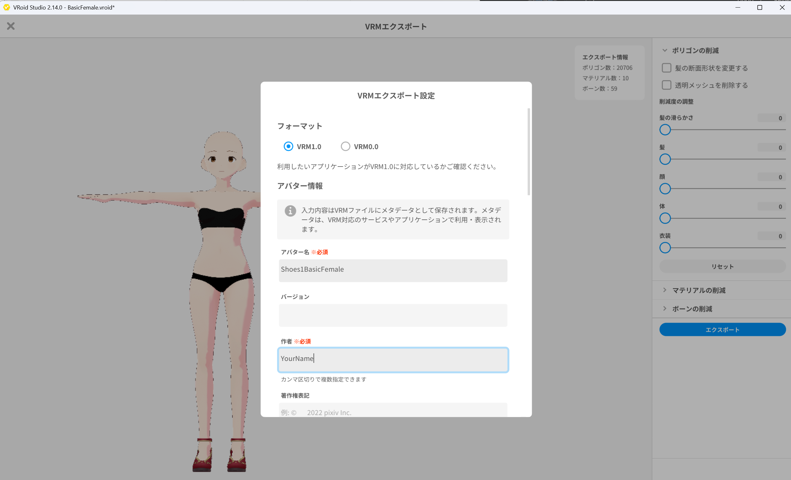
*▲図 7-3: ポリゴン数・マテリアル数・ボーン数を確認し Shoes1BasicFemale.vrm としてエクスポート*

5. アバター名に `Shoes1BasicFemale` と入力し、Unity プロジェクト内へ **`Shoes1BasicFemale.vrm`** としてエクスポートします。

### 2.3 `Shoes1SampleI.vrm` のエクスポート
1. 続けて、FBM 素体モデル **`SampleI.vroid`** を開きます。
2. **`衣装`** タブ ＞ **`靴`** ＞ **`カスタム`** から、同じ靴アイテムを選択して着用させます。

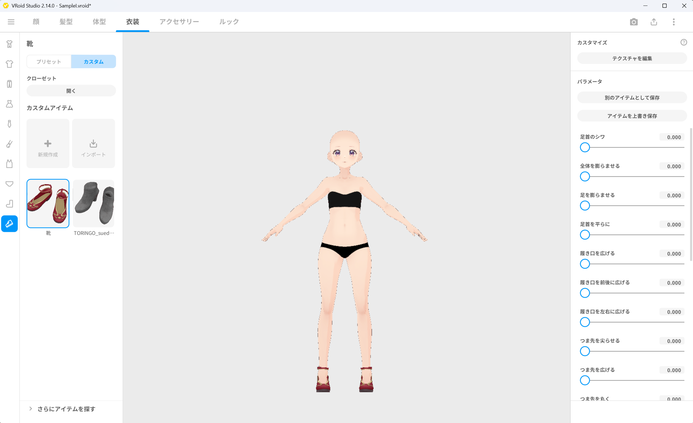
*▲図 7-4: SampleI を開き、カスタム靴を着用させる*

3. 右上のエクスポートボタンから **`VRMエクスポート`**（VRM 1.0）を選択し、エクスポート情報（ポリゴン数: **`20706`**、マテリアル数: **`10`**、ボーン数: **`59`**）を確認します。

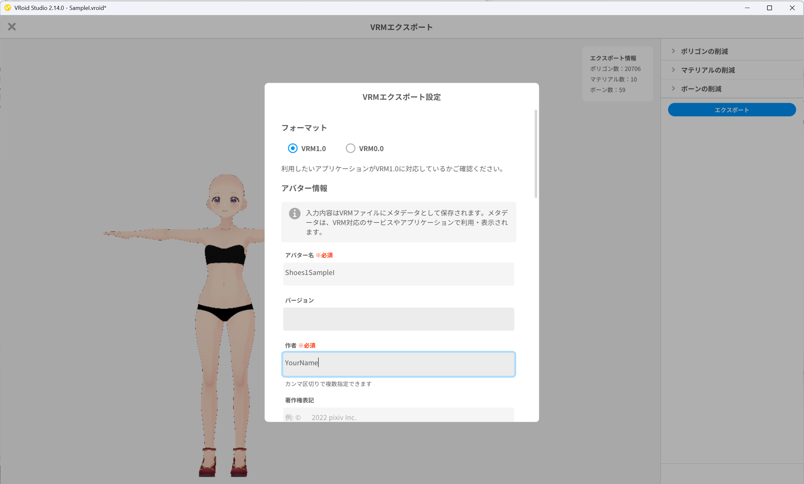
*▲図 7-5: ポリゴン数・マテリアル数・ボーン数を確認し Shoes1SampleI.vrm としてエクスポート*

4. アバター名に `Shoes1SampleI` と入力し、Unity プロジェクト内へ **`Shoes1SampleI.vrm`** としてエクスポートします。

---

## 3. Scene での位置・姿勢のずれ確認

Unity エディタに戻り、素体と靴の初期状態での位置関係を確認します。

1. Unity の Scene に、素体 **`BasicFemale.vrm`** と靴 **`Shoes1BasicFemale.vrm`** を配置します。
2. 両方の Transform Position を同一座標 **`(0, 0, 0)`** に設定します。
3. Scene ビューで足元を確認すると、素体の足と靴の位置・姿勢が一致せず、大きくずれている状態が確認できます。このずれを補正するために Collection を使用します。

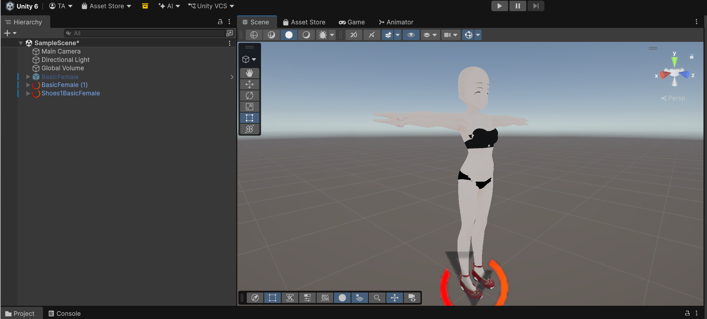
*▲図 7-6: BasicFemale と Shoes1BasicFemale を同一座標 (0,0,0) に配置し、足元や腰の位置ずれを確認*

---

## 4. Outfit（`Shoes1`）の登録と Materials 分類

書き出した靴 VRM を ShapeSync Editor に登録します。

1. Unity エディタの上部メニューから **Tools > zgock > ShapeSync > ShapeSync Editor** を開きます。
2. 左側 TreeView から **`Outfits`** を選択します。
3. **`Outfit Id`** に **`Shoes1`**、**`Outfit Name`** に **`Shoes1`** と入力し、**`Create Mesh Outfit`** ボタンをクリックします。
4. 作成された **`Outfits > Mesh Outfits > Shoes1`** を選択します。
5. **`Outfit Prefab`** に、Project ウィンドウの **`Shoes1BasicFemale.vrm`** をドラッグ＆ドロップして指定し、画面下部の **`Save to Database`** をクリックします。
6. 次に TreeView から **`Shoes1 > Materials`**（Mesh Outfit Materials）を開きます。
7. 一覧にある顔や身体などの身体部分のマテリアル行の **`Classification`** を、`Exclude` ではなく **`Projection`** に設定します。
8. 靴自体のマテリアル（`Shoes_01_CLOTH`）は **`Include`** のまま、Entry Name を **`Shoes1`** に設定し、画面下部の **`Save to Database`** をクリックします。
   > [!IMPORTANT]
   > 身体部分を `Projection` に分類することで、後述する Full Collection の頂点補正（Projection）が有効になります。

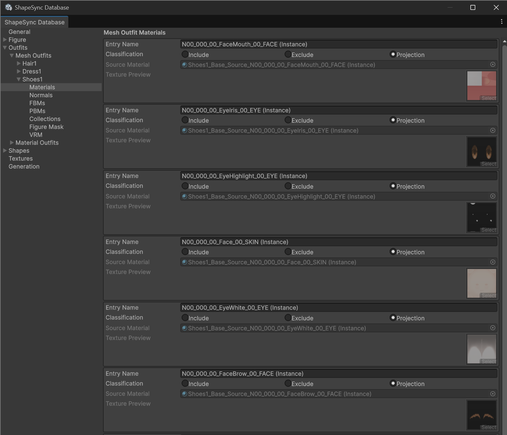
*▲図 7-7-1: Shoes1 ＞ Materials で顔や目などの身体マテリアルを Projection に設定*

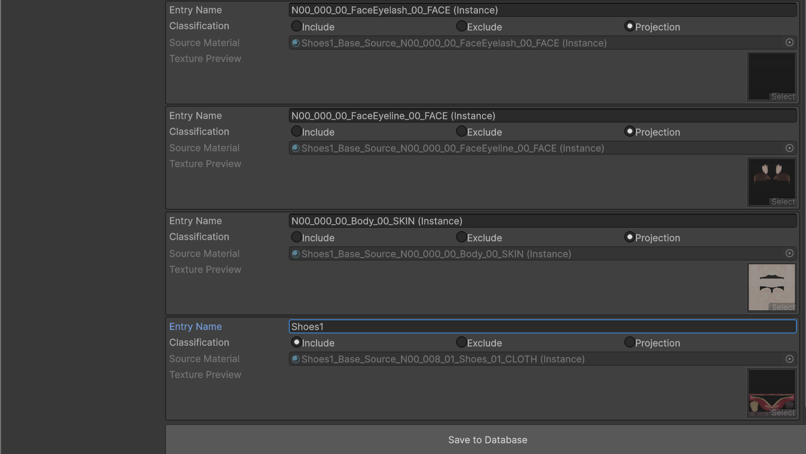
*▲図 7-7-2: Body_00_SKIN を Projection、靴マテリアルを Include（Entry Name: Shoes1）に設定して Save to Database*

9. TreeView から **`Shoes1 > FBMs`** を開きます。
10. 既存の Figure FBM 軸 **`SampleI`** の行にある **`FBM Prefab`** に、Project ウィンドウの **`Shoes1SampleI.vrm`** をドラッグ＆ドロップして指定し、画面下部の **`Save to Database`** をクリックします。

---

## 5. Collection 用素体 Prefab の Export と姿勢調整

素体の姿勢を靴に合わせて調整した Collection 用 Prefab を作成します。

### 5.1 Prefab の Export
1. TreeView の **`Figure`**（Base 画面）を開き、`Prefab on Database` 行の **`Export`** ボタンをクリックします。
2. 「Export Figure Prefab」ダイアログで、保存先に **`Assets/ShapeSync/Collection/Shoes1/BasicFemale.prefab`** を指定して保存します（既定のファイル名を維持します）。
3. TreeView の **`Figure > FBMs`** で `SampleI` 行を開き、`Prefab on Database` の **`Export`** ボタンをクリックします。
4. 「Export FBM Prefab」ダイアログで、保存先に **`Assets/ShapeSync/Collection/Shoes1/SampleI.prefab`** を指定して保存します。
5. 同様に、**`Shoes1`** の Base 画面の `Outfit Prefab on Database` 行にある **`Export`** から **`Assets/ShapeSync/Collection/Shoes1/Shoes1BasicFemale.prefab`** を保存します。
6. **`Shoes1 > FBMs`** の `SampleI` 行にある `Outfit Prefab` の **`Export`** から **`Assets/ShapeSync/Collection/Shoes1/Shoes1SampleI.prefab`** を保存します。

*▲図 7-8-1: Assets/ShapeSync/Collection/Shoes1/ に 4 つの Prefab が Export された状態*

### 5.2 Scene 上での姿勢調整と Override 保存
1. Scene 上に、作成した Collection 用素体 **`BasicFemale.prefab`** と比較用の靴 **`Shoes1BasicFemale.prefab`** を配置し、両方を **`(0, 0, 0)`** に置きます。

*▲図 7-8-2: BasicFemale（Collection用）と Shoes1BasicFemale を Scene 上の同一座標に配置*

2. 靴 Prefab（`Shoes1BasicFemale`）の `Root/J_Bip_C_Hips` の Position Y 座標（例: **`0.9225485`**）を確認します。

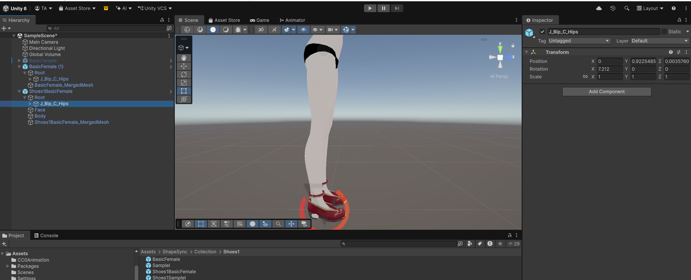
*▲図 7-8-3: Shoes1BasicFemale の J_Bip_C_Hips の Position Y 座標（0.9225485）を確認*

3. Collection 用素体（`BasicFemale`）の `Root/J_Bip_C_Hips` の Position Y 座標へ、確認した値（**`0.9225485`**）をコピーして入力します。

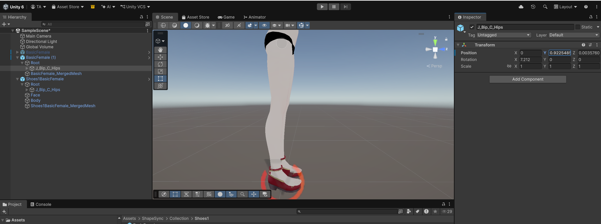
*▲図 7-8-4: BasicFemale の J_Bip_C_Hips の Position Y に 0.9225485 を入力*

4. Collection 用素体の左右の足首ボーン（`J_Bip_L_Foot` および `J_Bip_R_Foot`）の **Rotation X** を、靴の傾きにぴったり合うよう調整します（例: Rotation X = **`3.71`**）。

*▲図 7-8-5: BasicFemale の J_Bip_R_Foot の Rotation X を 3.71 に設定して靴の傾きに合わせる*

5. 調整が完了したら、Hierarchy で Collection 用素体（`BasicFemale`）を選択し、Inspector 右上の **`Overrides`** ドロップダウンから **`Apply All`** をクリックして Prefab へ上書き保存します。
   > [!WARNING]
   > Override の保存（Apply All）を行わないと、調整した姿勢が Collection の補正に反映されません。また、専用の別 Prefab は作成せず、必ずこの `BasicFemale.prefab` に保存してください。

*▲図 7-8-6: Inspector の Overrides ドロップダウンから Apply All をクリックして BasicFemale.prefab へ上書き保存*

6. 同様に、**`SampleI.prefab`** と **`Shoes1SampleI.prefab`** を Scene に配置し、Hip Y のコピーと左右 Foot X 回転の調整を行って **`SampleI.prefab`** へ Override 保存（Apply All）します。

---

## 6. Collection の設定（`Full` と `Projection`）

調整した Prefab を ShapeSync Editor の Collection 設定に登録します。

1. ShapeSync Editor の左側 TreeView から **`Outfits > Mesh Outfits > Shoes1 > Collections`** を選択します。
2. **`Collection`** ドロップダウンで **`Full`** を選択します。
3. **`Use Projection for Full Collection`** にチェックを入れて **ON** にします。
4. 各 Collection Prefab を指定します。
   * **`Base Collection Prefab`**: `Assets/ShapeSync/Collection/Shoes1/BasicFemale.prefab`
   * **`SampleI Collection Prefab`**: `Assets/ShapeSync/Collection/Shoes1/SampleI.prefab`
5. 画面最下部の **`Save to Database`** ボタンをクリックして保存します。

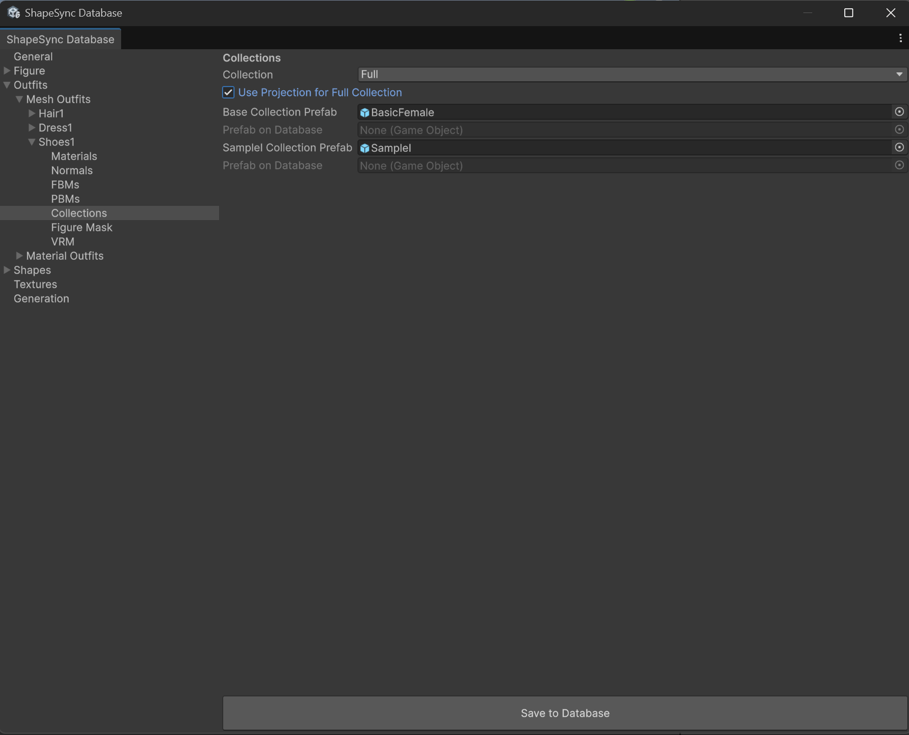
*▲図 7-9: Collection を Full に設定し、Use Projection for Full Collection を ON、Base/SampleI Collection Prefab を指定して Save to Database*

---

## 7. Outfit Shape の登録と Generate の実行

靴用の Outfit Shape を作成し、Shape Template を生成します。

1. ShapeSync Editor の左側 TreeView から **`Shapes`** を選択します。
2. **`Shape Id`** に **`outfitShoes1`**、**`Shape Name`** に `outfitShoes1` と入力し、**`Create Outfit Shape Template`** ボタンをクリックします。
3. TreeView の **`Shapes > Outfit Shapes > outfitShoes1`** を開きます。
4. **`Add Mesh`** ボタンをクリックし、**`Outfit Mesh`** に **`Shoes1`** を指定します。
5. 画面下部の **`Save to Database`** ボタンをクリックして保存します。

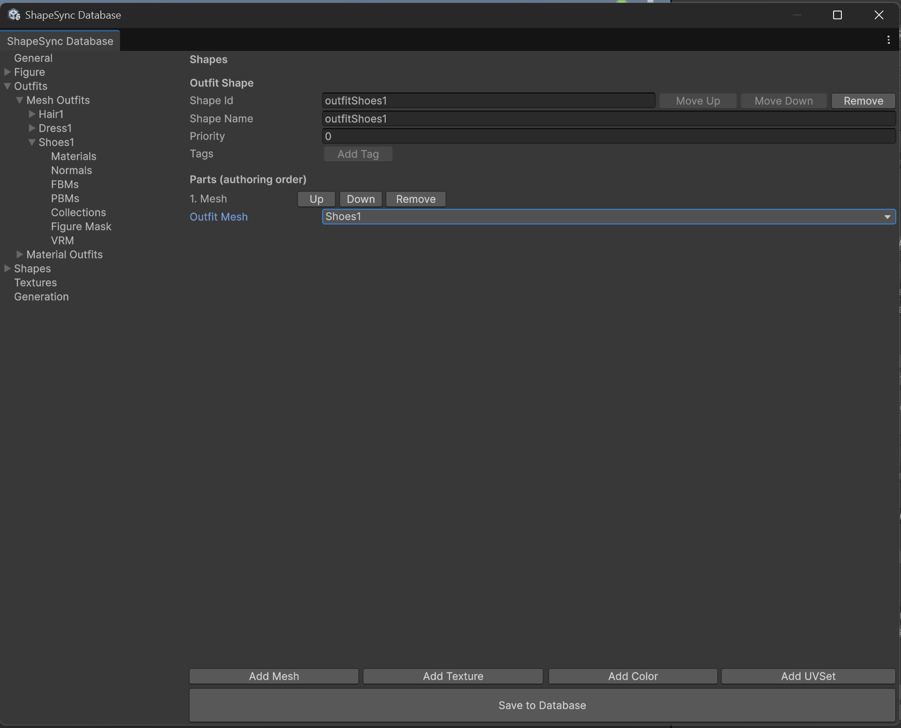
*▲図 7-10-1: outfitShoes1 の Outfit Shape で Outfit Mesh に Shoes1 を指定して Save to Database*

6. TreeView から **`Generation`** セクションを選択します。
7. 各出力相対パスは既定値のまま、画面下部の **`Generate`** ボタンをクリックします。
8. 出力ルートフォルダー（`Assets/ShapeSync/Generated`）を選択して「フォルダーの選択」をクリックし、生成を実行します。

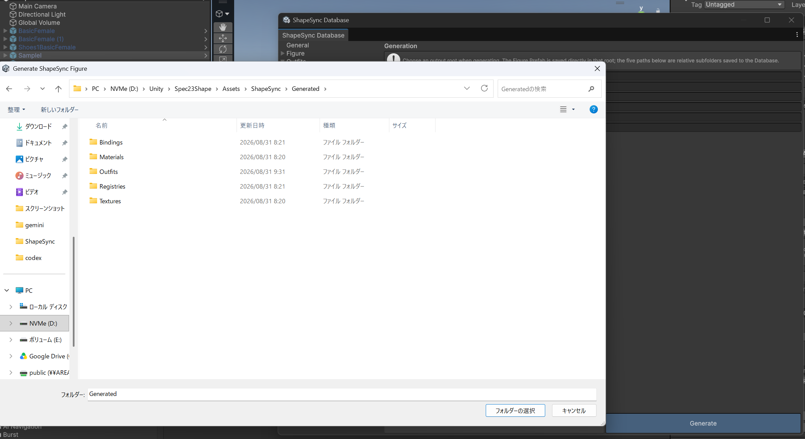
*▲図 7-10-2: Generation セクションで Generate をクリックし、出力ルートフォルダー（Generated）を選択して生成を実行*

---

## 8. Scene 配置と Shape Director による動作確認、Poke の確認

Scene 上の Figure に靴を適用し、Fit 状態と残存する課題を確認します。

1. Scene に配置されている Figure（`BasicFemale`）を選択します。
2. Figure の **`ShapeDirector`** コンポーネントの Inspector を確認します。
3. **`Template List`** に、新しく生成された **`outfitShoes1.asset`** をドラッグ＆ドロップして追加します（※登録は Play Mode 開始前に行います）。
4. Figure の `Animator` に `Walking.controller` が割り当てられていることを確認し、Unity の **Play ボタン** を押して **Play Mode** に入ります。
5. 歩行アニメーション再生中に、靴の位置や足首の角度が自然に Fit し、歩行に合わせて正しく追従することを確認します。

*▲図 7-11-1: Play Mode で歩行アニメーション再生中、靴の位置・角度が正しく Fit して追従している様子*

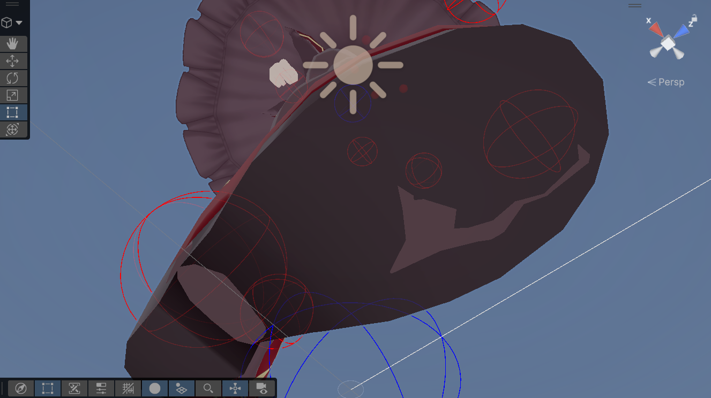
*▲図 7-11-2: ドレス下部から見た靴と足の追従状態*

6. 足元を拡大して詳細に観察すると、靴のつま先部分など一部に素体の肌/爪がわずかに突き出る現象（**Poke**）が確認できます。

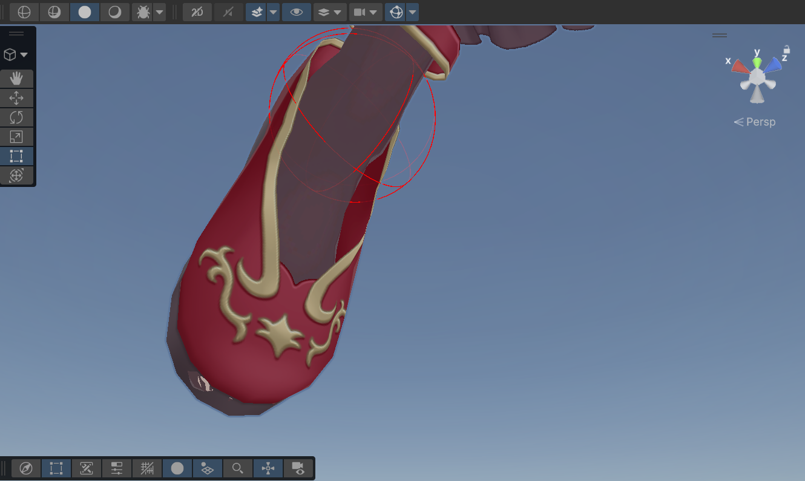
*▲図 7-11-3: 靴のつま先先端から素体の肌がわずかに突き出ている Poke の状態*

> [!NOTE]
> このつま先に残存する Poke は、次章（第8章）で解説する **Figure Mask（マスク）** 機能を使用することで完全に解消します。

---

## 9. よくあるトラブルと解決策（トラブルシューティング）

### Q1. Play Mode に入っても靴の位置や足首の角度が補正されない
* **原因**:
  Collection 用素体 Prefab（`BasicFemale.prefab` 等）の姿勢調整後に、Inspector の **`Overrides > Apply All`** による Prefab への上書き保存が行われていない可能性があります。
* **解決策**:
  Scene 上で調整した素体 Prefab を選択し、必ず `Overrides > Apply All` を押して保存してください。その後、ShapeSync Editor の `Generation` で `Generate` を再実行してください。

### Q2. 靴の周りの身体メッシュが綺麗に変形しない
* **原因**:
  `Shoes1 > Materials` で身体部分のマテリアルが `Projection` ではなく `Exclude` に設定されているか、`Collections` 画面で `Use Projection for Full Collection` が有効になっていない可能性があります。
* **解決策**:
  `Shoes1 > Materials` で身体マテリアルが `Projection` になっていること、および `Shoes1 > Collections` で `Full` かつ `Use Projection for Full Collection` が ON になっていることを確認して保存し、再生成してください。

---

[← チュートリアル目次へ戻る](./index.html) ｜ [← 第6章: 高度な Figure 登録と局所変形（PBM）](./pbmregistration.html)
