# 第4章: Outfit 登録と着脱動作確認

[← チュートリアル目次へ戻る](./index.html) ｜ [← 第3章: Figure 登録と初期動作確認](./figureregistration.html)

本章では、キャラクターに着用させる **髪型（`Hair1`）** と **衣装（`Dress1`）** を作成し、ShapeSync Editor に Outfit として登録して、Figure への着脱および体型変形追従を確認する手順を解説します。

* **前半（VRoid Studio）**: プリセットから髪型および衣装を着用させた VRM ファイルを作成・エクスポートします。
* **後半（Unity / ShapeSync）**: エクスポートした VRM を ShapeSync Editor の Database に登録してアセットを生成し、`OutfitAttacher` を使って Figure へ取り付けます。

> [!NOTE]
> 前章（[第3章: Figure 登録と初期動作確認](./figureregistration.html)）で作成した Base VRM（`BasicFemale.vrm`）、FBM 軸（`SampleI.vrm`）、および生成済み Figure Prefab が準備されていることを前提とします。

---

## 1. はじめに（Outfit の基本概念と準備する VRM）

* **Outfit（アウトフィット）**: キャラクターが着用する衣装や髪型などの装飾アセットです。ShapeSync ではメッシュを伴う **Mesh Outfit** として管理します。
* **Mesh Outfit Materials（マテリアルの分類）**: Outfit 登録時、モデルに含まれるマテリアルを「Outfit として残す部分（**`Include`**）」と「Outfit に含めない着用側の身体部分（**`Exclude`**）」に分類します。身体部分を `Exclude` に指定することで、衣装や髪型のメッシュだけが正しく抽出されます。
* **OutfitAttacher**: 生成された Figure にアタッチされ、Play Mode 中に任意の Outfit Prefab を着脱・同期させる Unity コンポーネントです。

### 本章で準備する 4 つの VRM
Outfit は Base 体型用と FBM 体型用の双方が必要となるため、以下の 4 ファイルを作成します。

1. **`Hair1BasicFemale.vrm`**: `BasicFemale`（Base）に髪型を着用させたモデル
2. **`Hair1SampleI.vrm`**: `SampleI`（FBM）に髪型を着用させたモデル
3. **`Dress1BasicFemale.vrm`**: `BasicFemale`（Base）に衣装を着用させたモデル
4. **`Dress1SampleI.vrm`**: `SampleI`（FBM）に衣装を着用させたモデル

---

## 2. カスタムヘアの登録と着用 VRM のエクスポート（VRoid Studio）

まずは VRoid Studio を使用して、プリセットモデルの髪型をカスタムアイテムとして登録し、Base および FBM モデルに着用させてエクスポートします。

### 2.1 `AvatarSample_I` から髪型をカスタムアイテムとして保存
1. VRoid Studio を起動し、プリセットモデル **`AvatarSample_I`** を開きます。
2. 上部メニューの **`髪型`** タブを選択します。
3. 左側メニューから **`前髪`** を選択し、**`カスタム`** タブに切り替えて、着用中の前髪を **`カスタムアイテムとして保存`** します。

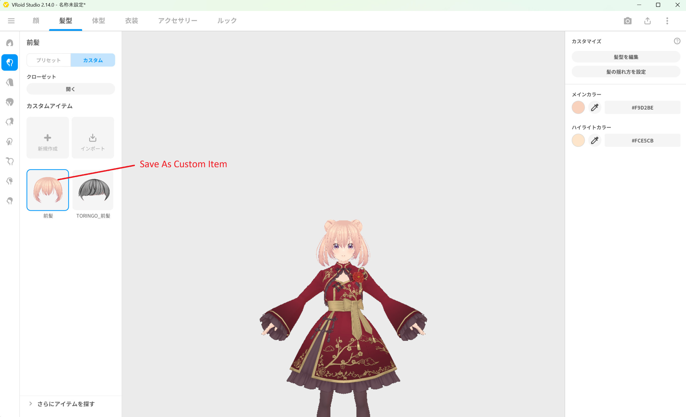
*▲図 4-1: AvatarSample_I の前髪をカスタムアイテムとして保存*

4. 同様に、左側メニューの **`後髪`** を選択し、**`カスタム`** タブから **`カスタムアイテムとして保存`** します。

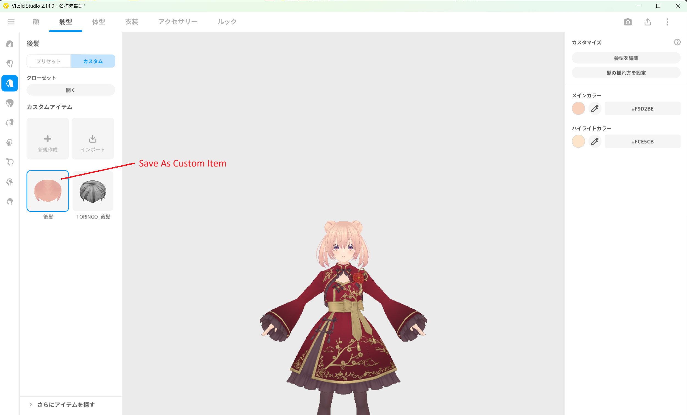
*▲図 4-2: AvatarSample_I の後髪をカスタムアイテムとして保存*

5. 同様に、左側メニューの **`つけ髪`** を選択し、**`カスタム`** タブから **`カスタムアイテムとして保存`** します。

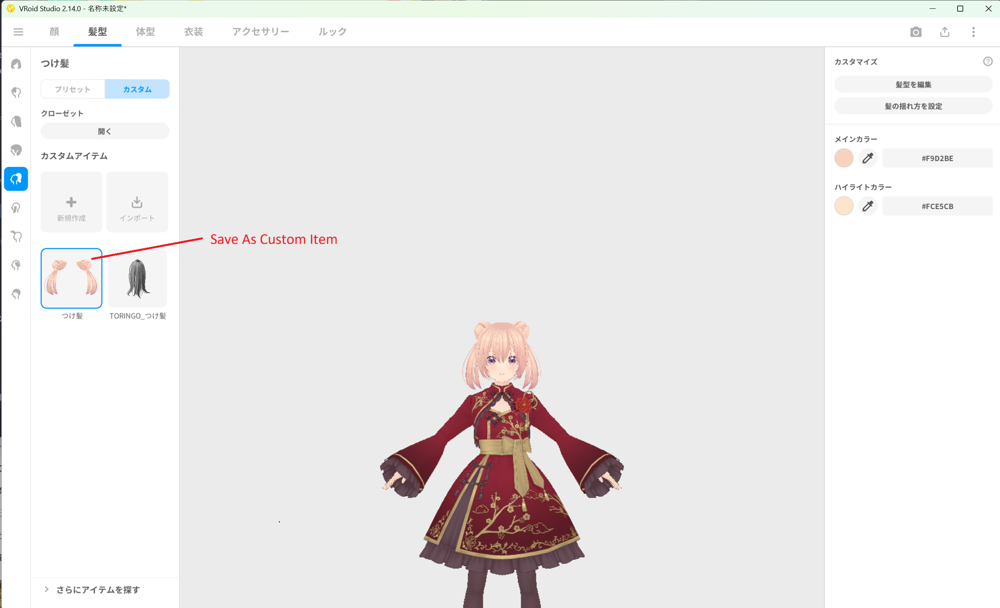
*▲図 4-3: AvatarSample_I のつけ髪をカスタムアイテムとして保存*

---

### 2.2 `SampleI` にカスタムヘアを着用しエクスポート（`Hair1SampleI.vrm`）
1. 第2章で作成した **`SampleI.vroid`**（素体モデル）を開きます。
2. **`髪型`** タブを開き、2.1 で登録した 3 つのカスタムアイテム（前髪・後髪・つけ髪）をそれぞれ選択して着用させます。

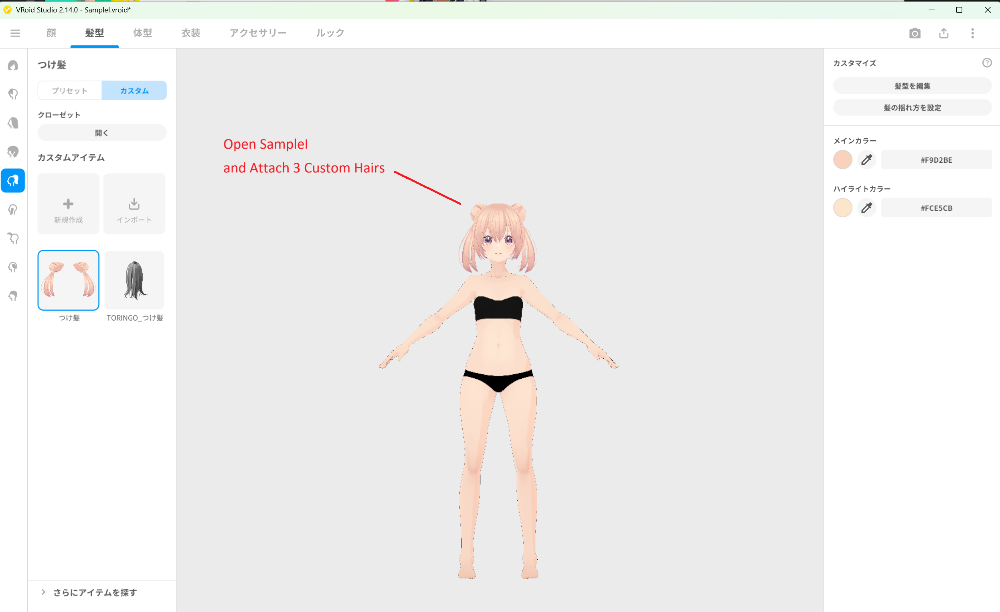
*▲図 4-4: SampleI.vroid に登録した 3 つのカスタムヘアを着用*

3. 画面右上のエクスポートボタンから **`VRMエクスポート`** を選択します。
4. 右側のエクスポート設定で、**すべてのポリゴン削減オプションが OFF（チェックなし・削減度 0）** になっていることを確認します。
   * エクスポート情報（目安: ポリゴン数 `42006` / マテリアル数 `12` / ボーン数 `95`）を確認します。

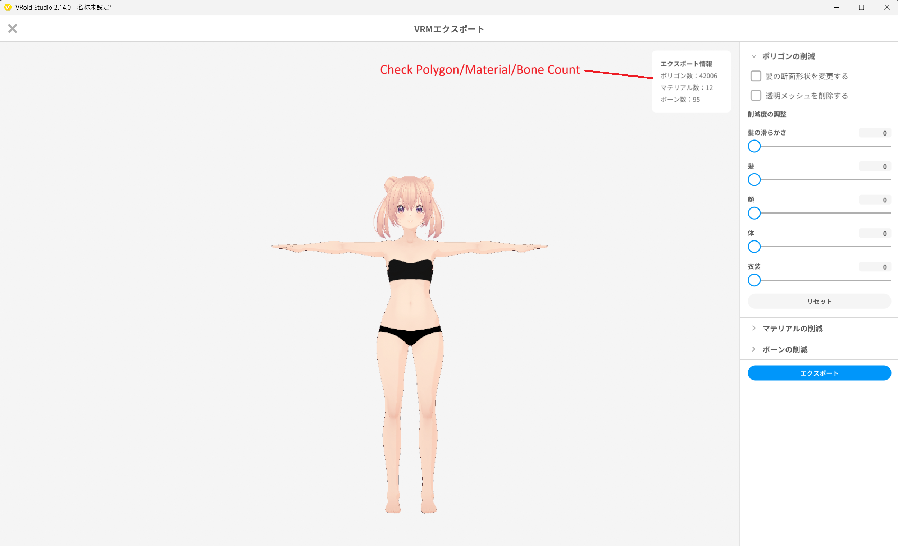
*▲図 4-5: ポリゴン削減全 OFF とエクスポート情報を確認*

5. **`エクスポート`** ボタンをクリックし、フォーマットで **`VRM1.0`** を選択、アバター名に **`Hair1SampleI`** と入力してエクスポートします。
   * 保存先: `Assets/VRM/Hair1SampleI.vrm`

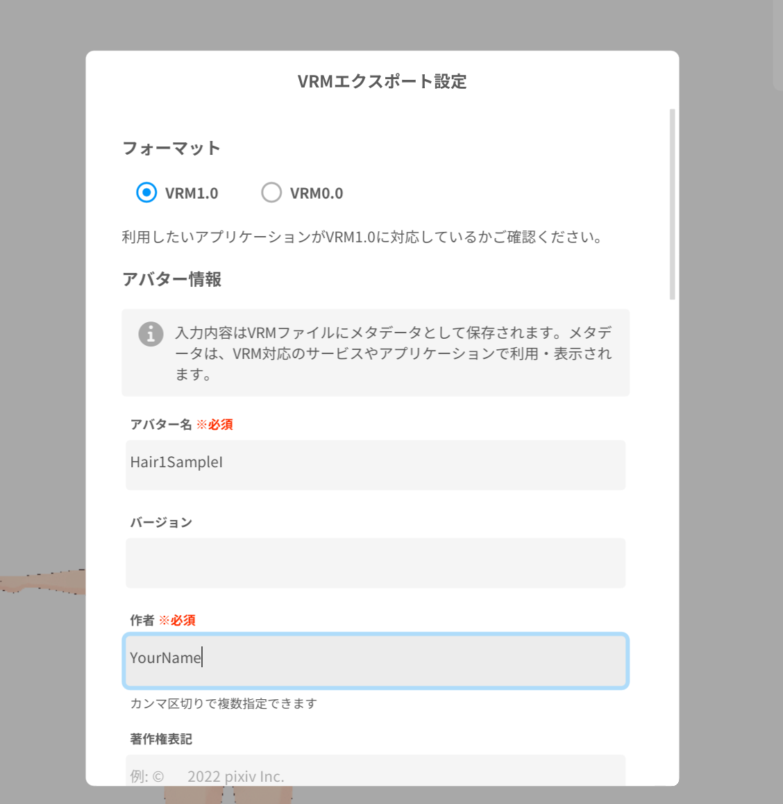
*▲図 4-6: フォーマット VRM1.0、アバター名 Hair1SampleI でエクスポート*

---

### 2.3 `BasicFemale` にカスタムヘアを着用しエクスポート（`Hair1BasicFemale.vrm`）
1. 第2章で作成した **`BasicFemale.vroid`**（素体モデル）を開きます。
2. **`髪型`** タブを開き、登録した 3 つのカスタムヘア（前髪・後髪・つけ髪）を着用させます。
3. **`VRMエクスポート`** を開き、ポリゴン削減オプションがすべて OFF であること、およびエクスポート情報（目安: ポリゴン数 `40406` / マテリアル数 `12` / ボーン数 `95`）を確認します。

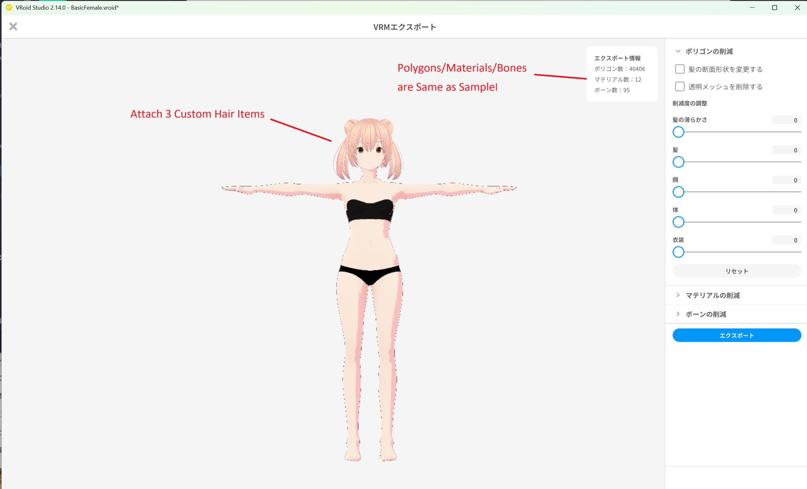
*▲図 4-7: BasicFemale にカスタムヘアを着用し、ポリゴン削減全 OFF と情報を確認*

4. フォーマットで **`VRM1.0`** を選択、アバター名に **`Hair1BasicFemale`** と入力してエクスポートします。
   * 保存先: `Assets/VRM/Hair1BasicFemale.vrm`

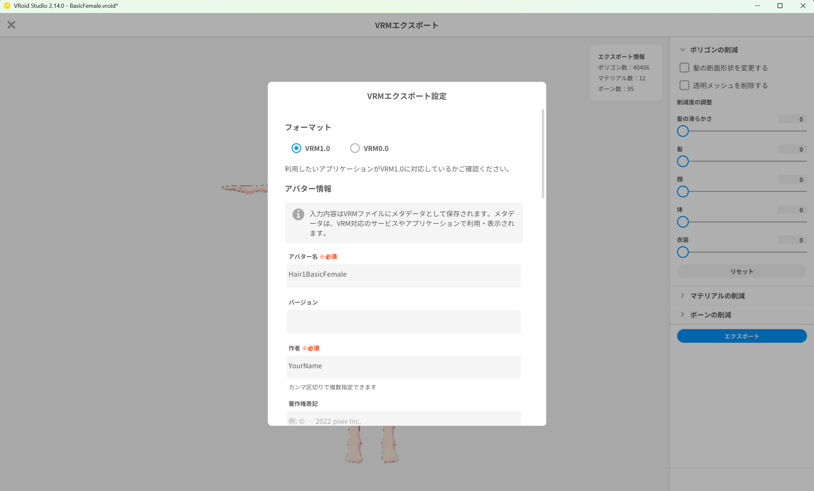
*▲図 4-8: フォーマット VRM1.0、アバター名 Hair1BasicFemale でエクスポート*

---

## 3. プリセットドレスの着用と衣装 VRM のエクスポート（VRoid Studio）

続いて、ワンピースプリセットのドレスを Base および FBM モデルに着用させてエクスポートします。

### 3.1 `BasicFemale` にドレスを着用しエクスポート（`Dress1BasicFemale.vrm`）
1. **`BasicFemale.vroid`** を開きます（※髪型は素体のまま、または外した状態にします）。
2. 上部メニューの **`衣装`** タブを選択し、左側メニューから **`ワンピース`** を選択します。
3. **`プリセット`** から `AvatarSample_I` のドレス（中華風ドレス）を選択して着用させます。

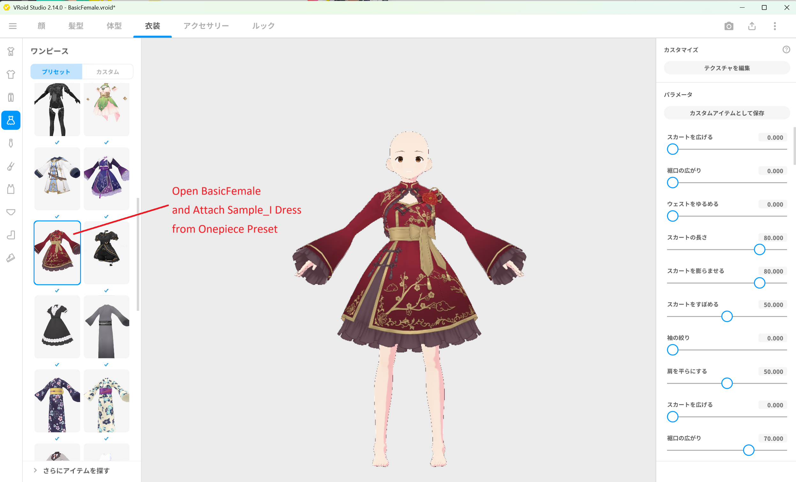
*▲図 4-9: BasicFemale.vroid にワンピースプリセットからドレスを着用*

4. **`VRMエクスポート`** を開き、ポリゴン削減がすべて OFF であること、およびエクスポート情報（目安: ポリゴン数 `32368` / マテリアル数 `14` / ボーン数 `159`）を確認します。
5. フォーマット **`VRM1.0`**、アバター名 **`Dress1BasicFemale`** と入力してエクスポートします。
   * 保存先: `Assets/VRM/Dress1BasicFemale.vrm`

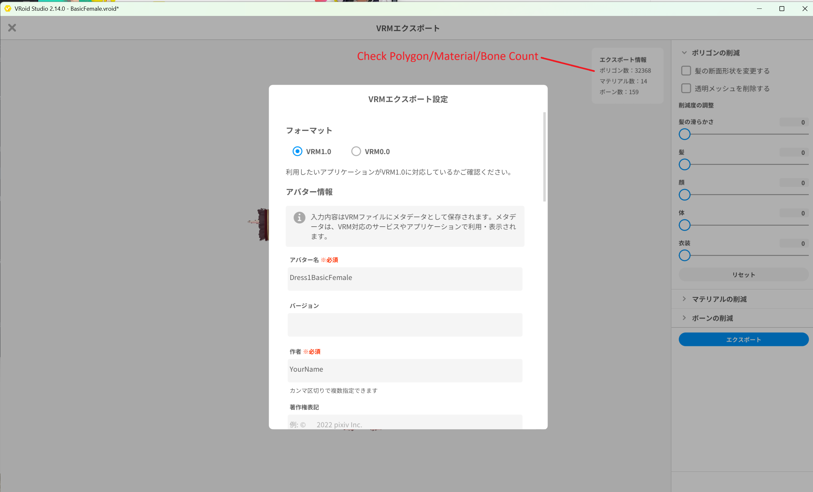
*▲図 4-10: フォーマット VRM1.0、アバター名 Dress1BasicFemale でエクスポート*

---

### 3.2 `SampleI` にドレスを着用しエクスポート（`Dress1SampleI.vrm`）
1. **`SampleI.vroid`** を開きます。
2. **`衣装`** タブ ＞ **`ワンピース`** ＞ **`プリセット`** から同様にドレスを選択して着用させます。

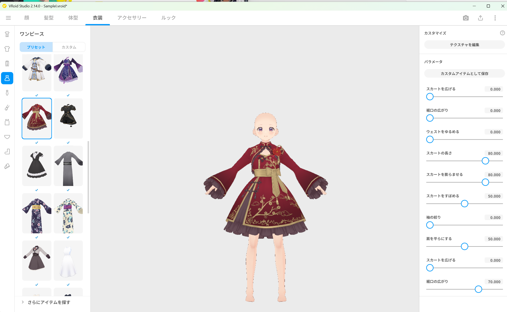
*▲図 4-11: SampleI.vroid にワンピースプリセットからドレスを着用*

3. **`VRMエクスポート`** を開き、ポリゴン削減がすべて OFF であること、およびエクスポート情報（目安: ポリゴン数 `32368` / マテリアル数 `14` / ボーン数 `159`）を確認します。
4. フォーマット **`VRM1.0`**、アバター名 **`Dress1SampleI`** と入力してエクスポートします。
   * 保存先: `Assets/VRM/Dress1SampleI.vrm`

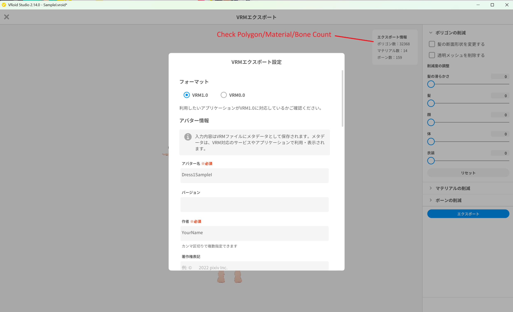
*▲図 4-12: フォーマット VRM1.0、アバター名 Dress1SampleI でエクスポート*

---

## 4. ShapeSync Editor での Outfit 登録

エクスポートした 4 つの VRM を Unity プロジェクトに取り込み、ShapeSync Editor を使って Database に登録します。

### 4.1 髪型 Outfit（`Hair1`）の登録
1. Unity エディタの上部メニューから **Tools > zgock > ShapeSync > ShapeSync Editor** を開きます。
2. 左側 TreeView から **`Outfits`** を選択します。
3. **`Outfit Id`** に `Hair1`、**`Outfit Name`** に `Hair1` と入力し、**`Create Mesh Outfit`** ボタンをクリックします。

*▲図 4-13: Outfits セクションで Outfit Id / Outfit Name を入力し Create Mesh Outfit をクリック*

4. 作成された `Hair1` の基本設定画面で、**`Outfit Prefab`** に Project ウィンドウの `Assets/VRM/Hair1BasicFemale.vrm` をドラッグ＆ドロップして指定し、下部の **`Save to Database`** をクリックします。

*▲図 4-14: Hair1 の基本画面で Outfit Prefab に Hair1BasicFemale を指定して保存*

5. TreeView の **`Hair1 > Materials`**（`Mesh Outfit Materials` 画面）を開きます。
   * 身体マテリアル（FaceMouth, EyeIris, Face_SKIN, EyeWhite, FaceBrow, FaceEyelash, FaceEyeline, Body_00_SKIN 等）を **`Exclude`** に設定します。

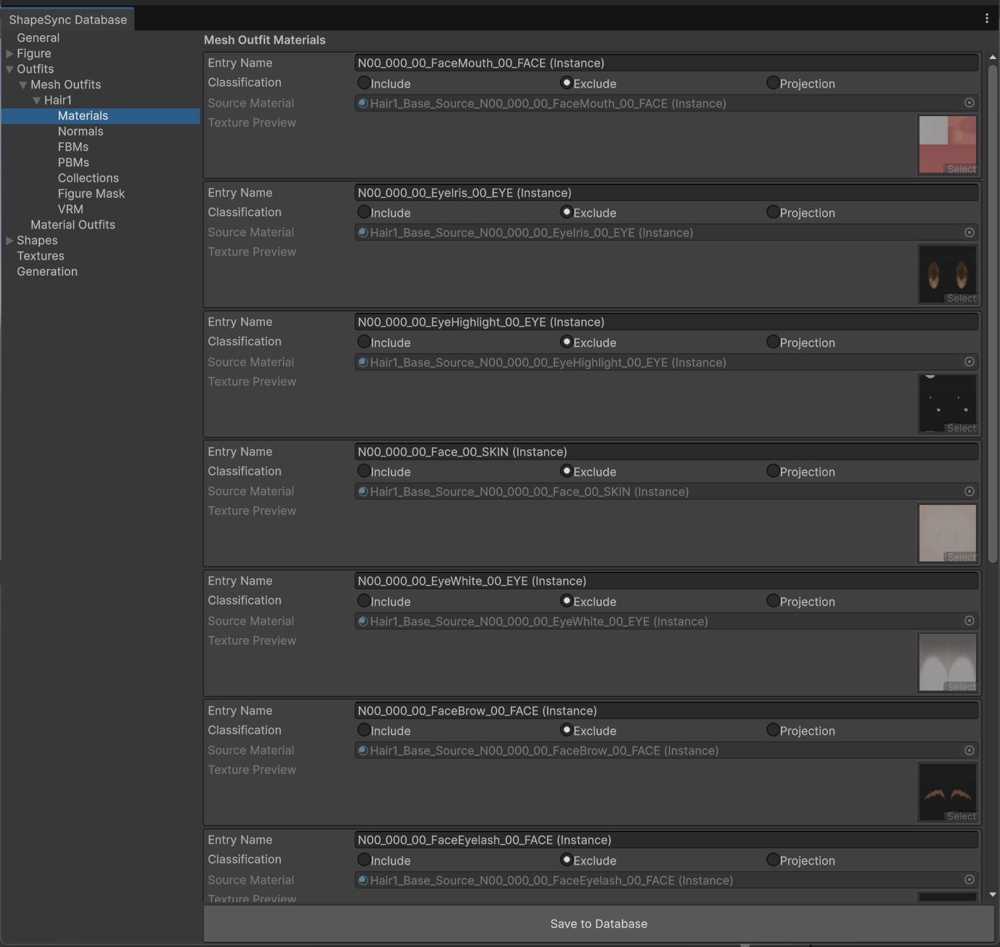
*▲図 4-15: Materials 画面で身体系マテリアルを Exclude に設定*

   * 髪型マテリアル（`Hair1`、`Hair2`）を **`Include`** に設定し、下部の **`Save to Database`** をクリックして確定保存します。

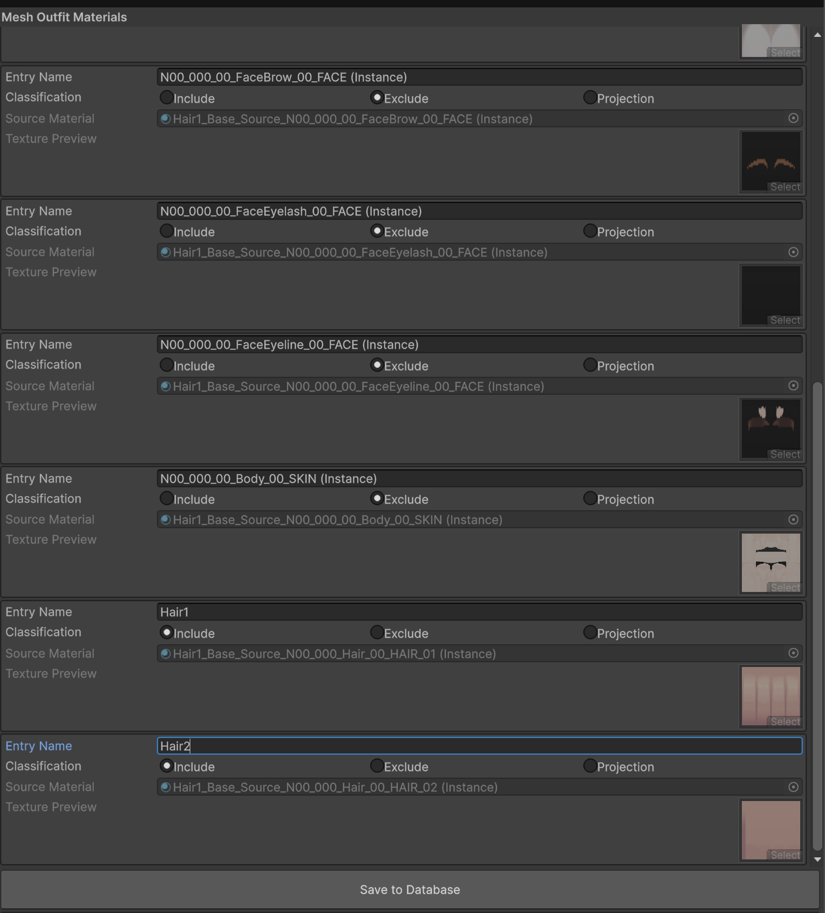
*▲図 4-16: 髪マテリアル（Hair1, Hair2）を Include に設定して保存*

6. TreeView の **`Hair1 > FBMs`**（`Mesh Outfit FBMs` 画面）を開きます。
   * 一覧にある **`SampleI`** 行の **`FBM Prefab`** フィールドに、Project ウィンドウの `Assets/VRM/Hair1SampleI.vrm` をドラッグ＆ドロップして指定します。
   * 下部の **`Save to Database`** をクリックして確定保存します。

*▲図 4-17: FBMs 画面で SampleI 行に Hair1SampleI を指定して保存*

---

### 4.2 衣装 Outfit（`Dress1`）の登録
1. TreeView から再度 **`Outfits`** を選択します。
2. **`Outfit Id`** に `Dress1`、**`Outfit Name`** に `Dress1` と入力し、**`Create Mesh Outfit`** をクリックします。
3. 作成された `Dress1` の基本画面で、**`Outfit Prefab`** に `Assets/VRM/Dress1BasicFemale.vrm` を指定し、下部の **`Save to Database`** をクリックします。
4. TreeView の **`Dress1 > Materials`** を開きます。
   * 着用側の身体マテリアル（`Body_00_SKIN` 等）を **`Exclude`**、衣装マテリアル（`Cloth1` 〜 `Cloth5`）を **`Include`** に設定します。
   * 下部の **`Save to Database`** をクリックします。
   > [!IMPORTANT]
   > 着用側の身体マテリアルを正しく `Exclude` に設定しないと、衣装メッシュだけを分離して抽出できません。必ず身体部分を除外設定にしてください。

*▲図 4-18: Dress1 の Materials 画面で身体を Exclude、衣装を Include に設定して保存*

5. TreeView の **`Dress1 > FBMs`** を開きます。
   * **`SampleI`** 行の **`FBM Prefab`** に `Assets/VRM/Dress1SampleI.vrm` を指定し、下部の **`Save to Database`** をクリックします。

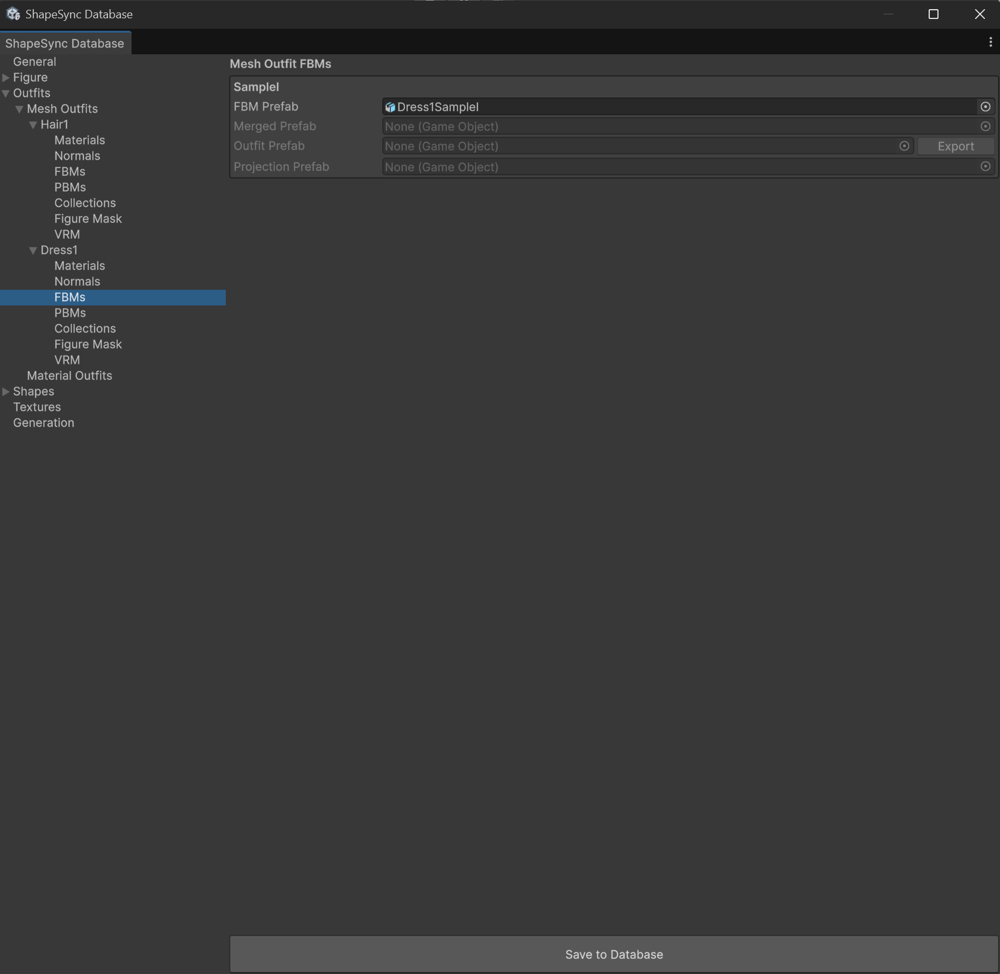
*▲図 4-19: Dress1 の FBMs 画面で SampleI 行に Dress1SampleI を指定して保存*

---

## 5. Generate の実行と Outfit アセットの出力

登録した Outfit アセットを生成します。

1. ShapeSync Editor の左側 TreeView から **`Generation`** セクションを選択します。
2. 各出力フォルダー（`Registries`、`Bindings`、`Materials`、`Textures`、`Outfits`）の設定は **既定値のまま変更しません**。
3. 下部の **`Generate`** ボタンをクリックします。
4. 「Generate ShapeSync Figure」保存ウィンドウで出力先ルートフォルダ（例: `Assets/ShapeSync/Generated`）を選択して生成を実行します。

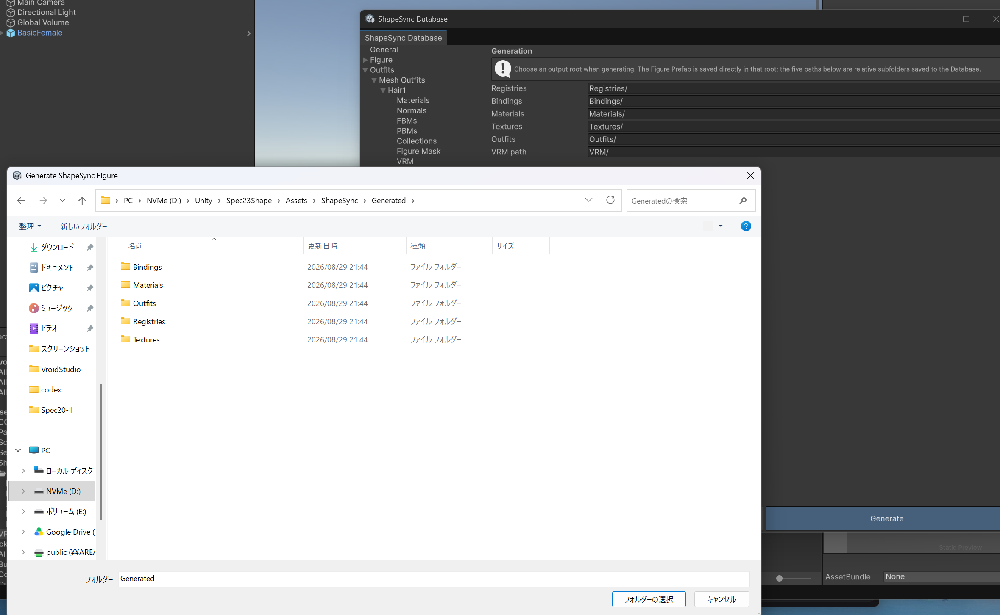
*▲図 4-20: Generation セクションで Generate を実行し出力ルートを選択*

5. 生成ルートの `Outfits/` フォルダー配下に、**`Hair1.prefab`** および **`Dress1.prefab`**（ならびにスキニング・メッシュ等の補助アセット）が出力されます。

*▲図 4-21: Project ウィンドウの Outfits フォルダーに出力された Outfit Prefab の確認*

---

## 6. Scene 配置と OutfitAttacher による着脱・動作確認

生成された Outfit Prefab を、Scene 上の Figure に取り付けてリアルタイムに着脱・体型変形追従を確認します。

### 着脱と動作確認手順
1. 第3章で生成した **Figure Prefab** を Scene（または Hierarchy）に配置します。
2. Figure のルート GameObject にアタッチされている **`OutfitAttacher`** コンポーネントを確認します。
   * ※Play Mode 外では `Enter Play Mode to attach an Outfit Prefab.` と表示され、装着操作は行えません。
3. Unity の **Play ボタン** を押して **Play Mode** に入ります。
4. Figure の Inspector で `OutfitAttacher` の **`Outfit Prefab Attach`** セクションを開きます。
5. Project ウィンドウの `Outfits/Hair1.prefab` を、**`Drop Outfit Prefab Here`** 欄にドラッグ＆ドロップします。
   * Figure に髪型が即座に装着され、**`Attached Outfits`** 一覧に `Hair1` が追加されます。
6. 同様に、Project ウィンドウの `Outfits/Dress1.prefab` を **`Drop Outfit Prefab Here`** 欄にドラッグ＆ドロップします。
   * Figure にドレスが装着され、`Attached Outfits` 一覧に `Dress1` が追加されます。
7. `Attached Outfits` 一覧の各行にある **`Delete`** ボタンをクリックすることで、該当の Outfit を取り外せることを確認します。

*▲図 4-22: Play Mode で OutfitAttacher に Hair1 / Dress1 を装着した Inspector および Game 画面*

### 体型変形とアニメーションへの追従確認
1. Figure の Inspector にある **`Animator`** に `Walking.controller` を割り当て、歩行アニメーションを再生します。
2. 歩行再生中に、**`DynamicBoneBlender`** コンポーネントの `SampleI` の **`weight`** スライダーを動かします。
3. **歩行アニメーション中、装着した髪型（`Hair1`）および衣装（`Dress1`）が、Figure の体型変形に完全に追従して滑らかに変形すること** を確認します。

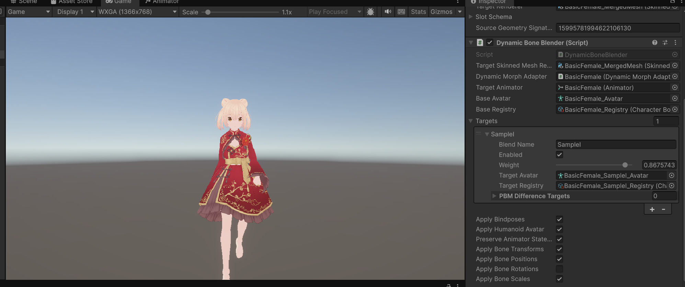
*▲図 4-23: 歩行再生中に SampleI の weight を操作し、衣装・髪型が破綻なく追従変形している様子*

---

## 7. よくあるトラブルと解決策（トラブルシューティング）

### Q1. OutfitAttacher の `Drop Outfit Prefab Here` にドロップしても装着されない
* **原因**:
  Play Mode に入っていないか、生成された `ShapeSyncOutfit` 付きの Prefab（`Outfits/Hair1.prefab` 等）ではなく、元の `.vrm` ファイルを直接ドロップしている可能性があります。
* **解決策**:
  Unity を Play Mode（再生中）にした上で、Generation 実行によって `Outfits/` フォルダに出力された `.prefab` をドロップしてください。

### Q2. 衣装を装着した際、キャラクターの身体が衣装から突き抜けてしまう・二重に表示される
* **原因**:
  Outfit 登録時の `Materials`（`Mesh Outfit Materials`）において、着用側の身体マテリアルが `Exclude` に設定されていない可能性があります。
* **解決策**:
  ShapeSync Editor の `Outfits > [対象 Outfit] > Materials` を開き、衣装以外の身体マテリアルがすべて `Exclude` になっていることを確認して `Save to Database` を押し、再度 `Generation` から `Generate` を実行してください。

---

[← チュートリアル目次へ戻る](./index.html) ｜ [← 第3章: Figure 登録と初期動作確認](./figureregistration.html)
