# 第6章: 高度な Figure 登録と局所変形（PBM）

[← チュートリアル目次へ戻る](./index.html) ｜ [← 第5章: Shape 登録と Shape Director 動作確認](./shaperegistration.html)

本章では、キャラクターの特定部位（本チュートリアルでは胸部 `BreastSize`）のみを変形させる **局所体型変形（PBM: Partial Body Morph）** の登録手順と、衣装（Dress）を素体の局所変形に追従させる設定方法を解説します。

* **前半（VRoid Studio）**: 胸部サイズを変更した Base 用および FBM 用の `.vroid` データを作成し、素体用（Figure）と衣装着用用（Dress）の計 4 つの PBM VRM をエクスポートします。
* **後半（Unity / ShapeSync）**: ShapeSync Editor で Figure 側に PBM（`BreastSize`）を登録した後、Dress 側に PBM 追従を設定し、Morph Shape（`morphSampleI`）を上書き再定義して、`ShapeDirector` で連動動作を確認します。

---

## 1. はじめに（PBM: Partial Body Morph の概念）

* **FBM（Full Body Morph）**: 第2章〜第4章で扱った、キャラクター全体の体型変化（例: `SampleI`）です。
* **PBM（Partial Body Morph）**: 胸の大きさや肩幅、足の長さなど、キャラクターの特定の部位だけを独立して変形させる局所体型変形です。
* **ShapeSync Core の機能**: PBM は ShapeSync Core に標準で備わっている基本的なメッシュ変形機能です（VRM の表情機能や外部拡張パッケージの機能ではありません）。

---

## 2. `BreastSize` 用 `.vroid` データの作成（VRoid Studio）

まずは VRoid Studio を使用して、Base 用素体および FBM 用素体の胸部サイズを変更した `.vroid` データを作成します。

### 2.1 Base 用 PBM データの作成
1. VRoid Studio を起動し、第2章で作成した素体モデル **`BasicFemale.vroid`** を開きます。
2. 上部メニューの **`体型`** タブを選択し、パラメータ一覧にある **`胸の大きさ`** スライダーを **`1.000`**（最大）に設定します。

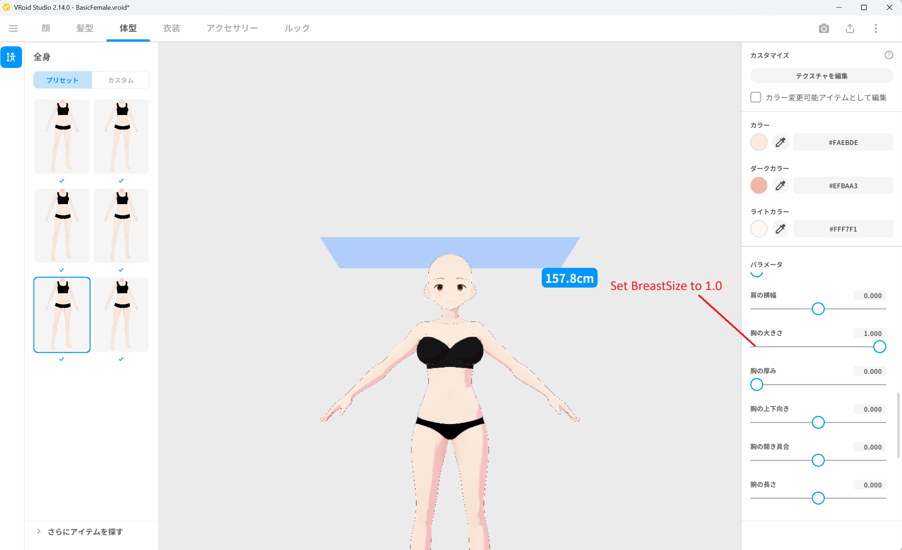
*▲図 6-1: BasicFemale を開き、体型 ＞ 胸の大きさを 1.0 に設定*

3. 左上のメニューから「名前を付けて保存」を選択し、ファイル名を **`BreastSizeBasicFemale.vroid`** として保存します。

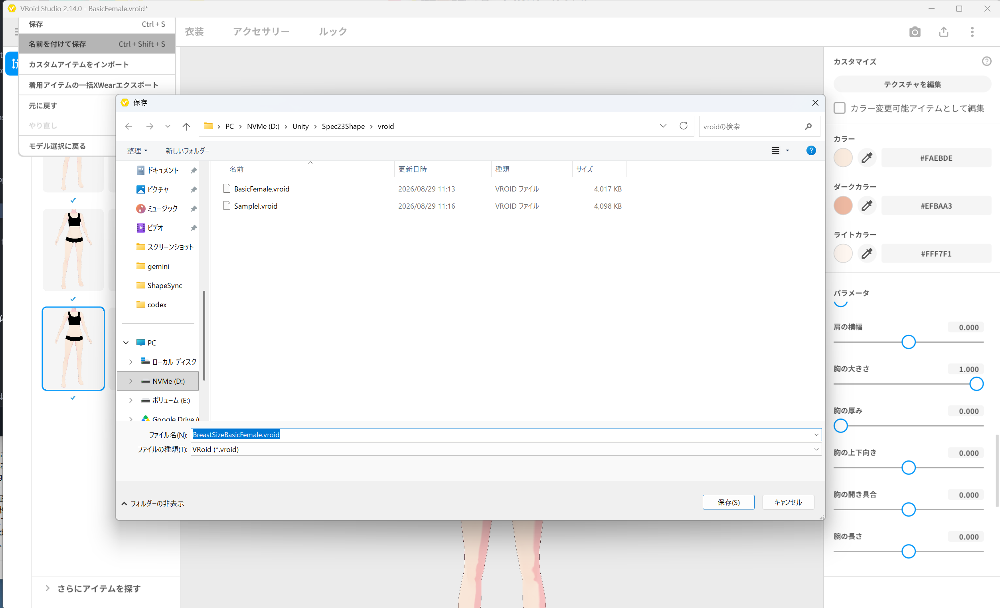
*▲図 6-2: BreastSizeBasicFemale.vroid として名前を付けて保存*

### 2.2 FBM 用 PBM データの作成
1. 続けて、第2章で作成した FBM 素体モデル **`SampleI.vroid`** を開きます。
2. **`体型`** タブを選択し、同じく **`胸の大きさ`** スライダーを **`1.000`** に設定します。

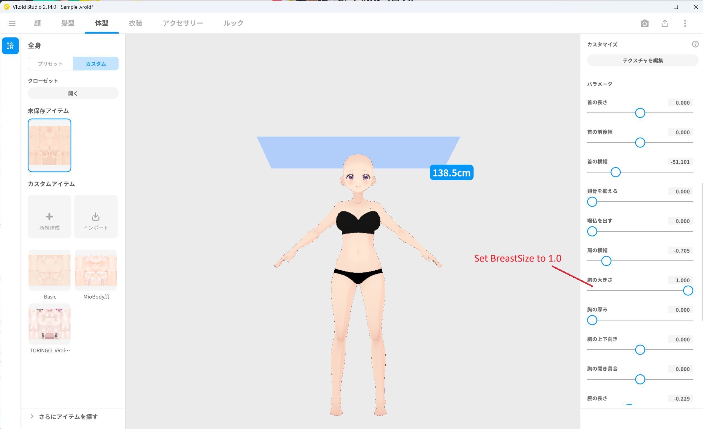
*▲図 6-3: SampleI を開き、体型 ＞ 胸の大きさを 1.0 に設定*

3. 左上のメニューから「名前を付けて保存」を選択し、ファイル名を **`BreastSizeSampleI.vroid`** として保存します。

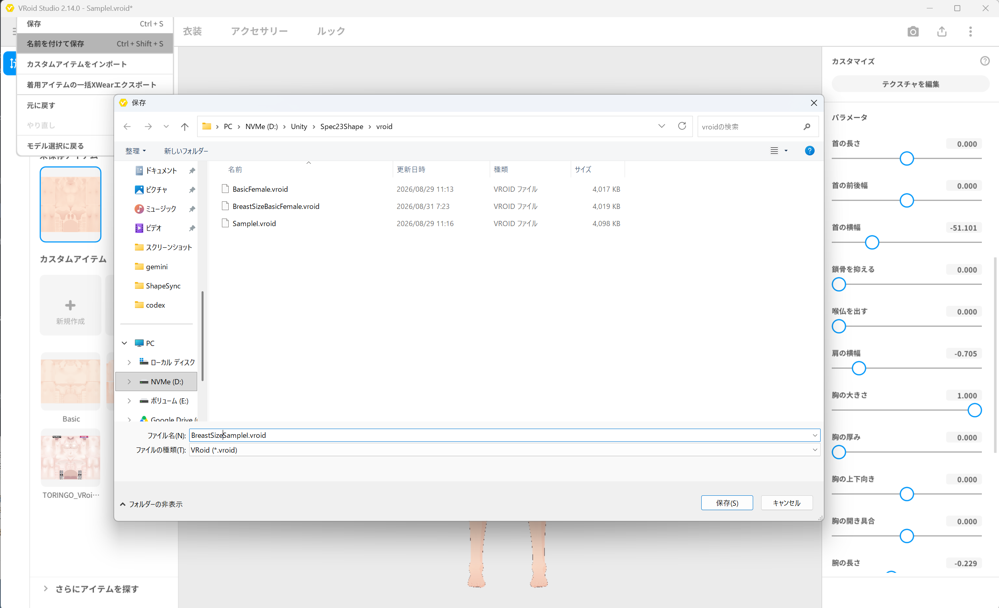
*▲図 6-4: BreastSizeSampleI.vroid として名前を付けて保存*

---

## 3. Figure 用 PBM VRM のエクスポート（VRoid Studio）

作成した 2 つの `.vroid` データから、素体（Figure）用の PBM VRM をエクスポートします。

### 3.1 `BreastSizeBasicFemale.vrm` のエクスポート
1. `BreastSizeBasicFemale.vroid` を開いた状態で、画面右上のエクスポートボタンから **`VRMエクスポート`** を選択します。
2. **`VRM1.0`** を選択し、削減設定を行わずにエクスポート画面を開きます。
3. ポリゴン数（**`19214`**）、マテリアル数（**`9`**）、ボーン数（**`59`**）が Base 素体と一致していることを確認します。

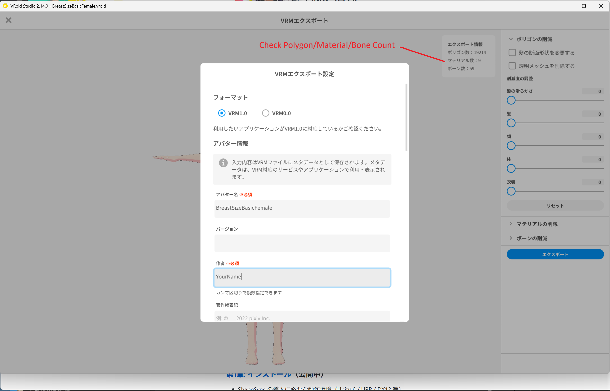
*▲図 6-5: ポリゴン数・マテリアル数・ボーン数を確認し BreastSizeBasicFemale.vrm としてエクスポート*

4. アバター名に `BreastSizeBasicFemale` と入力し、Unity プロジェクト内のフォルダへ **`BreastSizeBasicFemale.vrm`** としてエクスポートします。

### 3.2 `BreastSizeSampleI.vrm` のエクスポート
1. `BreastSizeSampleI.vroid` を開いた状態で、同様に **`VRMエクスポート`** を選択します。
2. **`VRM1.0`** を選択し、ポリゴン数（**`19214`**）、マテリアル数（**`9`**）、ボーン数（**`59`**）を確認します。

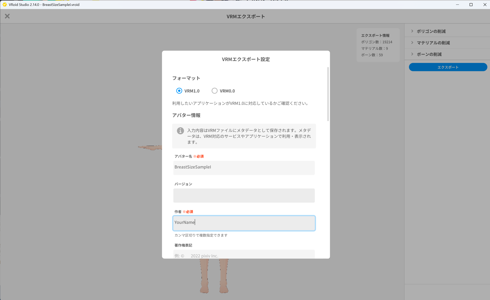
*▲図 6-6: ポリゴン数・マテリアル数・ボーン数を確認し BreastSizeSampleI.vrm としてエクスポート*

3. アバター名に `BreastSizeSampleI` と入力し、Unity プロジェクト内へ **`BreastSizeSampleI.vrm`** としてエクスポートします。

---

## 4. Dress 用 PBM VRM のエクスポート（VRoid Studio）

次に、衣装（Dress）が着用された状態の PBM VRM を 2 つエクスポートします。

### 4.1 `Dress1BreastSizeBasicFemale.vrm` のエクスポート
1. VRoid Studio で `BreastSizeBasicFemale.vroid` を開きます。
2. **`衣装`** タブを選択し、第4章で使用したプリセットドレス（Dress）を着用させます。

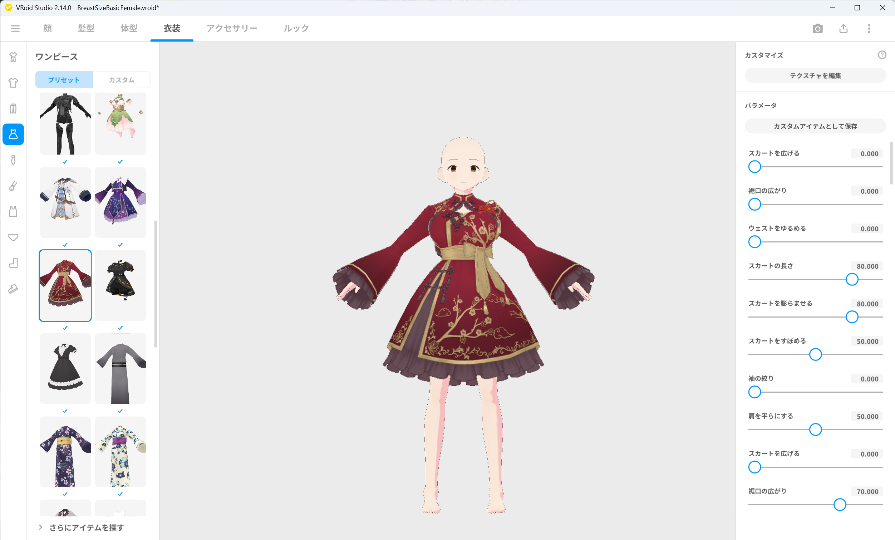
*▲図 6-7: BreastSizeBasicFemale を開き、Dress を着用させる*

3. 右上のエクスポートボタンから **`VRM1.0`** でエクスポートを開きます。
4. ポリゴン数（**`32368`**）、マテリアル数（**`14`**）、ボーン数（**`159`**）を確認します。

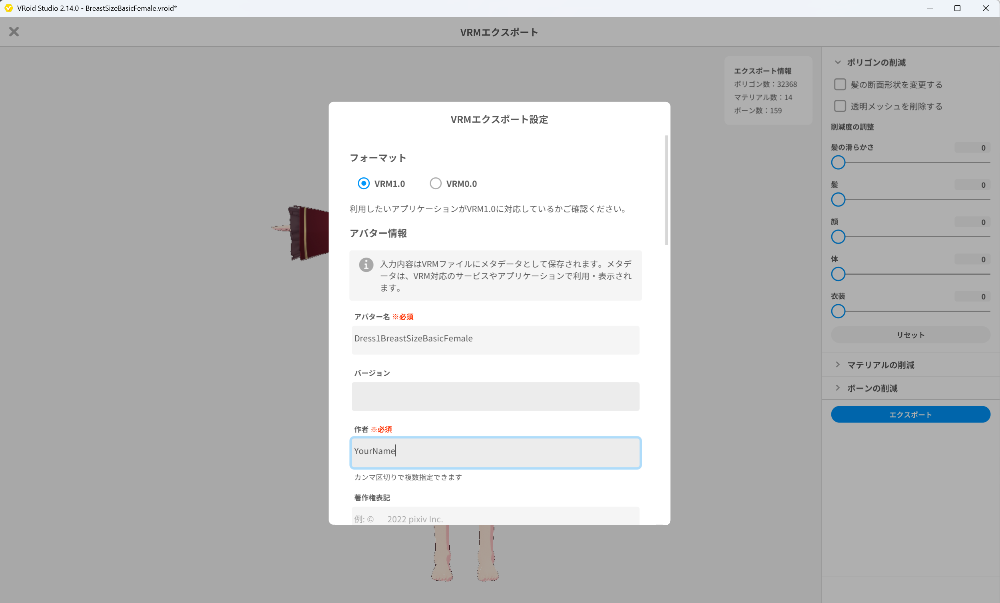
*▲図 6-8: ポリゴン数・マテリアル数・ボーン数を確認し Dress1BreastSizeBasicFemale.vrm としてエクスポート*

5. アバター名に `Dress1BreastSizeBasicFemale` と入力し、Unity プロジェクト内へ **`Dress1BreastSizeBasicFemale.vrm`** としてエクスポートします。

### 4.2 `Dress1BreastSizeSampleI.vrm` のエクスポート
1. VRoid Studio で `BreastSizeSampleI.vroid` を開きます。
2. **`衣装`** タブを選択し、同様にプリセットドレス（Dress）を着用させます。

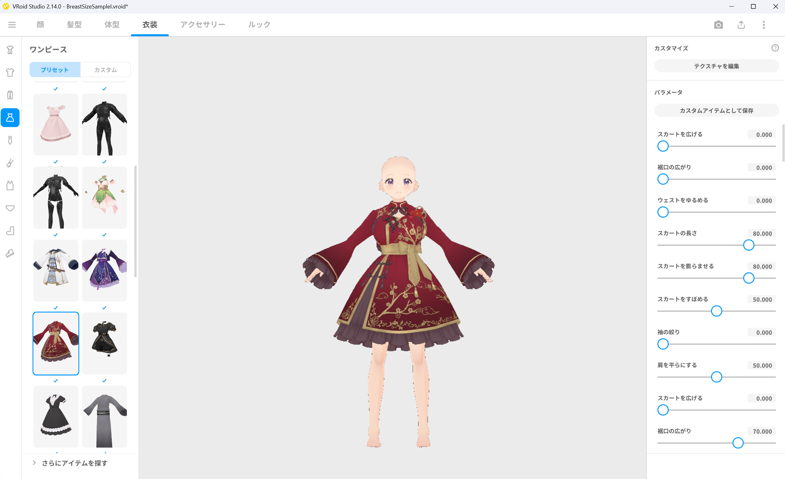
*▲図 6-9: BreastSizeSampleI を開き、Dress を着用させる*

3. 右上のエクスポートボタンから **`VRM1.0`** でエクスポートを開きます。
4. ポリゴン数（**`32368`**）、マテリアル数（**`14`**）、ボーン数（**`159`**）を確認します。

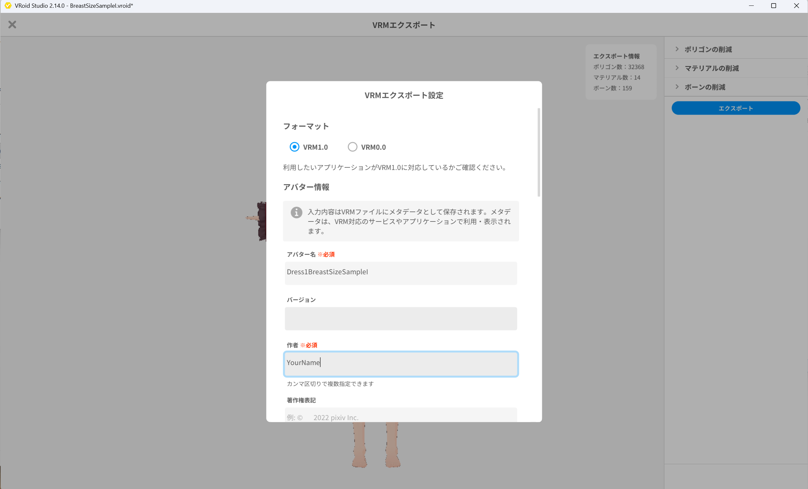
*▲図 6-10: ポリゴン数・マテリアル数・ボーン数を確認し Dress1BreastSizeSampleI.vrm としてエクスポート*

5. アバター名に `Dress1BreastSizeSampleI` と入力し、Unity プロジェクト内へ **`Dress1BreastSizeSampleI.vrm`** としてエクスポートします。

---

## 5. Figure PBM（`BreastSize`）の登録

ここから Unity エディタ上での作業となります。まずは Figure 側に PBM（`BreastSize`）を登録します。

1. Unity エディタの上部メニューから **Tools > zgock > ShapeSync > ShapeSync Editor** を開きます。
2. 左側 TreeView から **`Figure > PBMs`** を選択します。
3. **`Add PBM Entry`** ボタンをクリックします。
4. 表示された「Register PBMs」セクションの **`PBM Name`** に **`BreastSize`** と入力します。
5. **`PBM Prefabs`** 一覧に Figure の軸が表示されます。
   * **`BasicFemale`** 行（Base 素体）に、Project ウィンドウの **`BreastSizeBasicFemale.vrm`** をドラッグ＆ドロップして指定します。
   * **`SampleI`** 行（FBM 軸）に、Project ウィンドウの **`BreastSizeSampleI.vrm`** をドラッグ＆ドロップして指定します。
6. 画面最下部の **`Save to Database`** ボタンをクリックして保存します（※右側の `Prefab on Database` 欄は保存済み表示のため直接編集しません）。

*▲図 6-11: Figure ＞ PBMs で PBM Name に BreastSize を入力し、Base / FBM の VRM を指定して保存*

---

## 6. Dress への PBM 追従登録

Figure への PBM 登録が完了したら、次に衣装（`Dress1`）側でその PBM に追従する設定を行います。

> [!IMPORTANT]
> 必ず **Figure PBM を先に登録してから** 衣装側の追従設定を行ってください。衣装側では Figure に登録された PBM 軸を元に追従関係を選択します。

1. ShapeSync Editor の左側 TreeView から **`Outfits > Mesh Outfits > Dress1 > PBMs`** を選択します。
2. 「Mesh Outfit PBMs」一覧に表示された **`Follow BreastSize`** にチェックを入れて **有効** にします。
3. 有効化されると VRM 指定行が表示されます。
   * **`Base Prefab`** 行に、Project ウィンドウの **`Dress1BreastSizeBasicFemale.vrm`** をドラッグ＆ドロップして指定します。
   * **`SampleI Prefab`** 行に、Project ウィンドウの **`Dress1BreastSizeSampleI.vrm`** をドラッグ＆ドロップして指定します。
4. 画面最下部の **`Save to Database`** ボタンをクリックして保存します。

*▲図 6-12: Outfits ＞ Mesh Outfits ＞ Dress1 ＞ PBMs で Follow BreastSize を有効にし、Base / FBM VRM を指定して保存*

---

## 7. Morph Shape（`morphSampleI`）の上書き再定義

第5章で作成した Morph Shape（`morphSampleI`）に、今回追加した PBM（`BreastSize`）の変形重みを追加して上書き保存します。

1. ShapeSync Editor の左側 TreeView から **`Shapes > Morph Shapes > morphSampleI`** を選択します（※新しい Shape Id は作成しません）。
2. 詳細画面の **`Morphs`** 一覧を確認します。Figure 軸から自動的に `SampleI` と `BreastSize` が表示されます。
   * **`SampleI`** の重み: **`1`**（既存の値を維持）
   * **`BreastSize`** の重み: **`0.8`** に設定（スライダーまたは数値入力）
   > [!NOTE]
   > Shape 設定画面上では論理名 **`BreastSize`** として表示されます（生成後の物理的な内部管理名が `PBM_BreastSize` となります）。
3. 画面最下部の **`Save to Database`** ボタンをクリックして、既存の `morphSampleI` を上書き保存します。

*▲図 6-13: Shapes ＞ Morph Shapes ＞ morphSampleI で SampleI = 1 を維持し、BreastSize = 0.8 を設定して上書き保存*

---

## 8. 再 Generate の実行と Shape Template の更新

更新した Database から Shape Template アセットを再生成します。

1. ShapeSync Editor の左側 TreeView から **`Generation`** セクションを選択します。
2. 各出力相対パスは既定値のまま、画面下部の **`Generate`** ボタンをクリックします。
3. 「Generate ShapeSync Figure」画面で、出力ルートフォルダ（例: `Assets/ShapeSync/Generated`）を選択して「フォルダーの選択」をクリックし、再生成を実行します。
4. 出力ルート直下の Shape Template アセット（`morphSampleI.asset` 等）が更新されます。

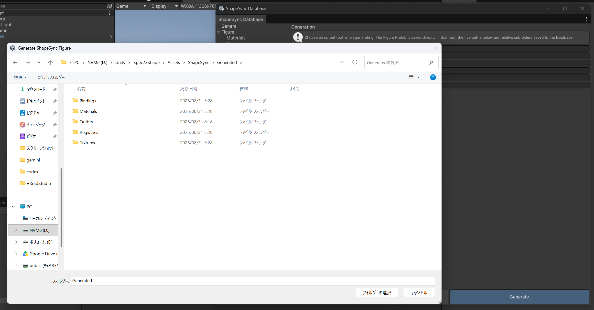
*▲図 6-14: Generation セクションで Generate をクリックし、出力フォルダーを選択して再生成を実行*

---

## 9. Scene 配置と Shape Director による PBM 動作確認

Scene 上の Figure にて、PBM（`BreastSize`）の変形が Figure と Dress の両方に同期して適用されることを確認します。

1. Scene に配置されている Figure（`BasicFemale`）を選択します。
   * **`ShapeDirector`** コンポーネントの `Template List` にはすでに第5章で Template が登録されています（※再登録の手動操作は不要です）。
2. Unity の **Play ボタン** を押して **Play Mode** に入ります。
   * 既定で `Auto Compile` が ON になっているため、Play Mode 開始時に自動的に最新の Template が初期同期されます。
3. `ShapeDirector` の **`Runtime Shapes (Authoritative)`** 内にある **`morphSampleI`** の **`Morphs`** を展開します。
4. **`BreastSize`**（`PBM_BreastSize`）のスライダーを動かします。
5. **歩行アニメーションが再生されたまま、素体（Figure）の胸部と衣装（Dress）の胸部が完全に同期して拡大・縮小変形し、衣装だけが遅れたり外れたりしないこと** を確認します。

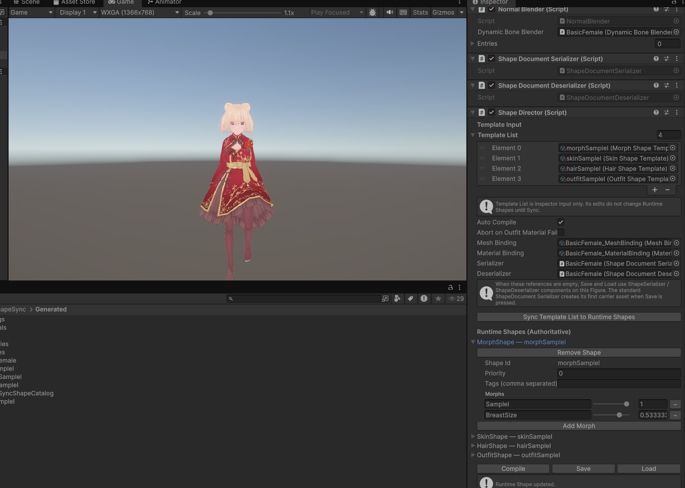
*▲図 6-15: Play Mode で歩行アニメーション再生中に BreastSize を操作し、Figure と Dress の胸部が同期して変形することを確認*

---

## 10. よくあるトラブルと解決策（トラブルシューティング）

### Q1. Dress の PBM 設定画面に `Follow BreastSize` が表示されない
* **原因**:
  Figure 側に PBM（`BreastSize`）が登録・保存されていない可能性があります。
* **解決策**:
  先に `Figure > PBMs` を開き、`PBM Name: BreastSize` として VRM を指定し、`Save to Database` を押して保存してください。保存後に `Outfits > Mesh Outfits > Dress1 > PBMs` を開くと `Follow BreastSize` が表示されます。

### Q2. Play Mode で `BreastSize` を動かしても胸部が変形しない / Dress が追従しない
* **原因**:
  Morph Shape（`morphSampleI`）の上書き保存後に `Generate` を再実行していないか、VRM エクスポート時にトポロジ（ポリゴン数・ボーン数）が変更されてしまった可能性があります。
* **解決策**:
  ShapeSync Editor の `Generation` で `Generate` を再実行したことを確認してください。また、VRoid Studio からエクスポートした VRM のポリゴン数・マテリアル数・ボーン数が Base モデルと完全に一致していることを確認してください。

---

[← チュートリアル目次へ戻る](./index.html) ｜ [← 第5章: Shape 登録と Shape Director 動作確認](./shaperegistration.html)
