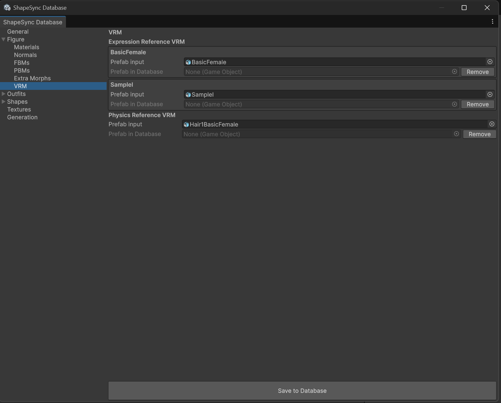
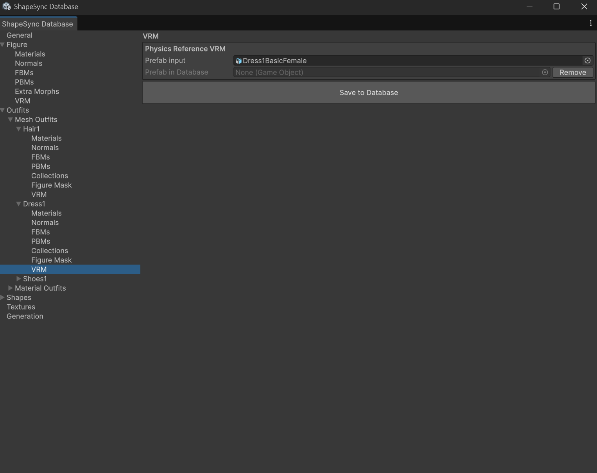
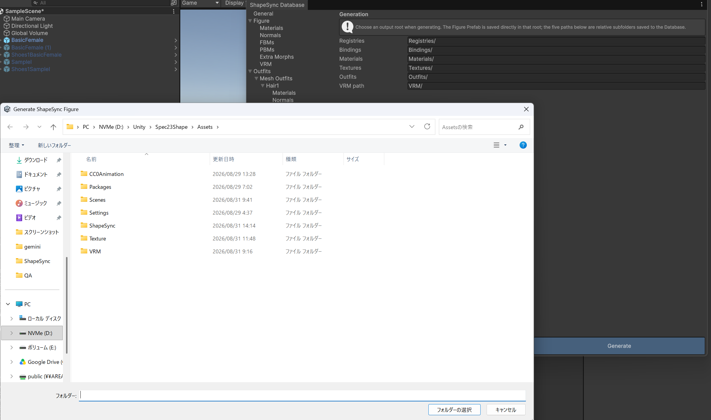
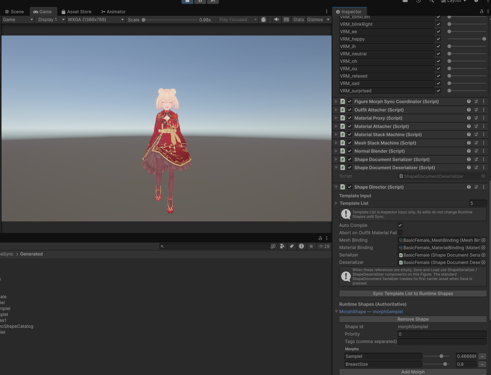
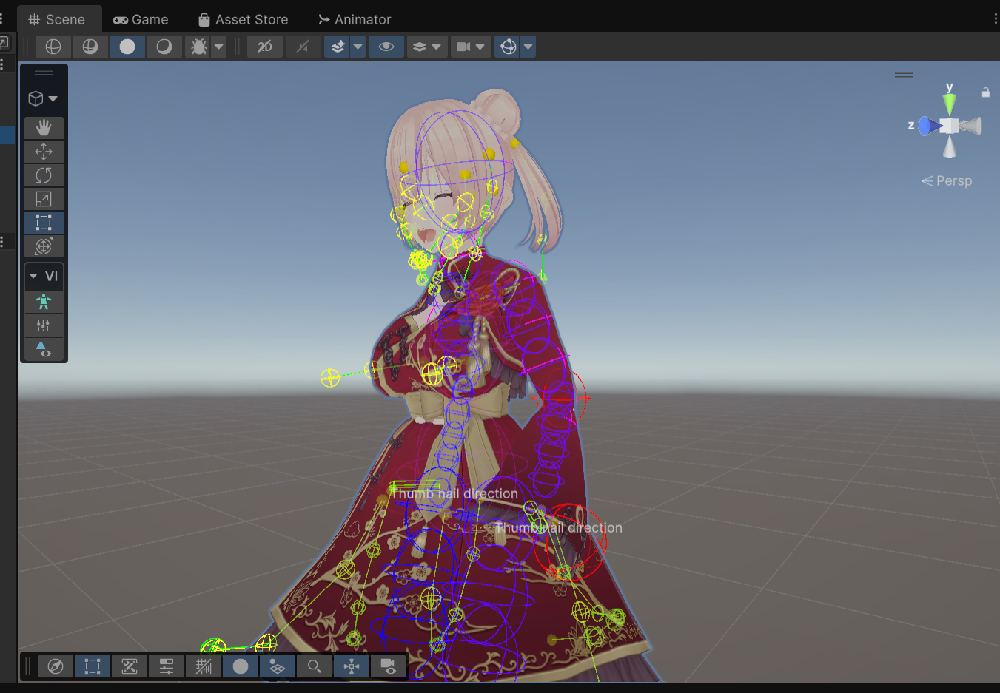

# 第9章: 高度な VRM 連携（Expression・Physics の設定と動作確認）

[← チュートリアル目次へ戻る](./index.html) ｜ [← 第8章: 高度な Outfit 登録と Figure Mask（衣装による素体メッシュの消去・Poke 補正）](./figuremask.html)

本章では、ShapeSync Asset の **VRM 連携機能** を使用して、キャラクターモデルの **Expression（表情）** と **Physics（髪や衣装の揺れ物・SpringBone）** を Figure および Outfit に設定し、Generate 後の動作確認を行う手順を解説します。

> [!NOTE]
> **本章の作業環境について**:
> 本章では VRoid Studio の操作は行いません。すべての作業は **Unity エディタ** および **ShapeSync Editor** 内で行います。

---

## 1. はじめに（VRM 連携の概要と前提環境）

### 1.1 前提環境の確認
VRM 連携機能を利用するには、第1章のインストール手順で導入した以下のパッケージおよびシンボル設定が必要です。
1. **VRM 関連パッケージ**:
   * `com.vrmc.gltf` (`0.131.1`)
   * `com.vrmc.vrm` (`0.131.1`)
   * **ShapeSync VRM Integration Companion**
2. **Scripting Define Symbols**:
   * `Edit > Project Settings > Player > Other Settings` の Scripting Define Symbols に **`SHAPESYNC_USE_UNIVRM`** が追加され、`Apply` されていること。

### 1.2 VRM 連携のスキップについて
* **VRM 連携を使わない場合**:
  VRM 形式のアバター表情や SpringBone 揺れ物連携が不要な場合は、UniVRM / Companion パッケージや define シンボルを追加せず、**本章をスキップして第10章以降へ進むことができます**（第10章以降は VRM 連携なしでも進行可能です）。
* **VRM 連携を有効にする場合の注意点**:
  本章を実行して VRM 設定を保存した Database は、以後も `SHAPESYNC_USE_UNIVRM` が有効な環境で取り扱う必要があります。VRM 連携を利用するかどうかは、Database へ設定を保存する前に判断してください。

---

## 2. Figure への Expression および Physics Reference 設定

ShapeSync Editor にて、Figure（素体）側の表情および揺れ物の参照 VRM を設定します。

1. Unity エディタの上部メニューから **Tools > zgock > ShapeSync > ShapeSync Editor** を開きます。
2. 左側 TreeView から **`Figure > VRM`** を選択します。
3. **`Expression Reference VRM`** セクションを設定します。
   * **`BasicFemale`** 行（Base）の `Prefab input` に、Project ウィンドウの **`BasicFemale.vrm`** をドラッグ＆ドロップして指定します。
   * **`SampleI`** 行（FBM）の `Prefab input` に、Project ウィンドウの **`SampleI.vrm`** をドラッグ＆ドロップして指定します。
   > [!IMPORTANT]
   > Expression Reference は、Base と登録済みのすべての FBM 行（本構成では `BasicFemale` と `SampleI` の 2 行）を漏れなく揃えて指定してください。
4. **`Physics Reference VRM`** セクションを設定します。
   * `Prefab input` に、Project ウィンドウの **`Hair1BasicFemale.vrm`** をドラッグ＆ドロップして指定します。
   > [!NOTE]
   > Figure 側の Physics Reference は「揺れ物（SpringBone）を持つ VRM」であれば任意です。本手順で `Hair1BasicFemale.vrm` を選択したことに特別な限定はなく、`Dress1BasicFemale.vrm` を指定しても同様に動作します。
5. 画面下部の **`Save to Database`** ボタンをクリックして保存します。

*▲図 9-1: Figure > VRM で Expression Reference 2 件および Physics Reference 1 件を設定し、Save to Database で保存*

---

## 3. Outfits への Physics Reference 設定（Hair1 / Dress1）

髪型（`Hair1`）およびドレス（`Dress1`）の各 Outfit に対して、衣装ごとの揺れ物参照 VRM を設定します。

### 3.1 `Hair1` の Physics Reference 設定
1. 左側 TreeView から **`Outfits > Mesh Outfits > Hair1`** を選択し、詳細画面の **`VRM`** セクションを開きます。
2. **`Physics Reference VRM`** の `Prefab input` に、Project ウィンドウの **`Hair1BasicFemale.vrm`** をドラッグ＆ドロップして指定します。
3. 画面下部の **`Save to Database`** ボタンをクリックして保存します。

*▲図 9-2: Outfits > Mesh Outfits > Hair1 > VRM で Physics Reference VRM に Hair1BasicFemale を指定し保存*

### 3.2 `Dress1` の Physics Reference 設定
1. 左側 TreeView から **`Outfits > Mesh Outfits > Dress1`** を選択し、詳細画面の **`VRM`** セクションを開きます。
2. **`Physics Reference VRM`** の `Prefab input` に、Project ウィンドウの **`Dress1BasicFemale.vrm`** をドラッグ＆ドロップして指定します。
3. 画面下部の **`Save to Database`** ボタンをクリックして保存します。

*▲図 9-3: Outfits > Mesh Outfits > Dress1 > VRM で Physics Reference VRM に Dress1BasicFemale を指定し保存*

---

## 4. Generation での Generate 実行（Expression Bake / Physics 転送）

設定した VRM 連携情報を反映するため、Figure および Outfit の生成を実行します。

1. ShapeSync Editor の左側 TreeView から **`Generation`** セクションを選択します。
2. 各出力設定（出力ルート: `Assets/ShapeSync/Generated`、VRM 相対パス初期値: `VRM/`）を確認します。
3. 画面下部の **`Generate`** ボタンをクリックし、出力フォルダーを選択して生成を実行します。

*▲図 9-4: Generation セクションで Generate をクリックし、出力ルートフォルダーを選択して再生成を実行*

> [!NOTE]
> **自動後処理について**:
> **Expression Bake**（Base と全 FBM の共通 Expression からの生成 Figure 用 VRM Expression データ作成）および **Physics 転送**（Figure および各 Mesh Outfit 生成 Prefab への SpringBone 物理データ転送）は、`Generate` の実行時に自動後処理として一括処理されます。個別の Bake ボタンや専用ウィンドウを開く必要はありません。

---

## 5. Play Mode での表情（Expression）の動作確認

Generate 完了後、Play Mode にて表情（Expression）が正しく連動するか単独で確認します。

1. Scene に配置されている生成済み Figure（`BasicFemale`）を選択します。
2. Unity の **Play ボタン** を押して **Play Mode** に入ります。
3. Hierarchy で Figure を選択し、Inspector の **`UniversalExpressionProxy`** コンポーネントを確認します。
4. **`Expressions`** 一覧から確認したい顔用 BlendShape 行（例: **`VRM_happy`**）の **`On`** チェックボックスを有効にします。
5. その行の **`Weight`** スライダー（`0.0` 〜 `1.0`）をドラッグして動かします。
6. Game ビューでキャラクターの顔を注視し、スライダーの操作に合わせて表情（笑顔や目・口の動き）がリアルタイムに変化することを確認します。

*▲図 9-5: Play Mode で UniversalExpressionProxy の VRM_happy を有効化し、Weight スライダーの操作で笑顔に変化することを確認*

---

## 6. Play Mode での揺れ物（Physics）の動作確認

続けて、髪や衣装の揺れ物（Physics / SpringBone）がキャラクターの動きに追従して動作するか単独で確認します。

1. Figure に `Hair1` および `Dress1` がアタッチされており、`Animator` に **`Walking.controller`** が設定されていることを確認します。
2. Play Mode のまま歩行アニメーションを再生します。
3. Scene ビューの Gizmos を有効にして確認すると、SpringBone のコライダーや物理ギズモが表示されます。
4. キャラクターの歩行動作に合わせて、**`Hair1` のツインテール・髪先** や **`Dress1` のスカートの裾・布端** が体の動きに遅れて自然に揺れ、キャラクターの足取りに追従して物理シミュレーションが働いていることを確認します。

*▲図 9-6: Play Mode で歩行アニメーション再生中、SpringBone ギズモとともに髪先やドレスの裾が自然に揺れて追従することを確認*

---

## 7. よくあるトラブルと解決策（トラブルシューティング）

### Q1. ShapeSync Editor に `VRM` セクションが表示されない、またはエラーが発生する
* **原因**:
  * UniVRM パッケージ（`com.vrmc.gltf`, `com.vrmc.vrm`）や ShapeSync VRM Integration Companion が正しくインストールされていない可能性があります。
  * `Project Settings > Player > Other Settings` の Scripting Define Symbols に **`SHAPESYNC_USE_UNIVRM`** が設定されていない可能性があります。
* **解決策**:
  第1章のインストール手順を確認し、必要なパッケージの導入および `SHAPESYNC_USE_UNIVRM` シンボルの追加と Apply を行ってください。

### Q2. Play Mode で `UniversalExpressionProxy` を操作しても表情が変化しない
* **原因**:
  * `Figure > VRM` で Expression Reference VRM の設定後に `Save to Database` を押していないか、設定後に `Generation` で `Generate` を再実行していない可能性があります。
  * `UniversalExpressionProxy` Inspector の該当表情行で `On` チェックボックスが有効になっていない可能性があります。
* **解決策**:
  `Figure > VRM` で Base および FBM の VRM が正しく保存されていることを確認し、`Generate` を再実行してください。Play Mode では必ず `On` をチェックしてから `Weight` スライダーを操作してください。

### Q3. 歩行させても髪やドレスの揺れ物が動かない
* **原因**:
  * `Outfit > Mesh Outfits > Hair1` や `Dress1` の `VRM` セクションで Physics Reference VRM を指定・保存した後に、`Generate` を再実行していない可能性があります。
* **解決策**:
  各 Outfit の `VRM` セクションで Physics Reference VRM が保存されていることを確認し、`Generation` セクションで `Generate` を再実行してください。

---

[← チュートリアル目次へ戻る](./index.html) ｜ [← 第8章: 高度な Outfit 登録と Figure Mask（衣装による素体メッシュの消去・Poke 補正）](./figuremask.html)
