# 第5章: Shape 登録と Shape Director 動作確認

[← チュートリアル目次へ戻る](./index.html) ｜ [← 第4章: Outfit 登録と着脱動作確認](./outfitregistration.html)

本章では、キャラクターの体型・衣装・髪型・テクスチャ（見た目）を連動して変化させる **各種 Shape（Morph / Hair / Skin / Outfit）** を ShapeSync Editor に登録し、**`ShapeDirector`** を使用して Scene 上で一括制御・動作確認を行う手順を解説します。

* **前半（VRoid Studio）**: レッグウェアのストッキングテクスチャを PNG としてエクスポートし、Unity プロジェクトへ取り込みます。
* **後半（Unity / ShapeSync）**: ストッキングを **Material Outfit** として登録し、4 種類の Shape（Morph / Hair / Skin / Outfit）を作成して Shape Template を生成し、`ShapeDirector` で動作確認を行います。

---

## 1. はじめに（各種 Shape と Material Outfit の概念）

* **Material Outfit**: メッシュを持たず、既存の身体や衣装のマテリアルテクスチャを差し替える装飾アセットです（本章ではストッキングを使用）。
* **Morph Shape**: 体型変形（FBM）の重み（weight）を保持する Shape です。
* **Hair Shape**: 髪型 Mesh Outfit（`Hair1`）の適用を定義する Shape です。
* **Skin Shape**: キャラクターの肌や顔などのテクスチャ切り替え（Base ⇔ `SampleI`）を定義する Shape です。
* **Outfit Shape**: メッシュ衣装（`Dress1`）とマテリアル衣装（`Stocking`）の組み合わせを定義する Shape です。
* **Shape Template**: Editor 上で定義した各 Shape の設定を、Runtime で利用可能なアセットとして書き出したものです。
* **ShapeDirector**: Figure にアタッチされ、登録された Shape Template を Runtime で読み込んで一括制御・同期する Unity コンポーネントです。

---

## 2. ストッキング用テクスチャのエクスポート（VRoid Studio）

まずは VRoid Studio を使用して、モデルのレッグウェアからストッキングのテクスチャ画像を PNG として書き出します。

### 2.1 ストッキングテクスチャのエクスポート手順
1. VRoid Studio を起動し、プリセットモデル **`AvatarSample_I`** を開きます。
2. 上部メニューの **`衣装`** タブを選択し、左側メニューから **`レッグウェア`** を選択して **`テクスチャ編集`** をクリックします。

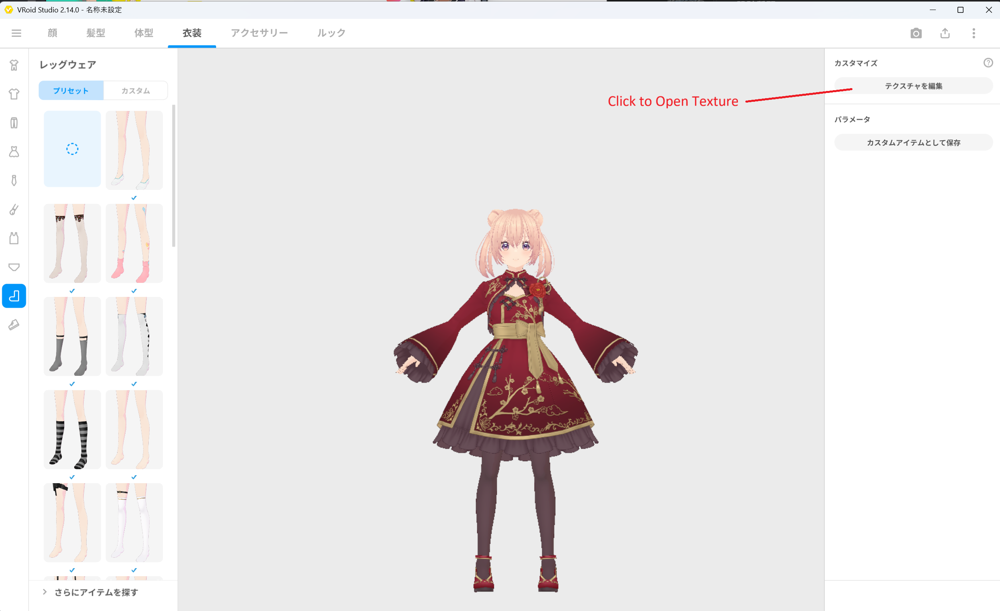
*▲図 5-1: AvatarSample_I を開き、衣装 ＞ レッグウェア ＞ テクスチャ編集を開く*

3. レイヤー一覧からストッキング画像を選択し、右クリックメニュー等から **エクスポート** を選択します。

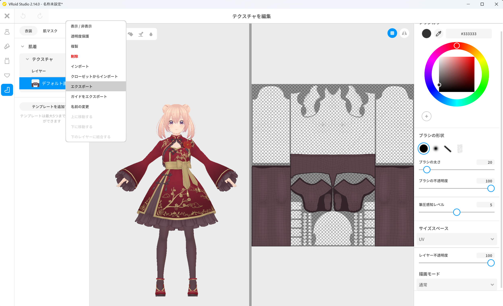
*▲図 5-2: ストッキングのテクスチャ画像をエクスポート*

4. 保存先として Unity プロジェクト内のフォルダ（例: `Assets/Textures/` 等）を指定し、ファイル名を **`Stocking.png`** として保存します。

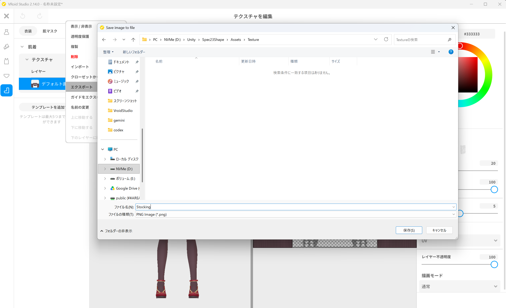
*▲図 5-3: Unity プロジェクト内に Stocking.png として保存*

5. Unity エディタに戻り、Project ウィンドウで `Stocking.png` を選択して Inspector を開きます。
6. Inspector で **`Alpha is Transparency`** にチェックを入れて **ON** に設定し、右下の **`Apply`** ボタンをクリックして適用します。
7. インスペクター下部のプレビュー等で画像が透過され、透過テクスチャとして正しく扱われていることを確認します。

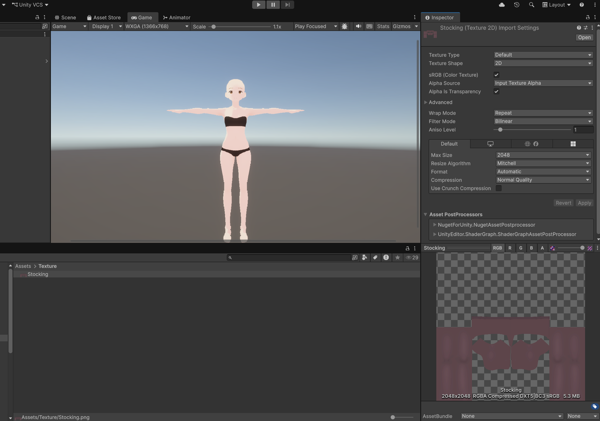
*▲図 5-4: Unity Inspector で Alpha is Transparency を ON にして Apply を押し、透過を確認*

---

## 3. Material Outfit（`Stocking`）の登録

書き出したストッキング PNG を、ShapeSync Editor にテクスチャ差し替え用の **Material Outfit** として登録します。

1. Unity エディタの上部メニューから **Tools > zgock > ShapeSync > ShapeSync Editor** を開きます。
2. 左側 TreeView から **`Outfits`** を選択します。
3. **`Outfit Id`** に `Stocking`、**`Outfit Name`** に `Stocking` と入力し、**`Create Material Outfit`** ボタンをクリックします。

*▲図 5-5: Outfits で Outfit Id と Outfit Name に Stocking を入力し Create Material Outfit をクリック*

4. TreeView から作成された **`Outfits > Material Outfits > Stocking`** を選択します。
5. 新規追加欄の **`Texture Entry Name`** に、Material Outfit 内で扱うテクスチャ名として **`Body`** と入力します（※ここでは Figure の Material Entry は指定しません）。
6. **`Texture Preview`** フィールドに、Project ウィンドウの `Stocking.png` をドラッグ＆ドロップして指定し、**`Add Texture Entry`** ボタンをクリックします。

*▲図 5-6: Texture Entry Name に Body、Texture Preview に Stocking.png を指定し Add Texture Entry をクリック*

7. 一覧にテクスチャ名 **`Body`** と指定した画像が表示されていることを確認し、画面下部の **`Save to Database`** をクリックして保存します。

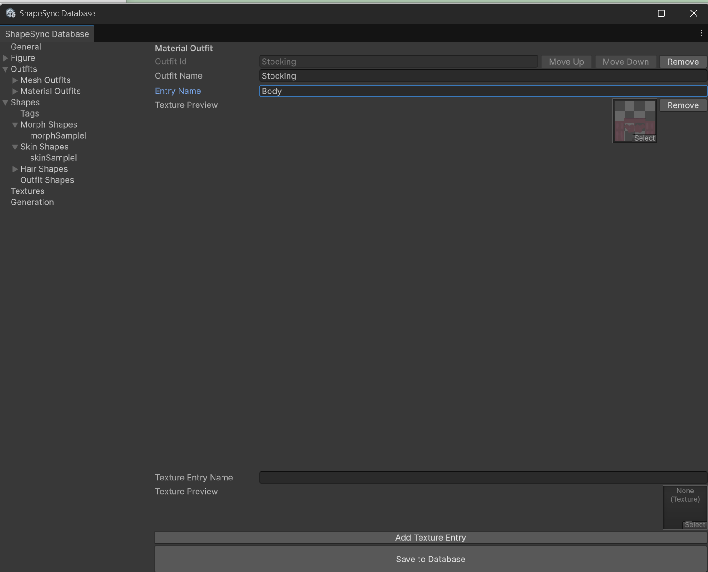
*▲図 5-7: 一覧に Body と画像が表示されていることを確認し Save to Database で保存*

> [!NOTE]
> Material Outfit はテクスチャ名と画像を登録するものです。Figure の Material Entry を指定する手順、身体マテリアルを直接指定するフィールド、`Include` / `Exclude` 分類、ブレンド設定はありません。保存時に Texture Resource（`Stocking_Body` 等）が自動生成されるため、`Textures` セクションへの別登録も不要です。

---

## 4. Morph Shape の登録（`morphSampleI`）

体型変形（FBM）を制御する Morph Shape を作成します。

1. ShapeSync Editor の左側 TreeView から **`Shapes`** を選択します。
2. **`Shape Id`** に **`morphSampleI`**、**`Shape Name`** に `morphSampleI` と入力し、**`Create Morph Shape Template`** ボタンをクリックします。

*▲図 5-8: Shapes で Shape Id と Shape Name に morphSampleI を入力し Create Morph Shape Template をクリック*

3. TreeView の **`Shapes > Morph Shapes > morphSampleI`** を開きます。
4. 詳細画面の **`Morphs`** 一覧に登録済み FBM 軸が表示されます。**`SampleI`** 行の重みを **`1`** に設定します。
5. 画面下部の **`Save to Database`** をクリックして保存します。

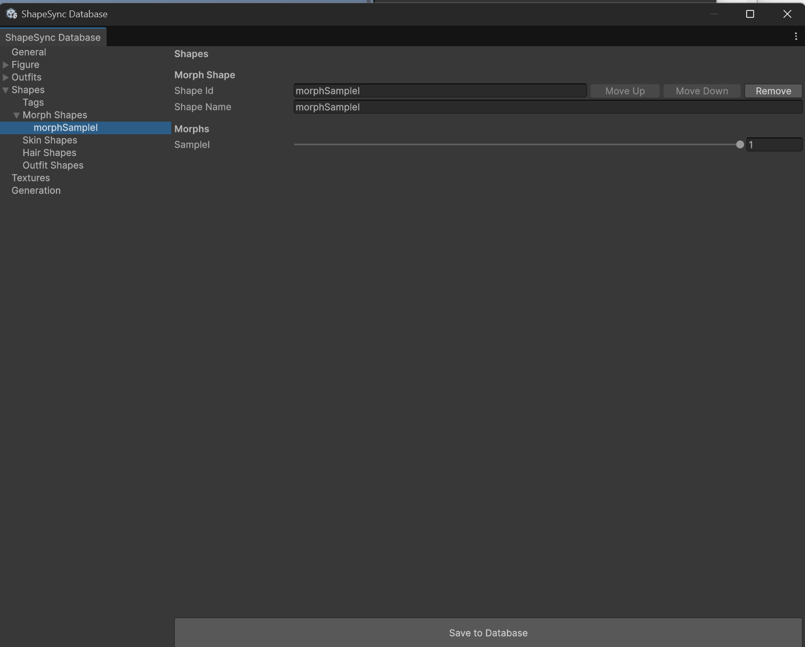
*▲図 5-9: SampleI の重みを 1 に設定し Save to Database で保存*

---

## 5. Hair Shape の登録（`hairSampleI`）

髪型 Outfit（`Hair1`）を適用する Hair Shape を作成します。

1. TreeView から **`Shapes`** を選択します。
2. **`Shape Id`** に **`hairSampleI`**、**`Shape Name`** に `hairSampleI` と入力し、**`Create Hair Shape Template`** ボタンをクリックします。
3. TreeView の **`Shapes > Hair Shapes > hairSampleI`** を開きます。
4. **`Parts (authoring order)`** セクションで **`Add Mesh`** ボタンをクリックします。
5. 追加された Mesh part の **`Outfit Mesh`** ドロップダウンで **`Hair1`** を選択します。
6. 画面下部の **`Save to Database`** をクリックして保存します。

*▲図 5-10: Parts (authoring order) で Outfit Mesh に Hair1 を指定し Save to Database で保存*

---

## 6. Skin Shape の登録（`skinSampleI`）

体型軸 `SampleI` の肌・顔テクスチャを適用する Skin Shape を作成します。

1. TreeView から **`Shapes`** を選択します。
2. **`Shape Id`** に **`skinSampleI`**、**`Shape Name`** に `skinSampleI` と入力し、**`Create Skin Shape Template`** ボタンをクリックします。
3. TreeView の **`Shapes > Skin Shapes > skinSampleI`** を開きます。
4. **`Add Texture`** ボタンを **9 回** クリックし、9 つの Texture part を作成します。
5. 各 Texture part において、**`Target`**（所有先: `Figure`、Proxy Entry）と **`Texture`**（所有元: `SampleI`、Main Texture リソース）を以下の表の通りに設定します。

### Skin Shape 設定対応表（Main Texture 9件）

| # | Target（所有先 / Proxy Entry） | Texture（所有元 / リソース名） |
| :--- | :--- | :--- |
| 1 | `Figure` / `Mouth` | `SampleI` / `SampleI_Mouth` |
| 2 | `Figure` / `Iris` | `SampleI` / `SampleI_Iris` |
| 3 | `Figure` / `Highlight` | `SampleI` / `SampleI_Highlight` |
| 4 | `Figure` / `Face` | `SampleI` / `SampleI_Face` |
| 5 | `Figure` / `EyeWhite` | `SampleI` / `SampleI_EyeWhite` |
| 6 | `Figure` / `Brow` | `SampleI` / `SampleI_Brow` |
| 7 | `Figure` / `Eyelash` | `SampleI` / `SampleI_Eyelash` |
| 8 | `Figure` / `Eyeline` | `SampleI` / `SampleI_Eyeline` |
| 9 | `Figure` / `Body` | `SampleI` / `SampleI_Body` |

> [!IMPORTANT]
> 対象は各マテリアルの Main Texture のみです。`_2` 以降の MatCap 等の補助テクスチャ（`SampleI_Face_2` や `SampleI_Body_2` 等）は含めないでください。

6. 9 件すべて設定後、画面下部の **`Save to Database`** をクリックして保存します。

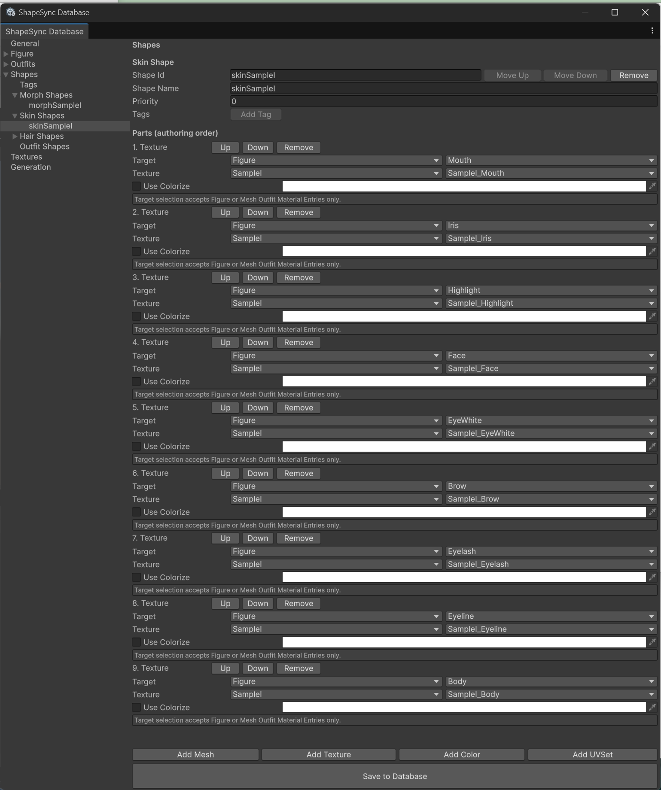
*▲図 5-11: 9 件の Main Texture を対応付け、Save to Database で保存*

---

## 7. Outfit Shape の登録（`outfitSampleI`）

メッシュ衣装（`Dress1`）とマテリアル衣装（`Stocking`）を組み合わせた Outfit Shape を作成します。

1. TreeView から **`Shapes`** を選択します。
2. **`Shape Id`** に **`outfitSampleI`**、**`Shape Name`** に `outfitSampleI` と入力し、**`Create Outfit Shape Template`** ボタンをクリックします。
3. TreeView の **`Shapes > Outfit Shapes > outfitSampleI`** を開きます。
4. **`Add Mesh`** ボタンをクリックし、**`Outfit Mesh`** に **`Dress1`** を設定します。
5. **`Add Texture`** ボタンをクリックして Texture part を追加します。
   * **`Target`**: 所有先に `Figure`、Proxy Entry に **`Body`** を選択します（※ここで初めて Figure の適用先 Material Entry を指定します）。
   * **`Texture`**: 所有元に **`Stocking`** を選択し、リソースに Material Outfit の `Body` エントリから生成された **`Stocking_Body`** を選択します。
   > [!NOTE]
   > Material Outfit は Target（適用先）ではなく、Texture の所有元（Source）として選択します。Figure のどの部位に適用するかは、Target で `Figure` の `Body` を指定して決定します。
6. 画面下部の **`Save to Database`** をクリックして保存します。

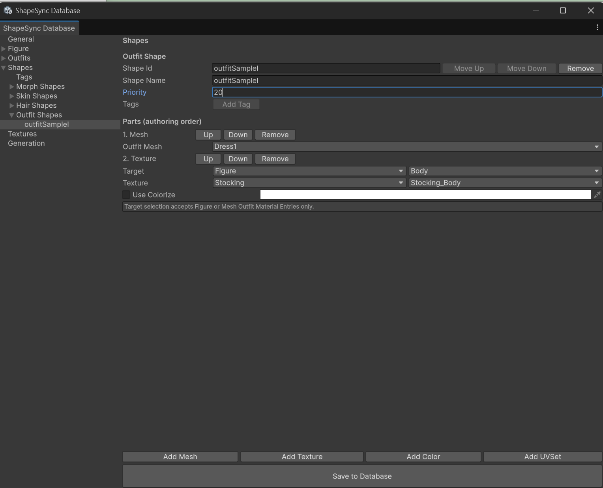
*▲図 5-12: Dress1 と Stocking_Body を設定し、Save to Database で保存*

---

## 8. Generate の実行と Shape Template の出力

登録した Shape 設定から Shape Template アセットを生成します。

1. ShapeSync Editor の左側 TreeView から **`Generation`** セクションを選択します。
2. 各出力相対パス（`Registries/`、`Bindings/`、`Materials/`、`Textures/`、`Outfits/`）は **既定値のまま変更しません**。
3. 画面下部の **`Generate`** ボタンをクリックします（※`Save to Database` は使用しません）。
4. 「Generate ShapeSync Figure」画面で、出力ルートフォルダ（例: `Assets/ShapeSync/Generated`）を選択して「フォルダーの選択」をクリックします。

*▲図 5-13: Generate を押し、出力先フォルダーに Assets/ShapeSync/Generated を指定*

5. 生成完了後、選択した出力ルート直下に以下の Shape Template アセットおよびカタログファイルが出力されていることを確認します。
   * **`morphSampleI.asset`** (`MorphShapeTemplate`)
   * **`skinSampleI.asset`** (`SkinShapeTemplate`)
   * **`hairSampleI.asset`** (`HairShapeTemplate`)
   * **`outfitSampleI.asset`** (`OutfitShapeTemplate`)
   * **`ShapeSyncShapeCatalog.txt`**

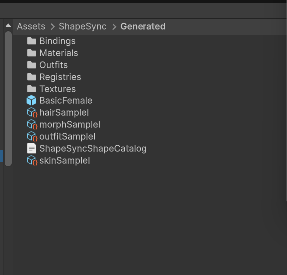
*▲図 5-14: Assets/ShapeSync/Generated 直下に Shape Template アセット群とカタログが出力された状態*

---

## 9. Scene 配置と Shape Director による動作確認

生成した Shape Template を Figure の **`ShapeDirector`** に登録し、Play Mode で連動動作を確認します。

### 9.1 Template List の登録
1. 生成された **Figure Prefab**（`BasicFemale`）を Scene（または Hierarchy）に配置します。
2. Figure のルートにある **`ShapeDirector`** コンポーネントの Inspector を確認します。
3. **`Template List`** に、生成された 4 つの Shape Template アセット（`morphSampleI.asset`, `skinSampleI.asset`, `hairSampleI.asset`, `outfitSampleI.asset`）をドラッグ＆ドロップして追加します。

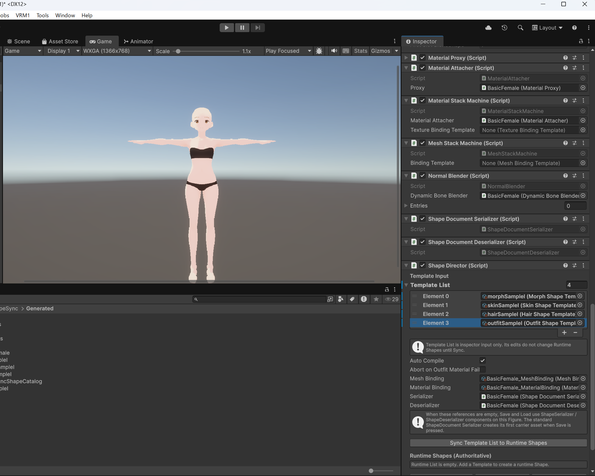
*▲図 5-15: Figure の ShapeDirector Inspector で Template List に 4 つの Shape Template を登録*

> [!NOTE]
> Play Mode に入る前のエディットモードでは、Template List に登録しても Runtime Shapes には同期されず、`Sync Template List to Runtime Shapes` ボタンも機能しません。Runtime Shapes への同期は Play Mode 開始時に自動的に実行されます。

### 9.2 Play Mode での動作確認
1. Figure の Inspector にある **`Animator`** に `Walking.controller` を割り当てます。
2. Unity の **Play ボタン** を押して **Play Mode** に入ります。
   * Play Mode 開始時に自動的に初期同期が行われ、Inspector の **`Runtime Shapes (Authoritative)`** に各 Shape が表示されるとともに、Game ビューのキャラクターに髪・衣装・肌・ストッキングが適用されます。
   * （※Play Mode 中に Template List を編集した場合は、`Sync Template List to Runtime Shapes` ボタンを押すことで即座に反映できます）

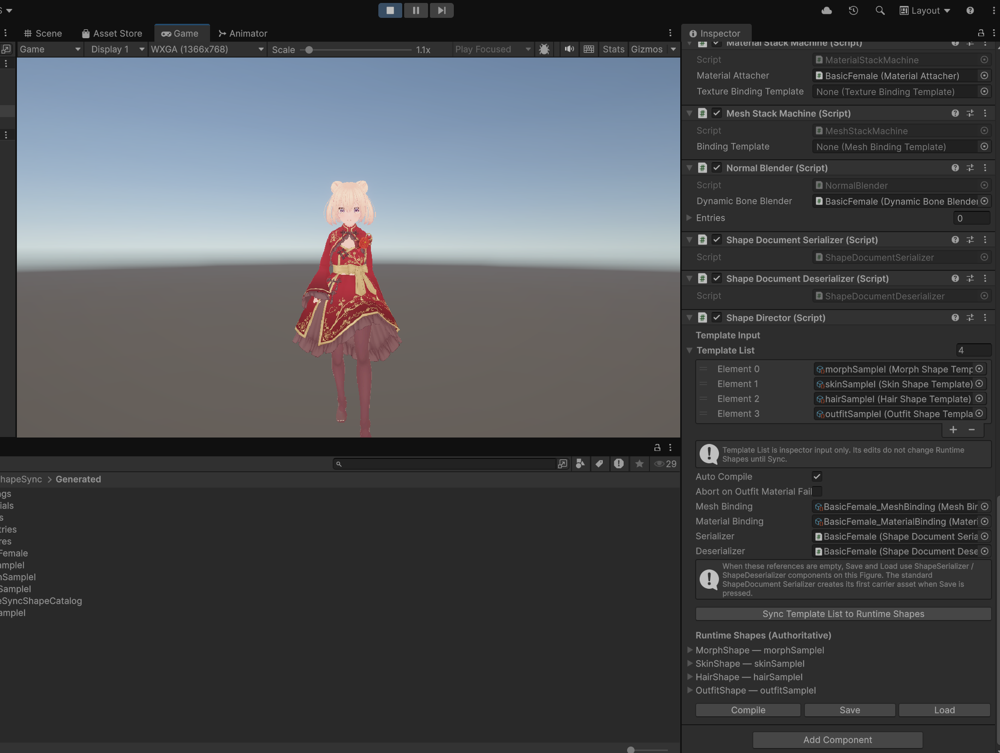
*▲図 5-16: Play Mode に入ると Runtime Shapes に同期され、髪・衣装・肌・ストッキングが適用される*

3. 歩行アニメーション再生中に、`ShapeDirector` の `Runtime Shapes (Authoritative)` 内にある **`morphSampleI`**（`SampleI`）を展開し、**重み（weight）スライダー** を動かします。
4. **歩行アニメーションが継続したまま、キャラクターの体型、髪型、衣装（ドレスおよびストッキング）、肌テクスチャが連動してスムーズに変化すること** を確認します。

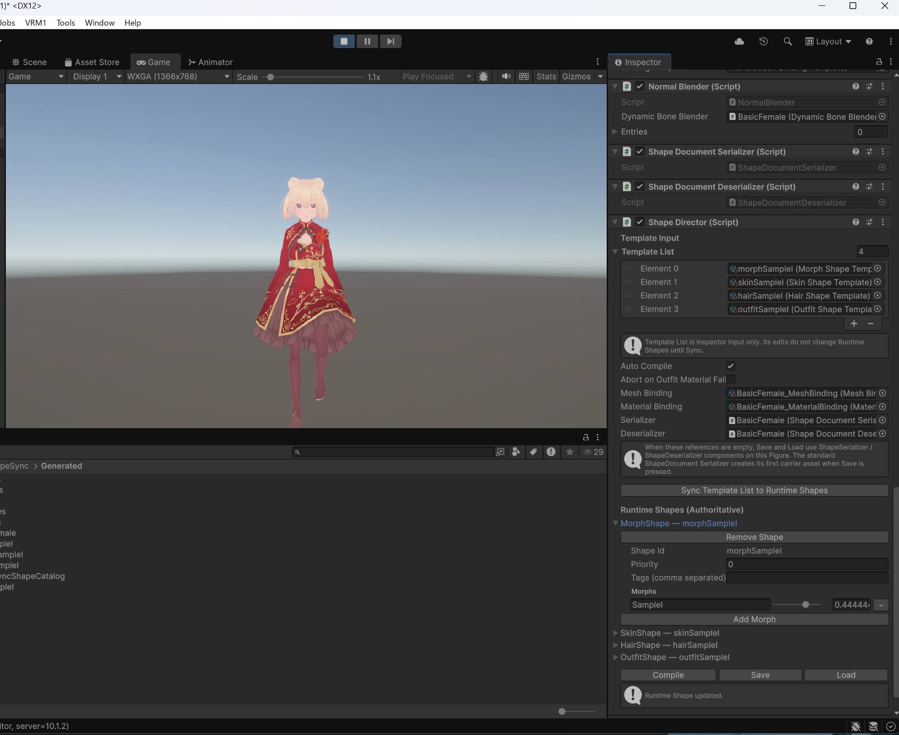
*▲図 5-17: 歩行アニメーション再生中に SampleI の重みを変更し、体型・衣装・髪・肌が連動して変化することを確認*

---

## 10. よくあるトラブルと解決策（トラブルシューティング）

### Q1. Template List に登録したのに Runtime Shapes に反映されない / Sync ボタンが機能しない
* **原因**:
  Play Mode に入っていない（エディットモードの）状態では、Runtime Shapes への同期は行われず、`Sync Template List to Runtime Shapes` ボタンも機能しません。
* **解決策**:
  Unity の **Play ボタン** を押して **Play Mode** に入ってください。Play Mode 開始時に Template List の登録内容が自動的に Runtime Shapes へ初期同期されます（Play Mode 中に Template List を編集した場合は、Sync ボタンで反映できます）。

### Q2. ストッキングが身体に表示されない・肌と混ざって乱れる
* **原因**:
  取り込んだ `Stocking.png` の Inspector で **`Alpha is Transparency`** が有効になっていないか、Outfit Shape の Target / Texture 紐付けが誤っている可能性があります。
* **解決策**:
  Project ウィンドウで `Stocking.png` を選択し、Inspector の `Alpha is Transparency` が ON になっていることを確認して `Apply` を押してください。また、ShapeSync Editor の `Shapes > Outfit Shapes > outfitSampleI` で `Target = Figure / Body`、`Texture = Stocking / Stocking_Body` になっていることを確認して再生成してください。

---

[← チュートリアル目次へ戻る](./index.html) ｜ [← 第4章: Outfit 登録と着脱動作確認](./outfitregistration.html)
